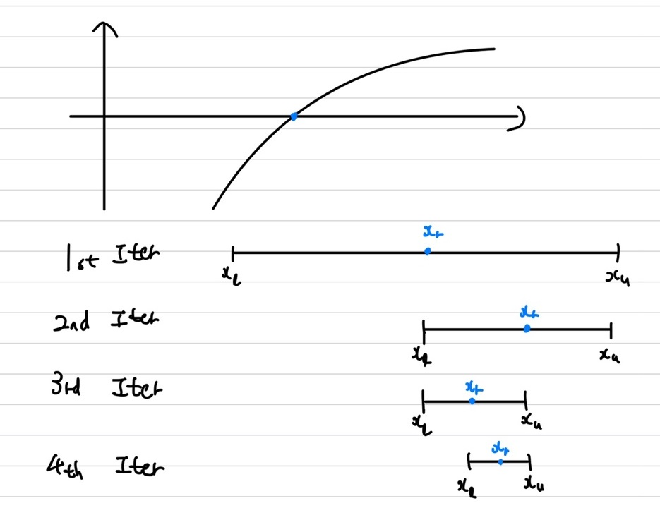
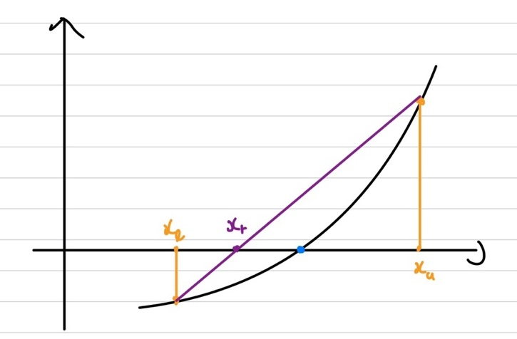
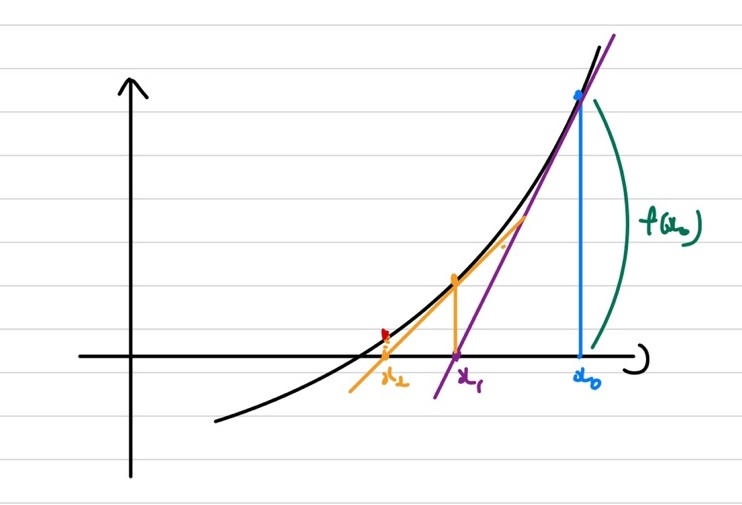

## 방정식의 근 찾기
이전 절에서는 Local Minimum을 찾는 방법인 Gradient Descent의 방법에 대해 알아보았습니다. 최종적으로 목표는 Object function에서의 solution을 찾는 것이 주 목적이었습니다. 이번에는 Netwon's Raphson Method를 알아보기전에 수치해석에서 배우는 근 찾는 여러 방법들에 대해 알아보겠습니다.   

## Incremental Method(증분 탐색)
증분 탐색 방법은 우선적으로 두 가지 전제 조건이 필요합니다.    
① Object function이 실수함수이어야합니다.    
② Object function이 연속함수여야합니다.    
증분 탐색은 **함수의 부호가 바뀌는 구간을 찾아내는 방법**입니다. 즉, $x_l, x_u$지점을 잡았을 때, $f(x_l)f(x_u) < 0$이라면 $x_l ~ x_u$사이에 $f(x) = 0$인 지점이 존재한다는 의미가 됩니다. 하지만, 이 증분 탐색은 이 구간의 길이가 너무 길다면 해를 찾는데 오랜시간이 걸리며, 또한 길이가 너무 짧다면 해를 놓칠 수 있는 문제점이 있습니다. 따라서 적절한 구간을 잡아줘야 하며 또한, 함수에 다중 해가 존재하다면 문제가 복잡해질 수 있습니다.    

## Bisection(이분법)
이전에는 증분 탐색을 통해 해가 있을만한 구간을 찾아냈습니다. 그럼 이번에는 실제 해를 찾아내는 방법인 이분법에 대해 알아보겠습니다. 우선 이분법은 **근이 있다고 판단되는 구간을 반으로 나누는 작업을 반복 수행하여 해를 찾아내는 구간법**입니다.   
    
즉 우선 $f(x_l)f(x_u) < 0$이라면, $x_l, x_u$의 구간에서 반으로 나눈 $x_r = \frac{x_l + x_u}{2}$을 구한후, $f(x_r) < 0$이라면, $x_r$을 $x_l$의 대체로 변경, $f(x_r) > 0$이라면, $x_r$을 $x_u$의 대체로 변경하여 다시 구간을 좁혀나가는 방법을 반복 수행합니다.    

이 때, 이 반복은 사전에 정의한 True 오차이하로 떨어질 때까지만 반복을 수행하는데, 이 전략의 경우에는 해를 미리 알고 있을 때만 적용할 수 있습니다. 그럼 이 오차를 위한 상대오차를 구하는 식을 알아보겠습니다.   
\begin{aligned}    
|\epsilo_{\alpha} | = | \frac{x_r^{\new} - x_r^{old}}{x_r^{new}} x 100 %
\end{aligned}   

즉, 우리가 지정한 True 오차인 $\epsilo_{s}$보다 $\epsilo_{\alpha}$가 작아질 때까지 이분법을 적용하면 됩니다.   

## False Position(가위치법)
가위치법 또한 기본은 증분 탐색을 통해 구하는 방법입니다. 가위치법은 방금전에 알아본 이분법보다 더 빠르게 해를 찾을 수 있는 선형보간법을 이용하여 구간을 분할하여 해를 찾는 방법입니다. 선형보간법이란 $f(x)=0$이 되는 선형 함수를 그려 구해내는 방법입니다.    
우선 증분 탐색과 동일하게 $f(x_l)f(x_u) < 0$인 $x_l, x_u$ 구간을 찾아내줍니다.    
    
상기의 그림에서와 같이 $x_l$과 $x_r$지점을 기반으로 선형 함수를 그려 그 선형함수의 x절편을 $x_r$로 설정을 하여 구간을 좁혀가는 방법입니다.     
이 좁혀가는 방법을 이분법과 동일하게 지정한 오차보다 상대 오차가 작아질 때까지 반복 수행합니다.    
$x_r = x_u - \frac{f(x_u)(x_l - x_u)}{f(x_l) - f(x_u)}$
즉, 간단하게 알고리즘을 정리해보겠습니다.   
① 선형보간법을 통해 $x_r$구간을 구합니다.   
② $x_l$이나 $x_u$값을 $x_r$로 대체합니다.    
③ 상대 오차가 지정한 오차보다 작아질 때까지 ①,②을 반복합니다.   

## Netwon Raphson Method
이제 우리가 이번절에 알아보고자 하는 뉴턴법에 대해 알아보겠습니다. 이전절인 Gradient Descent에서 들었던 예시인 $\underline{z} = A\underline{x} + \underline{n}$을 통해 설명하겠습니다. 우선 우리가 구하고자 하는 Object function은 하기와 같습니다.    
\begin{aligned}    
\underline{z} =& \underline{x} + \underline{n} \newline    
err =& (\underline{z} - A\underline{x})^T (\underline{z} - A\underline{x})
\end{aligned}    

이전 Gradient Descent의 solution은 $\underline{x_{k+1}} = \underline{x_k} + 2 \alpha A^T (\underline{z} - A \underline{x_k})$ 였습니다. 여기서 방향은 미분한 방향인 $2 A^T (\underline{z} - A \underline{x_k})$이고, $\alpha$는 얼마나 갈지인 step size를 나타낸다고 했습니다. 그럼 뉴턴법은 여기서 이 $\alpha$을 얼만큼 갈지를 결정해줍니다.    
우선 뉴턴법은 이전 해를 구하는 법과 동일하게 zero-finding을 목적으로 진행됩니다. 우선 초기지점인 $x_0$에서 접선을 그려 그 접선의 x절편을 구해줍니다. 그 지점을 다시 $x_1$으로 잡고 $f(x_1)$지점에서의 접선을 그은 후 그 접선에 대한 x절편을 또 다시구해주는 방법을 반복하여 해를 찾아주는 방법입니다.    
    
\begin{aligned}    
x_{k+1} = x_k - \frac{1}{f'(x_k)}f(x_k)
\end{aligned}   

상기의 수식이 뉴턴법인데, 뉴턴법은 zero-finding입니다. 즉, 현재 $f(x)=0$인 지점을 찾는 법입니다. 근데, 우리가 구하고자 하는 것은 극대, 극소값입니다. 극대,극소값은 미분값이 0이되는 지점이 되니, 즉, 뉴턴법을 $f(x)$가 아닌 도함수인 $f'(x)$에 적용을 하면 우리가 구하고자하는 목적에 맞게됩니다.    
\begin{aligned}    
x_{k+1} = x_k - \frac{1}{f''(x_k)}f'(x_k)
\end{aligned}   

최종적인 뉴턴법의 식을 얻었습니다. 그럼 Gradient Descent와 비교해보면 똑같이 미분값이 달려있지만 Gradient에서의 $\alpha$부분이 뉴턴법에서는 $\frac{1}{f''(x_k)}$로 나타납니다. 즉, 뉴턴법은 $\alpha$를 두 번 미분한 값으로 사용한다는 의미가 됩니다. 그럼 이 두 번 미분한 값을 구해서 최종 식을 완성해보겠습니다.   
\begin{aligned}    
\frac{\partial f}{\partial \underline{x}^T} =& -2(\underline{z} - A \underline{x})^T A \newline   
\frac{\partial f}{\partial \underline{x}} =& -2A^T(\underline{z} - A \underline{x}) \newline \newline   
\frac{\partial}{\partial \underline{x}^T}(\frac{\partial f}{\partial \underline{x}}) =& 2A^TA d\underline{x}
\end{aligned}   

여기서 변화량은 $ 2A^TA d\underline{x}$되고, 변화율은 $d\underline{x}$ 앞에있는 것인 $2A^TA$이 됩니다. 즉, **Scalar를 vector로 두 번 미분한 Hessian Matrix**가 됩니다. 즉, $\underline{x}$가 들어가 있지 않은 상수 Matrix가 됩니다. 그럼 이 Hessian Matrix를 대입해보겠습니다.   
\begin{aligned}    
\underline{x_{k+1}} =& \underline{x_k} + (2AA^T)^{-1} 2A^T(\underline{z} - A \underline{x_k}) \newline   
=& \underline{x_k} + (AA^T)^{-1} A^T(\underline{z} - A \underline{x_k})
\end{aligned}   

## Secant Method(할선법)

