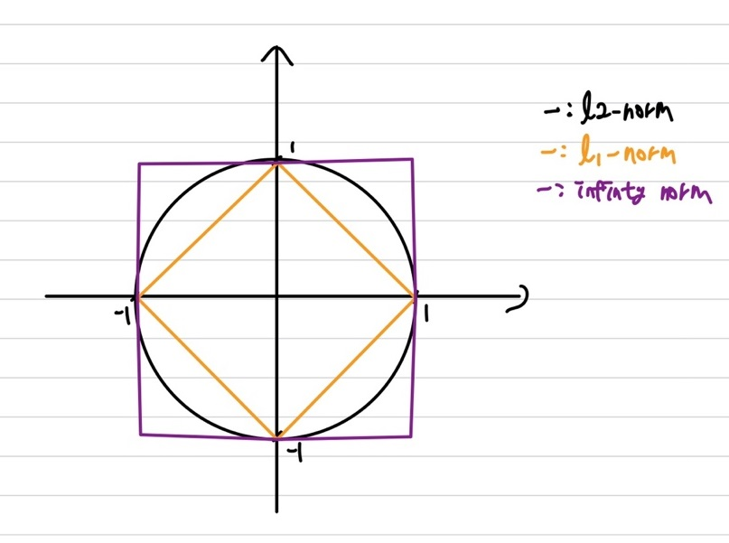

## norm
norm은 벡터의 크기(길이)를 나타내는 것입니다. 즉, 0포함 양수인 스칼라 값입니다. 따라서, 어떤 것이 크다 작다를 표현할 수 있습니다.   
norm에도 다양한 종류가 존재합니다 $L_1 norm, \; L_2 \; norm, \; L_p \; norm, \; L_{\infty} \; norm$이 있습니다. 여기에 대해 하나씩 살펴보겠습니다.   
### $L_1 \; norm$
$L_1 \; norm$은 벡터의 모든 성분의 절대값을 더하는 것입니다.   
\begin{aligned}
\|\| a \|\|_1 = \|\| \begin{bmatrix} 1 \newline 3 \end{bmatrix} \|\|_1 =& (\|1\| + \|3\|)^1 \newline
=& (\|1\| + \|3\|)^{\frac{1}{1}} \newline
=& 4
\end{aligned}   
1-norm은 **맨해튼 놈**이라고도 부릅니다.   
### $L_2 \; norm$
이전에 저희는 벡터의 크기에 대해 다뤘습니다. 저희가 다뤘던 벡터의 크기가 곧 $L_2 \; norm$입니다.   
\begin{aligned}
\|\| a \|\|_2 = \|\| \begin{bmatrix} 1 \newline 3 \end{bmatrix} \|\|_2 =& \sqrt{\|1\|^2 + \|3\|^2} \newline
=& (\|1\|^2 + \|3\|^2)^{\frac{1}{2}} \newline
=& \sqrt{10}
\end{aligned}   
2-norm은 $(1^2 + 3^2)^{\frac{1}{2}}$에서 각 성분의 제곱과 $\frac{1}{2}$을 해주기 때문에 2-norm이 됩니다.   
2-norm은 **유클리드 놈**이라고도 부릅니다.   

### $L_p \; norm$
p-norm은 norm의 확장이자 일반화라고 보시면 됩니다. 이전에 l-norm, 2-norm을 일반화 시킨것입니다.    
\begin{aligned}
\|\| a \|\|_p = \|\| \begin{bmatrix} a \newline b \newline c \end{bmatrix} \|\|_p =& (\|a\|^p + \|b\|^p + \|c\|^p)^{\frac{1}{p}} \newline
=& (\|a\|^p + \|b\|^p + \|c\|^p)^{\frac{1}{p}} \newline
\|\| x \|\|_p \approx& \; (\sum \|x_i\|^p)^{\frac{1}{p}} \;(p \ge 1)
\end{aligned}  

p값에 1을 넣으면 1-norm, 2를 넣으면 2-norm이 됩니다. 

### $L_{\infty} \; norm$
$L_{\infty} \; norm$은 하기와 같이 나타냅니다.   

\begin{aligned}
\|\| a \|\|_{\infty} =& (\|a\|^{\infty} + \|b\|^{\infty} + \|c\|^{\infty})^{\frac{1}{\infty}} \newline
\end{aligned}   

\begin{aligned}
\|\| x \|\|_{\infty} \approx \text{max}_i \| x_i \|
\end{aligned}
상기의 표현처럼 만약 a,b,c의 성분이 존재한다면 이 중 가장 큰 값을 가지게 됩니다. 만약 $\begin{bmatrix} 4 \newline -3 \newline 7 \end{bmatrix}$의 $\infty$-norm을 구한다면 7이됩니다.   

### $L_0 \; norm$
잘 쓰이진 않지만, 0-norm에 대해 설명하겠습니다.   
$L_0 \; norm$은 **벡터의 성분 중 0이 아닌 것의 개수**입니다.    
$x=\begin{bmatrix} 4 \newline 0 \newline -2 \newline 0 \newline 8 \end{bmatrix}$의 경우 $\|\|x\|\|_0 = 2$가 됩니다.      
$L_0 \; norm$은 사실 norm은 아닙니다. 그 이유는 norm을 만족시키 위한 조건을 충족하지 못합니다. norm이 되기 위한 조건은 하기와 같습니다.   
> ① $\|\| x \|\| > 0$이며, $x=0$일 때만, $\|\| x \|\| = 0$입니다.  
② $\|\| ax \|\| = \|a \| \; \|\|x \|\|$   
③ $\|\| x + y \|\| \le \|\| x \|\| + \|\| y \|\|$   

$L_0 \; norm$이 왜 norm이 아닌지에 대해 설명해보겠습니다.    
만약 $x=\begin{bmatrix} 4 \newline 0 \newline -2 \newline 0 \newline 8 \end{bmatrix}$의 경우 2번째 조건에 대해 살펴보겠습니다.   
$\|\| 2x \|\|_0 = 2$   
$\|2\| \; \|\| x \|\|_0 = 4$   
상기와 같이 2번 조건을 만족시키지 못합니다. 따라서, 0-norm은 norm이 아니게 됩니다.   

### norm 확인
    
상기의 이미지와 같이 크기가 1인 norm을 나타내보았습니다.    
$L_1 \; norm$의 경우에는 $\|x\| + \|y\| = 1$인 식이 나타납니다.   
$L_2 \; norm$의 경우에는 $x^2 + y^2 = 1$인 식이 나타납니다.    
$L_{\infty} \; norm$의 경우에는 $\|x\|^{\infty} + \|y\|^{\infty} = 1$입니다. $\|x\| > \|y\|$인 경우에는 $x=1$이 되고, $\|x\| < \|y\|$에는 $y=1$이 됩니다. 
