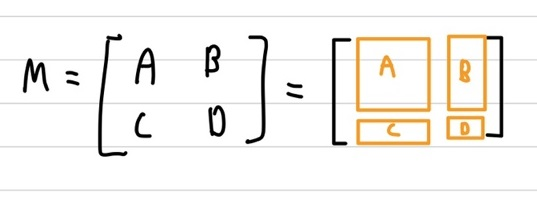

## Sherman-Morrison Formula
셔먼-모리슨 공식은 주어진 행렬 $A$의 Inverse Matrix를 알고 있을 때, Rank-1 update(Rank-1을 더한)인 $A+\underline{u}\underline{v}^T$의 Inverse Matrix를 빠르게 구할 수 있는 공식입니다. 다들 아시겠지만, $\underline{u}\underline{v}^T$은 모두 0이 아닌 어떤 값을 가지고 있다면, 무조건 rank-1 Matrix가 됩니다.   
\begin{aligned}    
\underline{u}\underline{v}^T =& \begin{bmatrix} u_1  \newline u_2 \newline \vdots \end{bmatrix} \begin{bmatrix} v_1  & v_2 & \ldots \end{bmatrix} \newline   
=& \begin{bmatrix} v_1 \begin{bmatrix} u_1  \newline u_2 \newline \vdots \end{bmatrix} & v_2 \begin{bmatrix} u_1  \newline u_2 \newline \vdots \end{bmatrix} & \ldots \end{bmatrix}
\end{aligned}    

그럼 우선 공식을 정의하겠습니다. 공식은 하기와 같습니다.   
\begin{aligned}    
(A + \underline{u}\underline{v}^T )^{-1} =& A^{-1} + \frac{A^{-1} \underline{u} \underline{v}^T A^{-1}}{1 + \underline{v}^T A^{-1} \underline{u}} \quad (1 + \underline{v}^T A^{-1} \underline{u} \neq 0 \; \Leftrightarrow \; A + \underline{u}\underline{v}^T \; is \; invertible)
\end{aligned}    

## RLS(Recursive Least Squares)
Least Squares는 이전 포스팅에서 계속 나왔으며, 간단한 설명 또한 진행을 했기 때문에, 구하고자 하는 $A\underline{x} \approx \underline{b}$에서 $\underline{b}$와 가장 닮은 $\underline{\hat{x}}$가 어떤 것인지만 말씀드리겠습니다. $\underline{\hat{x}} = (A^T A)^{-1} A^T \underline{b}$가 됩니다.    
Least Squares 문제는 선형 회귀에서도 쓰이는데, 이 선형 회귀 관점에서 생각을 해보겠습니다. 선형 회귀에서는 $A$가 실제 관측한 데이터라고 생각을 하면, $\underline{b}$는 이 관측한 데이터를 기반으로 가장 잘 예측한 데이터가 됩니다. 즉, 관측한 데이터들의 추세를 파악할 수 있다는 말이 됩니다. 만약, 데이터 4개를 관측했다고 한다면 행렬 $A$의 row는 4가 될 것이고, $\underline{b}$의 row 또한 4가 될 것입니다. 그럼 이때의 $\underline{b}$를 가장 잘 표현해줄 수 있는 $\underline{\hat{x}}$는 $(A^T A)^{-1} A^T \underline{b}$을 통해 구할 수 있습니다. 여기서 $\underline{\hat{x}}$는 해당 선형 함수의 기울기와 절편을 가지고 있게 될 것 입니다.    
여기서 만약 관측한 데이터가 추가가 됬을 경우, 해당 선형 함수의 값 또한 바뀌게 될 것입니다. 그럼 다시 $\underline{\hat{x}}$을 처음부터 계산해야하는데, 이것이 반복된다면 이전에 계산했던 것들을 또 다시 반복하여 계산하는 비효율적인 문제가 발생할 것 입니다.   
이 비효율적인 것을 방지하기 위해 사용할 수 있는 방안이 상기에서 설명했던 **Sherman-Morrison을 이용하여 Rank-1 Update를 취해주는 방법** 입니다. 즉, 새롭게 관측한 데이터는 Rank-1 데이터가 되니, 현재 구한 $A$에 추가해서 계산을 한다면 보다 쉽게 구할 수 있다는 말이 됩니다.   

    
기존 $A$에 대해 구한 $\underline{\hat{x}}$이 $(A^T A)^{-1} A^T \underline{b}$라고 했을 때, 상기의 이미지에서 추가된 데이터는 $\underline{a}^T$, 전체는 $A_a$라고 하겠습니다. 그럼 기존은 $\underline{b}$에 추가된 전체는 $\underline{b_a}$, 추가된 데이터는 $b$가 됩니다. 이 때의 다시 $\underline{\hat{x}}$은 $(A_a^T A_a)^{-1} A_a^T \underline{b_a}$가 됩니다.    
\begin{aligned}    
\underline{\hat{x_a}} =& (A_a^T A_a)^{-1} A_a^T \underline{b_a} \newline   
=& (\begin{bmatrix} A^T  & \underline{a} \end{bmatrix} \begin{bmatrix} A  \newline \underline{a}^T \end{bmatrix})^{-1} \begin{bmatrix} A^T  & \underline{a} \end{bmatrix} \begin{bmatrix} \underline{b}  \newline b \end{bmatrix} \newline   
=& (A^T A + \underline{a} \underline{a}^T)^{-1} (A^T \underline{b} + \underline{a}b)
\end{aligned}    

상기와 같이 Rank-1 Update 형식인 Sherman-Morrsion Formula 꼴라 나타내집니다. 그럼 공식을 적용해보겠습니다.   
\begin{aligned}    
(A^T A + \underline{a} \underline{a}^T)^{-1} =& (A^T A)^{-1} - \frac{(A^T A)^{-1} \underline{a} \underline{a}^T (A^T A)^{-1} }{1 + \underline{a}^T (A^T A)^{-1} \underline{a}} \newline   
=& P_a \newline   
(A^T A)^{-1} =& P
\end{aligned}  

다음과 같이 정의를 해보겠습니다. 그럼 상기에 $\underline{\hat{x}}$에 대해 이어서 구해보겠습니다.    
\begin{aligned}    
\underline{\hat{x_a}} =& (A^T A + \underline{a} \underline{a}^T)^{-1} (A^T \underline{b} + \underline{a}b) \newline    
=& (A^T A)^{-1} A^T \underline{b} - \frac{P \underline{a} \underline{a}^T P}{1 + \underline{a}^T P \underline{a}} A^T \underline{b} + P_a \underline{a} b \newline   
=& \underline{\hat{x}} - \frac{P\underline{a}}{1 + \underline{a}^T P \underline{a}} \underline{a}^T \underline{\hat{x}} + P_a \underline{a} b \quad (\underline{\hat{x}} = P A^T \underline{b}) \newline    
=& \underline{\hat{x}} + P_a \underline{a}(b - \underline{a}^T \underline{\hat{x}} ) \quad (\frac{P\underline{a}}{1 + \underline{a}^T P \underline{a}} = P_a \underline{a})
\end{aligned}    

최종적으로 상기의 수식이 추가된 데이터에 대한 $\underline{\hat{x_a}}$을 구하는 식이 됩니다. 즉, $ P_a \underline{a}(b - \underline{a}^T \underline{\hat{x}} )$이 추가된 데이터에 대한 증가분이 됩니다. 즉, 증가분만 계산을 해주면 $\underline{\hat{x_a}}$을 구할 수 있게 됩니다. 이전 $(A_a^T A_a)^{-1} A_a^T \underline{b_a}$을 계산하는 것보다 현저히 계산량이 줄어들게 됩니다. 

## Matrix Inversion Lemma(Sherman-Morrison-Woodbury Formula)
이전 Sherman-Morrison의 경우에는 주어진 행렬 $A$의 계수가 1인 Rank-1 Matrix를 통해 Update를 진행했었습니다. Woodbury가 추가된 공식의 경우에는 이 Rank-1 Matrix의 계수를 $1 \ge k \ge n$의 범위로 늘렸을 때의 경우로 다루게됩니다. 즉, Sherman-Morrison Formula에 대해 일반화를 진행한 Formula가 됩니다. 하기에 수식을 통해 정의해보겠습니다.   
\begin{aligned}    
A : \; n \; \times \; n \quad Matrix \newline   
U : \; n \; \times \; k \quad Matrix \newline   
C : \; k \; \times \; k \quad Matrix \newline   
V : \; k \; \times \; n \quad Matrix \newline   
\end{aligned} 

상기와 같은 Size의 Matrix일 때, $(A + UCV)$의 Inverse는 하기와 같은 Formula로 구할 수 있습니다.   
\begin{aligned}    
(A + UCV)^{-1} =& A^{-1} - A^{-1}U(C^{-1} + VA^{-1}U)^{-1}VA^{-1} \quad (A,C, C^{-1} + VA^{-1}U \; is \; invertible)\newline
\end{aligned}    

$A,C, C^{-1} + VA^{-1}U$의 determinant가 모두 0이 아니어야 Invertible하며 상기의 공식을 적용가능합니다. 

### 증명
Sherman-Morrison-Woodbury Formula을 증명하겠습니다. 
    
상기의 이미지와 같은 행렬들로 구성된 행렬 $M$에 대한 Inverse Matrix를 구해보겠습니다. 역행렬을 구할 때, 이전 포스팅에서 가우시안 소거법을 이용하여 역행렬을 구하였었습니다. 그럼 조금 더 쉽게 역행렬을 구하기 위해 이전 포스팅인 LU Decomposition에서 배웠던 LDU로 Decomposition을 해보겠습니다. 그럼 $M^{-1} = U^{-1}D^{-1} L^{-1}$을 통해 구할 수 있습니다.   
\begin{aligned}    
M =& \begin{bmatrix} A & B  \newline C & D \end{bmatrix} \newline   
\end{aligned}  

$M^{-1}$을 구해주기 위해서 1차적으로 $L_1$을 곱해주겠습니다.   
\begin{aligned}    
L_1M =& \begin{bmatrix} I & 0  \newline -CA^{-1} & I \end{bmatrix} \begin{bmatrix} A & B  \newline C & D \end{bmatrix} \newline   
=& \begin{bmatrix} A & B  \newline 0 & D - CA^{-1}B \end{bmatrix}
\end{aligned}  

여기서 $D - CA^{-1}B$을 $A$의 Inverser가 들어있기 때문에 **A의 Schur Complement**라고 합니다. A의 Schur Complement는 $M/A$라고 부르며, 현 위치인 $D$에서 시계방향으로 도는 것을 빼주면 형태입니다.    
그럼 이제 행렬 $M$을 LDU로 나타내보겠습니다.   
\begin{aligned}    
M =& \begin{bmatrix} A & B  \newline C & D \end{bmatrix} \newline   
=& \begin{bmatrix} I & 0  \newline -CA^{-1} & I \end{bmatrix}^{-1} \begin{bmatrix} A & B  \newline 0 & D - CA^{-1}B \end{bmatrix} \newline   
=& LU \newline   
=& \begin{bmatrix} I & 0  \newline -CA^{-1} & I \end{bmatrix}^{-1} \begin{bmatrix} A & 0  \newline 0 & D - CA^{-1}B \end{bmatrix} \begin{bmatrix} I & A^{-1}B  \newline 0 & I \end{bmatrix} \newline   
=& LDU \newline   
\end{aligned}  

상기에 LDU로 Decomposition을 했습니다. 그럼 $M^{-1} = U^{-1} D^{-1} L^{-1}$가 되니, $U^{-1}$는 예전에 배웠던 2차원 행렬의 역행렬 구하는 공식을 이용하여 구할 수 있습니다. $D^{-1}$의 경우 Diagonal Matrix의 역행렬이니 Diagonal Element에 Inverse를 취해주면 됩니다. 그러고 $L^{-1}$는 해당값에 Inverse를 취해주면 그대로 튀어나오게 됩니다.   
\begin{aligned}    
M^{-1} =& U^{-1} D^{-1} L^{-1} \newline   
=& \begin{bmatrix} I & - A^{-1}B  \newline 0 & I \end{bmatrix} \begin{bmatrix} A^{-1} & 0  \newline 0 & (D - CA^{-1}B)^{-1} \end{bmatrix} \begin{bmatrix} I & 0  \newline -CA^{-1} & I \end{bmatrix} \newline   
=& \begin{bmatrix} A^{-1} & - A^{-1}B(D - CA^{-1}B)^{-1}  \newline 0 & (D - CA^{-1}B)^{-1} \end{bmatrix} \begin{bmatrix} I & 0  \newline -CA^{-1} & I \end{bmatrix} \newline   
=& \begin{bmatrix} A^{-1} + A^{-1}B(D - CA^{-1}B)^{-1}CA^{-1} & - A^{-1}B(D - CA^{-1}B)^{-1}  \newline -(D - CA^{-1}B)^{-1} CA^{-1} & (D - CA^{-1}B)^{-1} \end{bmatrix}
\end{aligned}  

  
    
 
그럼 방금까지는 LDU에서 $M$ 앞에 L을 곱해서 U를 만들었습니다. 이번에는 $M$뒤에 L을 곱해서 U를 만들어서 진행해보겠습니다.   
\begin{aligned}    
ML_1 =& \begin{bmatrix} A & B  \newline C & D \end{bmatrix} \begin{bmatrix} I & 0  \newline -DC^{-1} & I \end{bmatrix} \newline   
=& \begin{bmatrix} A-BD^{-1}C & B  \newline 0 & D \end{bmatrix}
\end{aligned}  

여기서 $A-BD^{-1}C$을 $D$의 Inverser가 들어있기 때문에 **D의 Schur Complement**라고 합니다. D의 Schur Complement는 $M/D$라고 부르며, 현 위치인 $A$에서 시계방향으로 도는 것을 빼주면 형태입니다.     
그럼 이제 행렬 $M$을 LDU로 나타내보겠습니다.   
\begin{aligned}    
M =& \begin{bmatrix} A & B  \newline C & D \end{bmatrix} \newline   
=& \begin{bmatrix} A-BD^{-1}C & B  \newline 0 & D \end{bmatrix} \begin{bmatrix} I & 0  \newline -DC^{-1} & I \end{bmatrix}^{-1} \newline   
=& UL \newline   
=& \begin{bmatrix} I & BD^{-1} \newline 0 & I \end{bmatrix} \begin{bmatrix} A-BD^{-1}C & 0  \newline 0 & D \end{bmatrix} \begin{bmatrix} I & 0  \newline -DC^{-1} & I \end{bmatrix}^{-1} \newline   
=& UDL \newline   
\end{aligned}  

상기에 UDL로 Decomposition을 했습니다. 그럼 $M^{-1} = L^{-1} D^{-1} U^{-1}$가 되니, $U^{-1}$는 예전에 배웠던 2차원 행렬의 역행렬 구하는 공식을 이용하여 구할 수 있습니다. $D^{-1}$의 경우 Diagonal Matrix의 역행렬이니 Diagonal Element에 Inverse를 취해주면 됩니다. 그러고 $L^{-1}$는 해당값에 Inverse를 취해주면 그대로 튀어나오게 됩니다.   
\begin{aligned}    
M^{-1} =& L^{-1} D^{-1} U^{-1} \newline   
=& \begin{bmatrix} I & 0  \newline -DC^{-1} & I \end{bmatrix} \begin{bmatrix} (A-BD^{-1}C)^{-1} & 0  \newline 0 & D^{-1} \end{bmatrix} \begin{bmatrix} I & -BD^{-1} \newline 0 & I \end{bmatrix} \newline   
=& \begin{bmatrix} (A-BD^{-1}C)^{-1} & -(A-BD^{-1}C)^{-1}BD^{-1} \newline -DC^{-1}(A-BD^{-1}C)^{-1} & D^{-1} + D^{-1}C(A-BD^{-1}C)^{-1}BD^{-1} \end{bmatrix}
\end{aligned}    

 
 
그럼 상기의 LDU를 통해 구한 $M^{-1}$와 UDL을 통한 $M^{-1}$는 동일한 값이어야합니다. 1행 1열의 element를 보겠습니다.   
LDU에서는 $A^{-1} + A^{-1}B(D - CA^{-1}B)^{-1}CA^{-1}$이고, UDL에서는 $(A-BD^{-1}C)^{-1}$이 됩니다. UDL의 1행 1열 element를 보면 Sherman-Morrison-Woodbury Formula의 꼴과 비슷한게 보일 것 입니다.   
Sherman-Morrison-Woodbury Formula인 $(A + UCV)^{-1}$에서 $B = U, \; C = -D^{-1}, \; C = V$라면 동일해집니다. 그럼 LDU의 1행 1열 Element를 $U,C,V$로 치환하여 나타내보겠습니다.   
$A^{-1} + A^{-1}B(D - CA^{-1}B)^{-1}CA^{-1} = A^{-1} + A^{-1}U(-C^{-1} - VA^{-1}U)^{-1}VA^{-1}$로 Sherman-Morrison-Woodbury Formula와 동일한 것을 알 수 있습니다.   

이 Sherman-Morrison-Woodbury Formula는 **Kalman-filter나 LMMSE**에서 유도를 할 때, 사용됩니다. 