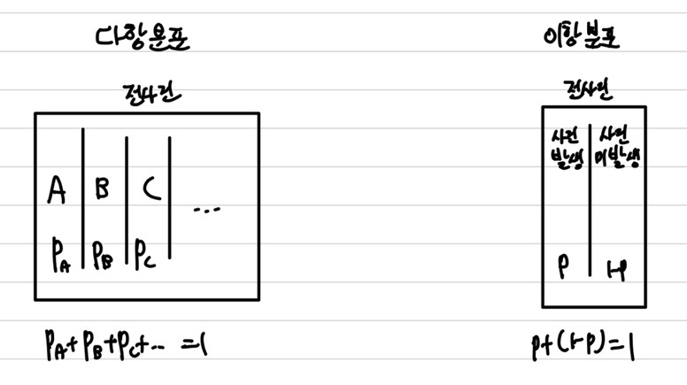
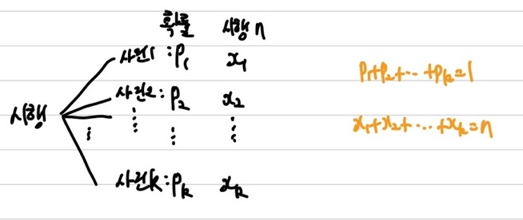
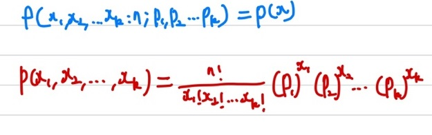

## 다항 분포

다항 분포는 이항 분포의 확장이라고 볼 수 있다. 다항 분포가 되기 위해서는 3가지 조건을 성립해야 한다.    
① 각 시행에서 발생할 수 있는 **사건의 결과는 k개**이다.(최소 3개)   
② 각 **사건의 발생확률은 고정**되어 있어야 한다.   
③ 각 시행은 **독립**이다.   
   
    
좀 더 간단히 이해할 수 있도록 예시를 들어 설명해보자.    
주사위에서 1일 나올 확률 $\frac{1}{6}$, 2~4가 나올 확률 $\frac{1}{2}$, 5가 나올 확률 $\frac{1}{6}$, 6이 나올 확률 $\frac{1}{6}$이라고 해보자. 여기서 주사위를 10번 던져서 1이 3번, 2~4가 5번, 5가 1번, 6이 1번 나올 확률은 다항 분포를 따르게 된다. 사건의 결과로 나올 수 있는 경우는 총 4개이며, 4개의 사건이 발생할 확률은 고정되어 있다. 또한, 내가 시행하는 것은 다른 시행과 연관이 되지 않는 독립 시행이 된다.    
이제 확률을 구해보면, $P(1:3, \; 2,3,4:5, \; 5:1, \; 6:1)=\frac{10!}{3!5!11}(\frac{1}{6})^3(\frac{1}{2})^5(\frac{1}{6})(\frac{1}{6})$이 된다.

### 다항 분포 확률 질량 함수

다음은 다항 분포의 확률 질량 함수(pmf)를 알아보겠다.   
   
각 사건의 결과의 확률에 대해 알고 있어야하니 모수(parameter)가 총 k개 만큼 필요하다. 

### 통계량

우선 다항 분포의 기댓값과 분산은 아래처럼 정의된다.   
$E(X_i)=np_i$   
$V(X_i)=np_i(1-p_i)$   

이번에는 예시를 들어 설명해보겠다.   
사건 A,B,C가 다항 분포를 따른다고 해보자. 각 확률은 $p_A,p_B,p_C$이며, 확률 변수는 $x,y,z$로 표현하겠다.   
이 경우 사건 A는 $E(X)=np_A$, $V(X)=np_A(1-p_A)$이다.   
이 경우 사건 B는 $E(Y)=np_B$, $V(Y)=np_B(1-p_B)$이다.   
이 경우 사건 C는 $E(Z)=np_C$, $V(Z)=np_C(1-p_C)$이다.   
이럴 경우, $E(X \cap Y) = 0, E(X \cup Y) = n(p_A + p_B), V(X \cup Y) = n(p_A + p_B)(1 - (p_A + p_B))$가 된다.
