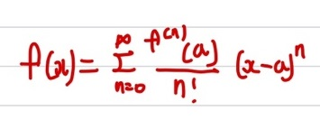
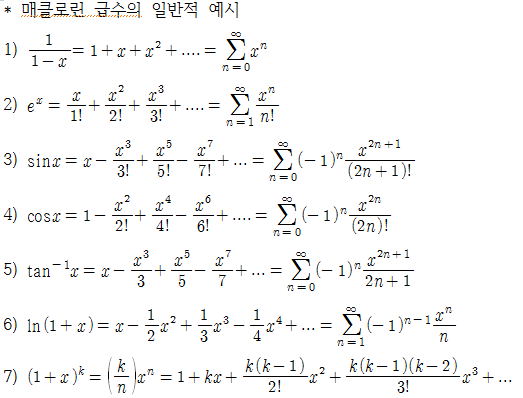
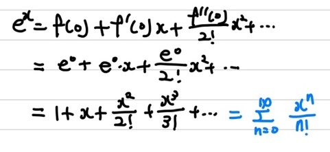
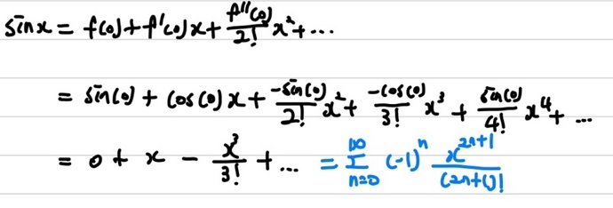
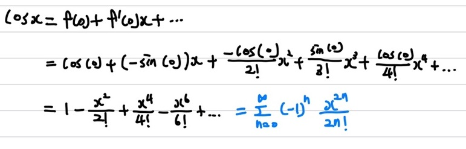
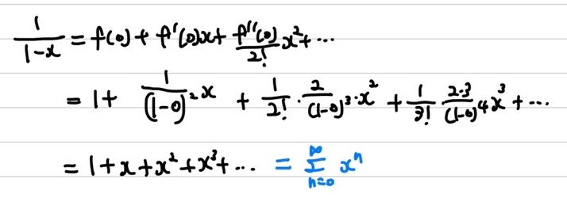
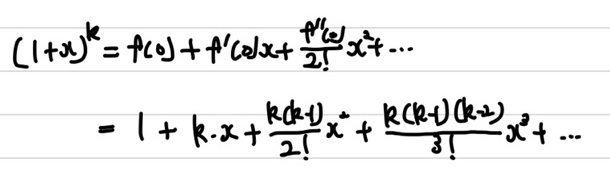

## 테일러 급수(Talyer's series)

테일러 급수는 함수를 특정 점의 미분 계수로 하는 다항식의 극한으로 표현한 것입니다. 즉, **어떤 함수 $f(x)$를 근사한 다항 함수로 표현**하는 것입니다.    
   
상기의 수식에서도 보이듯이 테일러 급수는 **x = a**근처에서만 성립합니다. x와 a값이 많이 차이가 난다면, 그 만큼 큰 오차를 가지게 된다는 것을 뜻합니다.   

### 테일러 급수 증명

   
상기의 이미지에서 보이듯이, 어떤 함수 $f(x)$를 전개하기 위해 우선, $f(x)$를 나타낼 수 있는 한가지 방식인 $\int_{a}^{x} f'(t) dt$를 통해 $f(x)$를 나타냈다고 하겠습니다. 이 때 좌항을 우항으로 넘겨서 $f(x)$를 표현할 수 있습니다. 그런 후 $\int_{a}^{x} f'(t) dt$을 부분 적분을 통해 식을 전개합니다. 이 때 적분 상수는 -x라고 가정을 하고 수식을 전개하겠습니다. 그럼 상기의 이미지처럼 수식이 전개되며 최종적으로 $f(x)$가 a라는 점의 미분 계수로 가지는 다항 함수들로 나타낼 수 있습니다.    

### 매클로린 급수(Maclaurin's series)

매클로린 급수는 테일러 급수의 특수한 경우라고 생각하면 됩니다. 테일러 급수가 **특정 점 a에서 $f(x)$를 근사한 다항 함수로 표현**한 것이라고 했습니다. 매클로린 급수는 **a의 점이 0**인 값입니다.    
   
매클로린 급수의 수식은 상기의 이미지에서 확인할 수 있습니다.    
그럼 이번에는 매클로린 급수로 표현한 함수들의 전개 예시들을 보겠습니다. 이전에 포아송 분포를 설명할 때 나왔던 매클로린 급수의 예시입니다. 이번에는 이 중 몇개를 다시 배운 수식 전개를 통해 증명해보겠습니다.   
      

우선 $e^x$에 대해 전개를 해보겠습니다. 앞으로 $e^x$는 설명한 통계학 내용들에 매우 중요한 요소가 됩니다. 바로 다음장에 이어설 얘기할 MGF에 관해서도 매우 필수적입니다.   
   
   
   
   
   
