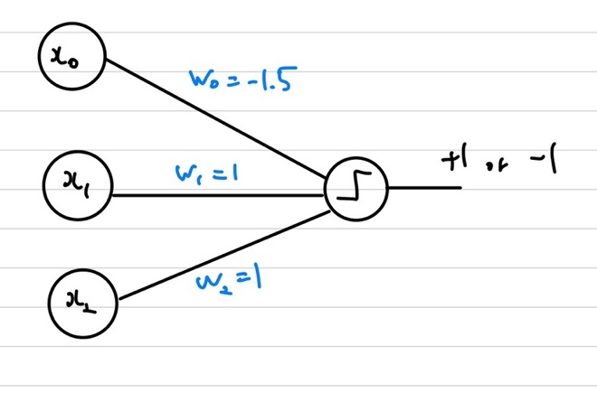

## Perceptron
Perceptron은 신경망 구조(Nerual Network)에서 activation function이 step function이며 Layer가 1개인 신경망을 의미합니다.   
우선 신경망의 구조는 인간의 학습 능력을 컴퓨터도 가질 수 있도록 모방한 것 입니다.   
Perceptron은 논리 구조에서 배우는 AND, OR 연산 구조를 표현할 수 있습니다.   
    
상기와 같은 그래프에서 $l_1, l_2$ 선을 이용하여 분류를 해보는 문제로 예시를 들어 설명하겠습니다.    
우선 $\underline{w} = \begin{bmatrix} -b & w_1, & w_2 \end{bmatrix}^T, \underline{x} = \begin{bmatrix} 1 & x_1, & x_2 \end{bmatrix}^T$라고 하겠습니다.   
그럼 $l_1 = \underline{w_1}^T \underline{x}$와 $l_2=\underline{w_2}^T \underline{x}$가 됩니다.   
우선 AND, OR, XOR 연산 기호를 신경망으로 표현해보겠습니다.   
 
AND    
    
우선 모든 x값인 $\underline{x}$는 1이나 -1 값을 가진다고 가정을 해보겠습니다. 그럼 상기의 신경망 구조는 AND연산 기호를 의미하게됩니다. 즉, $x_1=1, x_2=1$일 때만, 출력이 1이 나오게됩니다.   
    
OR    
    
우선 모든 x값인 $\underline{x}$는 1이나 -1 값을 가진다고 가정을 해보겠습니다. 그럼 상기의 신경망 구조는 OR연산 기호를 의미하게됩니다. 즉, $x_1=-1, x_2=-1$일 때만, 출력이 -1이 나오게됩니다.   
    
XOR    
    
우선 모든 x값인 $\underline{x}$는 1이나 -1 값을 가진다고 가정을 해보겠습니다. 그럼 상기의 신경망 구조는 XOR 기호를 의미하게됩니다.
 
 
이제 젤 상기의 이미지인 $l_1, l_2$ 두개의 선과 AND, OR 연산 기호를 이용하여 +와 - 기호를 분류해보겠습니다. 만약, $(l_1 \geq 0 \& l_2 \geq 0) \| (l_1 \leq 0 \& l_2 \leq 0)$라면, -값이 됩니다. 이를 MLP를 통해 표현해보겠습니다.   
MLP(Multi Layer Perceptron)    
    
우선 입력 $x_1,x_2$라는 vector가 들어왔을 때, weight를 잘 주면 $l_1, l_2$의 직선을 표현할 수 있습니다. 그다음 보라색 선은 $l_1 < 0; \& \; l_2 >0$ 구간을 나타내며, 자홍색 선은 $l_1 >0 \; \& \; l_2 < 0$인 구간을 나타냅니다. 이 구간은 모두 +인 구간으로 분류됩니다. 이렇듯 Perceptron을 여러개 사용하면 Non-linear한 영역도 분류가 가능해집니다. 
