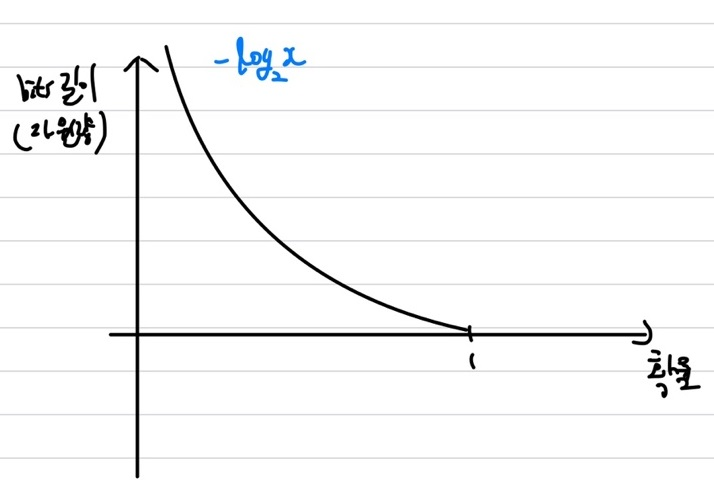

## Entropy
우선 위키백과에 나와있는 Entropy 정의부터 살펴보겠습니다.   
> 엔트로피(entropy)는 열역학적 계의 유용하지 않은 (일로 변환할 수 없는) 에너지의 흐름을 설명할 때 이용되는 상태 함수입니다. 통계역학적으로, 주어진 거시적 상태에 대응하는 미시적 상태의 수의 로그로 생각할 수 있습니다.   

원래 Entropy는 열역학쪽에서 주로 많이 사용되는 용어이지만, 이를 통계역학적으로 다루어보면 상태 함수에서 상태의 수의 로그로 생각을 한다고 했습니다. 즉, Entropy는 현 상태에 대한 함수라는 의미가 됩니다. 저희는 AI를 공부하다보면 Entropy라는 단어가 들어간 용어를 많이 보게 될 것입니다. (e.g. Information Gain, Entropy, Cross-Entropy). 그럼 이번 단원에서는 이 Entropy가 정확하게 무엇을 뜻하는지와 상태 함수의 수식은 어떤 것인지 알아보겠습니다.   

Entropy는 주어진 데이터 집합의 heterogeneous정도(혼잡도)를 의미합니다.즉, 불확실성의 척도라고 할 수 있습니다. 참고로 여기서 불확실성이란 제가 생각할 때, 어떤 데이터가 나올지 에측하기 어렵다라고 이해를 했습니다. 그럼 이어서 어떤 정보를 표현하는데 있어 **여러개의 자원들을 균등하게 사용하여 표현할시 엔트로피가 최대**가 됩니다. 조금 더 쉽게 설명해보겠습니다.   
**Entropy는 어떤 정보를 표현하는데 있어 필요한 평균 최소한의 자원량**이라는 의미입니다. 여기서 이 정보를 표현할 때 비트(bits)를 이용하여 표현하고자 했습니다. 즉, 0 또는 1을 이용하여 모든 정보를 표현하고 했습니다. 그럼 이 비트가 자원량이 되고 이 비트를 최소로 사용하면서 어떤 정보를 표현할 때가 바로 Entropy가 됩니다. 즉, 비트를 가장 짧게 사용하여 표현하는 것이 바로 목적입니다.    
정보를 비트로 표현하는데, 많이 사용되는 정보는 짧은 비트에 할당시켜놓는다면, 어떤 정보에서 필요한 비트(자원)이 최소가 될 수 있습니다. 한번 예시를 들어 설명해보겠습니다. 많이 사용되는 정보를 1로 할당시킨 것과 111로 할당시켜서 정보를 표현하는 경우를 들어보겠습니다. 이 정보는 많이 사용되니 1로 할당됬을 경우 그 정보를 4번 표현하려면 1,1,1,1 즉, 4개의 비트만 필요로 하면 됩니다. 하지만, 111로 할당시켰을 경우 111, 111, 111, 111 즉, 12개의 비트를 필요로하게 됩니다. 1로 할당한 것보다 무려 4배나 더 많은 자원(비트)가 필요로 하게 됩니다. 이 정보를 이제 확률에 빗대어 표현해보겠습니다.   
그럼 확률이 큰 것은 짧게 나타내고 확률이 작은 것은 길게 나타내면 entropy를 만족 시킬 수 있을 것입니다.   
    
상기의 이미지에서처럼 확률이 큰 것은 적은 자원량(짧은 길이)로 표현하고 확률이 작은 것은 큰 자원량(긴 길이)로 표현한다면 상기의 그래프처럼 나타내질 것입니다. 근데 상기의 그래프는 log함수를 x축으로 뒤집은 모양이 됩니다. 그럼 상기의 그래프의 함수는 $-log_2 (p_i)$가 되는 것을 알 수 있습니다. bits이니 밑은 2인 로그 함수가 됩니다. 근데 여기서 최소 자원량은 정해진 것이 아닌 **랜덤**이기 때문에 이를 나타낼 때는 **기댓값**측면에서 생각을 해야합니다. 그럼 기댓값은 변수와 확률의 곱의 합이 되니, $\sum_i p_i - log_2 (p_i)$이 됩니다. 여기서 $- log_2 (p_i)$이 해당 확률에 대한 최소 길이(최소 필요 자원량)를 나타내니 **$\sum_i p_i - log_2 (p_i)$인 기댓값이 최소로 필요로하는 평균 자원량**이 됩니다.   
그럼 여기서 이전에 말했듯이 Entropy가 최대가 되려면 이 확률이 균등할 때일 것입니다. 즉, 확률이 균등 분포를 따를 때, Entropy는 최대값을 가지게 됩니다.(불확실성이 가장 높다.)즉, 정보가 많으며 확률은 낮다는 의미가 됩니다.   

 
참고로 continuous할 때는 $log_2 \rightarrow ln$으로 가게 되며, 균등 분포일때 최대가 아닌 가우시안 분포를 따를 때, Entropy가 최대가 됩니다. 하기에 Discrete일 때와 Continous일 때의 Entropy 수식을 표기하겠습니다.   
\begin{aligned}    
H(x) =& \sum_i p_i \; - log_2 (p_i) \newline   
H(x) =& \int p(x) \; ln(p(x))
\end{aligned}   

## Corss-Entropy
Cross-Entropy는 분류문제를 해결할 때 자주 사용하는 Loss 함수입니다. 이전에 배웠던 Logistic Regression과 Softmax Regression에서도 Loss 함수로 Corss-Entropy를 이용했습니다. 그럼 이 Cross-Entropy가 정확하게 어떤 것인지 이번에 알아보겠습니다.    
Entropy는 필요한 최소한의 평균 자원량이라고 했습니다. 즉, 여기서 확률 관점으로 넘어가면 Entropy의 최소한의 자원량인 $-log(p_i)$가 곧 정답이라고 생각하시면 됩니다. 즉, $-log(p_i)$가 따르는 모형의 분포가 실제 분포가 됩니다. 그럼 여기서 Cross-Entropy는 모델에서 예측한 확률인 $-log(q_i)$라는 값을 내뱉게됩니다. 즉, **Cross-Entropy는 실제 정답 모형의 분포와 모델이 예측한 모형의 분포의 차이를 구하는 수식**이 됩니다. 즉, $-log(q_i)$는 정답인 Entropy $-log(p_i)$가 되는 것이 학습의 목표가 된다는 의미입니다. 그럼 Cross-Entropy의 수식을 한번 확인해보겠습니다.   
\begin{aligned}    
H_q(p) =& - \sum_i p_i \; log(q_i) \; : \: Cross-Entropy \newline   
H(x) =& - \sum_i p_i \; log (p_i) \newline \; : \: Entropy \newline   
\end{aligned}   

상기의 수식에서 볼 수 있듯이 Entropy의 $p_i$가 정답이라고 했을 때, Cross-Entropy는 모델이 예측한 확률 분포인 $q_i$의 값을 내뱉은 것입니다. 그럼 Entropy는 최소의 값이라고 했습니다. 그럼 당연히 Cross-Entropy는 Entropy보다 값이 클 것입니다.    

## KL-Divergence
그럼 이제 KL-Divergence에 대해 알아보겠습니다. 이전까지 Entropy와 Cross-Entropy에 대해 알아보았습니다. KL-Divergence은 이 Entropy와 Cross-Entropy의 개념을 이용한 것 입니다. Cross-Entropy가 모델이 잘못 예측한 확률 분포이고, Entropy는 실제 확률 분포라고 했습니다. 그리고 Entropy는 최소한의 자원량이니 잘못 예측한 Cross-Entropy가 당연히 Entropy보다 클 것 입니다. 그럼 여기서 KL-Divergence는 이 Cross-Entropy에서 Entropy를 빼주면 그 차이가 바로 **모델이 얼마나 잘못 예측했는가**를 의미하게 될 것 입니다. 하기에 수식을 표기하겠습니다.   
\begin{aligned}    
H_q(p) =& - \sum_i p_i \; log(q_i) \; : \; Cross-Entropy \newline   
H(x) =& - \sum_i p_i \; log (p_i) \; : \; Entropy \newline   
KL-Divergence =& Cross \; Entropy - Entropy \newline   
D_{KL}(p || q) =& H_q(p) - H(x) \newline   
=& - \sum_i p_i \; log(q_i) + \sum_i p_i \; log (p_i) \newline   
=& \sum_i p_i log (\frac{p_i}{q_i})
\end{aligned}   

## Mutual Information
\begin{aligned}    
M.I =& \sum_i \sum_j p(x_i, y_i) log(\frac{p(x_i, y_i)}{p(x_i)p(y_i)})
\end{aligned}   

