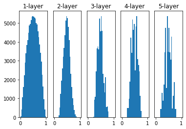

## Weight Initialization
Neural Network의 목적은 **Error 함수(Loss 함수)를 최소화하는 것**입니다. 보통, 이 Loss 함수를 최소화하기 위해 Gradient Descent방법을 적용하여, 현재의 Parameter들이 어떤 방향으로 바뀌어야 이전 Loss함수보다 최소화가 될 수 있는지를 구하여 그 방향으로 Weight를 업데이트합니다. 그럼 여기서 이 Weight의 초기값은 어떻게 설정하는게 좋은지와 Weight 초기값이 어떤 의미를 가지는지에 대해 알아보겠습니다.    
    
예를 들어, 어떤 Neural Network의 Loss함수가 상기의 이미지의 그래프와 같이 생겼다고 가정해보겠습니다. 그럼, Neural Network의 목적에 따라 이 그래프의 최저점을 향해 가는 것이 목적이 될 것 입니다. 상기의 이미지는 빨간색 봉우리에서 시작해서 Gradient 방향으로 내려가며 Loss함수를 최소화시키고 있습니다. 근데 여기서 만약 주황색 봉우리에서 시작할 경우, 빨간색 봉우리에서 출발하여 도착하는 최저점과 다른 곳에 안착하게됩니다. 즉, Local Minimum에 빠져서 나오지 못하는 문제가 발생할 수 있습니다. 시작점에 따라 Local Saddle Point에 도달할 수 있고, Global Saddle Point에 도달할 수 있다는 의미가됩니다. 따라서 어떤 가중치 초기화를 쓰는지에 따라 달라지기 때문에, 적절한 가중치 초기화법이 필요하게됩니다.   

### Zero Initialization
가장 먼저 생각해볼 수 있는 가중치 초기화는 모두 0으로 초기화하는 방법일 것 입니다. 이전에 배웠던 weight sum을 생각해보겠습니다. 이 경우 가중치를 모두 0으로 초기화를 시켜놓는다면 어떤 Input이 들어오던 Output은 항상 0으로 나올 것 입니다. 즉, 0으로 초기화를 하면 안된다는 의미입니다.    
그럼 Zero Initialization을 조금 다른 의미로 해석해보겠습니다. 모든 가중치의 값이 동일한 값이라고 생각해보겠습니다. 그럼 backpropagation을 통해 weight를 업데이트할 때, 모두 똑같은 값으로 변하게될 것 입니다. 즉, training의 의미가 없어지며, Neural Network의 구조자체가 의미가 없어질 것 입니다. 따라서, 저는 Zero Initialization의 초기화 방법은 배제하는 것이 좋다고 생각합니다.   

### Random Initialization
그럼 초깃값을 랜덤하게 설정하는 방법을 생각해볼 수 있습니다. 그럼 랜덤하게 설정하는 방법도 다양할텐데, 가장 쉬운 방법은 확률 분포를 이용하는 것이라고 생각하실 수 있습니다. 즉, 가장 흔하면서 중요한 가우시안 분포를 기반으로 초깃값을 설정하는 방법입니다. 즉, 이렇게 설정하면 모든 초깃값들이 다르게 설정될 것입니다.    
그럼 한번 layer가 5개인 노드로 구성된 Neural Network가 있다고 가정해보겠습니다. 각 노드들의 activation function은 sigmoid 함수를 이용했다고 가정해보겠습니다. 여기서 sigmoid 함수는 Gradient Vanishing인 미분값이 0으로 가는 문제점이 발생한다고 말씀드렸습니다. 이 Neural Network에 우선 평균은 0, 분산은 1인 가우시안 분포를 이용하여 초깃값을 세팅해보겠습니다.   
    
상기의 이미지와 같이 초깃값들이 세팅될 것입니다. 상기의 이미지에서 볼 수 있듯이, sigmoid 함수로 인해 0과 1에 가까운 값만 나타나는 것을 확인할 수 있습니다. sigmoid는 값이 조금 커지거나 작아지면 거의 1과 0으로 수렴하기 때문입니다. 상기의 이미지에서도 볼 수 있듯이, 이 경우 Gradient Vanishing현상이 발생으로 학습이 잘 이루어지지 않을 것입니다.    

 
 
상기의 경우 표준편차가 커 Gradient Vanishing현상이 발생했습니다. 그럼 이번에는 이전 가우시안 분포와 동일하지만, 표준편차를 0.01로 변경해보겠습니다.    
    
상기의 이미지에서 볼 수 있듯이 표준편차를 작게해주면, 층이 깊어질수록 0.5의 값으로 몰리는 현상을 확인하실 수 있으실겁니다. 이전 Zero Initialization에서도 말했듯이 모든 노드의 출력값이 비슷하면 여러개의 노드로 구성한 의미가 사라진다고 말씀드렸습니다. 따라서 이렇게 가중치를 초기화하게되면 학습이 제대로 이루어지지 않을 것입니다.    

### Lecun Initialization
이번엔 Lecun이라는 분이 만들어낸 초기화방법에 대해 알아보겠습니다. 우선 Lecun이라는 분은 생소하실수도 있습니다. Lecun이라는 분은 LeNet의 창시자이며, CNN을 도입하신 분입니다. 이 분께서는 크게 **가우시안 분포**를 따르는 방법과 **균등분포**를 따르는 방법 2가지를 제시하셨습니다. 하기의 수식에서 $N_{in}$은 이전 layer의 노드의 수를 의미합니다.  

 
정규분포의 경우는 하기와 같습니다.   
\begin{aligned}    
w \; \sim& \; N(0, Var(w)) \newline   
Var(w) =& \frac{1}{N_{in}}
\end{aligned}   

상기의 평균이 0, 분산이 $\sqrt{\frac{1}{N_{in}}}$인 가우시안 분포을 이용하여 초깃값을 세팅해주는 것입니다.   

 
균등분포의 경우는 하기와 같습니다.   
\begin{aligned}    
w \; \sim& \; U(-\sqrt{\frac{3}{N_{in}}}, \sqrt{\frac{3}{N_{in}}})
\end{aligned}   

상기는 $-\sqrt{\frac{3}{N_{in}}} ~ \sqrt{\frac{3}{N_{in}}}$ 범우의 균등 분포를 이용하여 초깃값을 세팅해주는 것입니다.    
Lecun은 상기의 정규분포와 균등분포 두개 모두를 이용하여 초깃값을 세팅하자는 논문을 발표했습니다. 상기의 두 수식을 잘 보시면, 두개 모두 평균은 0이고 분산은 동일하게 $\frac{1}{N_{in}}$인 것을 확인하실 수 있습니다. 따라서 두개의 분포 중 아무데서나 뽑아서 초깃값을 세팅하고자 했습니다. 

### Xavier Initialization(Glorot Initialization)
이번에는 자비어(Xavier) 초기값에 대해 알아보겠습니다. 보통 Xavier라는 단어는 생소하실 수도 있습니다. 왜냐하면 Xavier보다는 Glorot을 더 많이 사용하기 때문입니다. Xavier도 Lecun과 동일하게 **이전 노드와 다음 노드의 수**에 의존하여 초깃값을 세팅하는 방법입니다. 고정된 표준편차를 이용할 경우 상기의 Random Initialization에서 발생했던 것과 동일한 문제가 발생할 수 있어, 이를 극복하기 위해 Lecun에서부터 현재 Layer의 초깃값을 이전 노드 수와 다음 노드 수를 이용하여 세팅하는 방법이 고안됬습니다. Lecun과 동일하지만 조금 다른 수식을 하기에 나타내보겠습니다.   
\begin{aligned}    
w \; \sim& \; N(0, \frac{2}{N_{in} + N_{out}}) \newline   
w \; \sim& \; U(-\sqrt{\frac{6}{N_{in} + N_{out}}}, \sqrt{\frac{6}{N_{in} + N_{out}}})
\end{aligned}   

상기에 수식에서 볼 수 있듯이, Lecun은 이전 layer의 노드의 수에 대해서만 의존적이었다면, Xavier(Glorot)은 이전 layer의 노드 수와 다음 layer의 노드 수, 두 가지를 고려하여 초깃값을 세팅하는 방법입니다. 참고로 $N_{in}$은 이전 layer의 노드의 수를 의미하며 $N_{out}$은 다음 layer의 노드의 수를 의미합니다. Xavier의 경우 이전 Kaiming보다 분산이 작은 것을 확인하실 수 있습니다. 따라서 Xavier를 이용한 초깃값 세팅은 비선형 함수(tanh, sigmoid 등)에 대해서 효과적입니다. 하지만 Relu를 이용했을 때는 출력값이 0으로 수렴하는 현상을 확인하실 수 있습니다. Relu를 사용하실 경우 나중에 설명한 Kaiming(He) 초깃값 세팅 방법을 이용하시는 것을 추천드립니다. 참고로 여기서 균등분포와 정규분포의 평균과 분산은 똑같습니다.    
    
상기의 이미지는 Xavier를 이용하여 초깃값을 세팅한 경우입니다. 이전 Random Initialization의 방법보다 훨씬 더 고르게 퍼져있는 것을 확인하실 수 있습니다. 층마다 노드 개수를 다르게 설정하더라도 이에 맞게 가중치가 초기화되기 때문에 Gradient Vanishing 현상을 해결할 수 있습니다. 

### Kaiming Initialization(He Initialization)
Kaiming 초기값은 방금전에 배운 Lecun과 동일한 컨셉입니다. 여기서 평균은 똑같이 0이고, 분산만 각각에 대해 2배를 해준 것입니다. Kaiming이란 용어는 생소하실 수 있습니다. 하지만, 직접 모델을 설계해보고 학습을 돌려보신 분이라면 Kaiming을 대부분 사용해보셨을거라고 생각합니다. 왜냐하면 Kaiming의 또다른 이름은 He Initialization이기 때문입니다.    
즉, 하기와 같습니다.   
\begin{aligned}    
w \; \sim& \; N(0, \frac{2}{N_{in}}) \newline   
w \; \sim& \; U(-\sqrt{\frac{6}{N_{in}}}, \sqrt{\frac{6}{N_{in}}})
\end{aligned}   

Kaiming의 경우 보통 Relu를 이용하는 신경망에서 자주 사용됩니다.    
    
상기의 이미지는 Relu를 이용하는 신경망에서 Xavier Initialization(Glorot Initialization)을 이용하여 초깃값을 세팅했을 때의 경우입니다. 첫번째 layer에서는 골고루 잘 퍼져있지만, 층이 깊어질수록 0에 많이 쏠리는 현상을 확인하실 수 있습니다. 그럼 현재는 5개의 층으로 이루어져있지만, 10개, 20개 층으로 이루어져있다면 대부분이 0으로 쏠릴 것이라고 예상하실 수 있습니다. 즉, Gradient Vanishing 현상이 발생하게 될 것입니다.    
    
상기의 이미지는 Xavier Initialization(Glorot Initialization)이 아닌 Kaiming Initialization(He Initialization)을 이용했을 때의 경우입니다. 첫번째 층에는 똑같이 골고루 잘 퍼져있으며, 층이 깊어질수록도 계속하여 골고루 퍼져있는 것을 확인하실 수 있습니다. 즉, **Reul의 경우 Kaiming Initialization(He Initialization)을 이용하는 것이 Gradient Vanishing 현상을 방지**할 수 있는 것을 확인하실 수 있습니다. 