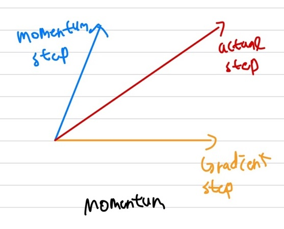
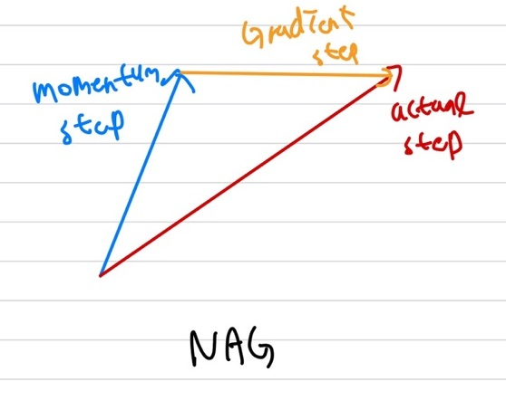

## Optimizer
Deep Neural Network는 Input Layer, Hidden Layer, Outpu Layer로 구성되어있습니다. 각 Layer와 Node에는 weight가 존재하며, 이 weight를 잘 fitting시키는 것이 학습의 목표입니다. 그럼 이 weight가 잘 fittinig이 됬는지를 파악할 수 있는 방법이 바로 Loss 함수입니다. 즉, Loss 함수를 최적화(최소화)를 시켜야 하는 것입니다. 근데 그럼 이 Loss 함수를 어떻게 최적화를 시켜야할까요? 이전에 배웠던 GD나 SGD와 같은 알고리즘을 통해 최적화를 시킬 수 있습니다. 즉, Output이 실제 정답과 잘 맞는(Loss 함수가 작아지는)쪽으로의 weight로 잘 fitting을 시키도록 weight를 업데이트해주면 됩니다. 그럼 여기서 이 Loss 함수의 최소값을 찾는 행위를 **Optimization**이라고 하며, 이를 수행하는 알고리즘들을 **Optimizer**라고 부릅니다. 여기서 우리의 목표는 어떤 Optimizer를 사용할 경우, **Global Minimum에 도달하며, 얼마나 빠른 시간에 도달**할 수 있는지가 학습에서 선택하는 Optimzier 알고리즘의 주요 관건이 됩니다.   
    
    
상기의 이미지는 가장 대표적인 Optimizer들이 어떻게 최저점(Saddle Point)에 안착하는지를 보여주는 예시입니다. 그럼 이제 Optimizer의 종류에 대해 알아보겠습니다.   

## Optimizer 종류
    

### Gradient Descent
Gradient Descent는 이전에도 계속하여 설명을 했기 때문에 이번절에는 아주 간략하게 설명을 하겠습니다. GD는 모든 데이터에 대해 고려하여 이 때 Loss함수를 최소화할 수 있는 Gradient(방향)으로 weight를 업데이트 해줍니다. 즉, 하기의 수식에서 $J(\theta)$는 모든 데이터에 대해 고려를 했다는 의미가 됩니다.  
\begin{aligned}    
\theta =& \theta - \alpha \triangledown_{\theta} J(\theta)
\end{aligned}   

### Stochastic Gradient Descent
Stochastic Gradient Descent도 간략하게 설명을 하겠습니다. 기본적인 Gradient Descent의 원리를 따라가며, Gradient Descent는 모든 데이터에 대해 고려해 Local Minimum과 수행시간이 오래걸린다는 단점을 극복했습니다. 즉, 1개의 데이터에 대해서면 고려하며 weight를 업데이트는 방식입니다. 즉, 하기의 수식에서 $J(\theta ; x^{(i)}; y^{(i)})$는 i번째 데이터 $x$와 i번째 정답 $y$에 대해서 고려를 한다는 의미가 됩니다.    
\begin{aligned}    
\theta =& \theta - \alpha \triangledown_{\theta} J(\theta ; x^{(i)}; y^{(i)})
\end{aligned}   

### Mini-batch Stochastic Gradient Descent
Mini-batch Stochastic Gradient Descent도 간략하게 설명을 하겠습니다. 이전 SGD와 동일한 원리를 가지고 있으며, SGD는 1개의 데이터에서 대해서만 고려를 했는데, 이 부분이 너무 비효율적이라 직접 설정한 batch size만큼의 데이터에 대해 고려하게됩니다. 즉, 만약 n개의 batch size로 설정했다면, n개의 데이터에 대해서 고려하여 weight를 업데이트하는 방식입니다. 즉, 하기의 수식에서 $J(\theta ; x^{(i:i+n)}; y^{(i:i+n)})$는 i번째 부터 n번째까지의 데이터 $x$와 i번째에서 n번째까지의 정답 $y$에 대해서 고려를 한다는 의미가 됩니다.  
\begin{aligned}    
\theta =& \theta - \alpha \triangledown_{\theta} J(\theta ; x^{(i:i+n)}; y^{(i:i+n)})
\end{aligned}   

### Momentum
    
상기의 Optimzer 종류에 대해 나타난 그래프에서 확인해보면, SGD의 경우 매우 느린 속도로 최저점을 향해 나아가는 것을 확인할 수 있습니다. 그 이유는 SGD의 경우 고정된 Learning Rate($\alpha$)에 의해 동일한 step으로 학습이 되기 때문입니다. 따라서 학습과정에서 최저점을 향해 가는 안정적인 방법이기도 합니다. 하지만, 너무 느린 속도로 가기 때문에 이런 문제를 극복하고자 나온 것이 Momentum입니다. Momentum은 쉽게 관성을 이용하는 방법이라고 생각하시면 됩니다. SGD의 경우 기울기 값이 이전과 동일하다면 step의 길이도 동일하게 업데이트가 됩니다. 또, 기울기값이 0인 지점에서는 업데이트가 되지 않으며, local minimum에서 빠져나오지 못하게 될 수도 있습니다.    
Momentum은 이전 이동거리인 $v_t$와 관성 계수 $\gamma$를 고려하여 weight를 업데이트하게 됩니다.   
\begin{aligned}    
v_t =& \gamma v_{t-1} + \alpha \triangledown_{\theta} J(\theta) \newline   
\theta =& \theta - v_t
\end{aligned}   

보통 관성 계수 $\gamma = 0.9$로 설정합니다. 즉, 쉽게 설명을 하면 내리막길에서 내려가다가 90도로 방향을 바꿀려고하면 현재 내려가고 있는 관성때문에 90도로 방향을 바꾸지 못하고 90도가 아닌 70도 정도로 방향을 바꾸는 현상이 발생합니다. 이 이유가 관성 때문인데, 즉, 현재 step에서의 Gradient뿐만 아니라 이전 step에서의 Gradient도 고려되어 방향이 바뀌게 된다는 의미입니다. 즉, 상기의 $v_t$ 수식에서도 볼 수 있듯이 단순히 이전 step의 Gradient를 계속해서 누적을 하게 됩니다.   
Momentum을 사용하면 관성 개념을 적용하여 최저점을 더 빠르게 찾을 수가 있게되며, Gradient가 0인 곳에서도 이전 Gradient를 고려하는 관성덕분에 업데이트가 수행될 수 있는 장점이 있습니다.    
하지만, 학습이 충분하지 않다면 얼토당토않는 곳에 안착을 하여 성능측면에서 매우 안좋아질 수 있는 단점도 함께 돈재합니다.   
 

### NAG(Nesterov Accelrated Gradient)
Momentum은 $\gamma v_{t-1}$와 같이 이전 기울기값을 기반으로 다음 기울기값을 업데이트합니다. 따라서, 만약 이전 기울기값이 매우 가팔라 빠르게 내려갔다고 해보겠습니다. 그럼 내려가는 길 사이에 최저점이 존재할 경우 이 최저점을 지나치는 상황이 발생할 수도 있습니다. 즉, 이런 Momentum의 문제점을 극복하기 위해 Nesterov Accelrated Gradient가 등장하게되었습니다.   
Nesterov Accelrated Gradient는 기존 Momentum과 동일하게 관성을 이용하지만, 여기서 Momentum은 이전 기울기값을 기반으로 다음 기울기값을 업데이트하는 것이 아닌, **Momentum으로 이동된 지점에서의 기울기를 이용**하여 업데이트하는 방법입니다. 이 경우 NAG는 관성에 의해 이동된 곳에서의 기울기를 이용하기 때문에 관성에 의해 **빠르게 이동하는 장점과 지나쳐가지 않고 최저점에서 멈출 수 있는 장점도 생겨 효과적으로 기울기를 제동**할 수 있게 됩니다.   
\begin{aligned}    
v_t =& \gamma v_{t-1} + \alpha \triangledown_{\theta} J(\theta - \gamma v_{t-1}) \newline   
\theta =& \theta - v_t
\end{aligned}   

    
즉, 상기의 이미지에서 보이듯이 관성에 의한 방향으로 이동한 후, 이동한 지점에서의 기울기를 이용하여 다음 step으로 이동할 기울기 방향을 결정하게 됩니다.   

### Adagrad(Adaptive Gradient)
SGD의 경우에는 $\theta$가 동일한 기준으로 업데이트가 되었습니다. 즉, 모두 동일한 기준으로 변경이 됬을 경우, 불균형 데이터의 경우 적은 데이터와 많은 데이터에 대해서도 동일한 기준으로 업데이트가 되기 때문에, 이 경우 최저점을 찾지 못하는 경우가 발생할 수 있습니다. 불균형 데이터의 경우 적은 데이터에 대해서는 데이터를 확인하는 경우가 작기 때문에 큰 Learning Rate, 즉 큰 step으로 이동해야하며, 많은 데이터의 경우에는 많이 보기 때문에 작은 Learning Rate, 즉, 작은 step으로 이동을 해야 효율적으로 이동하여 최저점을 찾을 수 있을 것입니다. 이 개념을 이용한 것이 바로 Adagrad입니다.   
Adagrad는 이전 SGD는 동일한 기준으로 $\theta$를 업데이트해서 발생하는 상기와 같은 문제를 해결하기 위해, 각각의 $\theta$에 다른 기준을 적용하였습니다. 즉, 방금전에 말씀드렸던 것과 비슷하게 지속적으로 변화하던(많은 데이터)의 경우에는 이미 $\theta$가 최저점에 근접했을 것이기 때문에 Learning Rate를 작게 주고, 많은 변화가 없던(적은 데이터) $\theta$는 큰 Learning Rate를 주어 빠르게 최저점으로 갈 수 있도록 적용한 개념입니다. 수식은 하기와 같습니다.  
\begin{aligned}    
g_{t,i} =& \triangledown_{\theta} J(\theta_{t, i}) \newline   
G_t =& G_{t-1} + (g_{t, i})^2 \newline   
\theta_{t+1, i} =& \theta_{t, i} - \frac{\alpha}{\sqrt{G_{t,ii} | \epsilon}} g_{t, i} \newline   
\theta_{t+1} =& \theta_{t} - \frac{\alpha}{\sqrt{G_{t} | \epsilon}} g_{t} \newline   
\end{aligned}   

   

여기서 $G_t$는 Diagonal Matrix이며, 모든 $\theta$인 이전 Gradient의 제곱합을 담고있습니다. 즉, $G_t$는 Network의 parameter 수에 대한 Matrix로 각 이동한 거리의 의미를 담고 있습니다. 따라서, 이후에 업데이트될 시 learning rate에 나눠줌으로써 이전에 많이 이동했던 것에 대해서는 작은 Learning Rate가 나올 것이고, 적게 이동했던 것은 큰 Learning Rate값이 나와 변화를 제동합니다. 참고로 여기서 root square를 안취해주면 성능이 떨어진다고 합니다. $\epsilon$은 0으로 나눠주는 divided by zero를 방지하기 위해 추가되었습니다.   
Adagrad도 단점이 존재하는데, 이의 단점은 학습이 진행됨에 따라 변화 폭이 눈에 띄게 줄어들어 결국 움직이지 않게 될 수 있습니다.    

### Adadelta(Adaptive Delta)
Adadelta는 이전 Adagrad의 단조롭게 감소하는 Learning Rate를 개선한 Adagrad의 확장 방법입니다. Adagrad에서는 이전 Gradient들에 대해 제곱합을 통해 Learning Rate를 구했지만, Adadelt는 모든 이전 Gradient를 고려하지 않고 특정 크기인 window만큼의 과거 Gradient를 고려하도록 제한했습니다. 즉, 과거 Gradient에 대해 무지성적으로 제곱합을 저장한 것이 아닌, 재귀적으로 과거 Gradient의 평균을 이용했습니다. $E\[ g^2 \]_t$는 step t에서 과거 평균과 현재 Gradient의 정보를 담고 있습니다.    

\begin{aligned}    
E \[ g^2 \]_t = \gamma E\[ g^2 \] _{t-1} + (1 - \gamma)g_t^2 \newline 
\end{aligned}   

여기서 $\gamma$는 이전 mommentum과 비슷합 값입니다. 즉, 이전에 Adagrad에서 $G_t$대신 $E\ [ g^2\]_t$로 대체하면 됩니다.   

\begin{aligned}    
\vartriangle \theta_t =& - \alpha \triangledown_{\theta} J(\theta) = \alpha g_{t, i} \newline   
\theta_{t+1} =& \theta_t + \vartriangle \theta_t \newline    
\end{aligned}   
    

SGD의 수식을 상기와 같이 표현해보았습니다. 그럼 $G_t$ 대신 $E\[g^2\]_t$로 대체해서 나타내보겠습니다.   

\begin{aligned}    
\vartriangle \theta_t =& - \frac{\alpha}{\sqrt{E \[ g^2 \]_t + \epsilon}}g_t \newline   
RMS[\vartriangle \theta]_t =& \sqrt{E \[ g^2 \]_t + \epsilon} \newline   
\end{aligned}   
    

상기의 수식에서는 분모는 $\sqrt{E \[ g^2 \]_t + \epsilon}$로 지수이동평균을 사용하는 반면 분모인 $\alpha$에는 지수이동평균을 적용하지 않아 단위가 맞지 않게됩니다. 따라서 분자에도 지수이동평균을 적용하기 위해 분자쪽에도 수식 변경을 취해줍니다. 분모에서는 Gradient의 제곱의 기댓값을 이용했으니, 분자에는 parameter인 $\theta$의 제곱의 기댓값을 이용하여 나타냈습니다.   
\begin{aligned}    
E \[ \vartriangle \theta^2 \]_t =& \gamma E \[ \vartriangle \theta^2 \] _{t-1} + (1 - \gamma)\vartriangle \theta_t^2 \newline   
RMS \[ \vartriangle \theta \]_t =& \sqrt{E \[ \vartriangle \theta^2 \]_t + \epsilon} \newline    
\end{aligned}   

여기서 현재 step t에서의 $RMS \[ \vartriangle \theta \] _t$는 알 수 없기 때문에 이전 t-1 시점의 근사값 $RMS \[ \vartriangle \theta \] _{t-1}$으로 대체합니다. 이렇게 이전 업데이트에서 사용했던 Learning Rate $\alpha$를 $RMS \[ \vartriangle \theta \] _{t-1}$로 바꾸면 Adadelt의 수식이 완성됩니다.    

\begin{aligned}    
\vartriangle \theta_t =& - \frac{RMS \[ \vartriangle \theta \] _{t-1}}{RMS \[g \] _t} g_t \newline   
\theta _{t+1} =& \theta_t + \vartriangle \theta_t \newline    
\end{aligned}   

즉, 지수이동평균을 적용하여 step인 Learning Rate의 크기가 결정되어 Adagrad에서 변화 폭이 줄어들 때, 움직이지 않는 현상을 극복했습니다.    

### RMSprop
RMSprop도 Adagrad의 단점인 변화 폭이 작아지면 움직이지 않는 문제를 해결하기 위해 등장했습니다. RMsprop의 개념과 동일하게 경사가 심한(많은 데이터)에 대해서는 천천히(작은 Learning Rate)로 가고, 경사가 완만한(적은 데이터)에 대해서는 빠르게(큰 Learning Rate)이동하도록 Learning Rate는 제동하는 알고리즘입니다.    
Adadelt와 비슷하게, Adagrad의 $G_t$ 계산식에서 지수이동평균을 적용하였습니다. 실제로 Adadelt의 첫번째 업데이트식인 분모에 지수이동평균을 적용한 수식과 동일합니다. 즉, 분자와 분모간의 단위에 대해서 고려하지 않은 것이 RMSprop이고 고려한 것이 Adadelt가 됩니다.   
\begin{aligned}    
E \[ g^2 \]_t = 0.9 E\[ g^2 \] _{t-1} + 0.1 g_t^2 \newline 
\theta _{t+1} =& \theta_t - \frac{\alpha}{E \[ g^2 \]_t + \epsilon} g_t \newline    
\end{aligned}   

### Adam(Adaptive Moment Estimation)
Adam은 RMSprop과 Momentum을 합친 알고리즘입니다. Momentum에서는 관성계수 $\gamma$와 계산된 $v_t$를 이용하여 parameter $\theta$를 업데이트했지만, Adam은 기울기값과 기울기의 제곱값의 지수이동평균을 활용하여 step 변화량을 제동합니다. 즉, Adadelt와 RMSprop에서 사용한 과거 Gradient의 제곱의 지수이동평균 $v_t$와 Momentum에서 이용한 과거 Gradient 정보 $m_t$를 이용합니다. 즉, Momentum을 이용한 $m_t$가 방향을 의미하게 되고, RMSprop에서 사용한 $v_t$는 step size(보폭)을 의미하게됩니다. (방향 : Momentum을 가진 방향, 보폭: 적은 데이터와 많은 데이터에 대한 이동 거리)  
\begin{aligned}    
m_t =& \beta_1 m_{t-1} + (1 - \beta_1) g_t \newline   
v_t =& \beta_2 v_{t-1} + (1 - \beta_2) g_t^2 \newline   
\end{aligned}   

즉, $m_t$와 $v_t$는 첫번째 moment(평균)과 두번째 moment(분산)의 추정치입니다. 여기서 만약, $\beta_1, \beta_2$가 1에 근사하다면, $m_t$와 $v_t$가 0 vector로 초기화가 되어 초기 step에서 특히 감소 비율이 매우 작으며 0을 향해 이동한다는 점이 있습니다. 따라서, 이런 문제를 극복하기 위해 하기와 같은 추정치를 이용하여 $\hat{m_t}$와 $\hat{v_t}$를 대신 이용합니다. ($E \[ \hat{m_t} \] = E \[ g_t \], E \[ \hat{v_t} \] = E \[ g_t^2 \]$)즉, 초기값이 0으로 시작하면 초기에 평균이 0의 근처에 계산되는 문제점을 해결해주기위해 보정해주는 역할로 추정치를 사용하는 것입니다.   
\begin{aligned}    
\hat{m_t} =& \frac{m_t}{1 - \beta_1^t} \newline   
\hat{v_t} =& \frac{v_t}{1 - \beta_2^t} \newline   
\end{aligned}    

따라서 최종적인 Adam의 수식은 하기와 같습니다.   
\begin{aligned}    
\theta_{t+1} =& \theta_t - \frac{\alpha}{\sqrt{\hat{v_t}}  + \epsilon } \hat{m_t}
\end{aligned}    

damax, Nadam, AMSGrad, QHAdam, AggMo 등과 같은 optimizer가 더 존재하지만, 해당 내용은 추가적으로 정리해보도록 하겠습니다.   

