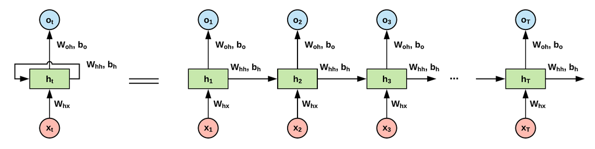
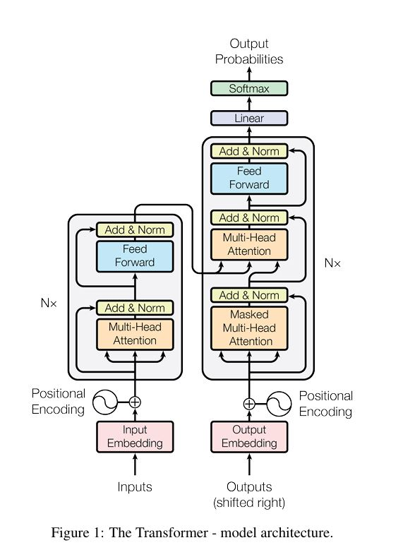

2023년 3월 이후 openai의 GPT가 매우 큰 호황을 끌고 있습니다. GPT는 생성형 AI라는 대목으로 큰 관심을 받으며 있으며, 이 GPT의 기본 구조는 Transformer의 구조를 따르고 있습니다. 그 이후 다양한 기업에서 생성형 AI를 연구 후 발표하고 있습니다. 대부분의 생성형 AI는 LLM측에서는 Transformer, vision분야에서는 Diffusion Model를 띄고 있습니다. 이번 절에서는 이 Transformer의 구조와 기존 DeepLearning 모델에서의 어떤 한계점을 돌파하고 어떤 차이점이 있는지에 대해 알아보도록 하겠습니다.   
- <https://papers.nips.cc/paper_files/paper/2017/hash/3f5ee243547dee91fbd053c1c4a845aa-Abstract.html>    
본 글은 필자의 주관적인 생각이 담겨있으므로 의역 및 오역이 존재할 수 있다는 점 양해 부탁드립니다.   

---

### Abstract
기존에 주로 사용되던 시퀀스 모델은 인코더와 디코더가 포함된 복잡한 RNN 또는 CNN기반의 모델을 사용했었습니다.    
여기서 이 논문에서는 기존 인코더, 디코더 구조에서 RNN 또는 CNN을 사용하지 않고 attention mechanism을 사용하는 새로운 아키텍처 구조인 Transformer 모델을 제안했습니다.   
실험 결과로 기존 RNN과 CNN기반의 모델보다 더 좋은 성능을 나타내며, 불가능하던 병렬처리도 가능하게 되며 학습 시간을 크게 단축할 수 있었다고 합니다. 

### 1.Introduction
RNN, LSTM, GRU 등과 같은 모델은 언어 모델링이나 기계 번역과 같은 시퀀스 모델링 및 변환 문제에 좋은 성과를 나타내왔었습니다. 추가적으로 인코더, 디코더를 아키텍처까지 확장하여 추가적으로 성능을 더 개선해왔습니다.   
 
**RNN**   
    
하지만, RNN 계열의 모델에서는 한계점이 존재했습니다. 상기의 이미지에서 볼 수 있듯이 RNN계열의 모델은 데이터들을 position t에 따라 순차적으로 처리해야합니다. 즉, hidden state인 $h_2$를 구하기 위해서는 입력으로 $h_1$이 필요합니다. 이를 일반화하면 $h_t$를 구하기 위해서는 입력으로 $h_{t-1}$이 필요하다는 의미가 됩니다. 이런 조건으로 인해 RNN계열은 시퀀스의 길이가 길어질수록 Gradient Vanishing 문제를 야기하며, 긴 시퀀스 데이터를 병렬 처리도 어려우며, 메모리와 엄청난 큰 계산 비용이 듭니다.   
 
**Attention Mechanism**   
사실 attention mechanism은 이번 논문에서 처음 소개된 기술 스택은 아닙니다. 기존 인코더, 디코더 시퀀스 모델에서도 RNN모델과 함께 attention mechanism을 이용하기도 했었습니다. attention은 input 또는 output 데이터에서 sequence distance에 무관하게 서로 간의 dependencies를 모델링합니다.    
여기서 차이점은 이번 논문에서는 **전적으로 Attention만을 이용하여 아키텍처를 구축**해서 엄청난 효율성과 성능을 확인했다는 점입니다.   

### 2.Background
CNN기반의 Extended Neural GPU, ByteNet, ConvS2S 등에서도 모두 시퀀스 연산을 줄이기 위한 연구를 수행했었습니다. 이 모델들은 입출력간의 관련성을 파악하기 위해 거리에 따라 계산량이 증가합니다. 따라서 입출력간의 거리가 멀수록 관련성을 파악하는데 어려움이 존재합니다. 하지만, Transformer는 attention의 가중치의 평균을 이용하는 **Multi-head Attention을 이용하여 상수 시간의 연산**을 가능하게 합니다.   
 
**Self-Attention(intra-attention)**은 단일 시퀀스 안에서 서로 다른 위치에 있는 요소들의 관련성을 찾아내는 방법입니다. 즉, 이름 그대로 자기 자신에게 attention을 수행하는 기법입니다.   
 
End-to-end memory network에서는 단순 시퀀스 기반의 recurrence를 이용하는것 대신에 attention기반의 recurrence인 recurrent attention mechanism을 사용했는데, 단순 언어 질문 응답 및 언어 모델링 작업에서 좋은 성능을 보이는 것으로 입증되었습니다.   
 
**Sequence Model**   
여기서 기존 시퀀스 모델의 가장 큰 문제점인 **장거리 의존성**이 존재합니다.   
대부분 시퀀스 모델에서는 인코더-디코더 구조를 가지는 recurrent model인 RNN이나 CNN 등을 주로 사용했습니다. 하지만, 이는 시퀀스의 특성상 **순차적인 특성이 유지되지만 시간이 지날수록 과거에 대한 의존성에 대해서는 취약**해진다는 단점이 존재합니다.    
- RNN : 시퀀스의 길이가 길어질수록 정보 압축 문제 존재
- CNN : Convolution의 filter 크기를 넘어서는 시퀀스에 대해 알기는 어려움

**Transformer**   
Transformer는 recurrence없이 **Attention Mechanism**만을 이용해 의존성을 찾을 수 있습니다. 즉, Self-Attention에만 의존하므로 기존의 RNN이나 CNN에서 존재하던 문제점을 무시할 수 있습니다.   

### 3.Model Architecture
대부분의 좋으 성능을 띄는 시퀀스 변환 모델은 인코더-디코더 구조를 가지고 있습니다.    
우선 인코더-디코더의 구조를 띄는 가장 대표적인 Sequent-to-Sequence 모델에 대해 간략하게 설명하여 추후에 설명할 Transformer의 이해를 도와주도록 하겠습니다.   
 
**Sequence-to-Sequence**   
    
Seq2Seq는 사실상 Transformer의 논문에 나오진 않지만, 많은 분들이 Transformer의 장점을 설명할 때, 해당 모델의 방법과 비교하여 설명하곤 합니다.    
계속하여 설명했듯이 RNN은 시퀀스 순서대로 데이터가 입력되는데, hidden state $h_{t+1}$을 구하기 위해서는 hidden state $h_{t}$가 입력으로 필요하게 됩니다. 이 말은 즉슨, 현재 $h_t$에는 이전 시간대에 대한 모든 정보들인 $t=1,2,...,t-1$까지의 정보를 모두 내포하고 있다고 할 수 있습니다.   
상기의 이미지를 보면 **인코더의 최종 output은 Context라는 vector**라고 합니다. 이 context vector를 디코더의 입력으로 넣어주게 됩니다. 이 때 context vector는 메모리와 계산 비용 때문에 **context의 길이는 제한**되어야 합니다. 따라서 긴 시퀀스 데이터를 처리할 때는 **제한된 context의 길이 때문에 엄청난 정보 손실**이 일어날 수 있습니다.    
이러한 문제를 해결하기 위해 Transformer는 인코더의 모든 state를 디코더에 참조시키기 위해 **Attention**기법을 이용했습니다.   

#### 3-1.Encoder and Decoder Stacks
    
**Encoder**   
현재 논문에서의 인코더는 $N=6$으로 구성되어있습니다. 각 layer는 2개의 sub-layer로 구성되어있습니다. 첫번째는 Multi-head Self-attention의 layer와 두번째로는 FC Feed Forward layer로 구성되어있습니다. 각 layer모두 주요 layer를 탄 후, 타기 전과의 residual connection을 이룬 후, Layer Normalization을 거칩니다. 즉, 입력 $x$는 $Layernorm(x + SubLayer(x))$로 구성되어 있습니다. 여기서 Sublayer는 Multi-head나 Feed Forward가 될 수 있습니다.   
 
**Decoder**   
디코더 또한 $N=6$으로 구성되어있습니다. 디코더는 인코더의 SubLayer에 추가적으로 Masked-Multi-head Self-attention인 SubLayer가 추가적으로 존재합니다.    

#### 3-2.Attention
모두 vector로 이루어진 Query, Key-Value의 쌍으로 이루어진 집합을 출력으로 나타냅니다. 이 output은 weighted sum으로 계산됩니다.   

##### 3-2.1.Scaled Dot-Product Attention
    
실제 다양한 attention 방법이 존재하는데, 이 논문에서 사양한 attention기법은 단순한 **scaled dot-product attention**입니다.    
입력은 Dimension이 $d_k$인 Query와 Key, Dimension이 $d_v$인 Value입니다. 여기서 Query는 모든 Key들과 **dot-product**를 계산 후, $\sqrt{d_k}$로 나누어줍니다. 그 후 Softmax 함수를 타주어 Value에 대한 가중치를 얻어줍니다. 방금의 설명을 수식으로 하기에 표현하겠습니다.   
\begin{aligned} 
Attention(Q,K,V) = softmax(\frac{Q K^T}{\sqrt{d_k}})V
\end{aligned}   

그럼 이번에는 Q, K, V가 어떤 것을 의미하는지 알아보겠습니다.   
Q(Query) : 영향을 받는 vector(물어보는 주체)   
K(Key) : 영향을 주는 vector(Query에게 물어봄을 당하는 주체)   
V(Value) : 주는 영향의 가중치 vector(실제 데이터의 값)   
그리고 $Attention(Q,K,V)$는 value의 가중합으로 계산됩니다. 여기서 가중치는 Query와 연관된 Key의 호환성 함수에 의해 계산됩니다.   
예시를 들어 설명하면, Query는 어떤 1개의 단어를 나타내는 vector이고, Key는 문장의 모든 단어들에 vector를 쌓아놓은 Matrix입니다. 이 Query와 Key를 Dot-Product($Q K^T$)를 하면, 현재 Query의 1개의 단어가 어떤 단어와 호환성이 큰지에 대한 가중치 vector가 나오게됩니다. 즉, 하기에 계산step에 대해 요약하겠습니다.   
1. Embedding에 가중치를 곱해 Queyr, Key, Value를 구합니다.   
2. $Query \times Key = attention \; score$ 에서 attention score의 값이 높을수록 연관성이 높고, 낮을수록 연관성이 낮다고 볼 수 있습니다.
3. $\sqrt{d_k}$로 나눠준 후, softmax 함수를 거쳐줍니다. 그럼 Query의 어떤 특정 단어가 Key값에 해당하는 어떤 단어들과 연관성이 있는지 확률 분포로 표현됩니다.   
4. Value와 확률 분포간의 Dot-product를 통해 Query와 Key간의 관련성을 더해준 Attention Value를 구해줍니다.

##### 3-2.2.Multi-Head Attention
    
논문에서는 1개의 Attention function을 이용하는 것보다 queries와 keys, values를 linear projection을 통해 중간에 매핑해줘서 각 다른 값들을 입력으로 하는, **여러 개의 Attention function들을 만드는 것이 더 효율적**이라고 합니다. 그 후 나중의 출력들을 **Concatenate**해주고 다시 projection을 시켜 최종 결과를 얻어줍니다.    
\begin{aligned} 
MultiHead(Q,K,V) =& Concat(head_1, ..., head_h)W^O \newline  
where \; head_i =& Attention(QW_i^Q, KW_i^K, VW_i^V)   
\end{aligned}    

    
논문에서는 $num_heads=8$로 정의를 했습니다. 현재 각 단어는 512차원을 가지는데, 이를 num_heads만큼 나눠주면, $d_k=d_v=d_{model} / num_heads = 64$ 다음과 같이 64차원의 Q,K,V vector로 바꾸어 Attention을 수행해주는 꼴입니다. 즉, **8개로 병렬로 Attention**이 이루어지게됩니다. 이 때, 가중치 행렬 $W^Q, W^K, W^V$는 8개 모두 값이 다릅니다. 이 병렬 Attention을 이용하는 가장 큰 이유는 1개의 Attention만을 이용했을 때, 놓칠 수 있는 부분이 존재할 수 있는데, 이를 8개가 동시에 이루어지면 이 부분을 보완할 수 있다고 생각했기 때문입니다.   

##### 3-2.3.Applications of Attention in our Model
Transformer는 3 가지 방식으로 Multi-head Attention를 사용합니다:
1. Encoder-decoder attention : 이전 decoder 레이어에서 오는 query들과 encoder의 출력으로 나오는 memory key, value들과의 attention
2. Self-attention in encoder : Encoder의 각 위치들은 이전 레이어의 모든 위치들을 참조
3. Self-attention in decoder : decoder의 각 위치들은 decoder 내의 다른 위치들을 참조할 수 있는데, 이전부터 자신 위치까지만을 참조

#### 3-3.Position-wise Feed-Forward Network
인코더 및 디코더의 각 계층에 개별적으로 위치하는 attention layer과 함께 fully connected feed-forward network가 사용됩니다.   
\begin{aligned}   
FFN(x) = max(0, xxW_1 + b_1)W_2 + b_2
\end{aligned}   

#### 3-4.Embeddings and Softmax
다른 sequence transduction 모델과 마찬가지로, input과 ouput token을 embedding layer를 거쳐서 $d_model$차원의 vector로 변환하여 사용합니다.   
이렇게 생성된 **embedded vector는 semantic한 특성**을 잘 나타납니다.   
**input embedding 과 output embedding에서 weight matrix를 서로 share하여 사용**합니다. embedding이 어떤 단어를 vector으로 표현하는 것이기 때문에, input과 output간에는 어떤 관련성이 존재해서 weight를 share해도 무방하다고 생각합니다.   

#### 3-5.Positional Encoding
어떻게 보면 Transformer에서 가장 중요한 부분입니다. Transformer는 RNN이나 CNN없이 **단지 Attention만 이용하기 때문에 시퀀스의 정보를 담아낼 수가 없습니다.** 따라서 별도로 상대적이나 절대적인 이러한 시퀀스 정보를 데이터에 추가해주어야 합니다. 이 역할을 하는 것이 **Positional Encoding**입니다. 이 Position Encoding은 인코더와 디코더 제일 밑에 추가됩니다.    
실제로 Positional Encoding을 선택할 수 있는 방법은 매우 다양하지만, 이 논문에서는 sine과 cosine 함수를 이용하여 표현했습니다.    
    
\begin{aligned}   
PE(pos, 2i) =& sin(pos/10000^{2i/ d_{model}}) \newline   
PE(pos, 2i + 1) =& cos(pos/10000^{2i/ d_{model}}) \newline   
\end{aligned}   

여기서 pos는 position, i는 dimension입니다. 우선 여기서 sin과 cosin 함수를 사용한 이유에 대해 알아보겠습니다.   
sin과 cosin함수는 주기함수이며, 또한 값이 -1 ~ 1의 값을 가지게 됩니다. 따라서 **의미 정보가 크게 변하지 않고 유지**될 수 있습니다.    
또한, sin함수의 경우 주기가 20인 경우, 1번째의 위치의 값과 9번째의 위치의 값이 동일해지는 문제가 발생할 수 있습니다. 이를 방지하고자 다양한 주기의 sin과 cosin을 섞어서 사용했습니다. 또한, Position Encoding은 scalar가 아닌 vector이기 때문에, 이 위치 vector 값이 같아지는 것을 방지하기 위해 vector마다 서로 다른 주기의 cosin, sin 함수를 이용하여 표현합니다. 즉, 단어 vector는 각각의 차원마다 서로 다른 위치 vector의 값을 가집니다. 만약, sin을 이용하여 첫번째 차원의 vector값을 채웠는데, 첫번째 차원의 vector들의 값의 차이가 크지 않다면, 두번째 차원의 vector는 cosin을 이용하여 채워주면 됩니다. 근데 여기서 두번째 차원의 vector 또한 값의 차이가 크지 않다면, cosin의 frequency를 이전 sin함수보다 크게 주어 채워주면됩니다. 즉, 이런 방법으로 sin과 cosin의 번갈아가며, frequency도 조절해가며 vector의 값을 채워주면 충분히 서로 다른 position encoding 값을 가질 수 있게됩니다.    
그 후 position encoding vector와 embeding vector간의 summation을 해주어 시퀀스 정보도 포함되게 해줍니다.    
 