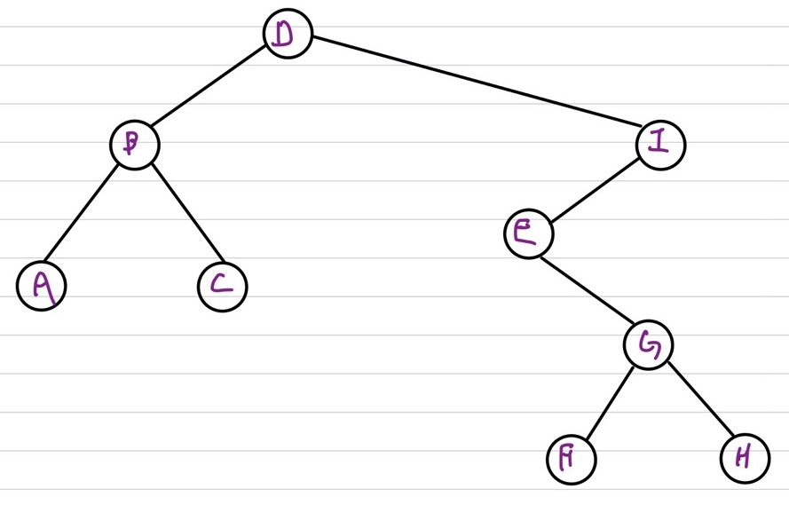
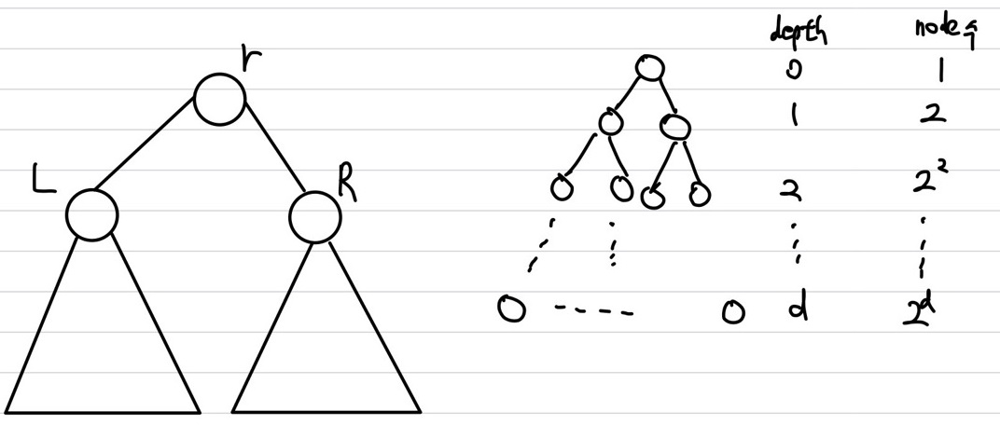
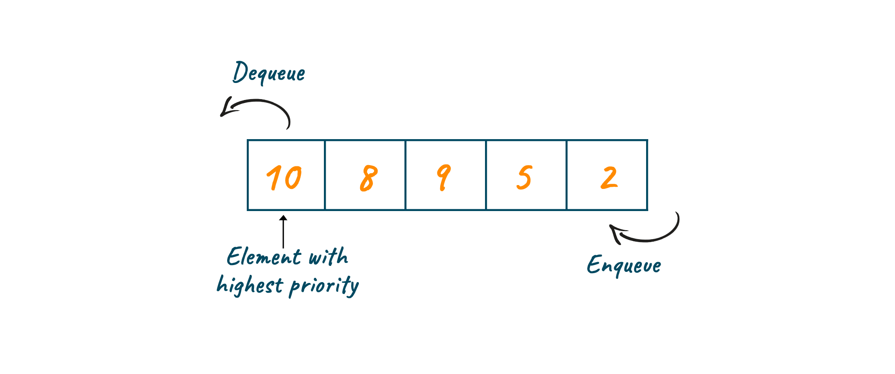
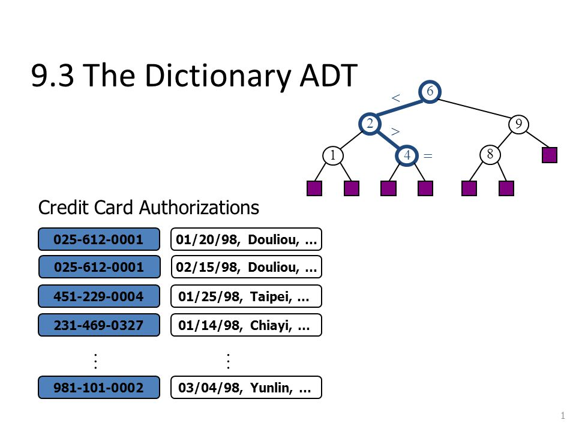

## Abstract Data Type(ADT)

Algorithm의 Correctness 확인 가능   
데이터의 특징을 요약한 것   
보통 Class를 정의할 때 ADT를 사용(member variable, member function)   
구체적인 설명 X, Input, Output을 명시 &rarr; Interface만 알면 Input, Output을 알 수 있음   

### Tree Terminology

   
Root : 부모가 없는 최상단의 Node &rarr; e.g) D   
Degree : 비어 있지 않은 subtree의 수(자식 수) &rarr; e.g) degree(B) : 2, degree(E) : 3   
External node(leaf node) : degree가 zero인 node들 &rarr; e.g) A, C, F, H    
Internal node : degree가 0이 아닌 양수인 node들 &rarr; e.g) D, B, I, E, G    
Ancestor : 특정 노드에서 root노드까지 갈 때에 거치는 부모 노드들 &rarr; e.g) G의 ancestor : G, E, I, D    
Proper Ancestor : Ancestor에서 자기 자신 미포함 &rarr; e.g) G의 proper ancestor : E, I, D    
Descendant : Ancestor와 반대로 자식들 &rarr; e.g) E의 descendant : G   
Subtree : Descendant들로 구성 &rarr; e.g) E의 subtree : G, F, H로 구성된 tree    
Depth : root node는 0에서 층마다 깊어짐, 해당 노드에서 root로에서 부모들을 만날 때 1씩 더해주면 됨 &rarr; e.g) D : 0,  B,I : 1, A,C,E : 2    
Level : depth가 같은 node들 &rarr; e.g) A의 leve : 2이며, A, C, E가 모두 같은 depth   
Height : depth의 최대 값 &rarr; e.g) tree의 height : 4, A의 height : 2   

### Binary Tree ADT

최대 자식을 2개까지만 가질 수 있는 tree   
① noe r은 root노드 ② 특정 node에서 크게 2가지로 분리(subset L, R 로 분리)   
원소가 없는 경우 : empty binary tree or null binary tree라 불림   
**Completely Binary Tree** : 모든 tree가 2개의 sub node를 가지고 있는 binary tree   
   
Completely Binary Tree일 시 ① depth가 d일시, 최대 node 수 : $2^d$ ② height가 h일 때, 최대 $2^{h+1}-1$의 노드들을 가짐 ③ n개의 node들을 가진 tree의 경우, height는 $\lceil log(n+1) \rceil \; - \; 1$    
모든 nodes : $1 + 2 + 2^2 + 2^3 + ... + 2^h \; = \; 2^{h+1} - 1$    
최소 height : $2^{h+1} - 1 \le n(노드의 개수)$ &rarr; $h+1 \le log(n+1)$ &rarr; $h \le \lceil log(n+1) \rceil -1 = \lfloor log n \rfloor$   

### Stack

**LIFO(Last In First Out)**   
    
top : first element   
push : top 뒤에 추가, top위치 하나 증가   
pop : top위치에 element 삭제후 top위치 하나 감수

### Queue

**FIFO(First In First Out)**    
   
rear : last element   
front : first element   
enqueue : rear 뒤에 추가   
dequeue : front를 삭제   

### Priority Queue

   
**Queue의 FIFO(First In First Out) 형태를 띄지만, 각 element들에 대해 우선순위가 존재하는 자료구조**     
**heap을 이용하여 구현하기도 함**    
**element의 우선순위는 ①cost관점 : min-priority Queue ② profit 관점 : max-priority Queue 로 결정**    

|       Function(기능)       | Unsorted array | sorted array |     heap(binary)     |
| :------------------------: | :------------: | :----------: | :------------------: |
|           Insert           |      O(1)      |     O(n)     |  O(log n) : up heap  |
| removeMin() or removeMax() |      O(n)      |     O(1)     | O(log n) : down heap |
|    getMin() or getMax()    |      O(n)      |     O(1)     |    O(1) : root 값    |

### Union-Find ADT

**보통 Undireted graph에서 Connected Component를 찾는데 적용**   
$Union$ Operation은 두개의 연결안된 set를 합치는데 사용   
$Unison$ : e.g) set id(set의 learder, representative)가 $s$와 $t$인 두개의 set이 존재, $s \; \neq\; t$일 때, set id가 $s$나 $t$인 새로운 set이 생성   
$Find$ Operation은 set id를 탐색, set id return   
보통 set id는 key값을 이용   
UnionFind create(int n) : n개의 disjoint한 set들을 생성 e.g) $\{\{1\}, \{2\}, \{3\}, ..., \{n\}\}$   
int find(UnionFind $sets$, int e) : set id를 return   
void makeSet(UnionFind $sets$, int e) : set에 새로운 set을 추가, e.g) $\{\{1\}, \{2\}, \{3\}, ..., \{n\}, \{n+1\}\}$, n+1 set 추가   
void union(UnionFind $sets$, int s, int t) : s와 t의 두개의 set id를 합침, $s \; \neq\; t$일시에만 합침

### Dictionary ADT

**Key, element(=value)로 구성**   
   
삽입, 삭제, 탐색   
key : Identifiers   
element : information   
e.g) Hashing, Binary Search Tree 등에 사용
