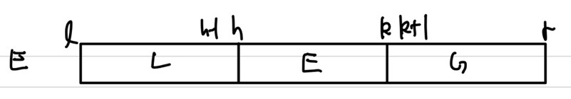

## Sorting Algorithm

|               종류               |                       Worst Case Time                        |
| :------------------------------: | :----------------------------------------------------------: |
|          Insertion Sort          |                           O($n^2$)                           |
|            Quick Sort            |       O($n^2$) &rarr; 기대 수행 시간 : O($n log (n)$)        |
|  Merge Sort(Optimal Algorithm)   |                        O($n log (n)$)                        |
| Heap Sort(**Optimal Algorithm**) |                        O($n log (n)$)                        |
|            Radix Sort            | O($n$) &rarr; Input에 대한 특저 제한 사항이 있을 경우 : O($n$)에 수행 가능 |

unsorted data에 대해서는 모든 data를 살펴봐야하니 optimal solution의 탐색(find)이 $\Theta(n)$   
sorted data에 대해서는 optimal solution의 탐색(find)이 $\Theta(log n)$   
<span style='color:red'>**Sorting Problem의 복잠도(F(n))는 $O(nlog(n))$**</span>

## Insertion Sort

n개의 elements를 가지는 unsorted array에 대해 수행   
두 개의 영역으로 나눔(sorted 영역, unsorted 영역)   
$x$를 밖으로 빼서 사용   
   
① $x$를 밖으로 빼놓음   
② $x$와 index 0의 element를 비교 후 $x$가 더 작다면 swap해 $x$를 index 0 위치에 넣음   

### Algorithm

Input : E(element들을 가지는 array), $n \le 1$이며 element들의 수, index는 0, 1, ... , n-1까지 존재   
Output : key들이 오름차순으로 정렬된 array   

```c++
void insertionSort(Element[] E, int n){
    int xindex;
    for(xindex = 1; xindex < n; xindex++){
        Element current = E[xindex];
        key x = current.key;
        int xLoc = shiftVacRec(E, xindex, x);
        E[xLoc] = current;
    }
    return;
}
```

```c++
int shiftVacRec(Element[] E, int vacant, Key x){
    // vacant : index
    int xLoc;
    if(vacant == 0)
        xLoc = vacant;
    else if(E[vacant-1].key <= x) // 전 위치보다 크면 제자리를 찾은 것
        xLoc = vacant;
    else{
        E[vacant] = E[vacant-1]; // 나의 위치를 왼쪽으로 한 칸 이동
        xLoc = shiftVacRec(E, vacant-1, x);
    }
    return xLoc;
}
```

### Example

$E\(array\) \; = \; \<5, 2, 4, 6, 1, 3\>$   
   
<span style='color:red'>**loop invariant(Correctness 분석)**</span> : 수학적 귀납법(i = 1, i=k일 때 참 증명시, k+1일 때 증명이 필요),    
① Initalization(초기화)   
&rarr; <span style='color:blue'>index 0까지 sorted 영역</span>   
② maintenance(iteration K가 참일려면, K+1이 참이면 됨)   
&rarr; <span style='color:blue'>i index가 시작되기 전 i-1까지는 sorted된 상태이고 i index가 끝난 후, i까지 sorted되 있는 상태(귀납법)</span>   
③ Termination   
&rarr; <span style='color:blue'>종료 후 sorted 되어있는 상태</span>   

### Analysis

<span style='color:red'>**Worst Case Complexity**</span>    
\begin{aligned}
    W(n) \; =& \; \sum_{i=1}^{n-1} i \; = \; n(n-1)/2 \; \approx \; \frac{n^2}{2} \in \; \Theta(n^2) \; 
\end{aligned}   

<span style='color:red'>**Average Behavior**</span>   
<span style='color:blue'>$ShiftVacRec$ : i번째 element의 위치 찾기</span>   
\begin{aligned}
    1/(i+1)\sum_{j=1}^{i}j \; + \; i/(i+1) \; = \; i/2+1 - 1/(i+1)
\end{aligned}   
총 i+1의 경우가 존재,    
1번의 경우 : x가 적절한 위치에 있어 비교 연산을 sorted된 영역의 가증 큰값과 한번 비교   
i번의 경우 : x가 가장 작은 값이여서 sorted된 영역의 원소들과 모두 비교   

<span style='color:blue'>$Average case$ : $ShiftVacRec$를 전체 원소들에 대해 수행(n-1)번</span>      
\begin{aligned}
    A(n) \; =& \; \sum_{i=1}^{n-1} \{i/2 + 1 - 1/(i+1)\} \approx n^2/4 \; \in \; \Theta(n^2)
\end{aligned}   
### Optimality

두개의 원소를 비교, swap하는 operation이 동작   
worst case의 경우 : $n(n-1)/2$의 비교가 발생   
average case의 경우 : $n(n-1)/4$의 비교가 발생   
<span style='color:blue'>**Insertion sort가 Optimal Algorithm이 되려면 인접한 원소만 비교하고 interchaning을 할 때**</span>   
## Quick Sort

<span style='color:red'>**일반적인 입력에 대해 Optimal**</span>   
<span style='color:red'>**$W(n) \; = \; O(n^2) $**</span>     
For random sequence, Sorting Algorithm based on Divde-and-Conquer     
① Divide and Conquer   ② Randomization &rarr; 2가지 전략을 사용하여 해결   

- <span style='color:red'>**Strategy**</span>   
  ① Divde : 랜덤으로 element x(pivot)를 고른 후 전체 집합 S를 3개의 집합으로 분할    
  &rarr;  L : less than x, E : equal x, G : greater than x
  element가 1개가 남을 때까지 Divide를 반복   
  ② Conquer : sort L and G   
  ③ Combine : join L, E and G   


### Divde and Conquer

**작은 instance으로 나눠서 문제를 해결하는 전략**   
   
① Divide : Sub Problem으로 쪼개줌   
② Conquer : Solving   
③ Combine : Solution Combine 

```c++
solve(I)
{
    n = size(I);
    if(n <= smallsize) // 내가 원하는 size
        solution = directlySolve(I); // Conquer : 우리가 원하는 size인경우 직접 해결
    else{
        divide I into I_1, I_2, ... , I_k
        for each i in {1, 2, ... , k}
        	S_i = solve(I_i);
        solution = combine(S_1, S_2, ..., S_k);
    }
    return solution
}
```

### Partition(Divide)

remove : $S$로부터 element $y$를 추출   
insert : 추출한 $y$를 pivot $x$와 비교 후 알맞은 $L, E, G$ 그룹에 추가   
remove와 insert의 경우 $O(1)$ time이 걸리지만, 모든 원소들에 대해 수행할 경우 total $O(n)$ time이 걸림   

```c++
Partition(S, p){
    // Input : sequence S, position p of pivot
    // Output : subsequences L, E, G of the elements of S less than, equal to, or greater than the pivot, resp
    L, E, G ← empty sequences
    x ← S.remove(p) // pivot 선택 및 추출, O(1)
    while !S.isEmpty(){ // n번 반복하니 O(n)
        y ← S.remove(S.first()) // pivot과 비교할 원소 추출, O(1)
        if y < x
            L.insertLast(y)
        else if y==x
            E.insertLast(y)
        else
            G.insertLast(y)
    }
    return L, E, G
}
```

### Case


#### Best Case

Best Case는 pivot이 Mid값일 경우

#### Worst Case

pivot이 Maximum or Minimum일 때, 즉, S가 n size 일 경우 $L$ 이나 $G$ 중 하나가 n-1 size이고 다른 하나는 0 size 일 때 발생   
   
$1 + 2 + ... + (n-1) \; = \; \frac{n(n-1)}{2} \; \approx \; O(n^2) $   

#### Average Case

   
\begin{aligned}
    n \times (\frac{3}{4})^k \; = \; 1 \newline
    k \; = \; log_{\frac{4}{3}}(n) \newline
    k \; = \; \frac{log_2(n)}{log_2\frac{4}{3}} \; \approx \; log_2(n) \newline
\end{aligned}   
해당 Partition을 n번 수행하니 <span style='color:red'>**$O(nlog(n))$**</span>

### Inplace Quick Sort

Space를 적게 사용하는 경우   
특정함수 내에 상수 Space를 사용   
pivot보다 작은 element는 h보다 작은 곳   
pivot과 동일한 element는 h와 k 사이   
pivot보다 큰 element는 k보다 큰 곳   
h와 k에서 반복(재귀)적으로 호출   
   
**input size n을 제외한 추가적인 space $O(1)$**   

```c++
inPlaceQuickSort(S, l, r){ // first index : l, last index : r
    // Input : sequence S, ranks(index) l and r
    // Output : sequence S, l과 r사이의 increasing order로 재정렬된 S
    if l>= r
        return
    i ← a random integer between l and r // pivot 
    x ← S.elemAtRank(i)
    (h, k) ← inPlacePartition(x) // visit, Divide and Conquer
    inPlaceQuickSort(S, l, h-1) // L부분과 동일, Divide and Conquer
    inPlaceQuickSort(S, l+1, r) // G부분과 동일, Divide and Conquer
}
```

Binary Tree로 생각시, Preorder로 수행   
#### Inplace Partition

Partition : $L, \; E \cup G$(2개의 그룹으로)   
   
① pivot보다 크거나 같은값(j)로 확인하면 j값을 우측으로 이동, pivot보다 작은 값(k)을 확인하며 k값을 좌측으로 이동   
② 찾은 index값들을 서로 swap   
③ ①, ②을 j와 k가 만날 때까지 반복, 만날 때 j값과 pivot값을 swap, 그 후, j,k가 만난 기준 왼쪽은 $L$그룹, 우측은 $ E \cup G$ 그룹으로 분할 : **pivot 1개가 정렬된 상태**   

## Merge Sort

정렬된 A, B array를 합쳐 정렬된 C array로 생성   
<span style='color:red'>**Optimal Sorting Algorithm**</span>

### Algorithm(Merge)

```c++
Merge(A, B, C){
    if(A is empty)
        rest of C = rest of B
	else if(B is empty)
        rest of C = rest of A
	else if(first of A <= first of B)
        first of C = first of A
        merge(rest of A, B, rest of C)
	else
        first of C = first of B
        merge(A, rest of B, rest of C)
}
```

$W(n) = n -1 \in \Theta(n)$   
### Worst Case

A, B가 번갈아가면서 C에 삽입(즉, A_1 < B_1 and A_2>B_1 형식으로 반복되어 구성되 있을 때)될 때, 그리고 A,B size가 동일할 때   
총 n-1번의 비교 연산이 필요   

### Algorithm(MergeSort)

Input : Array E, first index, last index   
Output : E[first], E[second], ..., E[last]   

```c++
void mergeSort(Element[] E, int first, int last){
    if(first < last){
        int mid = (first + last) / 2;
        mergeSort(E, first, mid); // divide
        mergeSort(E, mid + 1, last); // divide
        merge(E, first, mid, last); // visit, conquer & combine, postorder 순
    }
    return;
}
```

      
$W(n) \; = \; W(n/2) + W(n/2) + ... W_{merge}(n) \; \in \; \Theta(n log(n))$   
$W(n/2)$은 subproblem이며 divide 하는 구간, $W_{merge}(n)$은 combine을 수행하는 부분   
$W_{merge}(n) = n-1$   
$W(1) = 0$