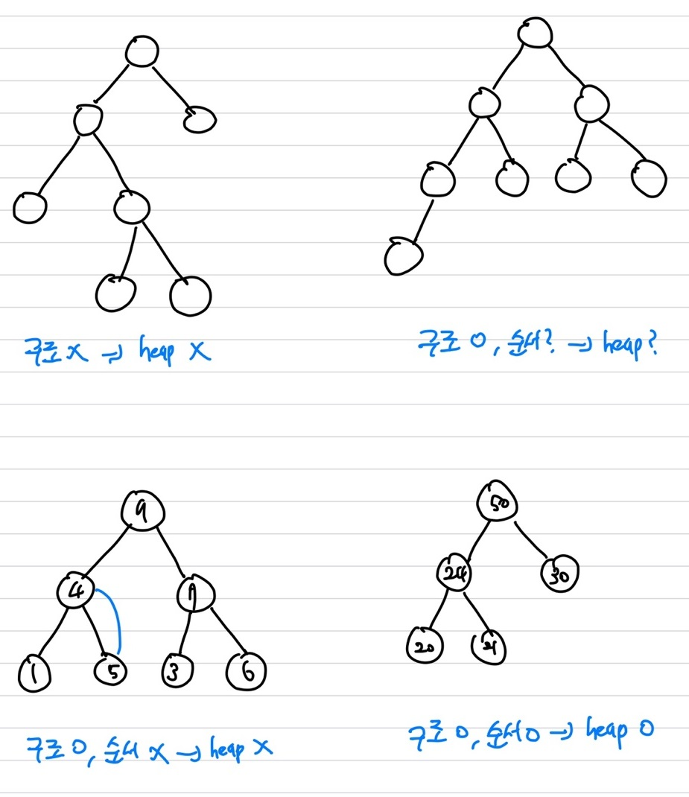
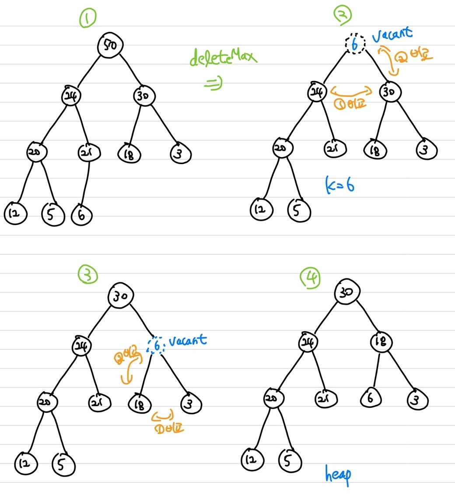
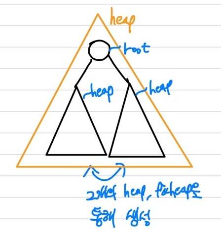
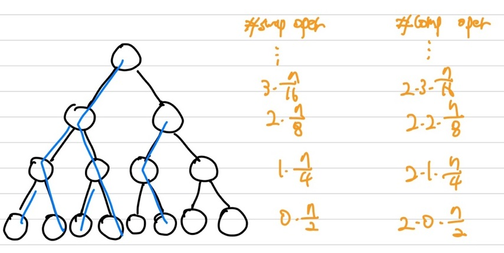
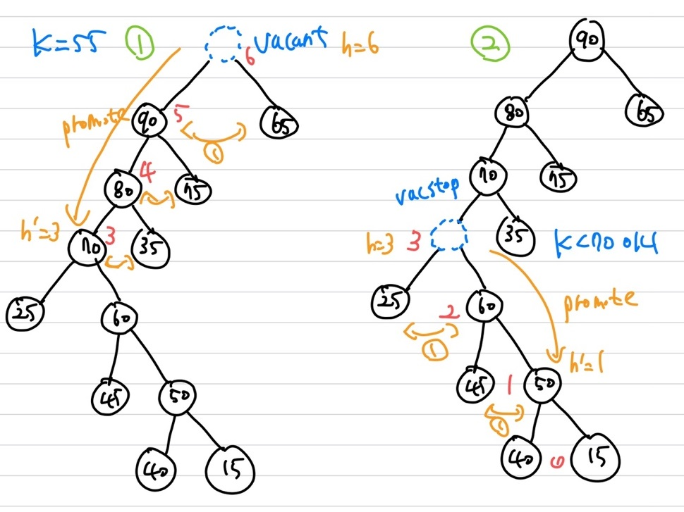
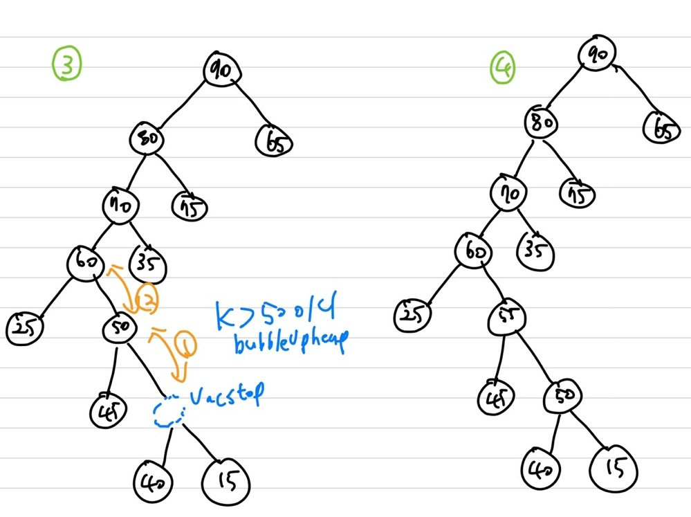
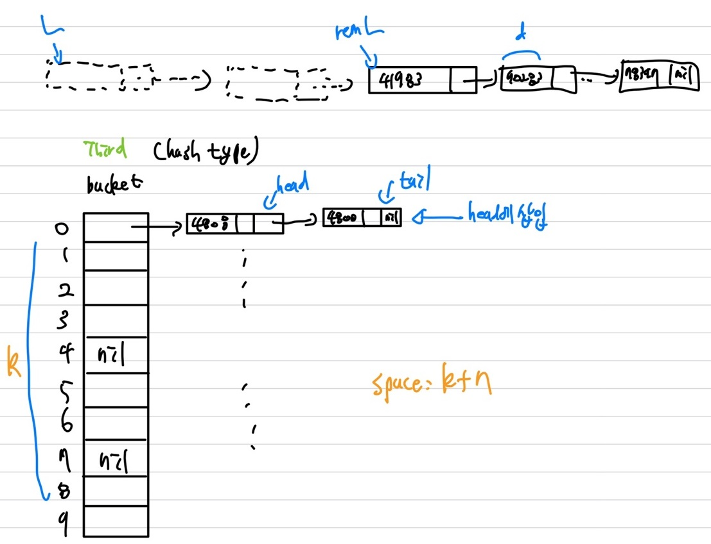

## Sorting Algorithm

|               종류               |                       Worst Case Time                        |
| :------------------------------: | :----------------------------------------------------------: |
|          Insertion Sort          |                           O($n^2$)                           |
|            Quick Sort            |       O($n^2$) &rarr; 기대 수행 시간 : O($n log (n)$)        |
|  Merge Sort(Optimal Algorithm)   |                        O($n log (n)$)                        |
| Heap Sort(**Optimal Algorithm**) |                        O($n log (n)$)                        |
|            Radix Sort            | O($n$) &rarr; Input에 대한 특저 제한 사항이 있을 경우 : O($n$)에 수행 가능 |

unsorted data에 대해서는 모든 data를 살펴봐야하니 optimal solution의 탐색(find)이 $\Theta(n)$   
sorted data에 대해서는 optimal solution의 탐색(find)이 $\Theta(log n)$   
<span style='color:red'>**Sorting Problem의 복잠도(F(n))는 $O(nlog(n))$**</span>

## HeapSort(Optimal Algorithm)

Heap : Priority Queue를 구현하기 위한 방법   
MaxHeap : 부모의 key값이 자식보다 크거나 같아야하며, root node에서 최대값을 가짐   
MinHeap : 부모의 key값이 자식보다 작거나 같아야하며, root node에서 최소값을 가짐   
여기서는 MaxHeap에 대해 다룸(MinHeap은 MaxHeap의 반대로 생각하며 됨)   
① Heap Structure(구조) ② Partial order tree(순서)을 만족시켜야 함   

### Heap Structure

<span style='color:red'>**left complete binary tree**</span>   
① height가 h인 tree에서 depth가 h-1 부분까지는 complete binary tree를 만족해야함   
② leaf node들은 depth가 h-1이나 h에 존재해야 함   
③ h-1까지는 complete binary tree이고, depth가 h인 부분의 leaf node들은 왼쪽에서부터 채워져아 함   

### Partial order tree Property

**임의의 노드는 $v$는 자식보다 크거나 같은 key값을 가져야 함**   
$parent(v).key \ge v.key$   

### Heap Example


### Fixheap

**Heap 순서 및 구조 재조정**

```c++
fixHeap(H, K){ // 2번의 비교 연산을 수행(1.자식들끼리, 2.부모와 자식끼리)
    if(H is a leaf) // 현재 노드가 leaf인가
        insert K in root(H);
    else{
        set largerSubHeap to leftSubtree(H) or rightSubtree(H), // 자식끼리 비교(자식 중 큰 값을 찾기)
        whichever has larger key at its root. This involves one key comparsion // 큰 자식과 부모끼리 비교 
        if(K.key >= root(largerSubHeap.key)) // 현 K노드의 key값이 자식보다 크다면 k가 root node(부모와 자식 비교)
            insert K in root(H);
        else
            insert root(largerSubHeap) in root(H);
            fixHeap(largerSubHeap, K);
    }
}
```

Fixheap의 경우 worst case로 2h만큼의 비교 연산이 필요(자식끼리 모두 비교하고, 부모와 비교도 수행하니)   
$h \approx log(n)$   
$W(n) \; = \; 2h \approx 2log(n)$   

### Heap Sort

root를 삭제하면 가장 뒤에 것을 root에 넣어 정렬   
<span style='color:blue'>**insert : 제일 끝에 추가 후 upheap() 수행 &rarr; 순서 정렬, upheap은 leaf node부터 root까지 갈 수도 있으니, $O(logn)$**
 </span>    
<span style='color:blue'>**delete : 마지막 노드 삭제, downheap() 수행 &rarr; 순서 정렬, $O(logn)$**
 </span>    
<span style='color:blue'>**findMax : root 노드를 가져오면 됨 &rarr; Heap의 Max는 root이니, $O(1)$**
 </span>   

```c++
heapSort(E, n){
    construct H(heap) from E(array), the set of n elements to be sorted // Heap construction : O(n) time
    for(i=n;i>=1;i--){
        curMax = getMax(H); // findMax
        deleteMax(H); // root 추출 후, Heap 순서 재정렬
        E[i] = curMax; // array의 끝 부분부터 채워넣음
    }
}
```

```c++
deleteMax(H){
    copy the rightmost element of the lowest level of H into K // 가장 큰 depth에 있으며 가장 우측에 있는 leaft node를 복사
    delete the right element on the lowest level of H // 해당 노드 삭제
    fixHeap(H, K); // = downHeap
    // ① 가장 끝에 있는 값을 저장 후 해당 노드 삭제 ② Fixheap 수행(=downHeap)
}
```

   
### Construct Heap

Input : 순서 조건은 만족하지 않아도 되며 구조 조건만 만족하는 heap H(complete binary tree 형태)    
Output : 순서 조건까지 만족하는 heap H    

```c++
void constructHeap(H){
    if(H is not a leaf){
        constructHeap(left subtree of H);
        constructHeap(right subtree of H);
        Element K = root(H);
        fixHeap(H, K);
    }
    return;
}
```



상기의 그림처럼 우선, subtree들을 heap으로 생성한 후, leftsubtree, rightsubtree 와 parent node로 heap을 크게 만들어 생성    

Heap Construction은 Postorder 순서로 진행   
Construct Heap의 worst case는 complete binary tree일 때 발생   
$swap \; operation = 1\frac{1}{2} + 2\frac{1}{4} + 3\frac{1}{8} + ...$
\begin{aligned}
    \sum_{i=1}^{log n}i \frac{n}{2^i} =& n \sum_{i=1}^{log n} \frac{i}{2^i} \newline
    \le& n \sum_{i=1}^{\infty} \frac{i}{2^i} = 2n \in O(n)
\end{aligned}    

### Heap Implementation Array

Array E : index start 1, 2, 3, ... ,n   
index $i$의 node가 주어졌을 때,    
left child index : $2i$   
right child index : $2i + $1   
parent index : $\lfloor i/2 \rfloor$   
### Heapsort Analysis

<span style='color:red'>**Optimal Sorting Algorithm**</span>   
k개의 node들에 대해 발생하는 **fixHeap**의 complexity는 $2log(k)$   
**fixHeap**은 node 1개를 삭제 후 수행되기 때문에, 총 n-1개의 node들에 대해 **fixHeap**이 수행되야 sorting된 array를 획득 가능   
즉, $2log(n-1) + 2log(n-2) + 2log(n-3) + ... + 2log(1) \; = \; 2\sum_{k=1}^{n-1}log(k) \in \Theta(nlog(n))$   
여기서 <span style='color:blue'>**Stirling's Approximation**</span> : $log(n!) \in \Theta(nlog(n))$ 을 사용   
<span style='color:red'>**따라서 HeapSort의 worst case의 경우 : $2nlog(n) + O(n)$ 발생(fixheap + heap construct)**</span>   

### Accelerated Heapsort

기존 fixHeap의 time complexity인 $2h = 2log(n)$을 개선하여 $h = log(n)$으로 변경   
**Divide-and-Conquer을 이용하여 개선**   
① promote : heigh가 $\frac{h}{2}$까지만 내려감(자식들의 key값을 비교 후  큰 자식과 swap하며 $\frac{h}{2}$까지 내려감)   
② $\frac{h}{2}$일 때, parent와 비교   
③ 부모와 비교 후 부모보다 크다면 부모와 swap(upheap() 수행)  
④ 만약 작다면, promote(①을 재귀적으로 다시 수행)   

### Accelerated Heapsort Algorithm

```c++
void bubbleUpHeap(Element[] E, int root, Element K, int vacant){ // swap 수행
    if(vacant == root)
        E[vacant] = K;
    else{
        int parent = vacant/2;
        if(K.key <= E[parent].key)
            E[vacant] = K;
        else
            E[vacant] = E[parent];
            bubbleUpHeap(E, root, K, parent);
    }
}
```

```c++
void fixHeapFast(Element[] E, int n, Element K, int vacant, int h){
    if(h <= 1)
        Process heap of height 0 or 1
    else{
        int hStop = h/2; // h/2까지 내려감
        int vacStop = promote(E, hStop, vacant, h);
        // vacStop은 높이가 hStop인 새로운 vacant location임
        int vacParent = vacStop / 2;
        if(E[vacParent].key <= K.key) // 내가 parent보다 클 경우, bubbleUpHeap
            E[vacStop] = E[vacParent];
            bubbleUpHeap(E, vacant, K, vacParent);
        else // 작을 경우, 다시 fixHeapFast 수행
            fixHeapFast(E, n, K, vacStop, hStop);
    }
}
```

```c++
int promote(Element[] E, int hStop, int vacant, int h){ //자식끼리 비교해 큰 자식쪽으로 내려감
    int vacStop;
    if(h <= hStop) // h/2까지 내려갔는지 확인
        vacStop = vacant;
    else if(E[2*vacant].key <= E[2*vacant + 1].key) // 자식 중 큰 자식 찾고 그 자식으로 promote 진행
        vacStop = promote(E, hStop, 2*vacant+1, h-1)
    else
        E[vacant] = E[2*vacant];
        vacStop = promote(E, hStop, 2*vacant, h-1);
    return vacStop;
}
```

     
   

### FixHeapFast

$\frac{h}{2}$까지 자식과 비교해서 내려감   
1번 내려갈 때마다 1번의 비교연산이 수행됨 &rarr; 기존 FixHeap의 경우에는 1번 내려갈 때 2번의 비교연산이 수행됨   
FixHeapFast의 경우 총 $h$의 비교 연산이 수행됨   
&rarr; promote + bubbleUpHeap = $\frac{h}{2}(promote) + \frac{h}{2}(bubbleUpHeap) \; or \;  \frac{h}{4}(promote) + \frac{h}{4}(promote) + \frac{h}{4}(bubbleUpHeap); =\;  h$   
<span style='color:red'>**bubbleUpHeap이 사용안된 경우가 Worst Case &rarr; Promote만 진행시 위로갈지 아래로 갈지를 결정해야하는 연산이 추가되기 때문**</span>   
&rarr; 즉, <span style='color:blue'>**$\frac{h}{2} + \frac{h}{4}+\frac{h}{8}+...+1 = h \sum_{i=1}^{logh}\frac{1}{2^i} \le  h\sum_{i=1}^{\infty}\frac{1}{2^i} = h$**</span>   
따라서, FixHeapFast는 <span style='color:red'>**$h(promote) + log(h)(부모와 내 key값 비교)$**</span> 연산이 수행됨   
$W_1 = h + log(h) = log(n) + log(log(n))$ 이니 n번의 FixHeapFast 호출 시<span style='color:red'>**$n(log(n) + log(log(n)))$**</span>   

### Accelerated Heapsort Analysis

기존 Heapsort보다 2배정도 빠름   
연산의 수가 $\frac{1}{2}$정도 줄어둠   
$\sum_{k=1}^{n-1}log(k) \in \Theta(nlog(n))$   
$W(n) = nlog(n) + \Theta(nlog(log(n)))$   

## Radix Sort

기수 정렬이라 부름   
linear time에 정렬 수행 가능   
**Input의 제한 사항이 있을 경우에만 linear time에 정렬 수행 가능**    
stable sort : 상대적인 순서가 유지되며 정렬이 됨(앞에 있는 원소를 앞에서부터 채워주는 경우이니 stable)

### Properties of the keys

key값의 example : ① 이름의 첫 알파벳에 따라 분류 ② 자릿수 제한 ③ k개의 interval로 분류(\[1, m\])   
① 바구니에 분배해서 넣기(divide) &rarr; $[1, \frac{m}{k}]$   
② 바구니에 대해 정렬(conquer) &rarr; $[\frac{m}{k} + 1, \frac{2m}{k}]$   
③ 바구니를 combine(combine) &rarr; $[\frac{m}{k}(k-1) + 1, m]$   
<span style='color:red'>**Input에 제한 조건이 있을 때, 정렬을 O(n) time에 수행 가능**</span>   

### Radix Sort Algorithm

```c++
List radixSort(List L, int radix, int numFields){
    List[] buckets = new List[radix];
    int field; // field number within the key
    List newL;
    for(field=0;fiel<numFields;field++){
        Initialize buckets array to empty lists
        distribute(newL, buckets, radix, field);
        newL = combine(buckets, raidx);
    }
    return newL;
}
```

```c++
void distribute(List L, List [] buckets, int radix, int field){
    //distribute keys into buckets
    List remL;
    remL = L;
    while(remL != nil){
        Element K = first(remL);
        int b = maskShift(field, radix, K.key);
        // maskShift(f, r, key) selects field f(counting from the right) of key,
        // based on radix r, the result, b, is the range 0...radix-1,
        // and is the bucket number for K
        buckets[b] = cons(K, buckets[b]); // construct list
        remL = rest(remL);
    }
    return
}
```

```c++
List combine(List[] buckets, int radix){
    //Combine linked lists in all buckets into one List L
    int b; // bucket number
    List L, remBucket;
    L = nil;
    for(b=radix-1; b >= 0; b--){
        remBucket = buckets[b];
        while(remBucekt != nil){
            key K = first(remBucket);
            L = cons(K, L);
            remBucket = rest(remBucket);
        }
    }
    return L;
}
```

### Example

| Unsorted | bkt<br />(1) | First | bkt<br />(10) | Second | bkt<br />(100) | Third | bkt<br />(1000) | Fourth | bkt<br />(10000) | Fifth | Sorted |
| :------: | :----------: | :---: | :-----------: | :----: | :------------: | :---: | :-------------: | :----: | :--------------: | :---: | :----: |
|  48081   |      1       | 48081 |       0       | 48001  |       0        | 48001 |        0        | 90283  |        0         | 00972 | 00972  |
|  97342   |              | 48001 |               | 53202  |                | 48081 |                 | 90287  |        3         | 38107 | 38107  |
|  90287   |      2       | 97342 |               | 38107  |       1        | 38107 |                 | 90583  |        4         | 41983 | 41983  |
|  90583   |              | 53202 |       1       | 65215  |       2        | 53202 |                 | 00972  |                  | 48001 | 48001  |
|  53202   |              | 00972 |               | 65315  |                | 65215 |        1        | 81664  |                  | 48081 | 48081  |
|  65215   |      3       | 90583 |       4       | 97342  |                | 90283 |                 | 41983  |        5         | 53202 | 53202  |
|  78397   |              | 41983 |       6       | 81664  |                | 90287 |        3        | 53202  |        6         | 65215 | 65215  |
|  48001   |              | 90283 |       7       | 00972  |       3        | 65315 |        5        | 65215  |                  | 65315 | 65315  |
|  00972   |      4       | 81664 |       8       | 48081  |                | 97342 |                 | 65315  |        7         | 78397 | 78397  |
|  65315   |      5       | 65215 |               | 90583  |                | 78397 |        7        | 97342  |        8         | 81664 | 81664  |
|  41983   |              | 65315 |               | 41983  |       5        | 90583 |        8        | 48001  |        9         | 90283 | 90283  |
|  90283   |      7       | 90287 |               | 90283  |       6        | 81664 |                 | 48081  |                  | 90287 | 90287  |
|  81664   |              | 78397 |               | 90287  |       9        | 00972 |                 | 38107  |                  | 90583 | 90583  |
|  38107   |              | 38107 |       9       | 78397  |                | 41983 |                 | 78397  |                  | 97342 | 97342  |
|          |              |       |               |        |                |       |                 |        |                  |       |        |

**Correctness : 각 자리에 대한 오름차순으로 정렬됨 &rarr; loop invariant로 증명 가능**   
   
d : 자리 수, k : bucket size   
head 삽입, 삭제 : O(1) time   

### Radix sort Analysis

Distribute : $\Theta(n)$ time   
Combine : $\Theta(n)$ time   
&rarr; i번째 pass에 대해 : $\Theta(k + n)$ time   
total : $\Theta(d(k+n))$ time 이며 추가적인 space $\Theta(n)$ 이 필요   
