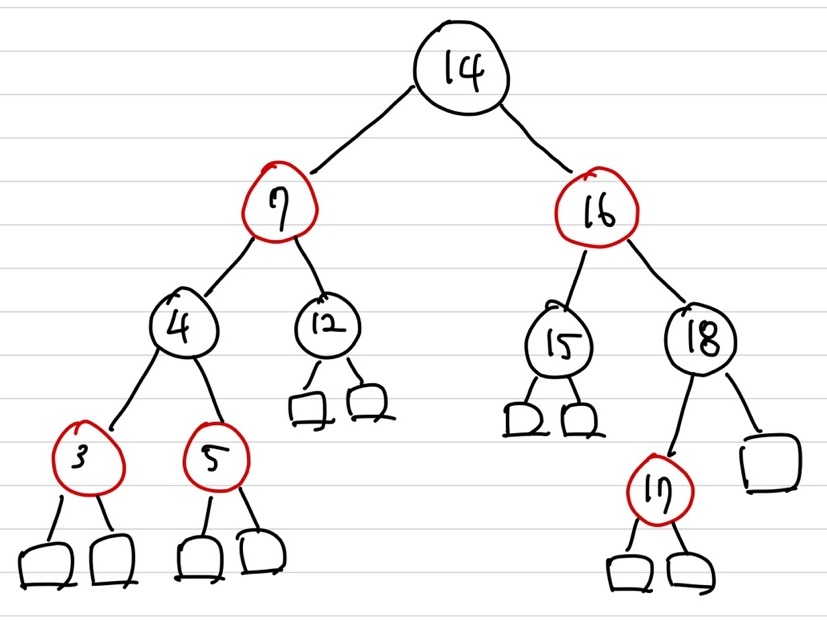

## Amortized Analysis(분할 상환 분석)

<span style='color:red'>**최악의 경우에 대해 최악의 경우가 발생하도록 연속된 연산을 수행, 그때의 한번의 연산에 대한 평균 수행시간을 분석**</span>    
즉, **Worst case의 일종**   
크게 3가지의 분석 방법이 존재 ① worst-case(base 방법) ② average-case ③ amortized analysis   
average-case와 amortized analysis는 크게 확률의 개념이 들어갔냐 안들어갔냐에 따라 다름   

example)   
하루에 1만원씩 쓰다가, 30일날 10만원을 쓴 경우   
worst case로 하루에 10만원을 쓴다가 됨(비합리적 분석) &rarr; Amortized analysis(사용한 최악의 경우에 대한 평균)   
여기서 30일날 10만원을 쓸 것을 대비해 4춴원씩 저측을 진행한다고 해보자   
그럴 경우, actual cost는 매일 1만원씩 쓰는 지출이 되고,  4천원씩 30일날을 위해 저축하게 되니 accounting cost는 4천원   
amortized cost = acutal cost + accounting cost = 1만원 + 4천원 = 1만 4천원

$Amortized \; Cost = Actual \; cost + Accounting \; cost$   
단, accounting cost는 음수 불가, amortized analysis을 용이하게 하는 accounting cost를 설정해야 함   
여기서 다양한 cost 계산 방법이 존재 하는데 크게 3가지로 존재 ① Aggregate method(평균) ② accounting method(회계 방법 &rarr; 평상시에 미리 저축, 나중에 큰 cost에 들어갈 것을 대비) ③ potential method

### Array Doubling

장점 : 임의의 index에 상수시간에 접근 가능   
단점 : memory size 가 고정   
공간이 부족할 때 해결방법 : ① 특정 상수만큼 부족할때마다 공간 증가  ② 현재 size의 2배만큼 증가

example) size가 n인 array A에 n개의 원소가 가득찬 상태에서 1개의 element의 insertion이 들어 왔을 때    
① Array Doubling을 통해 size가 2배인 array A' 생성   
② A의 원소들을 A'로 transferring(=copying) operation cost : $t \times n$   
③ 그 후 한번의 insertion operation : cost $1$이 추가   
④ 총 $t \times n + 1$의 cost가 발생   
⑤ Insertoin operation worst case : $t \times n + 1 = O(tn) \in O(n)$   
만약, array A size가 n이 되기전 8/n이 었다면, transferring operation cost : $ t \times n/8$, 4/n 이라면 $t \times n/4$... 으로 진행   
따라서, $t \ times n/8 + t \times n/4 + t \times n/2 + ...$으로 진행되는데 해당 이전에 연산들은 최대 $t \times n$을 넘을 수는 없음   
즉, total cost는 $2t \times n$을 넘을 수는 없음   

여기서도 accounting cost를 적용해보자   
array double이 발생할 것을 대비해, insert가 발생할 때마다, accounting cost를 추적해놓음   
accounting cost : $\frac{n}{2}k = tn (k=2t)$   
기존 A에 push나 pop이 발생하면 actual cost : 1, accounting cost : 2t가 발생   
하지만, A에 push을 수행했을 때 array double이 발생하면, actual cost : 1 + t\*n, accounting cost : -t\*n + 2t 가 발생하여   
$Amortized cost = 1 + 2t \in O(t) \in O(1)$   

## Binary Search Tree(BST)

binary search : 알고리즘   
binary tree : 자료구조   
binary search tree : 자료구조   
Binary tree 조건인 순서 조건을 만족해야함(inorder 순서, v의 왼쪽 자식 u, 오른쪽 자식 w일 경우, $u.key \le v.key \le w.key$)   

```c++
Element bstSearch(BinTree bst, Key K){ // binary search보다 탐색 수 절반이 줄어듬
    Element found
	if(bst == nil) // leaf 인 경우
        found = null;
    else{
        Element root = root(bst);
        if(K == root.key) // find
            found = root;
       	else if(K < root.key) // 작은 쪽인 left child로
            found = bstSearch(leftSubtree(bst), K);
        else // 큰 쪽인 right child로
            found = bstSearch(rightSubtree(bst), K)
    }
}
```

log chain tree structure : left child만 있는 경우나 right child만 있어서 한 줄로 쭉 이어진 형태, $height : \Theta(n)$   
balanced binary tree : 한쪽에 치우치지 않고 각 부모가 최대한 균등하게 자식들을 가지고 있는 구조, $height: \Theta(log(n))$   
**Binary Tree Rotation을 이용하여 balance 구조로 생성**

### Red-black Tree(Rb Tree)

<span style='color:red'>**height : $\Theta(log(n))$**</span>   
하기 5개의 조건을 만족해야 Rb Tree를 만족함   
① <span style='color:red'>**binary search tree의 구조, 순서조건 모두 만족**</span>   
② <span style='color:red'>**Root Property : root is black**</span>   
③ <span style='color:red'>**External Property : 모든 leaf 노드는 black**</span>  
④ <span style='color:red'>**Internal Property : red node의 자식은 black**</span>   
⑤ <span style='color:red'>**Depth Property : leaf 노드들은 black depth(root부터 해당 노드까지의 black edge 수) 가 모두 동일**</span>   
⑥ <span style='color:red'>**black edge : 자식이 black인 경우의 edge**</span>   


#### Height

n개의 items일 때, height는 $O(log(n))$   
   
좌측 그림은 black으로만 구성된 red-black tree이며, leaft에서 root까지의 가장 짧은 path인 경우의 tree   
우측 그림은 black과 red가 번갈아가며 구성된 red-black tree이며, leaft에서 root까지의 가장 긴 path인 경우의 tree   
   
양쪽 tree 모두 n개의 items에 대한 tree이며, 좌측은 complete binary tree로 height는 $log(n)$   
우측은 red-black tree로 complete binary tree에서 최대의 height가지는 red-black tree로 변경했을 때, height는 최대 $2log(n)$을 가짐   
즉, 가장 긴 path는 가장 짧은 path보다 많아야 2배차이 정도만 남   

#### Insertion

red-black tree에 삽입이 일어 났을 시, ① 순서 조건 ② 구조 조건(root가 아니라면 삽입시 red node로 설정)을 만족해야 함   
앞서 말했던 ① root property ② external property ③ depth property 를 모두 만족 시켜야 함   
부모가 black이라면, ④ internal property 를 만족시키게 변경해야 함    
   
v와 z간의 <span style='color:red'>**Double Red**</span>이 발생 &rarr; <span style='color:red'>**Double Red**</span>을 제거하기 위해 ① <span style='color:blue'>**Restructuring**</span>, ② <span style='color:blue'>**Recoloring**</span>이 필요  

```c++
Algorithm insertItems(K, o)
    
1. We search for key K to locate the insertion node z
// leaf까지 탐색 O(log n) time
2. We add the new item (K, o) at node z and color z red
// 삽입 노드 red로 color하면 끝이니 O(1) time
3.while doubleRed(z)
  if isBlack(sibling(parent(z)))
      z <- restructure(z)
      return
   // Restructuring은 1번만 수행되니, O(1) time
  else {sibling(parent(z)) is red}
      z <- recolor(z)
  // root까지 계속해서 Double Red가 발생할 경우도 존재하니, recolring이 총 O(log n)번 발생할 수 있음
```

**total : $O(log(n))$ time**

#### Double Red

{: width="70%" height="70%"}      
w : v의 sibling(z의 uncle)   
Double Red가 발생한 자식의 uncle이 black인 경우는 우측 case이며  <span style='color:blue'>**Restructuring**</span>이 필요   
좌측의 경우는 uncle이 red인 case이며  <span style='color:blue'>**Recoloring**</span>이 필요   

<span style='color:red'>**Restructuring**</span>   
   
key값이 가운데 있는 것을 parent로 변경(parent는 black, child들은 모두 red로 변경)   
O(1) time이 소요됨   
Restructuring이 일어날 수 있는 4가지의 case   
{: width="70%" height="70%"}   

<span style='color:red'>**Recoloring**</span>     
{: width="80%" height="80%"}   
v와 w의 부모를 red로 변경 후 w와 v는 black으로 변경   
O(1) time이 소요   
**최악의 경우 위의 그림과 같이 Recoloring을 통해 또 다시 Double Red가 발생할 수 있음**   
따라서 root까지 쭉 Double red가 발생하는 최악의 경우도 존재할 수 있기 때문에 $O(log(n))$번의 recoloring 수행이 필요할 수도 있음

#### Example


3번에서 12가 삽입됬을 때, Double Red가 발생했으며, 12번의 sibling이 black이기 때문에 reconstruct를 적용   
4번에서 15가 삽입됬을 때, Double Red가 발생했으며, 15번의 sibling이 red이기 때문에 recoloring을 적용   
   
15번에서 17이 삽입됬을 때, Double Red가 발생했으며, 17번의 sibling이 red이기 때문에 recoloring을 적용   
recoloring을 적용 후 또 다시 14번과 16번간의 Double red가 발생, 16번의 sibling인 4번이 black이기 때문에 reconstructuring 적용   
   
적용 후 더 이상 Double red가 존재하지 않으니 완료
