## Graph
### 기본 용어   
**Graph는 정점(vertex)와 간선(edge)로 구성된 자료구조**   
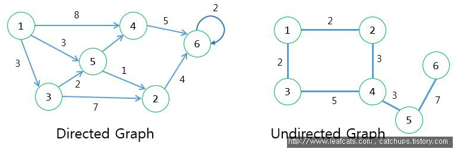   
크게 간선에 방향성이 존재하는 Directed Graph와 방향성이 없는 Undirected Graph로 분류     
\- **정점(Vertex , Node)** : 정점은 위 그래프에서 동그라미 친 1,2,3,4,5,6 과 같은 각각의 지점  
\- **간선(Edge, Link)** :  정점을 연결하는 선   
\- **가중치** : 해당 간선을 타고 다른 정점으로 이동할 때 필요한 비용 등을 표현할 때 사용   
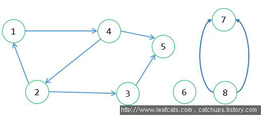   
\- **Self-loops** : 정점에서 자기 자신으로 돌아오는 간선, 정점6의 2번 간선이 그 예시   
\- **Adjacency** : Directed graph에서의 간선으로 연결된 인접 정점, 쌍방향 모두에 적용 X, e.g. Directed Graph에서 정점4가 정점1에 Adjacency하다고 한다면, 정점1은 정점4에 Adjacency은 X   
\- **Degree** : 각 정점에 연결되어 있는 Edge들의 수, 이 중 out-degree는 해당 정점에서 나가는 간선을, in-degree는 해당 정점으로 들어오는 간선, 해당 정점의 Degree = out-degree + in-degree   
\- **Path** : 정점 A에서 정점 B로 이동할 수 있는 경로, path는 여러개가 존재 가능  
\- **Simple Path** : 경로 상의 모든 정점들이 중복되지 않는다면 이 경로를 simple path, e.g. <1,4,2,3,5> 는 simple path 라고 할 수 있지만 <1,4,2,1>은 simple path X   
\- **Cycle** : 그래프가 path를 따라 동일한 정점으로 돌아올 수 있는 경우 e.g. <1,4,2> path가 cycle, 경로 안에서 중복된 노드가 시작점(끝점) 이외에는 발생하지 않는 경우를 Simple Cycle   
\- **An acyclic graph** : 그래프에 싸이클이 없는 경우 그 그래프를 acyclic graph   
\- **Connected Graph** : 기본적으로 connected graph는 방향성이 없는 그래프, 모든 쌍의 정점들이 path로 연결이 가능한 그래프를 connected graph라고 함   
\- **Connected Component** : 위 그래프 전체도 하나의 그래프, 이 중 방향이없는 그래프의 정점 하위 집합을 최대로 연결한 것을 Connected Component   
\- **Forest** : 그래프 중 Acyclic하고 Undirected하면 Forest   
\- **Tree** : Forest에서 하나 하나의 Component들은 Tree, 따라서 Connected, Acyclic, Undirected 모두를 만족하는 graph가 Tree라고 할 수 있음   
\- **Dag** : Tree가 방향성이 없고 싸이클이 존재하지 않는 그래프라면, Dag는 방향성이 있는 그래프 중 싸이클이 나오지 않는 그래프   

### Degree

undirected, directed graph 모두에서   
$graph \; G=(V, E), \|V\|=n, \|E\|= m$일시   
$\sum_{v \in V} deg(v) = 2m$    
**incident edge들의 수**

directed graph의 degree는 in-degree와 out-degree로 구분   
$degree = in-degree + out-degree$   
$\sum_{v \in V} in-deg(v) = m, \; \sum_{v \in V} out-deg(v) = m$   

\* Undirected Graph is connected, then $m \ge n-1$ &rarr; tree는 connected하니 tree개수보다 많아야 함   
\* Undirected Graph is tree, then $m = n-1$  
\* Undirected Graph is forest, then $m \le n-1$   
\* m이 $O(n^2)$에 가까우면 dense graph   
\* m이 $O(n)$에 가까우면 sparse graph   

### Directed graph

방향 그래프, 유향 그래프라고 부름   
$digraph \; G = (V, E)$   
edge의 표현은 v&rarr; w = $(v,w)$나 $vw$인 각 정점 두개로 표현하며, $(v,w) \ne (w, v)$임   
가중 그래프는 $G = (V,E, W)$로 표현

### Undirected Graph

무향 그래프라고 부름   
edge의 표현은 v \- w = $(v,w)$나 $vw$인 각 정점 두개로 표현하며, $(v,w) = (w, v)$임     

\* self-loop   
undirected graph에서는 self-loop (v,v)존재 X   
\- incident : edge와 vertex간의 관계   
\- adjacent : vertex와 vertex간의 관계   
가중 그래프는 $G = (V,E, W)$로 표현   

### Graph Representation

Graph의 input size : n+m &rarr;  $O(n+m)$ time   
크게 ① Adjacency matrix representation(인접행렬) ② Array of adjacency lists representations(인접 리스트)로 표현   
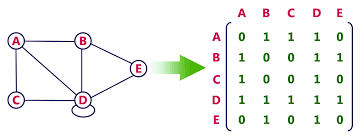{: width="70%" height="70%"} 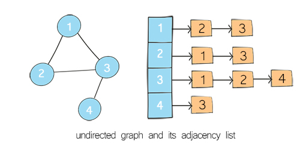{: width="70%" height="70%"}  
좌측은 matrix 표현, 우측은 list 표현 그래프   
좌측의 경우 $O(n^2)$의 space가 필요, 우측의 경우 $O(n+m)$의 space가 필요   
\* v.incidentEdges() 
&rarr; matrix로 표현시, $O(n)$ time, matrix의 한 행을 보면됨   
&rarr; list로 표현시, $O(deg(v))$ time   
\* v.isAdjacentTo(w)   
&rarr; matrix로 표현시, $O(1)$ time, v\[2\]\[3\]로 접근    
&rarr; list로 표현시, $O(min(deg(v)), max(deg(w)) )$ time    

### 추가 용어

\- **Subgraph** : $G'=(V', E') of G : V' \subset V \; and \; E' \subset E$일 때, G'은 G의 subgraph   
\- **Complete graph** : 모든 vertex들이 서로 adjacent함   
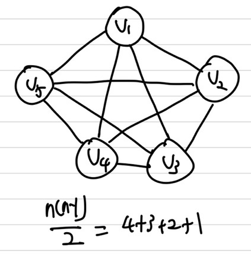{: width="50%" height="50%"}   
&rarr; undirected한 경우, $m=\frac{n(n-1)}{2}$ 해당 뜻은 또 undirected인 어떤 그래프든 $m \le \frac{n(n-1)}{2}$을 만족함   
&rarr; directed한 경우, $m=n(n-1)$ 해당 뜻은 또 directed인 어떤 그래프든 $m \le n(n-1)$을 만족함   
\- **reachable** : path가 존재할 경우 reachable, 도달 가능한 경우,  
\- **Adjacency relation** : 2개의 vertex사이에 edge가 있는지 확인   
\- **Connected, Strongly Connected** : Connected는 undirected 그래프에 있는 모든 vertex들이 reachable하면 connected graph, Strongly Connected는 diagraph의 경우   
&rarr; Strongly Connected : 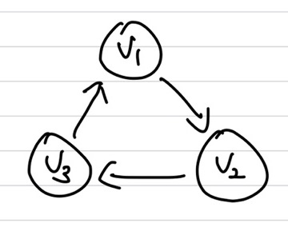{: width="50%" height="50%"}

\* **Connected Component(Maximal connected subgraphs of undirected graph G)**   
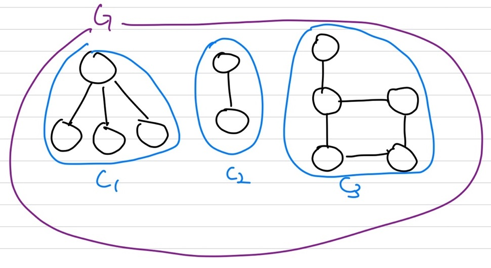{: width="70%" height="70%"}   
C3이 maximal connected subgraph   

\* **free tree(= undirected tree)**   
① connected   
② acyclic   
③ undirected

\* **undirected forest**   
① acyclic   
② undirected graph   

\* **undirected tree는 undirected forest임, but undirected forest는 undirected tree X &rarr; $tree \subset forest$**  
## Graph Traversal

**각 정점과 간선을 visit**   

\- **vertex 상태 정의**   
① undiscovered / white   
② discovered / gray   
③ finished / black

\- **edge상태 정의**   
① unexplored   
② explored   

### Depth-First Search(DFS)

**Recursion 이용**    
① starting vertex 선정, distance d = 0   
② distance를 증가시키며 adjacent한 vertex로 이동, d+1   
③ 이동한 adjacent vertex에서 또 adjacent vertex로 이동. d+2   
④ 더 이상 adjacent vertex가 없을 때까지 계속 이동, 만약 더 이상 없다면 finish   
⑤ backtrack으로 돌아와 이동했던 vertex말고 다른 adjacent vertex가 존재하면 다시 ③, ④을 반복    
$O(n+m)$ time 소요 : linear time

example) 알파벳 순서   
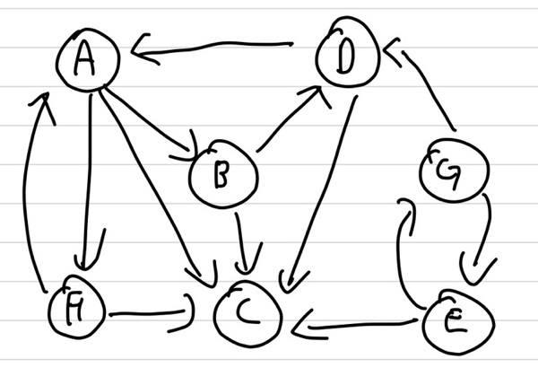    
visit 순서 : A &rarr; B &rarr; C &rarr; D &rarr; F &rarr; E &rarr; G   
finished 순서 : C &rarr; D &rarr; B &rarr; F &rarr; A &rarr; G &rarr; E   
\- tree edge : undiscvored vertex로 갈때의 edge   
\- back edge : vertex가 discoverd 상태이고 ancestor로 가는 edge   
\- descendant edge : vertex가 discovred 상태이고, 후손으로 가는 edge  
\- cross edge : 위의 3개를 제외한 edge   
   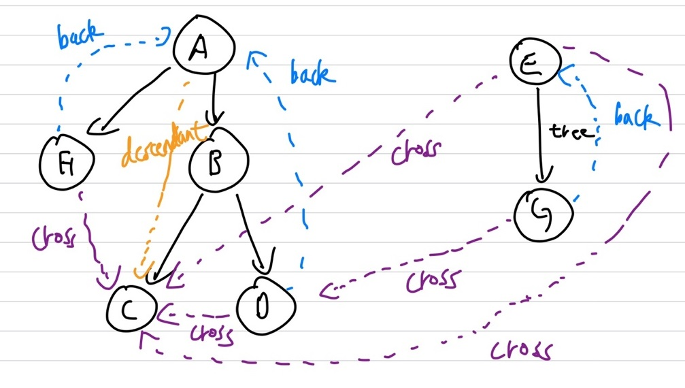

### Breadth-First Search(BFS)

**Queue 이용**      
**최단 경로 계산 가능**        
① starting vertex 선정, distance d = 0   
② adjacent vertex들을 Queue에 삽입, d=1   
③ Queue의 제일 앞에 vertex 꺼내 해당 vertex와 adjacent vertex들을 다시 Queue 끝에 삽입, d=2   
④ Queue가 빌 때 까지 ③을 반복  
$O(n+m)$ time 소요 : linear time

example) 알파벳 순서   
   
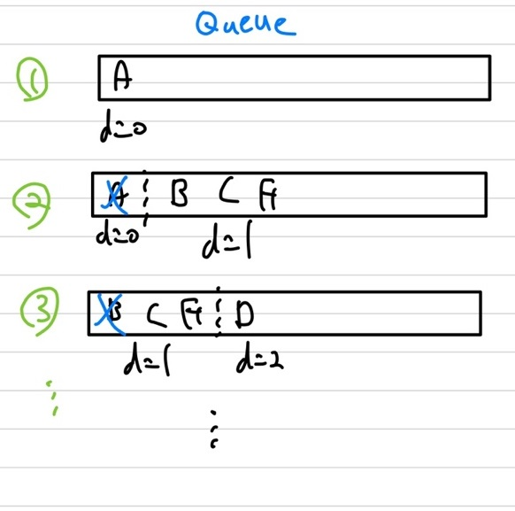{: width="70%" height="70%"}   
visit 순서 : A &rarr; B &rarr; C &rarr; F &rarr; D &rarr; E &rarr; G(E, G로는 A에서 가기 불가능)   
Finished 순서 : A &rarr; B &rarr; C &rarr; F &rarr;  D &rarr; E &rarr; G   

\* shortest path를 구할 땐 vertext들이 누구에게 의해 discover 되었는지에 대한 정보를 가지고 있어야함(=predecessor)   
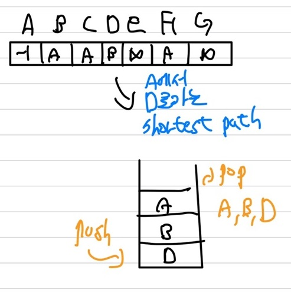{: width="70%" height="70%"}   

### Strongly Connected Componenets(SCC)   

{: width="50%" height="50%"}   
상기의 그래프를 이용   
maximal connected subdiagraph   
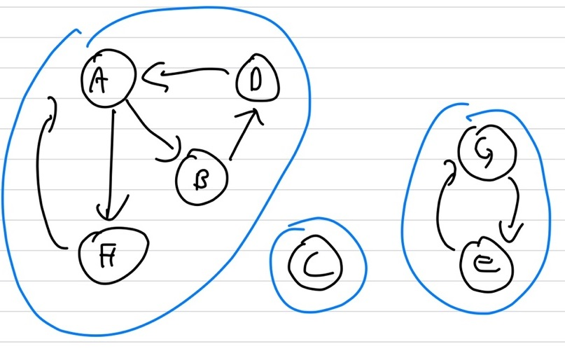{: width="70%" height="70%"}     
3개의 componenet   

코사르자 알고리즘(<https://ko.wikipedia.org/wiki/%EC%BD%94%EC%82%AC%EB%9D%BC%EC%A3%BC_%EC%95%8C%EA%B3%A0%EB%A6%AC%EC%A6%98>)   
\* correctness : Strongly Connected의 속성 중 edge의 방향이 바뀌어도 유지된다는 속성을 이용해 $G^T$을 이용하여 구함     
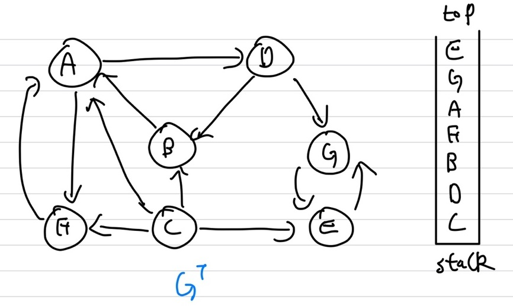{: width="70%" height="70%"}     
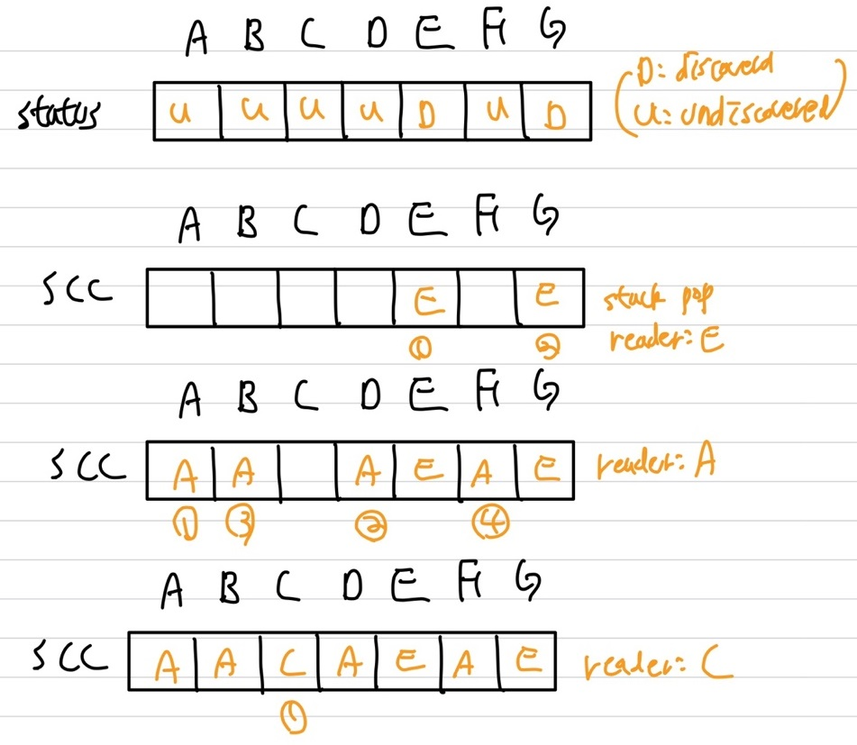{: width="70%" height="70%"}     
상기의 과정을 3개의 SCC로 구분
