## Optimization Problems

목표 : <span style='color:red'>**costs를 최소화 또는 benefits을 최대화**</span>   
가능한 결과를 모두 도출한 후 최고를 찾음 &rarr; 최고를 통해 전체의 효과가 optimal하게 만듦   

## Greedy Algorithm

<span style='color:red'>**선택의 순간마다 당장 눈앞에 보이는 Optimal 상황만을 쫓아 최종적인 해답에 도달하는 방법**</span>   
비용은 최소화하며, **빠른 시간**내에 best인 것을 선택   
여러 경우 중 하나를 결정해야 할 때마다 그 순간에 optimal이라고 생각되는 것을 선택해 나가는 방식으로 진행하여 최종적인 해답에 도달   
&rarr; <span style='color:blue'>순간마다 하는 선택은 그 순간의 지역적으로는 optimal이지만, 그 선택들을 종합하여 만든 최종적인 해답은 optimal이 아닐 수도 있음</span>   
&rarr; 한번 선택이 된다면, 번복이 불가능하기 때문에 추후에 더 좋은 해답이 도출되어도 선택을 번복할 수 없음   
따라서, Greedy Algorithm을 적용하여 optimal을 찾을 때는, 지역적으로 optimal이면서 전역적으로도 optimal한 문제들에 적용 가능 

### Greedy Solution

① **선택 절차(Selection Procedure)**: 현재 상태에서의 optimal solution을 선택   
② **적절성 검사(Feasibility Check)**: 선택된 해가 문제의 조건을 만족하는지 검사  
③ **해답 검사(Solution Check)**: 원래의 문제가 해결되었는지 검사하고, 해결되지 않았다면 선택 절차로 돌아가 위의 과정을 반복   

### Greedy Algorithm Condition

하기의 2가지 조건을 성립해야 적용 가능   
① **탐욕적 선택 속성(Greedy Choice Property)** : 앞의 선택이 이후의 선택에 영향을 주지 않음   
② **최적 부분 구조(Optimal Substructure)** : 문제에 대한 최종 해결 방법은 부분 문제에 대한 최적 문제 해결 방법으로 구성   
<span style='color:blue'>**매트로이드**</span>구조에 대해서는 Greedy Algorithm은 언제나 Optimal Solution을 찾아낼 수 있음 &rarr; 매트로이드 $\subset$ Greedy Algorithm   

## Graph Optimization

① Minimum Spanning Tree Algorithm ② Single-Source Shortest Paths Algorithm은 Greedy Algorithm을 토해 Optimal Solution을 찾을 수 있음

### Minimum Spanning Tree(MST)

<span style='color:red'>**모든 vertex를 연결하는 최소 비용 방법**</span>   
단, **Undirected Graph**에서만 적용 가능   
Spanning Tree's Condition   
&nbsp;&nbsp;&nbsp;&nbsp;&nbsp;① connected    
&nbsp;&nbsp;&nbsp;&nbsp;&nbsp;② undirected graph $G=(V,E)$   
&nbsp;&nbsp;&nbsp;&nbsp;&nbsp;③ $G$의 subgraph  
&nbsp;&nbsp;&nbsp;&nbsp;&nbsp;④ undirected tree   
&nbsp;&nbsp;&nbsp;&nbsp;&nbsp;⑤ G의 모든 vertex들  
즉, 간단하게 말하면 Spanning Tree는 $G'=(V',E') \; of \; G$ 이며 $V'=V \; and \; E' \subset E$인 **Undirected tree(connected, acyclic)**   

Minimum Spanning Tree는 연결된 edge가 최소인 것들로 구성된 Spanning Tree   
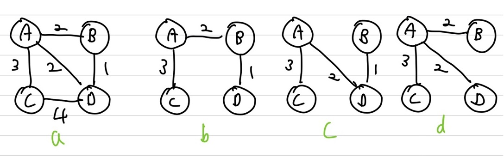   
b, c, d 모두 Spanning Tree 이지만, MST는 b,c   

### Prim's Algorithm

<span style='color:red'>**undirected graph에서 MST를 찾는 Greedy**</span>    
\- **Tree vertices**: Minimum Spanning Tree에 포함되는 vertex 및 edge   
\- **Fringe vertices**: Tree에 없는 vertex, Tree에 있는 vertex와 adjacent한 vertex들 모음   
\- **Unseen vertices**: Tree vertices와 Fringe vertices를 제외한 나머지들    
unseen vertex &rarr; fringe vertex or tree vertex   
fringe vertex &rarr; tree vertex   
**\*fringe vertex들은 Priory Queue를 통해 관리 &rarr; $O(n)$번 삽입, 삭제가 발생(모든 vertex들은 많아야 한번씩 Priority Queue에 삽입되었다 삭제되기 때문)**  
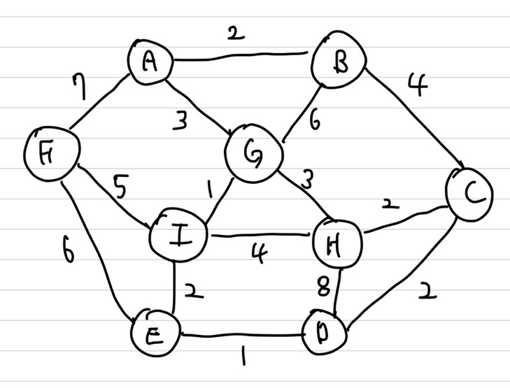{: width="70%" height="70%"}   
① starting vertex를 선택 후 비어있는 Tree T에 포함    
② T에 있는 vertex와 adjacent한 vertex들을 fringe에 포함   
③ fringe에 포함된 vertex들 중 최소 가중치를 가진 vertex를 T에 포함, 이 때 같은 vertex로 가는 가중치가 더 작은 edge가 존재하면 해당 edge로 변경  
④ ② , ③을 모든 vertex가 Tree T에 포함될 때까지 반복   
여기서 ③의 경우 Greedy Algorithm이 사용되어, 현 상태에서 Optimal한 가중치를 가진 edge를 Tree에 포함시킴   

#### Example

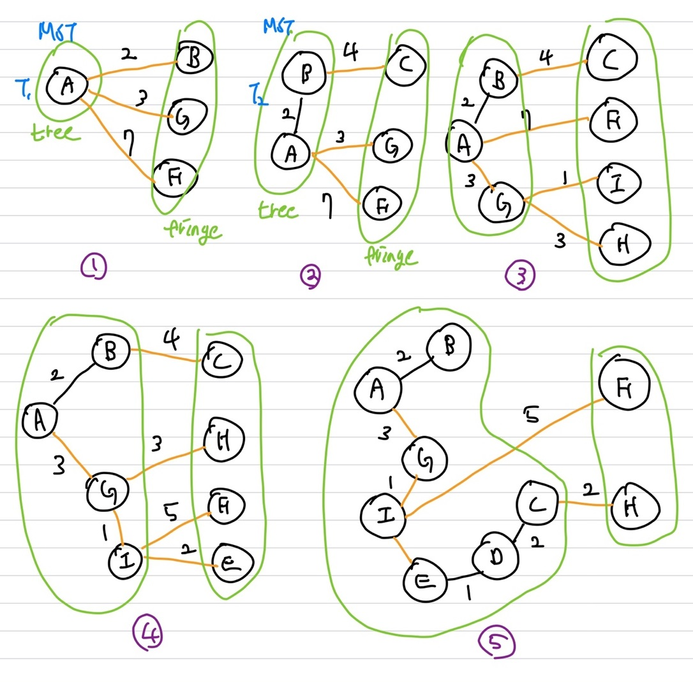   
현재 Tree에 포함된 vertex들은 MST를 이루고 있음   
2번 과정에서 3번 과정으로 갈 때, fringe vertex를 담고있는 Priority Queue에 있는 B가 삭제되고 Tree로 이동   
3번에서 4번으로 바뀌는 구간을 보면, 이전에 F vertex와 연결된 edge는 A &rarr; F 였지만, I &rarr; F 로 변경된 것을 볼 수 있음   
A &rarr; F 는 7의 weight이지만, I &rarr; F 는 5의 weight이기 때문에 더 적은 cost로 update가 이루어 짐   
해당 과정을 모든 vertex들이 Tree에 포함될 때까지 반복(= fringe가 비어있을 때까지 반복)

\- U : unseen \- T : Tree \- F : fringe   
**$M_{MST}=n-1$(edge의 개수)**   
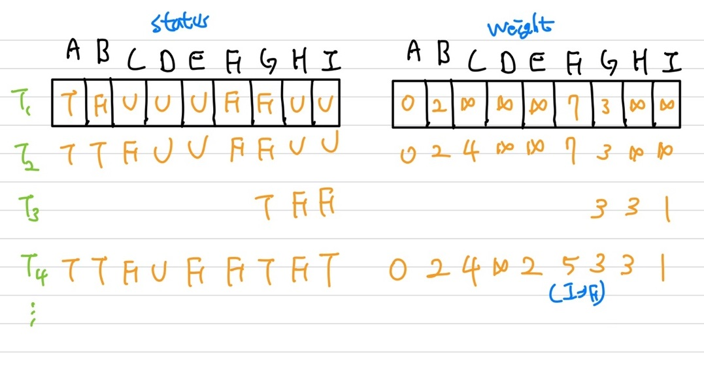   
$T_1, T_2, ...$는 모드 MST상태이며, $T_4$로 갈 때, 위에서 언급했듯이, 7보다 더 작은 가중치 5가 존재하기 때문에 A &rarr; F에서 I &rarr; F로가는 edge로 변경   
**MST는 unsorted array로 구성된 경우 특정 vertex를 찾는데 $O(n)$ time이 소요**   

#### Min-Priority Queue

|               |                            sorted                            |                           unsorted                           |   heap   |
| :-----------: | :----------------------------------------------------------: | :----------------------------------------------------------: | :------: |
|   insert()    |                             O(n)                             |                             O(1)                             | O(log n) |
|  removeMin()  | O(1) <br/><span style='color:blue'>circul array로 구현시</span> |                             O(n)                             | O(log n) |
| decreasekey() | O(n)<br/> <span style='color:blue'>탐색에 O(n)이 소요</span> | O(1)<br/> <span style='color:blue'>array로 구현시 원하는 key값 변경은 상수시간에 가능(array vertex를 매칭 시켰으니 그 vertex로 상수시간에 접근 가능)</span> | O(log n) |

#### Algorithm

Priority Queue를 unsorted sequence로 구현시

```c++
PrimMST(G, n) // unsorted array인 경우
    Initialize all vertices as unseen. // O(n) time, 초기화 T_1
    Select an arbitrary vertex s to start the tree; reclassify it as tree. // unseen -> tree, 초기화 T_1
    Reclassify all vertices adjacent to s as fringe. // unseen -> fringe, 초기화 T_1
    While there are fringe vertices; // n-1번 수행 -> O(n^2) time
		Select an edge of minimum weight between a tree vertex t and a fringe vertex v; // O(n) time
		Reclassify v as tree; add edge tv to the tree;
		Reclassify all unseen vertices adjacent to v as fringe. // O(deg(v)) time
```

total cost : $O(n^2)$ time 소요   

Priority Queue를 heap로 구현시   
```c++
PrimMST(G, n) // unsorted array인 경우
    Initialize all vertices as unseen. // O(n) time, 초기화 T_1
    Select an arbitrary vertex s to start the tree; reclassify it as tree. // unseen -> tree, 초기화 T_1
    Reclassify all vertices adjacent to s as fringe. // unseen -> fringe, 초기화 T_1
    While there are fringe vertices; // n-1번 수행 -> O(n)번의 삽입, 삭제 발생
		Select an edge of minimum weight between a tree vertex t and a fringe vertex v; // O(log n) time
		Reclassify v as tree; add edge tv to the tree;
		Reclassify all unseen vertices adjacent to v as fringe. // O(m)번의 decreasekey() 수행 가능, heap의 경우 O(log n)
```

\- m이 $O(n)$에 가까우면 sparse graph이며, **heap이 더 효율적**   
\- m이 $O(n^2)$에 가까우면 dense graph이며, **unsorted sequence가 더 효율적**  
total cost : $O(nlog(n) + mlog(n)) \approx O(mlog(n))$ time(connected이니 $m \ge n$)   

### Kruskal's Algorithm

<span style='color:red'>**Prim과 동일하게 undirected graph에서 MST를 찾는 Greedy**</span>      
가장 최소의 weight를 가진 edge를 선택   
**Union-Find ADT를 사용**   
\- **find(u)** : vertex u를 포함하는 set이 무엇인지 확인, u를 포함하는 set의 set id return   
\- **union(u, v)** : u와 v의 set을 합침, 즉, $if \; find(u) \ne find(v)$라면 $merge(u,v)$   
<span style='color:blue'>여기서 cycle이 발생하지 않게 Union해야함</span>   
조건 : ①<span style='color:red'>각각의 vertex를 tree로 생각</span> ② <span style='color:red'>먼저 edge들의 weight를 sorting 했다고 가정</span>   
동작 과정   
&nbsp;&nbsp;&nbsp;&nbsp;&nbsp;①  간선 데이터를 비용에 따라 오름차순으로 정렬   
&nbsp;&nbsp;&nbsp;&nbsp;&nbsp;② 간선을 하나씩 확인하며 현재의 간선이 사이클을 발생시키는지 확인   
&nbsp;&nbsp;&nbsp;&nbsp;&nbsp;&rarr; 사이클이 발생하지 않는 경우 최소 신장 트리에 포함  
&nbsp;&nbsp;&nbsp;&nbsp;&nbsp;&rarr; 사이클이 발생하는 경우 최소 신장 트리에 포함 X   
&nbsp;&nbsp;&nbsp;&nbsp;&nbsp;③ 모든 간선에 대하여 ②을 반복   
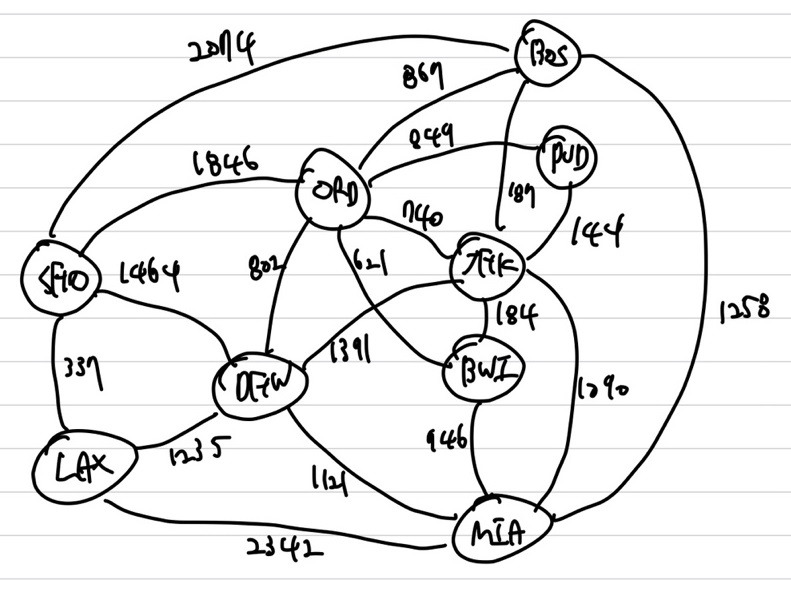{: width="70%" height="70%"}      

#### Example

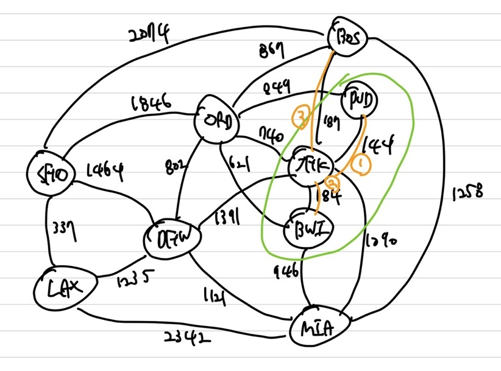{: width="70%" height="70%"}     
오름차순으로 정렬된 edge들을 확인하는데, 처음에 PVD와 JFK가 연결된 edge의 weight가 최소이니 이 둘을 확인   
PVD와 JFK는 서로 다른 set이니 union   
그런 후 JFK의 set과 BWI set을 확인 후 union   
또 BOS와 JFK의 set을 확인 후 union   
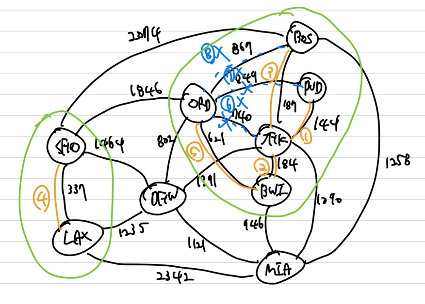{: width="70%" height="70%"}        
여기서 5번 간선을 확인하면 PVD의 set은 {PVD, JFK, BWI, BOS, ORD}로 구성됨   
그다음 edge인 6번 edge 740을 확인해보면  ORD set과 JFK set간의 비교인데 ORD와 JFK는 같은 set이니 pass(ORD의 set id와 JFK set id가 동일)   
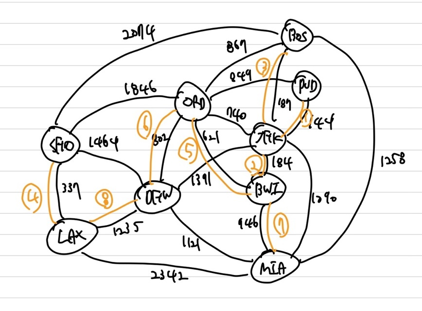{: width="70%" height="70%"}   
최종적으로 주황색으로 된 간서으로 연결된 MST가 생성   
Worst case는 모든 edge에 대해 다 확인하는 경우    
최종 하나의 set의 개수가 vertex의 개수만큼 될때까지 반복(vertex 개수: n, edge 개수 : n-1)

#### Algorithm

```c++
KruskalMST(G, n)
    R = E // R is remaining edges, edge정보를 그대로 copy 후 sorting O(mlog m) time
    F = ∅ // F is forest edges, R에서 minimum edge를 확인 후 제거, MST edge들의 모음
    while(R is not empty) // O(m)번 수행
        Remove the lightest(shortest) edge, vw, from R; //O(log m) time
		if (vw does not make a cycle in F) // Union-Find 사용, 모든 vertex들이 MST에 들어가 있고 edge로 인해 cycle이 발생하지 않을 때, edge를 MST에 추가
            Add vw to F;
	return F;
```

sorting에 $O(mlog(m))$ time이 소요   
heap을 사용시 m은 최대 $O(n^2)$이니 $O(mlog(n^2)) \approx O(m log(n))$ time이 소요(Prim과 동일) 

## Shortest Path

source와 destination간의 shortest path를 구함, 이 때 minimum-weight를 이루는 경로로 생성   
source : 출발지, destination : 목적지   
① single-source shortest path problem : source만 주어짐   
② single-pair shortest path problem : source와 destination이 주어짐   
③ single-destination shortest path problem : destination만 주어짐  
④ All-pairs shortest path problem : 모든 vertex에 대해 shortest path 구함   

Input : $G=(V,E,W)$, source, destination   
Output : source에서 destination까지의 edge로 구성된 shortest path   
w에서 y로 가는 path 표현 : $wv_1,v_1v_2,v_2v_3,...v_{k-1}y$   
가중치가 포함된 경우 : $W(xv_1),W(v_1v_2),..W(v_{k-1}y)$   
$W(P)=W(xv_1)+W(v_1v_2)+...+W(x_{k-1}y)$   
shortest path의 경우 각 edge의 가중치를 담고 있는 $W(p)$가 최소가 되도록 하는 경로, shortest path는 여러개가 존재할 수도 있음   

**Lemma(shortest path property)**   
graph $G=(V,E,W)$에서 $x$에서 $y$로 가는 shortest path를 구할 때 특정 점인 $z$를 거쳐갈 때, $x$에서 $z$까지 path와 $z$에서 $y$의 path로 구성됨   
즉, $x$에서 $y$의 shortest path를 $x$에서 $z$의 shortest path와 $z$에서 $y$의 shortest path로 분할이 가능   
\***Optimal substructure : Optimal 한 것들을 나눠도 optimal함**   

### Dijkstra

<span style='color:red'>**Greedy + Dynamic 사용**</span>   
**edge의 weight가 Non-negative일 때만 가능**  
또한 Prim's Algorithm과 유사   
Prim과의 차이점 : <span style='color:blue'>**tree vertex에서 edge와 fringed edge 합으로 최소값을 고려**</span>   
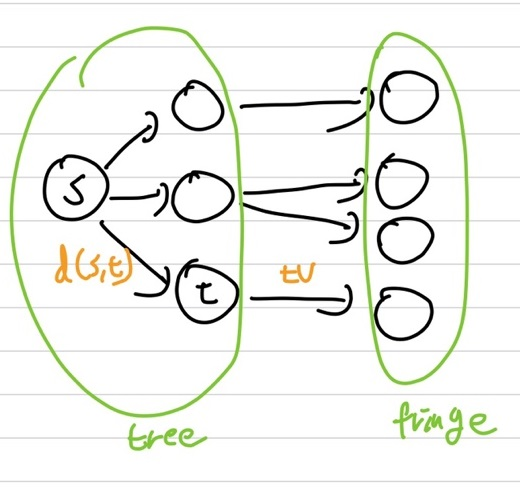{: width="70%" height="70%"}

#### Example

 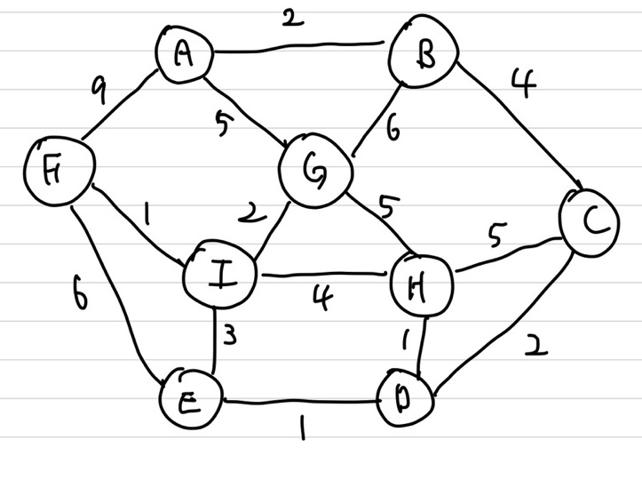{: width="70%" height="70%"}   
상기의 그래프에서 source가 A에 대한 shortest path를 구해보겠음   
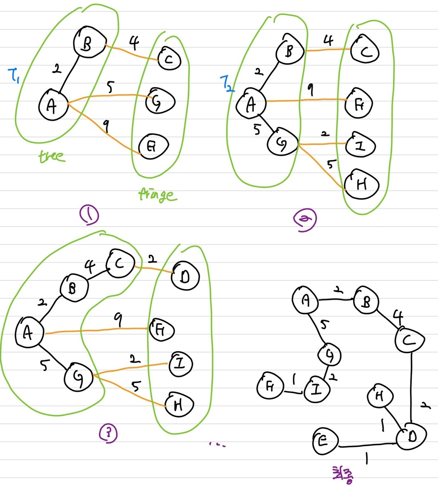   
1번 상태에서 A &rarr; B로 가는 경로는 shortest path이며 tree로 status를 변경시켜놓음   
2번상태에서 3번상태로 갈 때, A, B에 대한 fringe 들이 C,G,F가 존재하는데 이때   
&nbsp;&nbsp;&nbsp;&nbsp;&nbsp;d(A, B) + W(BC) = 2 + 4 = 6   
&nbsp;&nbsp;&nbsp;&nbsp;&nbsp;d(A, A) + W(AG) = 0 + 5 = 5   
&nbsp;&nbsp;&nbsp;&nbsp;&nbsp;d(A, A) + W(AF) = 0 + 9 = 9   
이렇게 현재까지의 cost를 prim과 다르게 더해줘 cost를 계산함   
1번에서 가장 최소 cost는 d(A, A) + W(AG)이니 G를 tree에 포함시켜 줌   
3번에서 4번 상태로 갈 때는   
&nbsp;&nbsp;&nbsp;&nbsp;&nbsp;d(A, C) + W(CD) = 2 + 4 + 2 = 8   
&nbsp;&nbsp;&nbsp;&nbsp;&nbsp;d(A, A) + W(AF) = 0 + 9 = 9    
&nbsp;&nbsp;&nbsp;&nbsp;&nbsp;d(A, G) + W(GI) = 5 + 2 = 7   
&nbsp;&nbsp;&nbsp;&nbsp;&nbsp;d(A, G) + W(GH) = 5 + 5 = 10    
중에 가장 최소값인 d(A, G) + W(GI)를 선택하니 I를 tree에 포함   
이와 같이 반복하면서 단, **경로의 더 최소인 경우가 존재하면 해당 weight를 가지는 edge로 변경(weight가 동일한 경우에는 변경 X)**  
최종적으로 해당 그래프의 shortest path가 완성됨   

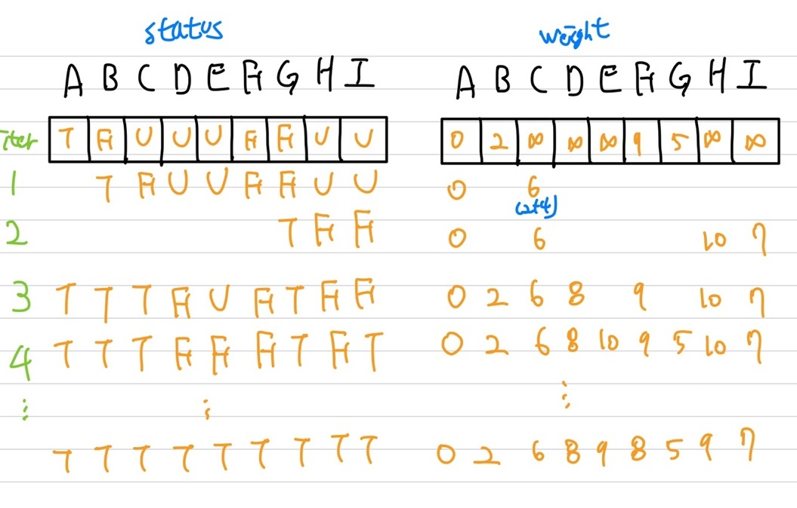   
status와 weight의 변화   
1번 상태에서는 6이 나오는 이유가 A &rarr; B &rarr; C 이니 2 + 4인 6이 됨    
매 iteration마다 $O(n)$ time이 발생하며, iteration이 n번 발생할 수 있으니 worst case는 $O(n^2)$ time

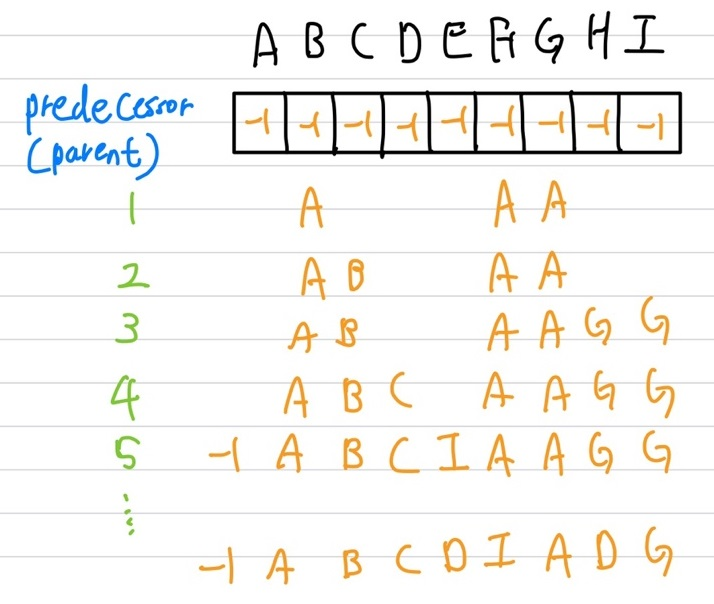   
상기의 그림은 predecessor로 어떤 경로를 거쳐왔는지 알 수 있게 해주는 array   
즉, decreasekey()를 통해 key값을 update 해줌   

#### Algorithm

 ```c++
 dijkstraSSSP(G, n)
     Initialize all vertices as unseen. // 초기화
     Start the tree with the specified source vertex s; reclassify it as tree; // s는 root이며 현 1개로 구성된 tree, 초기화
 	define d(s, s) = 0 // weight 초기화
     Reclassify all vertices adjacent to s as fringe. // 인접한 vertex들 처리, 초기화
 	while there are fringe vertices; // Priority Queue unsorted 시 : O(n^2), heap시 : O(m log n)
 		Select an edge between a tree vertex t and a fringe vertex v such that (d(s,t) + W(tv)) is minimum;
 		// 이전까지 cost와 갈 cost를 더한 값이 최소가 되는 vertex를 선택
 		Reclassify v as tree; add edge tv to the tree; // tree에 추가
 		define d(s, v) = (d(s,t)+W(tv)) // 거리 업데이트, 현까지 최소 거리
         Reclassify all unseen vertices adjacent to v as fringe
 ```

unsorted : $O(n^2)$ time   
heap   
\- $O(n)$번의 insert, removeMin()이 발생하니 $O(n log (n))$   
\- $O(m)$번의 decreasekey()가 발생하니 $O(m log(n))$   
\- heap total : $O(nlog(n) + mlog(n)) \approx O(mlog(n))$   

#### Correctness

**Dijkstra는 Non-negative weight여야 함**   
s부터 z까지의 shortest path는 $d(s,y)+W(yz)$로 표현 가능   
negative weight의 경우 <span style='color:blue'>**밸만포드 Algorithm**</span>을 사용
