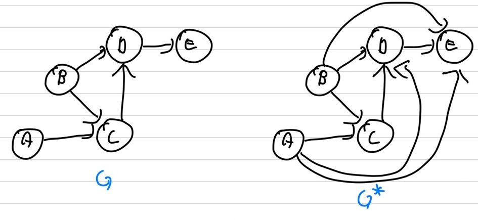
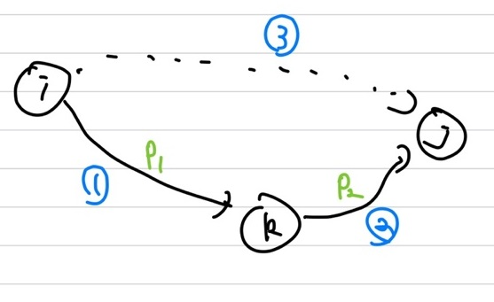
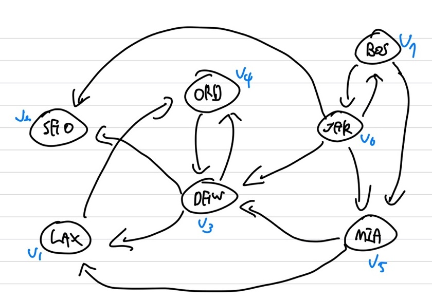
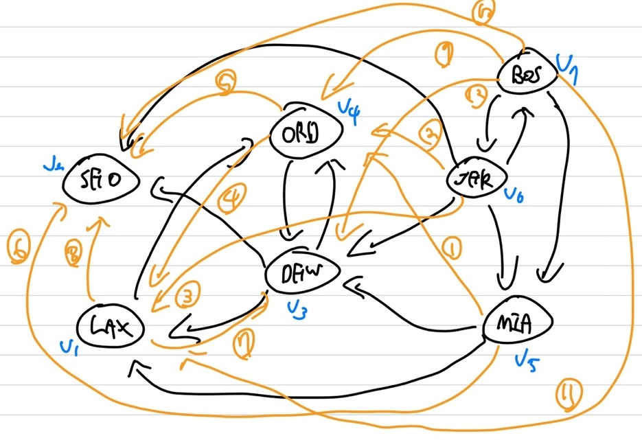
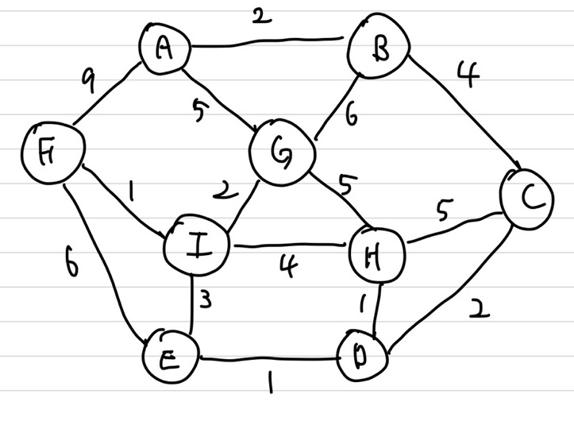

## Shortest path

① single-source shortest path problem : source만 주어짐 &rarr; Dijkstra   
② single-pair shortest path problem : source와 destination이 주어짐   
③ single-destination shortest path problem : destination만 주어짐  
④ All-pairs shortest path problem : 모든 vertex에 대해 shortest path 구함 &rarr; Floyd-Warshall  

## Transitive Closure

digraph $G$에 대해 transitive closure를 추가한 graph는 $G^\*$   
\- $G$와 $G^\*$는 같은 vertex를 가지고 있음   
\- $G$가 u에서 v로가는($u \ne v$) **directed path**가 존재한다면 $G^\*$는 **directed edge**를 가짐  
{: width="70%" height="70%"}   
Transitive Closure는 n번의 **DFS**를 통해 확인 가능   
A &rarr; C 로가는 direct edge가 없을 때, A &rarr; B &rarr; C 를 통해 갈 수 있다면, A &rarr; C edge를 생성   
<span style='color:blue'>모든 vertex를 starting으로 두어가며 DFS를 통해 확인</span>   
$O(n(n+m))$ time이 발생하며, dense graph인 경우 $O(m) \approx O(n^2)$ 이니 $O(n^3)$ time에 bound   

## Floyd-Warshall

Idea 1 : Number the vertices 1, 2, 3, ... , n (\|v\| = n)   
Idea 2 : 각 vertex들에 대해 갈 수 있는 edge들을 모두 생성   
① i에서 k로 가는 directed edge를 1,2,...,k-1 vertex를 통해 찾음   
② k에서 j까지 가는 edge를 1,2,..., k-1 vertex를 통해 찾음   
③ i에서 j의 directed edge를 생성   
{: width="70%" height="70%"}

### Example

{: width="70%" height="70%"}   
상기의 그래프에 대해 Floyd Warshall을 적용을 보여줄 거임   
우선 n번의 DFS 적용하며 n개의 vertex에 대해 shortest path를 가져야하니 n x n의 인접 matrix를 표현   

| $G_1$ | 1($G_1$)<br/> <span style='color:blue'>check</span> | 2($G_2$) | 3($G_3$) | 4($G_4$) | 5($G_5$) | 6($G_6$) | 7($G_7$) |
| :---: | :-------------------------------------------------: | :------: | :------: | :------: | :------: | :------: | :------: |
|   1   |                          0                          |    0     |    0     |    1     |    0     |    0     |    0     |
|   2   |                          0                          |    0     |    0     |    0     |    0     |    0     |    0     |
|   3   |                          1                          |    1     |    0     |    1     |    0     |    0     |    0     |
|   4   |                          0                          |    0     |    1     |    0     |    0     |    0     |    0     |
|   5   |                          1                          |    0     |    1     |    0     |    0     |    0     |    0     |
|   6   |                          0                          |    1     |    1     |    0     |    1     |    0     |    1     |
|   7   |                          0                          |    0     |    0     |    0     |    1     |    1     |    0     |

1번째 iteration의 전인 $G_1$ 상기의 matrix이며, 1번 2번으로 표현한 것은 vertex의 번호를 표현한 것임   
우선 $G_0$을 업데이트해야하니, 1열을 보면 \[0, 0, 1, 0, 1, 0, 0\]으로 되어 있으며 3 &rarr; 1 과 5&rarr; 1의 edge가 존재한다는 뜻   
그럼 1번의 행인 \[0, 0, 0, 1, 0, 0, 0\]을 확인해보면 1 &rarr; 4가 존재하니 3 &rarr; 4를 추가해줘야함   
또 5 &rarr; 1의 경우도 존재하니, 5 &rarr; 4를 추가해줘야 함   

| $G_2$ | 1($G_1$) | 2($G_2$)<br/> <span style='color:blue'>check</span> | 3($G_3$) |              4($G_4$)               | 5($G_5$) | 6($G_6$) | 7($G_7$) |
| :---: | :------: | :-------------------------------------------------: | :------: | :---------------------------------: | :------: | :------: | :------: |
|   1   |    0     |                          0                          |    0     |                  1                  |    0     |    0     |    0     |
|   2   |    0     |                          0                          |    0     |                  0                  |    0     |    0     |    0     |
|   3   |    1     |                          1                          |    0     |                  1                  |    0     |    0     |    0     |
|   4   |    0     |                          0                          |    1     |                  0                  |    0     |    0     |    0     |
|   5   |    1     |                          0                          |    1     | <span style='color:orange'>1</span> |    0     |    0     |    0     |
|   6   |    0     |                          1                          |    1     |                  0                  |    1     |    0     |    1     |
|   7   |    0     |                          0                          |    0     |                  0                  |    1     |    1     |    0     |

1번째 iteration 후인 $G_2$의 state의 matrix임   
2번의 열을 보면 \[0, 0, 1, 0, 0, 1, 0\]으로 되어 있으며 3 &rarr; 2 와 6 &rarr; 2의 edge가 존재   
2번의 행을 보면 \[0, 0, 0, 0, 0, 0, 0\]으로 갈 수 있는 vertex가 없으니 끝  

| $G_3$ | 1($G_1$) | 2($G_2$) | 3($G_3$)<br/> <span style='color:blue'>check</span> | 4($G_4$) | 5($G_5$) | 6($G_6$) | 7($G_7$) |
| :---: | :------: | :------: | :-------------------------------------------------: | :------: | :------: | :------: | :------: |
|   1   |    0     |    0     |                          0                          |    1     |    0     |    0     |    0     |
|   2   |    0     |    0     |                          0                          |    0     |    0     |    0     |    0     |
|   3   |    1     |    1     |                          0                          |    1     |    0     |    0     |    0     |
|   4   |    0     |    0     |                          1                          |    0     |    0     |    0     |    0     |
|   5   |    1     |    0     |                          1                          |    1     |    0     |    0     |    0     |
|   6   |    0     |    1     |                          1                          |    0     |    1     |    0     |    1     |
|   7   |    0     |    0     |                          0                          |    0     |    1     |    1     |    0     |

2번 째 iteration 후인 $G_3$의 state의 matrix임   
3번의 열을 보면 \[0, 0, 0, 1, 1, 1, 0\]으로 되어 있으며 4 &rarr; 3, 5 &rarr; 3, 6 &rarr; 3의 edge가 존재   
3번의 행을 보면 \[1, 1, 0, 1, 0, 0, 0\]으로 되어 있으며 3 &rarr; 1, 3&rarr; 2 와 3 &rarr; 4의 edge가 존재   
그럼 4 &rarr; 3 &rarr; 1로 가니 4 &rarr; 1의 edge와 이의 방식으로 동일하게 4 &rarr; 2 의 edge가 추가될 수 있음, 하지만 self-loop는 불가능하니 4 &rarr; 4는 X   
5와 6도 똑같이, 5 &rarr; 1, 5 &rarr; 2, 5 &rarr; 4, 6 &rarr; 1, 6 &rarr; 2, 6 &rarr; 4의 edge를 추가    

| $G_4$ |              1($G_1$)               |              2($G_2$)               | 3($G_3$) | 4($G_4$)<br/> <span style='color:blue'>check</span> | 5($G_5$) | 6($G_6$) | 7($G_7$) |
| :---: | :---------------------------------: | :---------------------------------: | :------: | :-------------------------------------------------: | :------: | :------: | :------: |
|   1   |                  0                  |                  0                  |    0     |                          1                          |    0     |    0     |    0     |
|   2   |                  0                  |                  0                  |    0     |                          0                          |    0     |    0     |    0     |
|   3   |                  1                  |                  1                  |    0     |                          1                          |    0     |    0     |    0     |
|   4   | <span style='color:orange'>1</span> | <span style='color:orange'>1</span> |    1     |                          0                          |    0     |    0     |    0     |
|   5   |                  1                  | <span style='color:orange'>1</span> |    1     |                          1                          |    0     |    0     |    0     |
|   6   | <span style='color:orange'>1</span> |                  1                  |    1     |         <span style='color:orange'>1</span>         |    1     |    0     |    1     |
|   7   |                  0                  |                  0                  |    0     |                          0                          |    1     |    1     |    0     |

3번 째 iteration 후인 $G_4$의 state의 matrix임   
4번의 열을 보면 \[1, 0, 1, 0, 1, 1, 0\]으로 되어 있으며 1 &rarr; 4, 3 &rarr; 4, 5 &rarr; 4, 6 &rarr; 4의 edge가 존재   
4번의 행을 보면 \[1, 1, 1, 0, 0, 0, 0\]으로 되어 있으며 4 &rarr; 1, 4 &rarr; 2, 4 &rarr; 3의 edge가 존재    
그럼 1 &rarr; 2, 1 &rarr; 3, 3 &rarr; 1, 3 &rarr; 2, 6 &rarr; 1, 6 &rarr; 2, 6 &rarr; 3의 edge를 추가     

| $G_5$ | 1($G_1$) |              2($G_2$)               |              3($G_3$)               | 4($G_4$) | 5($G_5$)<br/> <span style='color:blue'>check</span> | 6($G_6$) | 7($G_7$) |
| :---: | :------: | :---------------------------------: | :---------------------------------: | :------: | :-------------------------------------------------: | :------: | :------: |
|   1   |    0     | <span style='color:orange'>1</span> | <span style='color:orange'>1</span> |    1     |                          0                          |    0     |    0     |
|   2   |    0     |                  0                  |                  0                  |    0     |                          0                          |    0     |    0     |
|   3   |    1     |                  1                  |                  0                  |    1     |                          0                          |    0     |    0     |
|   4   |    1     |                  1                  |                  1                  |    0     |                          0                          |    0     |    0     |
|   5   |    1     |                  1                  |                  1                  |    1     |                          0                          |    0     |    0     |
|   6   |    1     |                  1                  |                  1                  |    1     |                          1                          |    0     |    1     |
|   7   |    0     |                  0                  |                  0                  |    0     |                          1                          |    1     |    0     |

4번 째 iteration 후인 $G_5$의 state의 matrix임   
5번의 열을 보면 \[0, 0, 0, 0, 0, 1, 1\]으로 되어 있으며 6 &rarr; 5, 7 &rarr; 5의 edge가 존재   
5번의 행을 보면 \[1, 1, 1, 1, 0, 0, 0\]으로 되어 있으며 5 &rarr; 1, 5 &rarr; 2, 5 &rarr; 3, 5 &rarr; 4의 edge가 존재    
그럼 6 &rarr; 1, 6 &rarr; 2, 6 &rarr; 3, 6 &rarr; 4, 7 &rarr; 1, 7 &rarr; 2, 7 &rarr; 3, 7 &rarr; 4의 edge를 추가   

| $G_6$ |              1($G_1$)               |              2($G_2$)               |              3($G_3$)               |              4($G_4$)               | 5($G_5$) | 6($G_6$)<br/> <span style='color:blue'>check</span> | 7($G_7$) |
| :---: | :---------------------------------: | :---------------------------------: | :---------------------------------: | :---------------------------------: | :------: | :-------------------------------------------------: | :------: |
|   1   |                  0                  |                  1                  |                  1                  |                  1                  |    0     |                          0                          |    0     |
|   2   |                  0                  |                  0                  |                  0                  |                  0                  |    0     |                          0                          |    0     |
|   3   |                  1                  |                  1                  |                  0                  |                  1                  |    0     |                          0                          |    0     |
|   4   |                  1                  |                  1                  |                  1                  |                  0                  |    0     |                          0                          |    0     |
|   5   |                  1                  |                  1                  |                  1                  |                  1                  |    0     |                          0                          |    0     |
|   6   |                  1                  |                  1                  |                  1                  |                  1                  |    1     |                          0                          |    1     |
|   7   | <span style='color:orange'>1</span> | <span style='color:orange'>1</span> | <span style='color:orange'>1</span> | <span style='color:orange'>1</span> |    1     |                          1                          |    0     |

5번 째 iteration 후인 $G_6$의 state의 matrix임   
6번의 열을 보면 \[0, 0, 0, 0, 0, 0, 1\]으로 되어 있으며 7 &rarr; 6의 edge가 존재   
6번의 행을 보면 \[1, 1, 1, 1, 1, 0, 1\]으로 되어 있으며 6 &rarr; 1, 6 &rarr; 2, 6 &rarr; 3, 6 &rarr; 4,  6 &rarr; 5,  6 &rarr; 7의 edge가 존재    
그럼 7 &rarr; 1, 7 &rarr; 2, 7 &rarr; 3, 7 &rarr; 4, 7 &rarr; 5의 edge를 추가    

| $G_7$ | 1($G_1$) | 2($G_2$) | 3($G_3$) | 4($G_4$) | 5($G_5$) | 6($G_6$) | 7($G_7$)<br/> <span style='color:blue'>check</span> |
| :---: | :------: | :------: | :------: | :------: | :------: | :------: | :-------------------------------------------------: |
|   1   |    0     |    1     |    1     |    1     |    0     |    0     |                          0                          |
|   2   |    0     |    0     |    0     |    0     |    0     |    0     |                          0                          |
|   3   |    1     |    1     |    0     |    1     |    0     |    0     |                          0                          |
|   4   |    1     |    1     |    1     |    0     |    0     |    0     |                          0                          |
|   5   |    1     |    1     |    1     |    1     |    0     |    0     |                          0                          |
|   6   |    1     |    1     |    1     |    1     |    1     |    0     |                          1                          |
|   7   |    1     |    1     |    1     |    1     |    1     |    1     |                          0                          |

6번 째 iteration 후인 $G_7$의 state의 matrix임   
6번의 열을 보면 \[0, 0, 0, 0, 0, 1, 0\]으로 되어 있으며 6 &rarr; 7의 edge가 존재   
7번의 행을 보면 \[1, 1, 1, 1, 1, 1, 0\]으로 되어 있으며 7 &rarr; 1, 7&rarr; 2, 7 &rarr; 3, 7 &rarr; 4,  7 &rarr; 5,  7 &rarr; 6의 edge가 존재    
그럼 6 &rarr; 1, 6 &rarr; 2, 6 &rarr; 3, 6 &rarr; 4, 6 &rarr; 5의 edge를 추가     
따라서 $G_7$가 최종 transitive clousre의 state인 $G^\*$가 됨   
하기의 그림은 edge가 추가되는 과정을 나타낸 그림   


### Algorithm

```c++
Algorithm FloydWarshall(G)
    Input digraph G
    Output transitive closure G* of G
    i ← 1
    for all v ∈ G.vertices()
        denote v as v_i
        i ← i + 1
    G_0 ← G // copy, 초기화
	for k ← 1 to n do
        G_k ← G_{k-1}
		for i ← 1 to n (i != k) do
            for j ← 1 to n (j != i, k) do
				//i 부터 k 까지 와 k부터 j까지 확인 
                if G_{k-1}.areAdjacent(v_i, v_k) ∧ G_{k-1}.areAdjacent(v_k, v_j)
					if ¬G_k.areAdjacent(v_i, v_j) // i에서 j까지 directly edge가 없을 때
                        Gk.insertDirectedEdge(v_i, v_j, k)
	return G_n // transitive closure
```

total : $O(n^3)$ time   
areAdjacent : $O(1)$ time &rarr; 인점 행렬로 구현하기 때문   

## All-Pairs Shortest Paths

Floyd-Warshall과 동일하지만 weight가 추가된 형태   
똑같이 n번의 Dijkstra가 수행됨   
따라서 1번의 Dijkstra가 $O(mlog(n))$ time이 걸리는데 n번을 수행하게 되니 $O(mnlog(n))$ time이 소요됨   
$if \; m \in O(n^2), \; then \; O(n^3)$ time 소요   

### Algorithm

```c++
Algorithm AllPair(G) {assumes vertices 1, 2, ..., n}
	for all vertex pairs (i, j)
        if i = j
            D_0[i,i] ← 0
        else if (i,j) is an edge in G
            D_0[i, j] ← weight of edge (i, j)
        else
            D_0[i, j] ← + ∞
	for k ← 1 to n do // O(n) time
        for i ← 1 to n do // O(n) time
            for j ← 1 to n do // O(n) time
                D_k[i, j] ← min(D_{k-1}[i, j], D_{k-1}[i, k] + D_{k-1}[k, j])
	return D_n
```

total : $O(mn log(n))$ time (n번의 Dijkstra)   
worst case : $m \in O(n^2)$ &rarr; $O(n^3)$ time   

### Example

{: width="70%" height="70%"}   
상기의 그림에 대해 All-Pairs shortest path를 구함   

| $G_0$ |    A     |    B     |    C     |    D     |    E     |    F     |    G     |    H     |    I     |
| :---: | :------: | :------: | :------: | :------: | :------: | :------: | :------: | :------: | :------: |
|   A   |    0     |    2     | $\infty$ | $\infty$ | $\infty$ |    9     |    5     | $\infty$ | $\infty$ |
|   B   |    2     |    0     |    4     | $\infty$ | $\infty$ | $\infty$ |    6     | $\infty$ | $\infty$ |
|   C   | $\infty$ |    4     |    0     |    2     | $\infty$ | $\infty$ | $\infty$ |    5     | $\infty$ |
|   D   | $\infty$ | $\infty$ |    2     |    0     |    1     | $\infty$ | $\infty$ |    1     | $\infty$ |
|   E   | $\infty$ | $\infty$ | $\infty$ |    1     |    0     |    6     | $\infty$ | $\infty$ |    3     |
|   F   |    9     | $\infty$ | $\infty$ |    6     |    6     |    0     | $\infty$ | $\infty$ |    1     |
|   G   |    5     |    6     | $\infty$ | $\infty$ | $\infty$ | $\infty$ |    0     |    5     |    2     |
|   H   | $\infty$ | $\infty$ |    1     | $\infty$ | $\infty$ | $\infty$ |    5     |    0     |    4     |
|   I   | $\infty$ | $\infty$ | $\infty$ |    3     |    3     |    1     |    2     |    4     |    0     |

$G_0$은 현 상태의 인접 행렬을 나타낸 표기함   

| $G_1$ |                  A                   |    B     |                  C                  |                  D                  |                  E                  |    F     |    G     |                  H                   |                  I                   |
| :---: | :----------------------------------: | :------: | :---------------------------------: | :---------------------------------: | :---------------------------------: | :------: | :------: | :----------------------------------: | :----------------------------------: |
|   A   |                  0                   |    2     | <span style='color:orange'>6</span> | <span style='color:orange'>8</span> | <span style='color:orange'>9</span> |    9     |    5     | <span style='color:orange'>11</span> | <span style='color:orange'>10</span> |
|   B   |                  2                   |    0     |                  4                  |              $\infty$               |              $\infty$               | $\infty$ |    6     |               $\infty$               |               $\infty$               |
|   C   | <span style='color:orange'>6</span>  |    4     |                  0                  |                  2                  |              $\infty$               | $\infty$ | $\infty$ |                  5                   |               $\infty$               |
|   D   | <span style='color:orange'>8</span>  | $\infty$ |                  2                  |                  0                  |                  1                  | $\infty$ | $\infty$ |                  1                   |               $\infty$               |
|   E   | <span style='color:orange'>9</span>  | $\infty$ |              $\infty$               |                  1                  |                  0                  |    6     | $\infty$ |               $\infty$               |                  3                   |
|   F   |                  9                   | $\infty$ |              $\infty$               |                  6                  |                  6                  |    0     | $\infty$ |               $\infty$               |                  1                   |
|   G   |                  5                   |    6     |              $\infty$               |              $\infty$               |              $\infty$               | $\infty$ |    0     |                  5                   |                  2                   |
|   H   | <span style='color:orange'>11</span> | $\infty$ |                  1                  |              $\infty$               |              $\infty$               | $\infty$ |    5     |                  0                   |                  4                   |
|   I   | <span style='color:orange'>10</span> | $\infty$ |              $\infty$               |                  3                  |                  3                  |    1     |    2     |                  4                   |                  0                   |

1번 째 iteration 후인 $G_1$의 state의 matrix임   
A번의 열을 보면 \[0, 2, $\infty$, $\infty$, $\infty$, 9, 5, $\infty$, $\infty$\]으로 되어 있으며 B &rarr; A로 가는 edge가 존재하며 weight가 2인 edge가 존재한다는 뜻임     
그럼 B와 연결된 edge들을 확인해보면, C와 G가 존재, 또 C와 연결된 edge들을 확인해보면 D, H가 존재, D와 연결된 edge들을 확인해보면 E, F가 존재, E와 연결된 edge들을 확인해보면 I를 확인해볼 수 있음, 이런식으로 DFS로 깊이탐색을 통해 연결된 edge들에 대해 확인을 수행   
우선 C &rarr; B로 가는 weight가 4인 edge가 존재하니 C &rarr; B &rarr; A는 4 + 2인 6인 edge를 추가, 또 D &rarr; C인 weight가 2인 edge가 존재하니 D &rarr; C &rarr; B &rarr; A인 2 + 4 + 2인 8인 edge를 추가, E &rarr; D인 weight가 1인 edge가 존재하니 E &rarr; D &rarr; C &rarr;  B &rarr; A인 1 + 2 + 4 + 2인 9인 edge를 추가, F의 경우는 이미 A와 direct로 연결된 edge가 존재하며 추가할 weight보다 더 최소이기 때문에 패스, 그럼 I의 경우, I &rarr; F &rarr; A인 1 + 9인 10인 edge를 추가   
이렇게 되면 $G_1$인 A로 가는 direct edge들은 다 추가된 것이며 추후에 더 최소로 가는 경우가 존재하면 업데이트를 진행하면 됨   

상기와 같은 방식으로 &G^\*&까지 진행하면 All-Pairs shortest Path를 구할 수 있음
