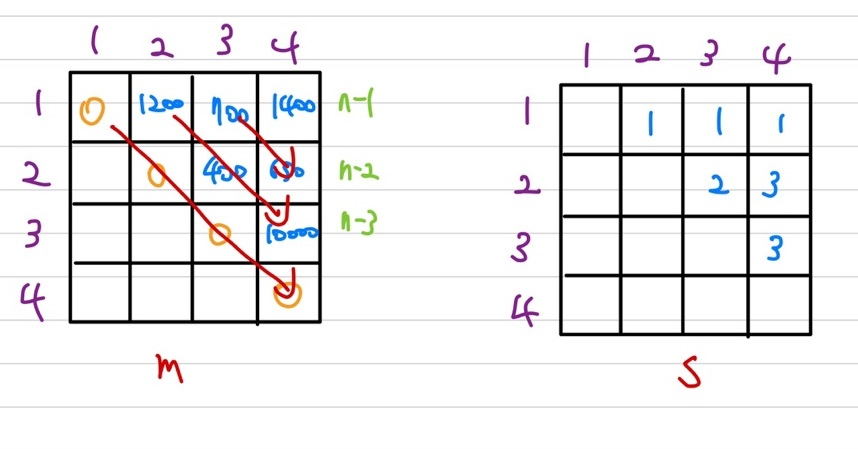
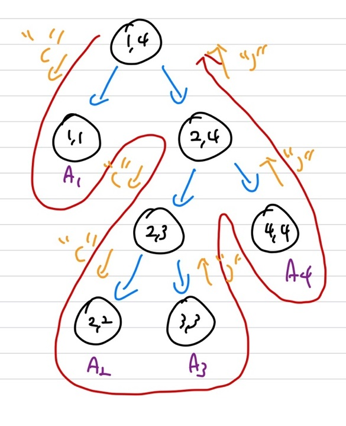

## Dynamic Programming

**Divide and Conquer 전략 사용**   
<span style='color:red'>**Optimization Problem을 해결할 때 사용**</span>   
① top-down 방법(**Recursion 방식**)   
 &rarr; <span style='color:blue'>**Memoization**</span> 방법(table에 기록)   
② bottom-up 방법(**loop 방식**)   

### Recursive Algorithm(top-down)

speed와 space를 맞교환하는 방식   
sub-problem의 solution을 저장하여 recomputing을 제거 &rarr; 추가적인 공간이 필요하지만, 계산을 추가적으로 하지 않기 때문에 속도 측면에서는 유리함   
sub-problem의 solution을 dictionary에 저장 &rarr; $soln$ : solution을 저장하는 dictionary   
recursive call을 하기전에 sub-problem의 solution인 $Q$가 존재하는지 dictionary에서 확인 후 진행   

#### Fibonacci

```c++
fibDPwrap(n) // n = 10
    Dict soln = create(n); // F_n = F_{n-1} + F_{n-2}
	return fibDP(soln, n);
fibDP(soln, k)
    int fib, f1, f2;
	if(k < 2) // 0, 1일 때는 그대로 저장
        fib = k;
	else 
        if(member(soln, k-1) == false) // 현재 table에 저장되어있는지 확인
        	f1 = fibDP(soln, k-1);
		else
            f1 = retrieve(soln, k-1);
		if(member(soln, k-2) == false)
            f2 = fibDP(soln, k-2);
		else
            f2 = retrieve(soln, k-2);
		fib = f1 + f2
	store(soln, k, fib);
	return fib;

```

만약, $F_{10} = F_9 + F_8$에서 $F_9 = F_8 + F_7$을 통해 계산되는데 $F_8$의 경우 이미 $F_9$를 구할 때 계산했으니, $F_{10}$을 계산할 때 추가적인 계싼이 필요X   

### Matrix-Chain Multiplication

**Optimization Problem**   
n개의 matrix가 주어질 때, $\<A_1, A_2, A_3, ..., A_n\>$에 대해 n개의 matrix 계산   
결합 법칙 가능 : $\(A_1 \times A_2\) \times A_3 = A_1 \times \(A_2 \times A_3\)$   
<span style='color:red'>**결합벅칙에서 연산수가 최소가 되는 법**</span>   
\- $A_i$는 $p_{i-1} \times p_i$의 dimension을 갖고 있을 때, 결합법칙을 이용해 **scalar multiplication**을 최소화   

### Computation Time

Dimension이 $p \times q$와 $q \times r$인 두 개의 matrix에 대한 scalar multiplication은 $pqr$의 multiplication이 필요    

#### example

$A_1 = 30 \times 1, \; A_2 = 1 \times 40, \; A_3 = 40 \times 10, \; A_4 = 10 \times 25$    
$\(\(A_1A_2\)A_3\)A_4 = 30 \times 1 \times 40 + 30 \times 40 \times 10 + 30 \times 10 \times 25 = 20,700$    
$A_1\(A_2\(A_3A_4\)\) = 40 \times 10 \times 25 + 1 \times 40 \times 25 + 30 \times 1 \times 25 = 11,750$    
$\(A_1A_2\)\(A_3A_4\) = 30 \times 1 \times 40 + 40 \times 10 \times 25 + 30 \times 40 \times 25 = 41,200$    
$A_1\(\(A_2A_3\)A_4\) = 1 \times 40 \times 10 + 1 \times 10 \times 25 + 30 \times 1 \times 25 = 1,400$   
제일 마지막이 optimal solution   
또 다른 input 방법으로는 $\<p_0, p_1, p_2, p_3, p_4\>$이 존재   

## Development(step)

① 최적해에 대한 구조의 특징 파악   
② top-down 방식, 점화식 정의   
③ bottom-up 방식의 optimal solution 계산   
④ **Optimal한 step** : ③에서도 결과가 나오지만(value),  ④에서는 optimal solution을 계산   

### Step 1: The structure of an Optimal Parenthesization

$A_iA_{i+1}...A_j$가 존재할 때, $A_iA_{i+1}...A_k$와 $A_{k+1}...A_j$로 분할($i \ge k \< jt$)   
Cost = (cost of computing $A_i...A_k$) + (cost of computing $A_{k+1}...A_j$) + (cost of multiplying them)   
&rarr;   Cost : A'의 연산 + A''연산 + (A'와 A''의 곱하는 연산)   

### Step 2: A Recursive Solution

**점화식 정의**   
$m\[i,j\]$ : optimal solution value 저장, 즉 $A_i...A_j$까지 필요한 최소 곱셈 연산 수 저장   
&rarr; i==j이면 0, i < j이면 $min_{i \ge k \< j} \{m\[i,k\] + m\[k+1,j\] + p_{i-1}p_kp_j\}$   
$s\[i,j\]$ : step 4까지 진행할 때 사용, 쪼갠 k의 값을 저장, **optimal solution**을 저장   

$\(A_iA_{i+1}...A_{k-1}A_k\)\(A_{k+1}A_{k+2}...A_j\)$      
$\(p_{i-1} \times p_i p_i \times p_{i+1}...p_{k-2} \times p_{k-1} p_{k-1} \times p_k \)\(p_k \times p_{k+1} ...p_{j-1} \times p_j\)$   
$A' \times A''\(p_{i-1} \times p_k \; \times \; p_k \times p_j\)$

### Step 3: Computing the Optimal Costs

Recursive를 통한 solution 계산 대신, tabular를 사용한 bottom-up 방식으로 접근   
Input : $p=\<p_0,p_1,...,p_n\>$   

```c++
MATRIX-CHAIN-ORDER(p)
    n ← length[p] - 1
    for i ← 1 to n
        do m[i, i] ← 0
	for l ← 2 to n
        do for i ← 1 to n - l + 1
            do j ← i + l - 1
                m[i, j] ← ∞
            	for k ← i to j - 1
                    do q ← m[i, k] + m[k+1, j] + p_{i-1}p_kp_j
                        if q < m[i, j]
                            then m[i, j] ← q
                            s[i, j] ← k
	return m and s
```

bottom-up 방식   
$O(n^3)$ time과 $O(n^2)$ space 사용   

### Step 3: example

$A_1 = 30 \times 1, \; A_2 = 1 \times 40, \; A_3 = 40 \times 10, \; A_4 = 10 \times 25$    
$p_0 = 30, p_1 = 1, p_2 = 40, p_3 = 10, p_4 = 25$    
{: width="70%" height="70%"}   
s는 k값 저장   
$n+(n-1)+...+1 = O(n^2)$의 cell이 존재   
1개의 cell계산 시 $O(n)$ time이 소요되니 total $O(n^2)$개의 cell이 존재하니 $O(n^3)$ time이 소요   

$m\[1, 2\] = min \( m\[1, 1\] + m\[2, 2\] + p_0p_1p_2 \) = 0 + 0 + 1200 = 1200$
$m\[2, 3\] = min\(m\[2, 2\] + m\[3, 3\] + p_1p_2p_3\) = 0 + 0 + 400 = 400$
$m\[3, 4\] = min\(m\[3, 3\] + m\[4, 4\] + p_2p_3p_4\) = 0 + 0 + 10000 = 10000$
$m\[1, 3\] = min\(m\[1, 1\] + m\[2, 3\] + p_0p_1p_3\) = 0 + 400 + 300 = 700$
&rarr; choice : $A_1A_2A_3$ = $\(A_1A_2\)A_3$ 와 $A_1\(A_2A_3\)$ 중 선택
$m\[1, 3\] = min\(m\[1, 2\] + m\[3, 3\] + p_0p_2p_3\) = 1200 + 0 + 12000 = 13200$
$m\[2, 4\] = min\(m\[2, 2\] + m\[3, 4\] + p_1p_2p_4\) = 0 + 10000 + 1000 = 11000$
$m\[2, 4\] = min\(m\[2, 3\] + m\[4, 4\] + p_1p_3p_4\) = 400 + 0 + 250 = 650$
&rarr; choice : $A_2A_3A_4$ = $\(A_2A_3\)A_4$ 와 $A_2\(A_3A_4\)$ 중 선택
$m\[1, 4\] = min\(m\[1, 1\] + m\[2, 4\] + p_0p_1p_4\) = 0 + 650 + 750 = 1400$
$m\[1, 4\] = min\(m\[1, 2\] + m\[3, 4\] + p_0p_2p_4\) = 1200 + 10000 + 1200\*25 = $
$m\[1, 4\] = min\(m\[1, 3\] + m\[4, 4\] + p_0p_3p_4\) = 700 + 0 + 300\*25 = $
&rarr; choice : $A_1A_2A_3A_4$ = $A_1\(\(A_2A_3\)A_4\)$ 선택   

### Step 4: Constructing an Optimal Solution

**k값을 이용**   

```c++
PRINT-OPTIMAL_PARENTS(s, i, j) // s table, A_i, ..., A_j
    if i == j
        then print "A_i"
	else
        print "("
        PRINT-OPTIMAL-PARENTS(s, i, s[i, j]) // A_i, ..., A_k : left child
        PRINT-OPTIMAL-PARENTS(s, s[i, j] + 1, j) // A_k+1, ..., A_j : right child
        print ")"
```

{: width="70%" height="70%"}   
recursion tree(binary tree) : leaf 노드 개수가 n개일 때, internal node는 n-1개   
leaft : n &rarr; total node : 2n -1(n + n - 1)   
$O(n)$ time, $O(n^2)$ space가 필요   
$\(A_1\(\(A_2A_3)A_4\)\)$   
