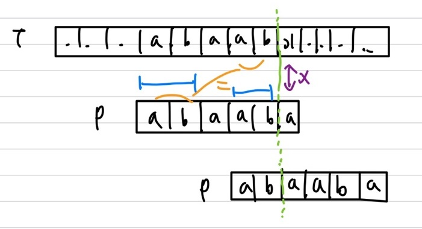
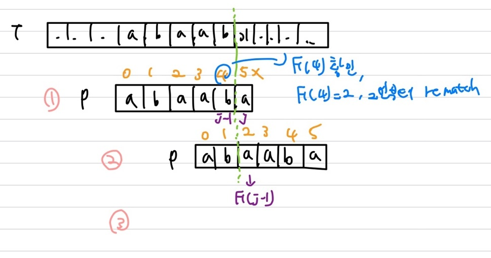
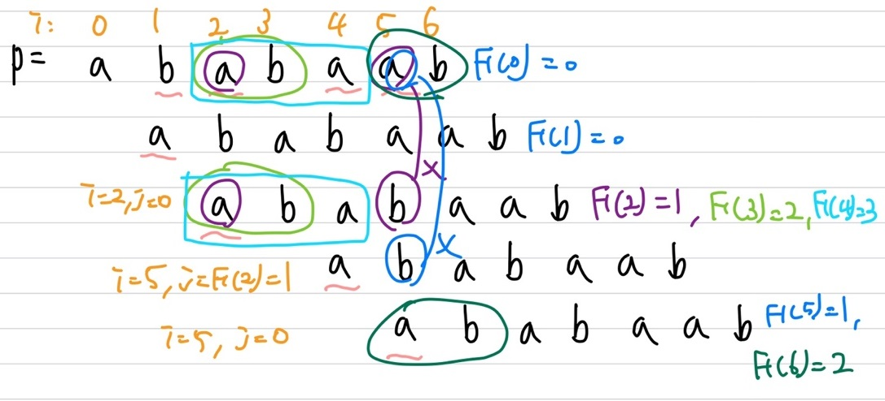
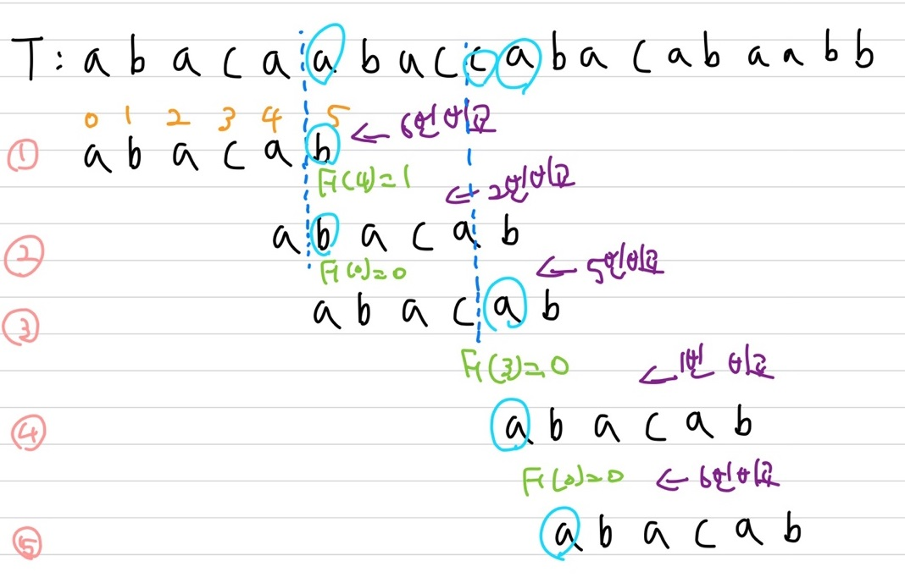
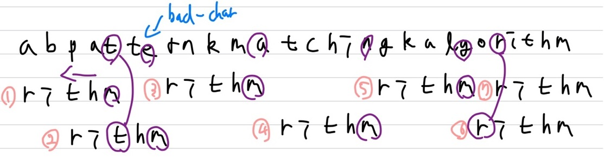
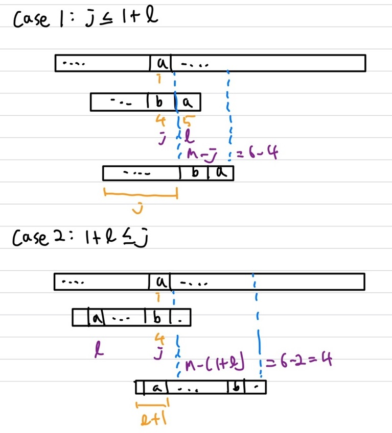
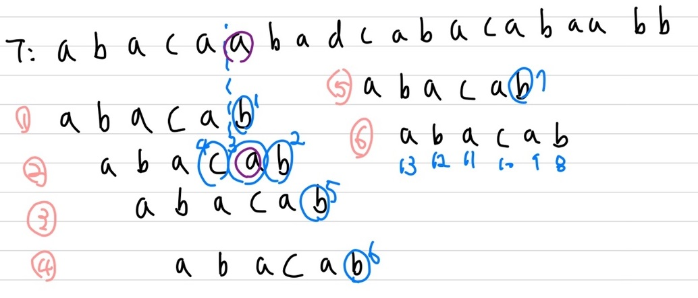

## Pattern Matching

전체 Text에서 특정 pattern $p$가 발생하는 위치 탐색   
**string** : character(문자)의 나열, 문자열(e.g. C++ Program, HTML document, DNA sequence, Digitized image)   
$\sum$(alphabet) : characters set(e.g. ASCII, \{0, 1\}, \{A, C, G, T\})    

$P$ : size $m$의 string($P\[01... m-1\]$)(e.g. $P$=algorithm)   
**substring** : $P\[i .. j\]$ i와 j번째 사이의 character로 구성된 $P$의 subsequence, **부분 문자열**(e.g. algo, gori, m, ...)   
**prefix** : 시작인 0부터 시작하는 $P\[0 .. i\]$인 substring, **접두사**(e.g. a, al, alg, ..., algorithm)   
**suffix** : 끝인 m-1 $P\[i.. m-1\]$인 substring, **접미사**(e.g. m, hm, thm, ithm, ... algorithm)   

### Brute-Force Algorithm

Brute-Force에서 Brute는 '무식한', Force는 '힘'이라는 뜻을 가지고 있음   
<span style='color:red'>**완전탐색**</span>  알고리즘이며 가능한 모든 경우의 수를 모두 탐색하면서 요구조건에 충족되는 결과를 도출함   
예외 없이 100%의 확률로 정답 출력 가능  
해가 존재할 것으로 예상되는 모든 영역을 전체 탐색하는 방법    

pattern $P$를 text $T$에 대해서 움직여가며 비교(basic operation)   
T의 가장 왼쪽부터 하나씩 P와 비교, mismatch시 Text를 한칸 이동한 후 다시 P와 비교   

#### Algorithm

```c++
Algorithm BruteForceMatch(T, P)
    Input text T of size n and pattern P of sizme m
    Output starting index of a substring of T equal to P or -1 if no such substring exists
	for i ← 0 to n - m //test shift i of the pattern, i는 비교할 text 시작 index
		j ← 0 // j는 pattern의 index
        while j < m ∧ T[i + j] = P[j]
            i ← j + 1
        if j == m
            return i //match at i
    return -1 //no match anywhere
```

보통 $O(n + m)$ time이 소요   
**But**, worst case의 경우 $O(nm)$ time이 소요됨(pattern m과 모두 비교하며 총 n번까지 반복하게 되니)

### KMP Algorithm

KMP : Knuth-Morris-Pratt   
Brute-Force와 비슷하게 **left to right**로 pattern을 비교하지만, mismatch시 이동하는 보폭이 다름   
즉, **mismatch**시 어느정도 이동시켜야 효율적으로 다시 비교를 수행할 수 있을까? 라는 점에 주목한 Algorithm   
 {: width="70%" height="70%"} 

#### Idea

**접두사(Prefix)**와 **접미사(Suffix)**를 활용   
부분 문자열인 **$P\[i\]$**가 필요($P\[i\]$는 suffix==preffix가 될 수 있는 부분 문자열 중 가장 긴 것의 길이)   

|  i   |                         부분 문자열                          | P[i] |
| :--: | :----------------------------------------------------------: | :--: |
|  0   |                              A                               |  0   |
|  1   |                              AB                              |  0   |
|  2   | <span style='color:orange'>A</span>B<span style='color:blue'>A</span> |  1   |
|  3   | <span style='color:orange'>A</span>BA<span style='color:blue'>A</span> |  1   |
|  4   | <span style='color:orange'>AB</span>A<span style='color:blue'>AB</span> |  2   |
|  5   | <span style='color:orange'>ABA</span><span style='color:blue'>ABA</span> |  3   |
|  6   | <span style='color:orange'>AB</span>AAB<span style='color:blue'>AB</span> |  2   |

**Failure Function**   
$F(j)$는 proper suffix와 preffix의 길이

|    j     |   0   |   1   |   2   |   3   |   4   |   5   |
| :------: | :---: | :---: | :---: | :---: | :---: | :---: |
| **P[j]** | **a** | **b** | **a** | **a** | **b** | **a** |
| **F[j]** | **0** | **0** | **1** | **1** | **2** | **3** |

j가 0일 때는 empty string   
j가 1일 때는 No match    
j가 2일 때는 a, a match   
j가 3일 때는 a, a match    
j가 4일 때는 ab, ab match    
j가 5일 때는 aba, aba match    

{: width="70%" height="70%"}    
j에서 mismatch가 났을 시 F(j-1)을 확인 후 **j를 F(j-1)값으로 변경**    
만약 0번 index에서 mismatch가 날 시, 한칸만 이동하여 다시 비교 &rarr; 모두 mismatch시 Brute-Force와 동일하게 동작함   
$F(j)$는 $O(m)$ time이 소요   

#### Algorithm

```c++
Algorithm failureFunction(P)
    F[0] ← 0 // 초기화
    i ← 1
    j ← 0
    while i < m
        if P[i] == P[j] // match인 경우
            F[i] ← j + 1
            i ← i + 1
            j ← j + 1
        else if j > 0 // mis match시
            j ← F[j - 1]
		else
            F[i] ← 0 // no match
            i ← i + 1
```

Failure Function은 $O(m)$ time이 소요됨   
i는 1씩 증가함, F(j-1) < j   
따라서 while문은 2m을 넘을 수 없음   

```c++
Algorithm KMPMatch(T, P)
    F ← failureFunction(P) // O(m) time
    i ← 0 // index of T
    j ← 0 // index of P
    while i < n // n번 + patternshift = O(n) time
        if T[i] == P[j] // match
            if j == m-1 // P의 길이만큼 match가 된다면
                return i-j // matching success
        	i ← i + 1
            j ← j + 1
		else if j > 0 // mismatch
            j ← F[j-1] // failureFunction으로 변경, j만 변경, i는 가만히 있는 경우
        else // j=0(Brute-Force)
            i ← i + 1
	return -1 // no match
```

while문은 2n을 넘을 수 없음   
따라서 optimal time은 $O(m + n)$ 소요   

#### Example

<span style='color:orange'>**Failure Function**</span>   
{: width="70%" height="70%"}    

|    j     |   0   |   1   |   2   |      3       |      4       |   5   |   6   |
| :------: | :---: | :---: | :---: | :----------: | :----------: | :---: | :---: |
| **F[j]** | **0** | **0** | **1** | **2(1 + 1)** | **3(2 + 1)** | **1** | **2** |

<span style='color:orange'>**KMP**</span>   
{: width="70%" height="70%"} 

|    j     |   0   |   1   |   2   |   3   |   4   |   5   |
| :------: | :---: | :---: | :---: | :---: | :---: | :---: |
| **F[j]** | **0** | **0** | **1** | **0** | **1** | **2** |

총 20번의 비교로 탐색   
Worst case로는 pattern이 1칸씩 움직여서 총 27번의 비교 연산을 수행하게 됨   

### Boyer-Moore Heuristics

① 거꾸로 확인(패턴의 우측에서 좌측 방향으로 비교)   
② Text T의 mismatch 문자가 pattern의 문자와 align되도록 pattern P 이동   
&rarr; bad-character인 $T[i]=c$가 되도록, 같은 문자가 여러개일 경우 마지막 위치로 align   
 {: width="70%" height="70%"}   
문자가 없을 경우 전체 pattern을 이동   

#### Last-Occurrence Function

**pattern의 마지막 위치**   
Last-Occurrence Function : $L$은 mapping $\sum$ integers   
가장 큰 index i는 $P[i]=σ$ or 없으면 -1   

P = abacab   
$\sum$ = {a, b, c, d}   

|    σ     |   a    |   b    |   c    |   d    |
| :------: | :----: | :----: | :----: | :----: |
|  inital  | **-1** | **-1** | **-1** | **-1** |
|    0     | **0**  | **-1** | **-1** | **-1** |
|    1     | **0**  | **1**  | **-1** | **-1** |
|   ...    |  ...   |  ...   |  ...   |  ...   |
| **L(σ)** | **4**  | **5**  | **3**  | **-1** |

Pattern의 size m, $\sum$의 size s 일 때, $O(m + s)$ time 소요(패턴 탐색 + 초기화)   
#### Algorithm

```c++
Algorithm BoyerMooreMatch(T, P, ∑)
    L ← lastOccurrenceFunction(P, ∑) // preporcessing of P, O(m + s) time
    i ← m - 1 // index of T
    j ← m - 1 // index of P
    repeat
        if T[i] == P[j]
            if j == 0
                return i // match at i
            else
                i ← i - 1 // 좌측으로 이동
                j ← j - 1 // 좌측으로 이동
       else
           l ← L[T[i]] // LastOccurrence 사용, character jump
           i ← i + m - min(j, 1 + l) // jump(i값 증가), j: case 1, l + 1 : case 2
           j ← m - 1
	until i > n - 1
	return -1 // no match
```

{: width="70%" height="70%"}    
case 1은 bad-character가 우측에 있는 경우, case 2는 bad-character가 좌측에 있는 경우   

#### Example

|    σ     |   a   |   b   |   c   |   d    |
| :------: | :---: | :---: | :---: | :----: |
| **L(σ)** | **4** | **5** | **3** | **-1** |

{: width="70%" height="70%"}    
1번의 경우 뒤에 시작인 b에서부터 mismatch가 발생   
&rarr; L(σ) a의 값이 4이니 pattern의 4번 index가 mismatch가 오는 부분으로 맞게 이동(우측 1칸 이동)   
2번의 경우 pattern c(3번 index)에서 mismatch 발생   
&rarr; case 1이니, 좌측에 있는 a에 맞게 이동(우측 1칸 이동)   
3번의 경우 시작(5번 index)부터 mismatch 발생   
&rarr; L(σ) a의 값이 4이니 pattern의 4번 index가 mismatch가 오는 부분으로 맞게 이동(우측 1칸 이동)   
4번의 경우 시작(5번 index)부터 mismatch 발생   
&rarr; L(σ) d의 값이 -1이니 pattern 전체를 이동   
5번의 경우 시작(5번 index)부터 mismatch 발생   
&rarr;  L(σ) a의 값이 4이니 pattern의 4번 index가 mismatch가 오는 부분으로 맞게 이동(우측 1칸 이동)   
6번의 경우 모두 matching이니 종료   
Total 13번의 비교로 matching Find   

#### Analysis

**Worst case : 항상 마지막 위치에서 mismatch가 발생하는 경우(=Brute-Force와 동일한 시간 소요)**   
최종적으로 $O(nm+s)$ time이 소요됨   
**Preprocess** : $O(m + s)$ time   
**Searching** : $O(nm)$ time   
**Total**: $O(nm + s)$ time
