# Syntax Analysis(Parser)
<span style="color:red">**Parser** </span>    

## Role

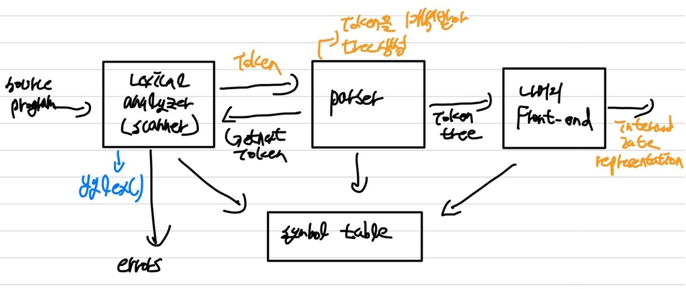   
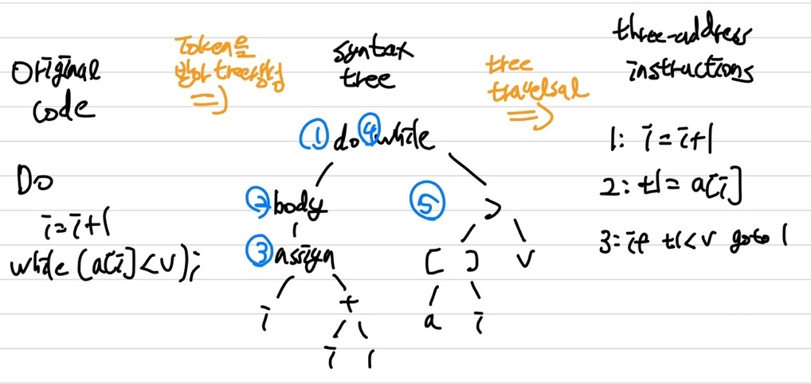   
① Syntax Check(문법 기반으로) -> syntax error를 확인   
&nbsp;&nbsp;&nbsp;&nbsp;Grammar = {∑(terminal), N(non-terminal), S(symbol), Production Rule}   
&nbsp;&nbsp;&nbsp;&nbsp;Grammar G를 통해 맞는 문법인지 빠르게 확인   
② Semantic Actions(type checking) -> 구조는 맞지만, type이 안맞는 경우   
&nbsp;&nbsp;&nbsp;&nbsp;&nbsp;따라서 의미가 맞는지 확인(next로 intermediate 언어를 생성하기 때문, intermediate언어 = syntax-directed translation)     
③ Derivation : Tree를 만드는 과정   

### Context-Free Grammar

**Regular Expression을 통해서는 모든 언어를 표현할 수 없기 때문**   
{(), (()), (((()))), ...}(괄호가 열린만큼 닫혀야 함) 이나 {01, 001, 0001, 0000001}(1을 다양하게 표현) 등은 RE로 처리 불가   
**Regular Language ⊂ Context-Free Grammar**   
### Parse Tree

Derivation을 Graph로 나타낸 것   
Parse Tree 생성법   

```python
start with starting symbol(root of the tree);
for each sentential form in the RHS of production rule(CFG);
    - add children nodes(RHS에 있는 것들) to the node corresponding to the LHS symbol.

The leaves of the tree (read from left to right) constitute a sentential form(fringe, or yield, or frontier, or ...)
```

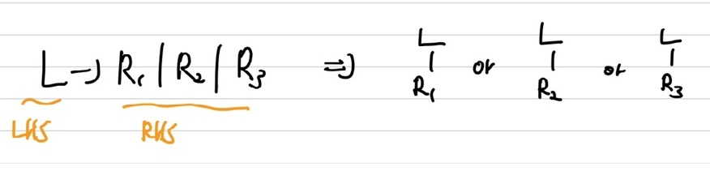   
example)   
9 - 5 + 2 ?   
1 : list -> list + digit   
2 : list -> list - digit   
3 : list -> digit   
4 : digit -> [0, 9]   
**non-terminal = {list, digit}, terminal : ∑ = {+, -, [0, 9]} start symbol = list,  Production Rule = 1,2,3,4**   
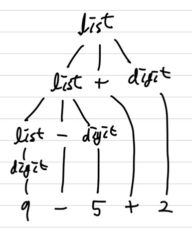      
<span style='color:red'>Parse Tree result = Derivation Result </span>   

### Syntax Error Handling

① lexical errors : id, keyword, operators의 missspelling(token 생성 불가), lex가 error 판단 후 parser에게 넘겨줘 parser가 error 판단, <span style='color:blue'>Parser가 error Report</span>    
② syntax errors : 문법구조가 이상한 경우( ex) if then, ...), parser tree 생성 X, <span style='color:blue'>Parser가 error Report</span>   
③ semantic errors : type mismatch시, **auto type casting**을 통해 <span style='color:blue'>**warning** </span>표시   
④ Logical errors : no error, programmer가 변경해야 함, Code 문제(ex) =을 ==로 작성했을 경우)   
**Parser는 LL 또는 LR 방법 중에서 골라서 Error을 수정**   
### Error Recovery Strategy

빠르게 처리해야하니 간단해야 함   
① Panic mode   
② Phrase level   
③ error Productions   
④ global correction   
## CONTEXT-FREE GRAMMAR(CFG)

<span style='color:red'>**Parser의 문법**</span>   

- Terminals : token   
  lex와 다르게 term이 token   
  a, b, c, ...∈ T   
  ex) 0, 1, id, +
- Nonterminals : syntax Variable(변수)   
  A, B, C, ... ∈ N   
  ex) expr, term, stmt
- Start Symbol : non-terminal
- Productions : terminal과 non-terminal의 조합   
  Leftside(head) -> (::=) rightside(body)   
  ex) stmt -> if (expr) stmt else stmt : left의 stmt는 non-terminal, 우측은 terminal과 non-terminal의 조합   
  re와 다름

### Derivations in CFG

α Α β -> α γ β : Α는 non-terminal   
Α -> γ 의 Production Rule이 존재해야 진행 가능   
leftmost : ->lm, 좌측 끝의 non-terminal부터 변경 ex) lm <u>list</u>    
rightmost : ->rm, 우측 끝의 non-terminal부터 변경 ex) rm list -> <u>digit</u>   
example)   
<span style='color:orange'>leftmost</span>   
<u>list</u>   
->lm <u>list</u> + digit    
->lm <u>digit</u> + digit   
->lm 9 + <u>digit</u>   
->lm 9 + 5    
<span style='color:orange'>rightmost</span>   
E   
->rm E + <u>E</u>   
->rm E + <u>digit</u>   
->rm <u>E</u> + 5   
->rm 9 + 5   

### Derivation(Example)

Grammar G = ( {E}(non-terminal), { +, *, (, ), **-**, **id** }(terminal), P(Production Rule), E(Start Symbol) )   
Production P  
P = E -> E + E   
&nbsp;&nbsp;&nbsp;&nbsp;&nbsp; E -> E * E   
&nbsp;&nbsp;&nbsp;&nbsp;&nbsp; E -> ( E )    
&nbsp;&nbsp;&nbsp;&nbsp;&nbsp; E -> **-** E   
&nbsp;&nbsp;&nbsp;&nbsp;&nbsp; E -> **id**   
E -> - E -> - **id**   
E ->rm E + E ->rm E + **id** ->rm **id** + **id**   
example)    
<span style='color:blue'>**-(id + id)**</span>   
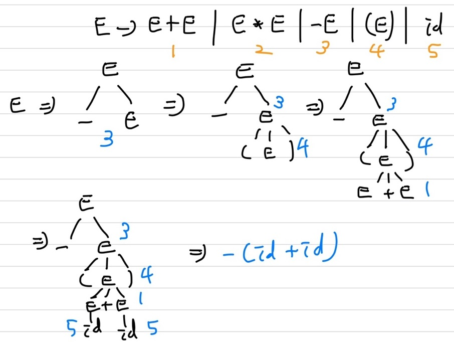   

### Ambiguity   

**Production Rule의 순서차이 때문에 발생**   
여러가지로 해석되어 다른 결과가 도출될 수 있음   
<span style='color:red'>모호하지 않은 문법으로 변경하여 해결 가능</span>   
example)    
case A, B 모두 같은 5 + 2 * 3, leftmost   
<span style='color:blue'>(A)</span>   
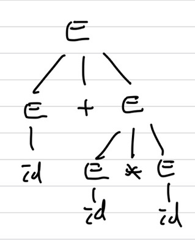   
(A)의 경우 우선적으로 id * id을 수행하니 2*3인 6의 결과를 얻은 후 id + id를 통해 6 + 5인 11의 결과를 도출   
<span style='color:blue'>(B)</span>   
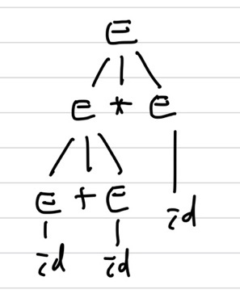   
(B)의 경우 우선적으로 id + id를 수행하니 5 + 2인 7의 결과를 얻은 후 id * id를 통해 7 * 3인 21의 결과를 도출    
<span style='color:red'>**Tree의 구조를 따라가며 action을 취하기 때문에 2개의 결과가 도출(Ambiguity)**</span>   

### Grammar Ambiguity

**주어진 같은 문법에 의해 2개 이상의 tree가 생성될시**   
<span style='color:red'>**단, lm(leftmost)와 rm(rightmost)로 생성된 Tree는 ambiguity하지 않음**</span>   
ex)   
Stmt -> <u>if</u> Expr <u>then</u> Stmt   
&nbsp;&nbsp;&nbsp;&nbsp;&nbsp;&nbsp;&nbsp;&nbsp;&nbsp; |  <u>if</u> Expr <u>then</u> Stmt <u>else</u> Stmt   
&nbsp;&nbsp;&nbsp;&nbsp;&nbsp;&nbsp;&nbsp;&nbsp;&nbsp; | ... other stmts....

example)   
<span style='color:orange'>if E1 then if E2 then S1 else S2</span>   
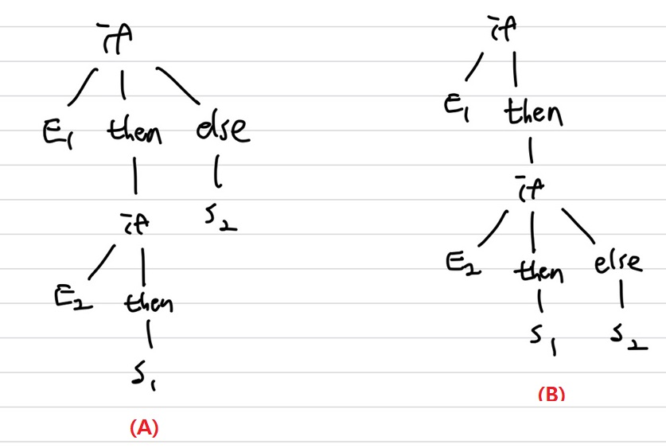   
(A), (B)로 tree가 생성될 수 있기 때문에 ambiguity함, 따라서 ambiguity를 제거하기 위해 문법 **rewrite**가 필요   

#### Eliminating Ambiguity(Rewrite Grammar)

matched_stmt -> **if** Expr **then** matched_stmt **else** matched_stmt   
&nbsp;&nbsp;&nbsp;&nbsp;&nbsp;&nbsp;&nbsp;&nbsp;&nbsp;&nbsp;&nbsp;&nbsp;&nbsp;&nbsp;&nbsp;&nbsp;&nbsp;&nbsp;&nbsp;| **Other**   
 open_stmt -> **if** Expr **then** Stmt   
&nbsp;&nbsp;&nbsp;&nbsp;&nbsp;&nbsp;&nbsp;&nbsp;&nbsp;&nbsp;&nbsp;&nbsp;&nbsp;&nbsp;&nbsp;&nbsp; | **if** Expr **then** matched_stmt **else** open_stmt   
Stmt -> matched_stmt | open_stmt   

### Left Recursion

**Top down일 때 문제가 발생할 수 있음 -> Rewrite 필요**   
example)   
leftrecursion : <span style='color:orange'>A -> A + α | β</span>     
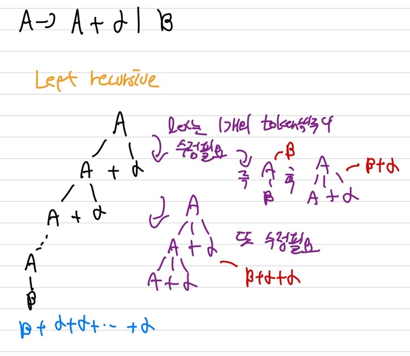   
rightrecursion   
<span style='color:orange'>A -> βR</span>   
<span style='color:orange'>R -> +αR | ε</span>   
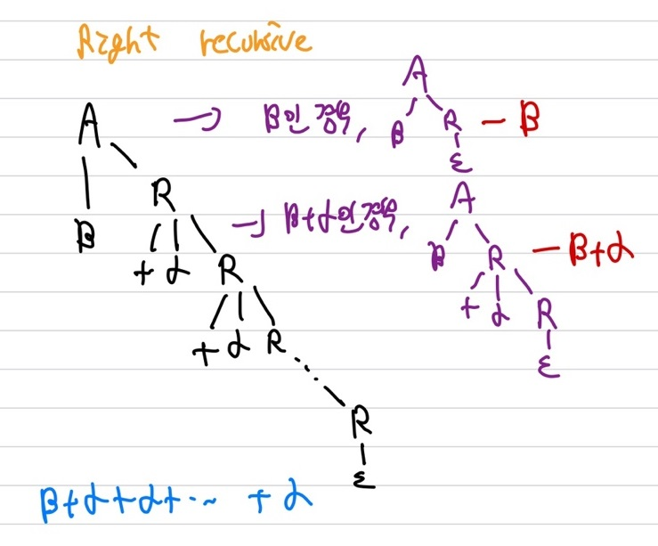   
Top down에서는 Left Recursive보다 Right Recursive가 더 좋음   

### Trun Left Recursion into Right Recursion

<span style='color:red'>**공통이 아닌 것을 그냥 쓰고 공통인 것은 A'으로**</span>
leftrecursion : A -> Aα1 | Aα2 | Aα3 | ... | Aαn | β1 | β2 | β3 | ... | βn   
right recursion   
A -> β1A' | β2A' | ... | βnA'   
A' -> α1A' | α2A' | ... αnA' | ε   

### Top-down

① Pre-order과 ② Post-order은 Top-down 방식   
start(root)에서 left까지 순서대로 matching   
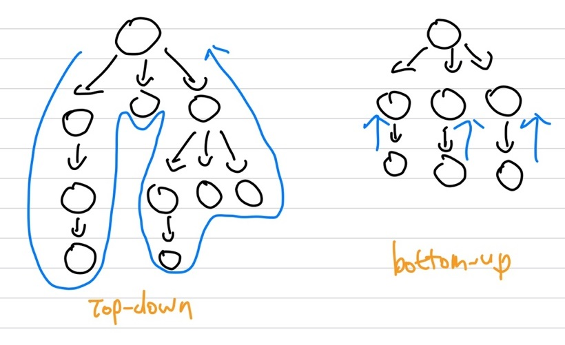
