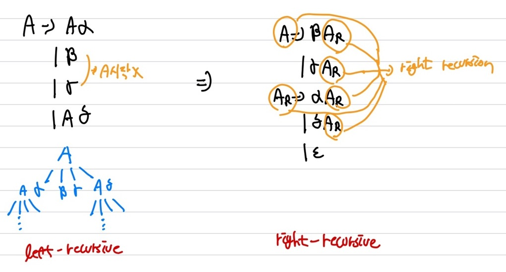
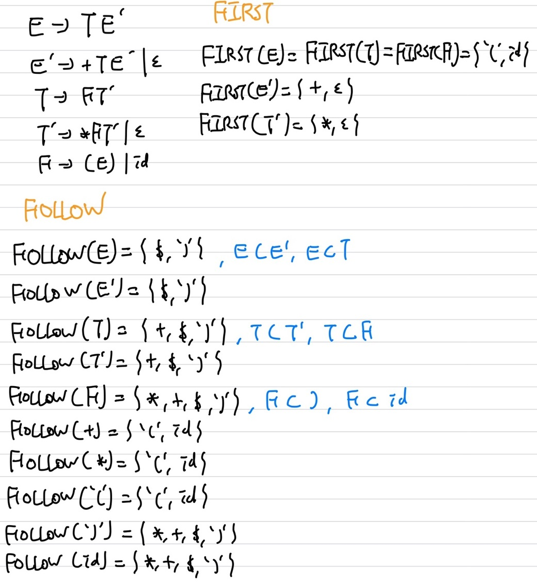
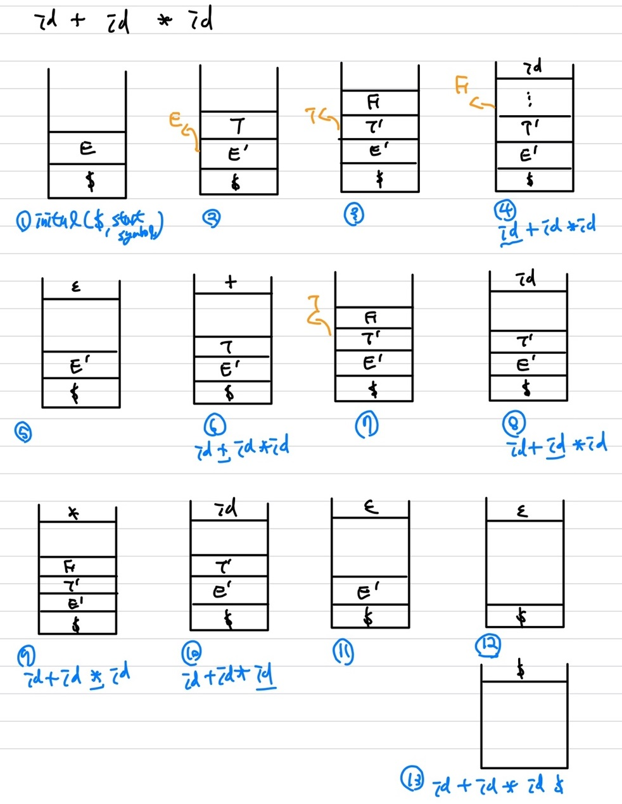

# Syntax Analysis(Parser)

## Top-down Parsing

Algorithm   
```python
1. root node(start symbol) 생성
2. labeled된 node A에 lhs(left hand side)나 rhs(right hand side) production rule을 적용해 확장, A->...
3. terminal이 fringe에 들어왔을 때, symbol과 matching 안된다면 다시 backtrack, 이때 terminal에선 멈추고, non-terminal인 경우 계속 진행
4. 다음 노드로 확장
5. terminal까지 진행, tree 생성 완성
```

### Recursive-Descent Parsing( = LL(0) )

Pseudo Code

```python
'''non-terminal pseudo code'''
void A(){
    Choose an A-production, A -> X1X2...Xk;
    for(i=1 to k){
        if(Xi is a non-terminal)
        	call procedure Xi();
        else if(Xi equals the current input symbol a)
        	advance the input to the next symbol;
        else # an error has occured;
        	# terminal인데 input symbol과 매칭이 안된 경우,
        	# ①없는 symbol(error) ② 다른 production rule로 check
    }
}
```

<span style='color:red'>**1개씩 넣어 확인하는 Parsing 방법**</span>    
여러개의 production rule일 때, 비효율적 &rarr; <span style='color:red'>predictive parsing</span>으로 해결 가능    
(A의 production이 없을 때, error을 handle하니 비효율적 &rarr; 해결 : <span style='color:red'>Predictive Parsing( LL(1) )</span>)   
Non-terminal이 들어올시 위의 Non-terminal 함수를 계속 call   
만약, A &rarr; X<sub>1</sub> | X<sub>2</sub> | X<sub>3</sub> | ... 많은 rule이 있을 때, <span style='color:red'>backtracking</span>이 많이 발생할 수 있음    
example 1)   
    ex1.jpg)
example 2)   
Grammar $G = ({E}, {+, *, (, ), -, id }, P, E)$   
 ex2.jpg)

### Left Factoring

Production Rule을 좀 더 효율적으로 선택   
**공통 문자 묶기**   

#### Replace Production Rule
$A$ &rarr; $\alpha \beta_1$ |  $\alpha \beta_2$ |  $\alpha \beta_3$ | ... |  $\alpha \beta_n$ | $\gamma$   
<span style='color:orange'>의 Production Rule을 변경(Left Factoring) &rarr; **Left Recursion 제거**</span>    
$A$ &rarr; $\alpha A_R$ | $\gamma$   
$A_R$ &rarr; $\beta_1$ | $\beta_2$ | ... | $\beta_n$   

#### Immediate Left-Recursion Elimination

   
① left-recursion과 상관없는 것들을 앞에 둠   
② right-recursion을 그 뒤에 넣음   

#### Eliminating left recursion

<span style='color:red'>**① No Cycles   
② $\epsilon$-production 제거   
③ immediate left-recursion 사용**</span>  
Algorithm)

```python
'''
	cycle : A -> Bα
	        B -> cB
		    c -> αA
'''
Input : Grammar G with no cycles or ε-productions
Arrange the nonterminals in some order A1, A2, ..., An
for i=1, ..., n do
	for j=1, ..., i-1 do
    	replace each
        	Ai -> Ajγ
        with
        	Ai -> δ1γ | δ2γ | ... | δkγ
        where
        	Aj -> δ1 | δ2 | ... | δk
        enddo
        eliminate the immediate left recurrsion in Ai
enddo
```

<span style='color:red'>**example)**</span>  
A &rarr; BC | a   
B &rarr; CA | Ab   
C &rarr; AB | CC | a   

<span style='color:orange'>i=1</span>,   
nothing   

<span style='color:orange'>i=2(B), j=1(A),</span>   
B &rarr; CA | <u>A</u>b   
B &rarr; CA | <u>BC</u>b | <u>a</u>b   
<span style='color:blue'>(imm)</span>,   
B &rarr; CAB' | abB'   
B' &rarr; CbB' | $\epsilon$   

<span style='color:orange'>i=3(C), j=1(A)</span>,   
C &rarr; <u>A</u>B | CC | a   
C &rarr; BCB | aB | CC | a   

<span style='color:orange'>i=3(C), j=2(B) </span>,   
C &rarr; <u>B</u>CB | aB | CC | a   
C &rarr; <u>C</u>AB'CB | abB'CB | aB | <u>C</u>C | a   
<span style='color:blue'>(imm)</span>,   
C &rarr; abB'CBC' | aBC' | aC'   
C' &rarr; AB'CBC' | CC' | $\epsilon$   

<span style='color:red'>**example 2)**</span>    
Grammar $G = ({E}, {+, *, (, ), -, id }, P, E)$   
<span style='color:orange'>Producion rule</span>    
E &rarr; E + T | T   
T &rarr; T * F | F    
F &rarr; ( E ) | id    

T &rarr; <u>T</u> * F | F   
<span style='color:blue'>(imm)</span>,    
T &rarr; FT'   
T' &rarr; *FT' | $\epsilon$

E &rarr; <u>E</u> + T | T    
<span style='color:blue'>(imm)</span>,   
E &rarr; TE'   
E' &rarr; +TE' | $\epsilon$   

<span style='color:red'>result</span>   
Grammar $G = ({E, E', T, T', F}, {+, *, (, ), -, id }, P, E)$   
E &rarr; TE'   
E' &rarr; +TE' | $\epsilon$    
T &rarr; FT'   
T' &rarr; *FT' | $\epsilon$   
F &rarr; ( E ) | id    

<span style='color:red'>**example 3)**</span>      
S &rarr; <u>S</u>X | <u>S</u>Sb | XS | a   
X &rarr; <u>X</u>b | Sa | b   

S &rarr; XS S' | aS'   
S' &rarr; X S' | Sb S' | $\epsilon$   
X &rarr; <u>X</u>b | <u>X</u>S S'a | aS'a | b   
X &rarr; aS'aX' | bX'    
X' &rarr; bX' | SS'aX' | $\epsilon$    
### Predictive Parsing( = LL(1) )

Top-down parsing의 일종   
<span style='color:red'>**어떤 2개의 Production Rule에서 옳은거 고르기**</span>   
&rarr; A &rarr; a | b 에서 알맞은 거 선택(A &rarr; a or A &rarr; b)    
<span style='color:red'>**① left recursion 제거 ② left factor ③ FIRST, FOLLOW 계산**</span>   

#### FIRST

제일 처음 나오는 terminal   
① terminal의 FIRST는 자기 자신   
② $\epsilon$의 FIRST는 자기 자신   
③ FIRST(A)의 경우, A &rarr; 후 바로 처음나오는 terminal의 집합   
④ FIRST(A)는 A &rarr; B의 경우 FIRST(B)와 동일

Algorithm   
$FIRST(\alpha) = \\{the\;set\;of\;terminals\; that\; begin\; all\; strings\; derived\; from\;  \alpha\\}$   
$FIRST(a) = \\{a\\}$   
$FIRST(\epsilon) = \\{\epsilon\\}$   
FIRST(A) = U<sub>A&rarr;α</sub>  FIRST(α)   
$FIRST(X_1X_2...X_k) = $   
$if \;for \;all \;j=1, ..., i-1 : \epsilon \in FIRST(X_j) \;then $   
$\quad\quad add\; non-\epsilon \; in FIRST(X_i)\; to \;FIRST(X_1X_2...X_k)$    
$if \;for \;all \;j=1, ..., k : \epsilon \in FIRST(X_j) \;then $   
$\quad\quad add\; \epsilon \; to\;FIRST(X_1X_2...X_k)$    

#### FOLLOW

① 가장 끝이 non-terminal일 경우, 그때의 lefthandside는 non-terminal의 부분집합   
② 전체에서 FOLLOW(A)는 A다음으로 오는 FIRST를 구함    
③ 가장 끝이 non-terminal일 경우, 그리고 그 non-terminal의 FIRST가 $\epsilon$을 포함한다면 전체에서 그 non-terminal에 $\epsilon$을 넣고 ①,②을 다시 진행    
④ start는 $을 포함   

example)    
   
F &rarr; ( E ) | id 의 경우, E 다음에 ')'가 오니 FOLLOW(E)에 속함   
FOLLOW(T)는 E' &rarr; +TE' | $\epsilon$ 에서 E'의 FIRST에서 $\epsilon$을 뺀 것   
E &rarr; TE'에서 E'은 $\epsilon$이 될 수도 있으니, E &rarr; T가 가능, FOLLOW(E)는 FOLLOW(T)의 부분집합   
T' &rarr; *FT' | $\epsilon$에서 FIRST(T') - $\epsilon$이 포함   
T &rarr; FT'에서 T'은 $\epsilon$이 될 수 있으니, T &rarr; F가 가능, FOLLOW(T)는 FOLLOW(F)의 부분집합   

### LL(1) Grammar

LL = Left to right Left most-derivation   
1개의 lookahead   
No left-recursion   
No ambiguous   
$\epsilon$ - free grammar로 대체 사용 가능   
ex)   
S &rarr; aS | a를   
S &rarr; aS'   
S' &rarr; aS' | $\epsilon$으로 변경    
여기서 <span style='color:red'>**FIRST(aS')와 FIRST(a)의 교집합이 없어야 LL(1) parser가 가능**</span>   
**stack 사용(현재까지의 상태를 저장하는 용)**   
### Predictive Parsing Table

 Algorithm   
```python
Input : Grammar G
Output : Parsing table M
Method : 
    1. ∀ productions A → α:
      (a) ∀a ∈ FIRST(α), add A → α to M[A, a]
      (b) If ε ∈ FIRST(α):
            i. ∀b ∈ FOLLOW(A), add A → α to M[A, b]
            ii. If $ ∈ FOLLOW(A) then add A → α to M[A, $]
    2. Set each undefined entry of M to error
If ∃M[A, a] with multiple entries then grammar is not LL(1).
```

① FIRST(non-terminal)에 있는 것들 중에 $\epsilon$을 제외한 production rule을 넣음(non-terminal = left hand)   
② $\epsilon$이 있는 non-terminal에 FOLLOW를 취한 것들을 넣음   
example)   
E &rarr; TE'   
E' &rarr; +TE' | $\epsilon$   
T &rarr; FT'   
T' &rarr; *FT' | $\epsilon$    
F &rarr; ( E ) | id   

| Non-terminal |      id      |          +          |       *        |                     (                      |          )           |          $           |
| :----------: | :----------: | :-----------------: | :------------: | :----------------------------------------: | :------------------: | :------------------: |
|      E       | E &rarr; TE' |                     |                | &nbsp;&nbsp;&nbsp;&nbsp;&nbsp;E &rarr; TE' |                      |                      |
|      E'      |              |   E' &rarr; +TE'    |                |                                            | E' &rarr; $\epsilon$ | E' &rarr; $\epsilon$ |
|      T       | T &rarr; FT' |                     |                |                T &rarr; FT'                |                      |                      |
|      T'      |              | T &rarr; $\epsilon$ | T' &rarr; *FT' |                                            | T' &rarr; $\epsilon$ | T' &rarr; $\epsilon$ |
|      F       | F &rarr; id  |                     |                |               F &rarr; ( E )               |                      |                      |

 stack(역순으로 삽입)  


### Error Recovery

<span style='color:red'>**production rule이 없는 table을 가르키는 경우**</span>   

1. Panic-mode recovery   
   이전의 input은 버리고 새로운 구역명이(i, ws)같은 것이 나온 후 부터 새롭게 시작(복구포인트부터 다시 시작)   
   simple   
   상당한 양의 토큰을 버림   
   FOLLOW기반으로 error를 맞춰봄
2. Phrase level recovery   
   비슷한 것을 토대로 예측(스스로 recovery를 수행)    
   문자의 prefix를 보고 다음 문자를 예측하여 제시   
   실제 error가 아닐 수도 있음   
   다양한 error에 대해 다룸   
   추론하여 recovery를 진행(자동으로 진행)
3. Error production   
   Production rule을 넣어서 처리 해봄(error를 처리할 수 있는 production rule(프로그래머가 직접 명시, error message를 띄움))   
   까다로움
