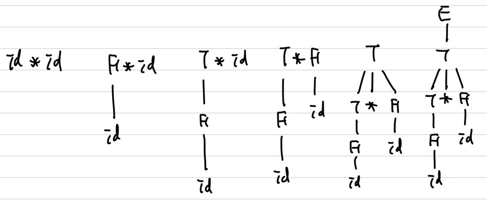
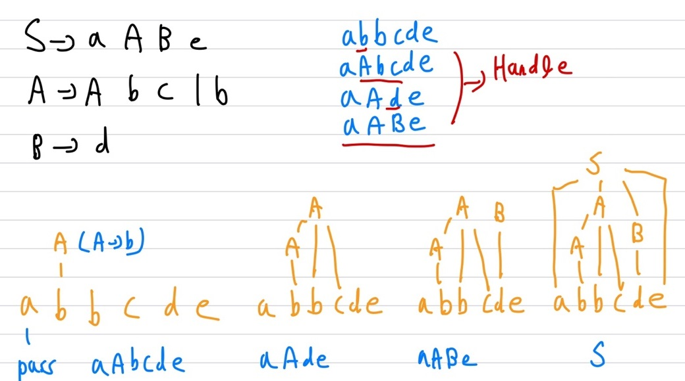
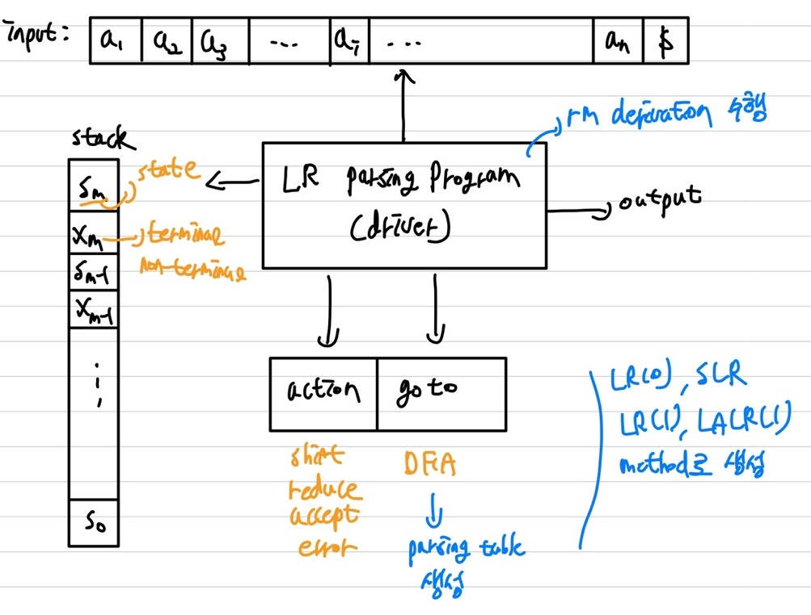

# Syntax Analysis(Parser)

## BOTTOM-UP Parsing

입력의 terminal을 보고 거꾸로 tree 생성, <span style='color:red'>start symbol</span>까지 생성   
leaf node에서 부터 root로 역으로 진행   
<span style='color:red'>**Right Most Derivation(RM)**</span>을 역순으로 진행   
<span style='color:red'>**LR(Left to right scanning Right most derivation)**</span>   
<span style='color:red'>**Reduction**</span> : derivation의 반대, 즉, start symbol까지 거꾸로 진행   
ex)   
RM derivation : E &rarr; T &rarr; T * F &rarr; T * id &rarr; F * id &rarr; id * id   
RM의 역으로 진행   


### Handle

<span style='color:blue'>Reduction의 과정</span>   
S &rarr; $*_{rm} \alpha Aw &rarr;  rm \; \alpha \beta w$ 이때, $A &rarr; \beta$의 존재가 필요  
$\alpha$는 $\alpha \beta w$의 **Handle**   
example)   

| **Right Form** | **Handle** |  **Reducing**  |
| :------------: | :--------: | :------------: |
| $id_1 * id_2$  |   $id_1$   |  F &rarr; id   |
|   F * $id_2$   |     F      |   T &rarr; F   |
|   T * $id_2$   |   $id_2$   |  F &rarr; id   |
|     T * F      |   T * F    | T &rarr; T * F |
|       T        |     T      |   E &rarr; T   |

<span style='color:red'>**&uarr; : Derivation**</span>   
<span style='color:red'>**&darr; : Reduction**</span>     
<span style='color:blue'>**Handle : reduction을 하기위한 symbol(대상 symbol)**</span>    
<span style='color:blue'>**Reducing : symbol을 만들 수 있는 production rule을 찾음**</span>     
<span style='color:blue'>**이때까지의 과정을 저장하기 위해 stack이 필요**</span>     

Right Most Derivation : $ S = \gamma_0 &rarr; \gamma_1 &rarr; ... &rarr; \gamma_n \; = \; w$    
Algorithm

```c++
for i = n downto 1
    1. find the handle Ai → Bi in ri
    2. replace Bi with Ai to generate ri-1
```

Bottom-up Parsing example)   


### Shift-Reduce Parsing( LR(0) )

<span style='color:blue'>**Handle을 잘찾는 방법**</span>   
이미 처리한 것들을 저장하기 위한 **stack**이 필요   

```python
1. initialize stack with $
2. Repeat until the top of the stack is the goal symbol(start symbol) and the input token is $ → top이 start symbol일 때까지 handle 처리
	a) find the handle
      if we don't have a handle on top of the stack, shift an input wymbol onto the stack
    b) prune the handle(=reduction)
    if we have a handle A → B on the stack, reduce
       i) pop B symbols off the stack
       ii) push A onto the stack
```

#### Shift-Reduce parser Actions

1. shift : 해당 위치의 input을 stack에 넣은 후 ,shift
2. reduce : top을 pop 후, handle을 적용 후 다시 push
3. accept : goal symbol에 도달
4. error : error recovery routine을 call


#### example   
$id_1 * id_2$   
E &rarr; E + T | T   
T &rarr; T * F | F   
F &rarr; ( E ) | id   

|        Stack         |               Input               |                            Action                            |
| :------------------: | :-------------------------------: | :----------------------------------------------------------: |
|          $           | id<sub>1</sub> * id<sub>2</sub> $ |                       shift (and push)                       |
|   $ id<sub>1</sub>   |        * id<sub>2</sub> $         |                    Reduce by F &rarr; id                     |
|         $ F          |        * id<sub>2</sub> $         |                     Reduce by T &rarr; F                     |
|         $ T          |        * id<sub>2</sub> $         |                       shift (and push)                       |
|        $ T *         |         id<sub>2</sub> $          |                       shift (and push)                       |
| $ T * id<sub>2</sub> |                 $                 |                    Reduce by F &rarr; id                     |
|       $ T * F        |                 $                 |                   Reduce by T &rarr; T * F                   |
|         $ T          |                 $                 |                     Reduce by E &rarr; T                     |
|         $ E          |                 $                 | accept (<span style='color:red'>goal symbol = start symbol</span>) |

#### Conflicts

할 수 있는 행동이 여러개일 때, 어떤 행동을 선택하느냐   
shift / reduce conflict : shift와 reduce 모두 가능할 때, e.g. If then if then else   
reduce/ reduce : 어떤 reduce를 할지, e.g. if(id)   
해결법 : **LOOKAHEAD**   
LR(k) : k lookahead symbol을 더 봄, k개의 lookahead를 이용   
보통 LR = LR(1)을 이용   
### SIMPLE LR( SLR )

<span style='color:red'>**LR(0)의 item set, FOLLOW 사용**</span>   
**Benefits**

1. 모든 CFG(Context-Free-Grammar)를 처리 가능
2. No backtracking
3. syntactic errors detect
4. LL(Left to right scanning Left most derivation) $\subset$ LR(Left to right scanning Right most derivation) : LL parser로 parsing 가능한 모든 언어 parsing 가능

<span style='color:blue'>**Parser를 만드는데 많은 노력이 필요**</span>   
action : ① shift ② reduce ③ accept ④ error   
#### LR Parser Model

   
#### LR Parsing(driver) Algorithm

Configuration( = LR parser state):   
($s_0X_1\;s_1X_1\;s_2X_2\;...\;X_ms_m : state,  \quad a_i\;a_{i+1}\;...\;a_n$ $ : input)

① $action[s_m, \; a_i]\;=\; shift\;s : push \; a_i, \; push \; s$   
&rarr; ($s_0X_1\;s_1X_1\;s_2X_2\;...\;X_ms_m\;a_is ,  \quad a_{i+1}\;...\;a_n$ $)    
&rarr; <span style='color:blue'> stack에 집어 넣기, 상태 s</span>   

② $action[s_m, \; a_i]\;=\; reduce\; A \; &rarr; \; \beta \;, \; goto[s_{m_r}, \;  A]\; = \; s, \; \gamma \; = \; \vert \beta \vert \;  (\beta 개수) \; : \;  pop \; 2\gamma, \; push \; A, \; push \; s$    
&rarr; <span style='color:blue'> goto를 통해 다음 상태를 s로 집어 넣음, production rule을 반대로 적용</span>

③  accept = stop

④ error = recovery   
&rarr; <span style='color:blue'> 정의가 안돼있는 경우</span>

#### LR Parser Table Example

<span style='color:blue'> id + id </span>   
goto : 상태를 바꿈   
1 : E &rarr; E + T   
2 : E &rarr; T   
3 : T &rarr; T * F   
4 : T &rarr; F   
5 : F &rarr; ( E )   
6 : F &rarr; id   

|           |                           action                            |                        action                         | action | action | action | action |                             goto                             | goto  | goto  |
| :-------: | :---------------------------------------------------------: | :---------------------------------------------------: | :----: | :----: | :----: | :----: | :----------------------------------------------------------: | :---: | :---: |
| **state** |                           **id**                            |                         **+**                         |   *    | **(**  | **)**  | **$**  |                            **E**                             | **T** | **F** |
|     0     |                             s5                              |                                                       |        |   s4   |        |        | 1 ( <span style='color:blue'> T + E를 E로 변경하니<br />state는 1로 </span>) |   2   |   3   |
|     1     |                                                             |                          s6                           |        |        |        | accept |                                                              |       |       |
|     2     |                                                             | r2 (<span style='color:blue'> reduction rule </span>) |   s7   |        |   r2   |   r2   |                                                              |       |       |
|     3     |                                                             |                          r4                           |   r4   |        |   r4   |   r4   |                                                              |       |       |
|     4     |                             s5                              |                                                       |        |   s4   |        |        |                              8                               |   2   |   3   |
|     5     |                                                             |                          r6                           |   r6   |        |   r6   |   r6   |                                                              |       |       |
|     6     | s5 (<span style='color:blue'> id를 넣고 5번 상태로 </span>) |                                                       |        |   s4   |        |        |                                                              |   9   |   3   |
|     7     |                             s5                              |                                                       |        |   s4   |        |        |                                                              |       |  10   |
|     8     |                                                             |                          s6                           |        |        |  s11   |        |                                                              |       |       |
|     9     |                                                             |                          r1                           |   s7   |        |   r1   |   r1   |                                                              |       |       |
|    10     |                                                             |                          r3                           |   r3   |        |   r3   |   r3   |                                                              |       |       |
|    11     |                                                             |                          r5                           |   r5   |        |   r5   |   r5   |                                                              |       |       |

#### LR Parsing Example

<span style='color:blue'> id + id </span>      
1 : E &rarr; E + T   
2 : E &rarr; T   
3 : T &rarr; T * F   
4 : T &rarr; F   
5 : F &rarr; ( E )   
6 : F &rarr; id   

|                            stack                             |     Input      |                       Action                       |
| :----------------------------------------------------------: | :------------: | :------------------------------------------------: |
| $ 0 (<span style='color:blue'> 0 : s5는 id push <br />후, 5번 state로 </span>) | id * id + id $ |                      shift 5                       |
| $ 0 id 5 (<span style='color:blue'> r6이니 id 와 5(terminal)를 pop(state)    <br />후, 0번 state에서 F로가는 F 와 3 을 push)</span> |  * id + id $   |                reduce 6 goto 3 (r6)                |
|                           $ 0 F 3                            |  * id + id $   |                reduce 4 goto 2 (r4)                |
|                           $ 0 T 2                            |  * id + id $   |                    shift 7 (s7)                    |
|                         $ 0 T 2 * 7                          |   id + id $    |                    shift 5 (s5)                    |
|                       $ 0 T 2 * 7 id 5                       |     + id $     | reduce 6 goto 10 (5번 상태에서 +를 가져 왔으니 r6) |
| $ 0 T 2 * 7 F 10 ( <span style='color:blue'> 10, 7, 2 pop, F, *, T pop <br />후, 0번에서 T로 가는 2번 state push </span> ) |     + id $     |                  reduce 3 goto 2                   |
|                           $ 0 T 2                            |     + id $     |                  reduce 2 goto 1                   |
|                           $ 0 E 1                            |     + id $     |                      shift 6                       |
|                         $ 0 E 1 + 6                          |      id $      |                      shift 5                       |
|                       $ 0 E 1 + 6 id 5                       |       $        |                  reduce 6 goto 3                   |
|                       $ 0 E 1 + 6 F 3                        |       $        |                  reduce 4 goto 9                   |
|                       $ 0 E 1 + 6 T 9                        |       $        |                  reduce 1 goto 1                   |
|                           $ 0 E 1                            |       $        |                       accept                       |


#### SLR Grammars

**LR(0)(Shift-reduce parsing)의 확장**   
A &rarr; $\alpha \; \cdot $ 인 경우, FOLLOW(A) 에 있는 symbol들을 다 A &rarr; $\alpha$로 reduction 수행   
ex)   
id + id의 경우    
1 : S &rarr; E   
2 : E &rarr; id + E   
3 : E &rarr; id   

|      |  id  |  +   |   $    |  E   |
| :--: | :--: | :--: | :----: | :--: |
|  0   |  s2  |      |        |      |
|  1   |      |      | accept |      |
|  2   |      |  s3  |   r3   |      |
|  3   |  s2  |      |        |  4   |
|  4   |      |      |   r2   |      |

r3 : FOLLOW(E) = { $ }   
#### SLR Parsing

LR(0)의 item set 사용   
$\cdot$(dot)으로 현재 처리하는 시점 표시   
$\cdot$(dot) 위치에 따라 다 다른 state    
LR(0) item set에 Closure operation으로 동등한 상태의 것들을 포함   
goto operation으로 Transition Diagram 생성   
SLR Parsing Table로 shift/reduce 결정   
A &rarr; $\epsilon$ = A &rarr; $\cdot$

#### SLR Parsing Table 생성

① S' &rarr; S 추가 (initial, production rule을 추가)   
② LR(0) item set = { $I_0,\; I_1,\; ... \; I-n$ } 생성   
③ if [ A &rarr; $\alpha \; \cdot \; a \beta $ ] $\in \; I_i$ , goto[$I_i$, a] = $I_j$ 일 때, [ i, a] = shift j 추가   
&rarr; A &rarr; $\alpha$까지는 처리 된 것   
④ if [ A &rarr; $\alpha \; \cdot$ ] 일 때, FOLLOW(A)에 속하는 것들을 [ i, a ]에 reduce A &rarr; $\alpha$ 추가 ( a $\in$ FOLLOW(A) )   
&rarr;   A &rarr; $\alpha$ : reduction( FOLLOW(A)에 있는 경우만 )  
⑤ [ S' &rarr; S $\cdot$ ], [ i, $ ] = accept   
⑥ goto[ $I_i$, A ] = $I_j$ 일 때, goto(i, A) = j 추가   
⑦  ③ ~ ⑥ 반복  

#### Closure Operation

① start closure(I) = I   
② [ A &rarr; $\alpha \; \cdot B \beta$ ] $\in$ Closure(I), B &rarr; $\gamma$라면, $\beta \; &rarr; \; \cdot \; \gamma$ 도 추가   
③ ②을 반복   
example)   
1 : E &rarr; E + T | T   
2 : T &rarr; T * F | F   
3 : F &rarr; ( E ) | id   
<span style='color:blue'>Closure( E' &rarr; $\cdot$ E)</span> = E ' &rarr; $\cdot$ E , E &rarr; $\cdot$ E + T, E &rarr; $\cdot$ T, T &rarr; $\cdot$ T * F, T &rarr; $\cdot$ F, F &rarr; $\cdot$ ( E ), F &rarr; $\cdot$ id   

<span style='color:orange'>**Variable Prefix는 SLR automata에서 다음으로 행해질 수 있는 것들**</span>   
<span style='color:orange'>**Variable Prefix는 top of the stack에 나올 수 있는 접두사**</span>   
<span style='color:orange'>**SLR Parsing은 Variable Prefix를 찾아내는 것**</span>   
<span style='color:orange'>: E &rarr; *<sub>rm</sub> F * id &rarr; <sub>rm</sub> ( E ) * id </span>