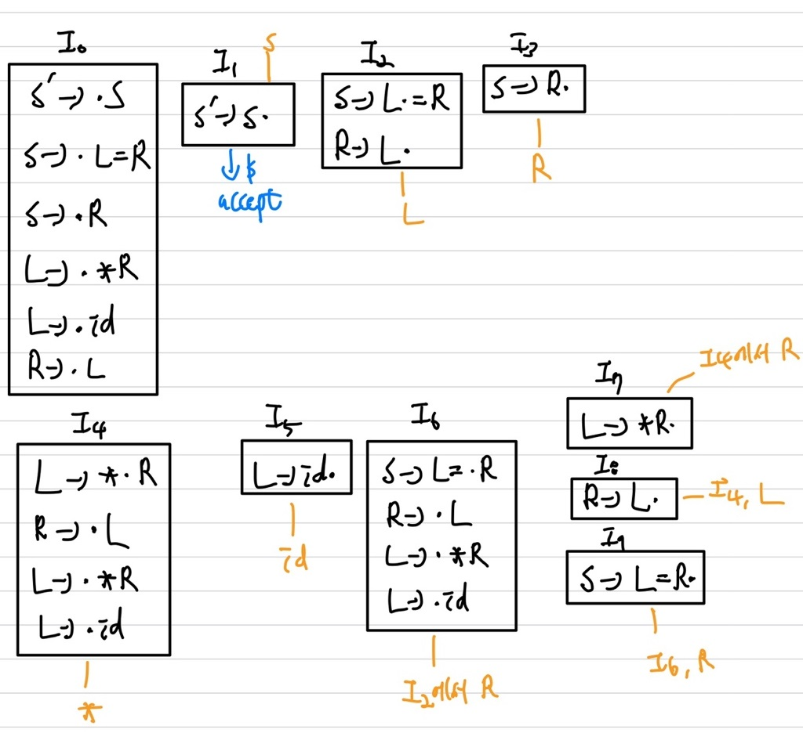

# Syntax Analysis(Parser)

## BOTTOM-UP Parsing

### SLR 한계점

**특정 상황에서 action을 shift를 해야할지, reduce를 해야할지 애매한 경우가 존재**   
**SLR은 item set을 구할 때, LR(0)를 사용하기 때문에 한계 발생**      
example) unambiguous grammar   
1 : S &rarr; L = R   
2 : S &rarr; R   
3 : L &rarr; * R   
4 : L &rarr; id   
5 : R &rarr; L   
   
I2에서 S &rarr; L $\cdot$ = R 인지, R &rarr; L $\cdot$ 인지 구별 불가   

### LR(1)

SLR parser의 확장   
LR(1)은 lookahead symbol을 이용해 SLR에 존재하던 문제점 해결   
**LR(1) item = LR(0) item + lookahead**   
item 수 : LR(0) < LR(1)   
ex)   
LR(0) item : [ A &rarr; $\alpha \; \cdot \; \beta$ ]   
LR(1) item : [ A &rarr; $\alpha \; \cdot \; \beta $, a] : a : next symbol, lookahead (input buffer에 존재)

#### Problem

[ A &rarr; $X \; \cdot \; Y \; Z $, a] : a 사용 X   
[ A &rarr; $X \; Y \; Z \; \cdot $, a] : a 사용   
[ A &rarr; $\alpha \; \cdot$, a], [ B &rarr; $\alpha \; \cdot$, b]와 같이 모호한 경우 다음 symbol을 확인하여 선택 가능   
**위의 경우 $\alpha$는 A나 B로 reduction이 될 수 있어 conflict가 발생할 수 있음 &rarr; lookahead가 a일경우 A, b일 경우 B로 선택**   
.jpg)

#### LR(1) items

**lookahead 1개를 포함해 item set을 생성하는 방법**   
[ A &rarr; $\alpha \; \cdot \; \beta$, a] : lookahead term을 포함하여 생성   
$\beta \; = \; \epsilon $ : [ A &rarr; $\alpha \; \cdot$, a] : a 사용   
$\beta \; \ne \; \epsilon $ : [ A &rarr; $\alpha \; \cdot$ \; \beta, a] : a 사용 X, $\beta$에 따라 작업 수행(lookahead 영향 X)   
#### LR(1) items Closure Operation

① Closure(I) = I 로 시작   
②  [ A &rarr; $\alpha \; \cdot \; B \; \beta$, a ] $\in$ Closure(I)이고 $\beta \; &rarr; \; \gamma$라면,   
b $\in$ FIRST($\beta$a) &rarr; [ B &rarr; $\cdot \; \gamma $, b ]  
③ ②을 새로운 items이 없을 때까지 반복   

#### LR(1) items Goto Operation

① [ A &rarr; $\alpha \; \cdot \; X \; \beta$, a ] $\in$ I이고, closure( { [ A &rarr; $\alpha \; X \; \cdot \; \beta$, a ] } )의 집합을 goto( I, X )을 추가   
② goto(I,X)에 더 이상 items을 추가할 수 없을 때까지 ①을 반복   
#### LR(1) items Construct

① 새로운 start symbol인 S'와 S' &rarr; S의 production을 추가   
② 첫번째 state인, C = Closure( { [ S' &rarr; $\cdot$ S, $ ] } )을 세팅(DFA의 start state)   
③ I $\in$ C와 goto( I, X ) $\notin$ C 와 goto( I, X ) $\ne \; \phi$와 같은 grammar symbol인 X $\in$ ( Non-terminal $\cub$ Terminal )에 대해 goto( I, X )을 C에 추가    
④ C에 더 이상 추가할 수 없을 때까지 ③을 반복    

#### LR(1) items example

**grammar**   
S &rarr; L = R   
S &rarr; R   
L &rarr; * R   
L &rarr; id   
R &rarr; L    
S' &rarr; S ( Augment start )

I0   
[ S' &rarr; $\cdot$ S, $ ] : start   
[ S &rarr; $\cdot$ L = R, $ ] : 아직 처리가 되지 않았으니   
[ S &rarr; $\cdot$ R, $ ] : 아직 처리가 되지 않았으니  
[ L &rarr; $\cdot$ * R, = ] :  FIRST( =R $) = '='  
[ L &rarr; $\cdot$ id, = ] :  FIRST( =R $) = '='   
[ R &rarr; $\cdot$ L, $ ] : R의 lookahead는 $이기 때문  
[ L &rarr; $\cdot$ * R, $ ] : R &rarr; L에서 L의 다음이 $이기 때문   
[ L &rarr; $\cdot$ id, $ ] : R &rarr; L에서 L의 다음이 $이기 때문   
#### LR(1) example
