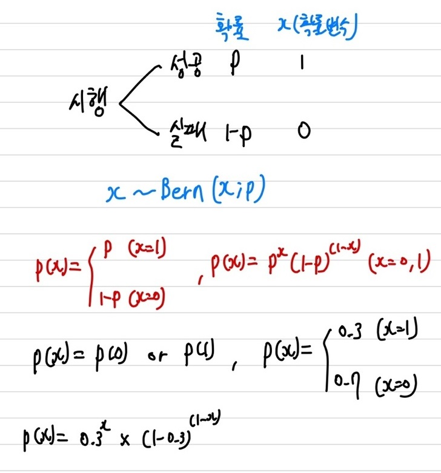
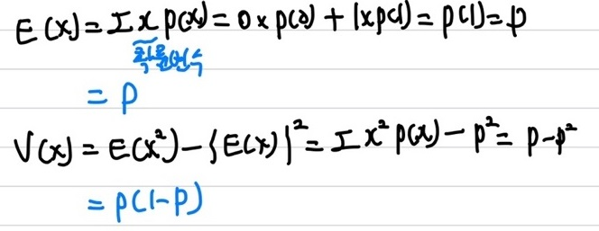
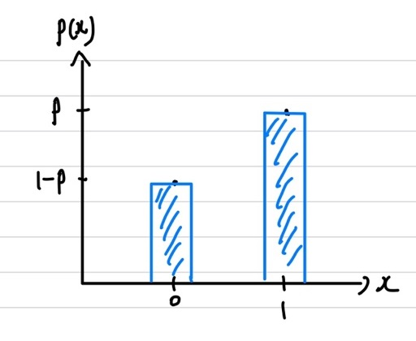
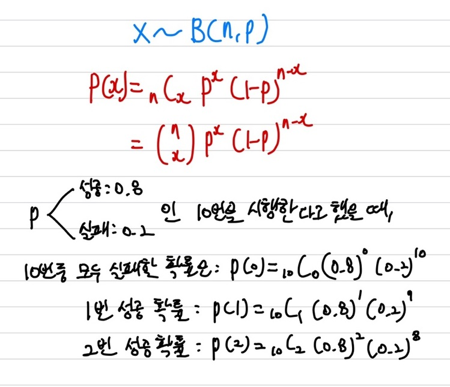
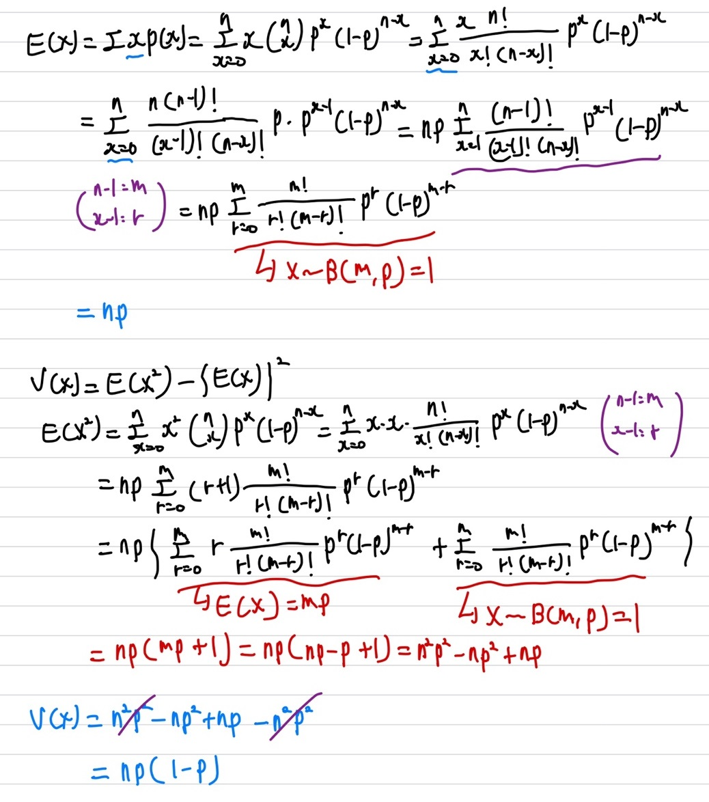

## 베르누이 분포

### 베르누이 시행

우선 베르누이 분포를 알아보기 전에, 베르누이 시행이 어떤 개념을 갖고 있는지 부터 알아야 한다.   
베르누이 시행이란 간단하게 말해, 어떤 사건에 대해 시행을 했을 때 결과가 두 가지 중 하나로만 나오는 시행을 일컫는다.   
즉, 어떤 시행에 대한 결과가 성공 or 실패, 특정 사건이 발생, 발생하지 않음으로 나타낼 수 있는 시행을 일컫는다.   
가장 기본적인 예로 들면, 동전을 던졌을 때, 앞면과 뒷면의 결과인 2가지 결과만 나타나는 것 또는 주사위를 던졌을 때, 숫자 2 또는 그 나머지가 나오는 시행을 모두 베르누이 시행이라 부른다.   

### 베르누이 확률 변수

베르누이의 시행 결과를 0 또는 1로 바꾼 것을 확률 변수라 한다. 베르누이 확률 변수는 0 또는 1 중 하나만 가질 수 있는 **이산확률변수**이다. 

### 베르누이 확률 질량 함수

### 통계량

### 그래프

PMF

## 이항 분포

이항 분포를 알기 전에는 베르누이 분포를 알아야 한다. 이항 분포는 베르누이 시행을 특정 횟수 N번을 시행했을 때에 대한 분포이기 때문이다.   
### 이항 분포 확률 변수

베르누이 분포에서의 확률 변수는 어떤 사건이 발생 했냐 안했냐라면, 이항 분포에서의 확률 변수는 그 사건이 N번 시행 중에 몇번 발생했냐에 대한 것이라고 생각하면 된다. 예를 들어, 농구 선수가 자유투를 던질 때, 자유투 성공 횟수 인 $x$가 확률 변수가 된다. 이 때 $x$라는 횟수 만큼 성공할 확률이 이항 분포의 확률이 된다.

### 이항 분포 확률 질량 함수

   
### 통계량

X~B(n, p)는 모든 확률에 대한 합이니, 확률의 합은 항상 1이 된다.    
여기서 이항 분포의 경우 확률 p는 그래프의 볼록한 위치에 영향을 주고, 시행 횟수 n은 볼록한 부분의 폭에 영향을 준다.

