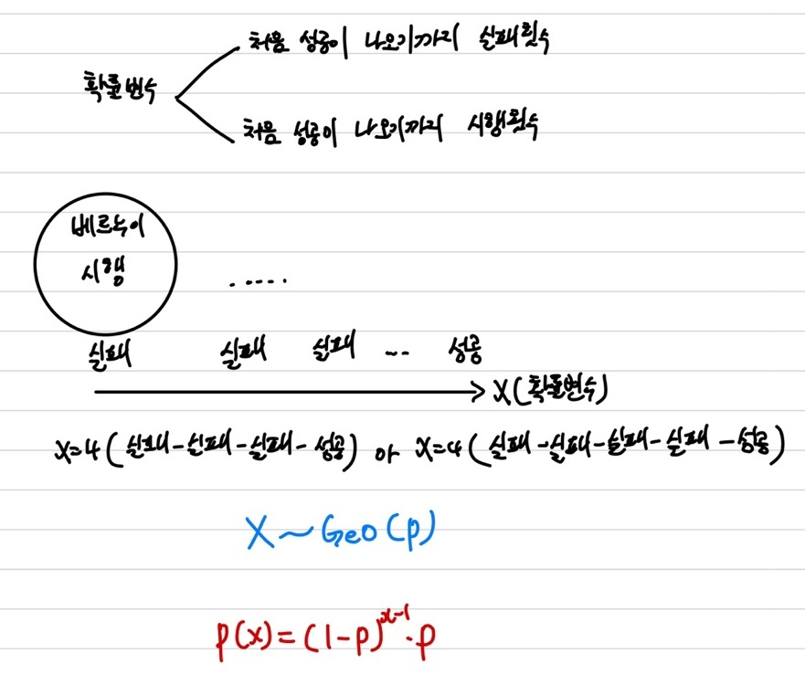
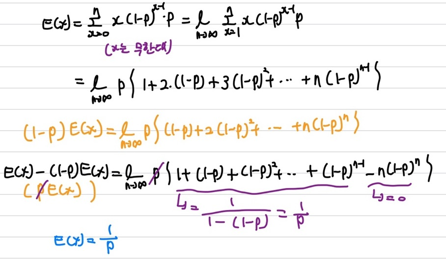
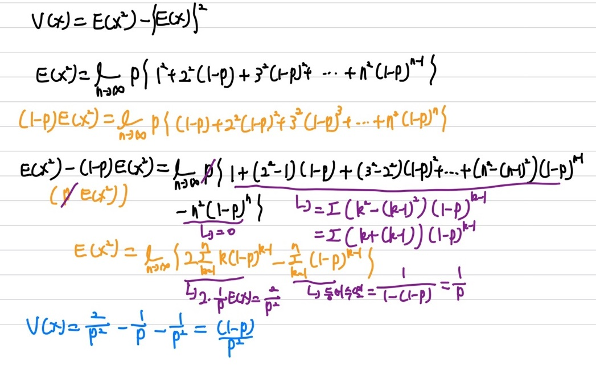

## 기하 분포

기하분포는 이산 확률 분포이며, **첫번째 성공이 일어날 때까지 시행하는 경우에 대한 시행(실패) 횟수 분포**이다.   
기하 분포는 이전에 다뤘던 베르누이 분포와 매우 밀접한 관련이 있다. 

### 기하 분포 확률 변수

확률 변수로는 크게 두가지로 생각할 수 있는데, 하나는 **처음 성공이 나오기까지 실패 횟수**, 또 다른 하나는 **처음 성공이 나오기까지의 시행 횟수**로 나타낼 수 있다.   
기하 분포는 이산 확률변수로 확률 질량 함수(pmf)로 표현하면 상기의 이미지에 보이는 $P(X)$로 나타낼 수 있다. 또한, 모수(parameter)로는 성공에 대한 확률을 나타내는 $p$이다. 여기서 $x$는 전체 시행 횟수(실패 + 성공)을 의미한다. $(1-p)^{x-1}$는 최초의 성공이 나오기 전까지에 대한 실패 횟수에 대한 확률을 나타내며, 마지막에 성공을 한 번하니 성공인 $p$를 곱해준 형식의 확률 질량 함수를 가진다.

### 통계량

우선 기댓값부터 확인을 해보면   

상기의 수식을 통해 기댓값을 유도할 수 있다. 우리가 흔히 알고 있는 $\sum_{x=0}^{n}xp(x)$의 기댓값 수식에 기하 분포의 확률 질량 함수인 $p(x)$를 넣어 수식을 전개하면 상기의 이미지와 동일하게 나타낼 수 있다. 무한 등비급수의 수식 계산 방법을 이용해 기댓값을 구할 수 있으며, $n(1-p)^n$은 n이 무한대로 갈 경우 0으로 수렴한다. 기하 분포의 기댓값은 $E(X)=\frac{1}{p}$이다.    
다음으로는 분산을 확인해 보겠다.   

분산은 우리가 흔히 알고 있는 기댓값을 이용해 구할 수 있다. $V(x)=E(X^2) - \{E(X)\}^2$의 식을 통해 분산을 구할 수 있다. 분산을 구하기 위해서는 우선 $E(X^2)$을 먼저 구해야하는데, $E(X^2)$을 구하는 방법은 상기의 이미지에 수식 전개를 통해 확인해 볼 수 있다. 여기서 $\sum_{x=1}^{n}x(1-p)^{x-1}p$는 기하 분포의 기댓값을 구하는 수식이며 여기에서 trick을 이용하여 $\frac{1}{p}$을 양변에 곱해주면 $\sum_{x=1}^{n}x(1-p)^{x-1}$에 대한 값을 구할 수 있다. 이를 이용해 기하 분포의 분산은 $V(X)=\frac{(1-p)}{p^2}$이다.
