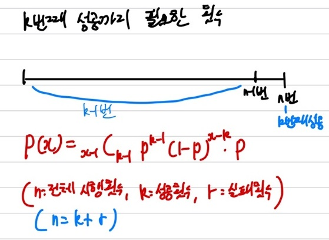
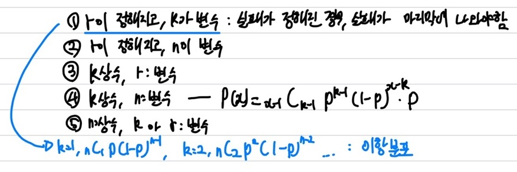
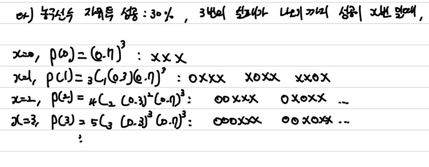
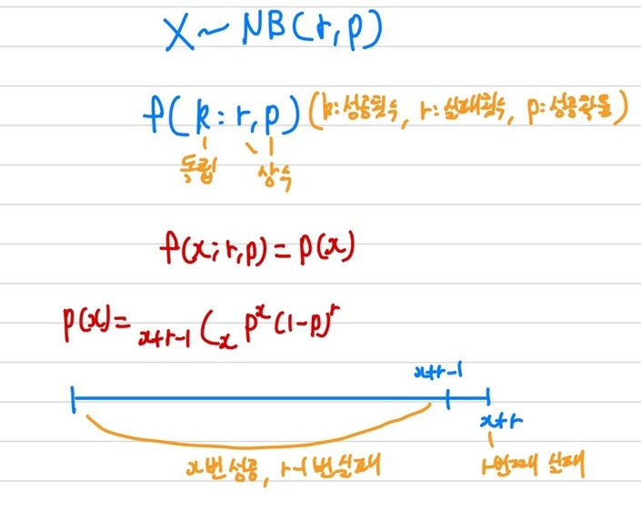
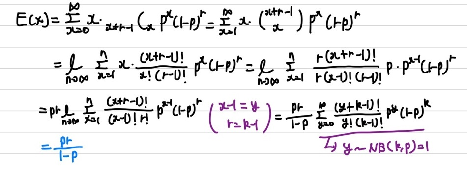
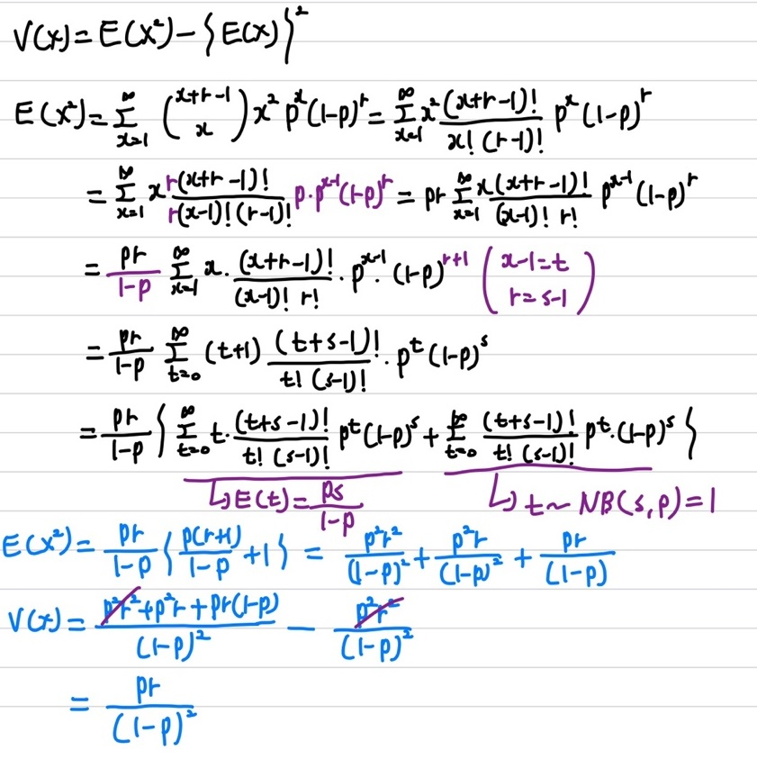

## 음이항 분포

음이항 분포는 **기하 분포의 확장**이라고 볼 수 있다. 기하 분포는 성공할 확률이 $p$인 베르누이 시행을 **1번**성공할 때까지 시행한다. 하지만, 음이항 분포는 베르누이 시행을 **r번** 성공할 때까지 시행하는 경우에 대한 시행(실패) 횟수의 분포이다.

### 음이항 분포 확률 변수

음이항 분포에 대한 가장 쉽게 이해할 수 있는 확률 변수는 상기의 이미지에 보이듯이 k번째 성공까지 필요한 횟수로 생각하면 된다. 총 n번 시행 중에 n번째에서 k번째 성공이 일어난다고 해보자. 그럼 그 이전 n-1번 시행 중에 k-1번의 성공이 일어났어야 하며, n-1-(k-1)번의 실패 횟수가 일어난다. 음이항 분포 또한 이산 확률 변수를 가지며, 확률 질량 함수(pmf)로 나타내면, 상기의 이미지처럼 $p(x)$로 나타낼 수 있다.    
   
여기서 좀 더 깊게 들어가 보자. 음이항 분포의 전체적인 개념은 위에서 설명했던 것처럼 개념을 잡아 보자. 사실 음이항 분포는 전체 5가지로 표현할 수 있다. 5가지 모두 같은 뜻이며, 어떤 모수(parameter)를 기준으로 잡냐에 차이이다.   
여기서는 실패 횟수는 정해져 있고, 성공 횟수에 따른 음이항 분포를 확인해 보겠다.   
하기의 이미지는 이해를 돕기위한 예시이다.   
   
성공에 대한 확률인 $p$는 주어져있고, 실패 횟수인 $r$도 주어진 상황이다. 이 경우, 성공을 몇번 하냐에 따라 값이 바뀐다. 하지만, 여기서 3번째 실패는 제일 마지막에 나와야하니, 이전에 설명했던 마지막 k번째 성공이 나오는 것을 반대로 생각하면 이해하기가 쉬워진다.    
위의 예시에 따른 음이항 분포를 재정의 하겠다.   
   

음이항 분포는 총 2개의 모수(parameter)인 실패 횟수인 $r$과, 성공 확률인 $p$가 필요하다.   
이전 개념을 뒤집어서 요약하자면, 총 x+r번 시행 중에 x번의 성공이 나올 횟수에 대한 분포이다. 그럼 x+r번째는 r번째 실패가 일어나야하며, 그 이전에는 r-1번의 실패와 x번의 성공이 일어나야 한다.   
이를 확률 질량 함수로 나타내면 성공인 $p$가 x번 나타나야하며, 실패인 $(1-p)$가 r번 발생하는데, 마지막에는 실패가 일어나며, 그 이전에는 성공인 x번과 실패인 r-1번에 대한 조합으로 표현하면 된다.  

### 통계량

우선 기댓값부터 확인을 해보면   

상기의 수식을 통해 기댓값을 유도할 수 있다. 우리가 흔히 알고 있는 $\sum_{x=0}^{n}xp(x)$의 기댓값 수식에 음이항 분포의 확률 질량 함수인 $p(x)$를 넣어 수식을 전개하면 상기의 이미지와 동일하게 나타낼 수 있다. 여기서 trick을 이용하면, 치환을 통해 기존에는 x에 대한 음이항 분포를, 치환한 y에 대한 음이항 분포로 변형하여 유도하는 방법이다. 음이항 분포의 기댓값은 $E(X)=\frac{pr}{(1-p)}$이다.   
다음으로는 분산을 확인해 보겠다.   

분산은 우리가 흔히 알고 있는 기댓값을 이용해 구할 수 있다. $V(x)=E(X^2) - \{E(X)\}^2$의 식을 통해 분산을 구할 수 있다. 분산을 구하기 위해서는 우선 $E(X^2)$을 먼저 구해야하는데, $E(X^2)$을 구하는 방법은 상기의 이미지에 수식 전개를 통해 확인해 볼 수 있다. 이전에 기댓값을 구할 때 사용한 치환 trick을 적용하여 t에대한 음이항 분포를 변환하며 t에 대한 분포값을 구해준다. 여기서 t는 성공횟수에 대한 확률 변수이며, 실패 횟수는 s로 치환했다. 그 이후 상기의 이미지대로 수식을 전개하면 분산을 유도할 수 있다. 음이항 분포의 분산은 $V(X)=\frac{pr}{(1-p)^2}$이다.
