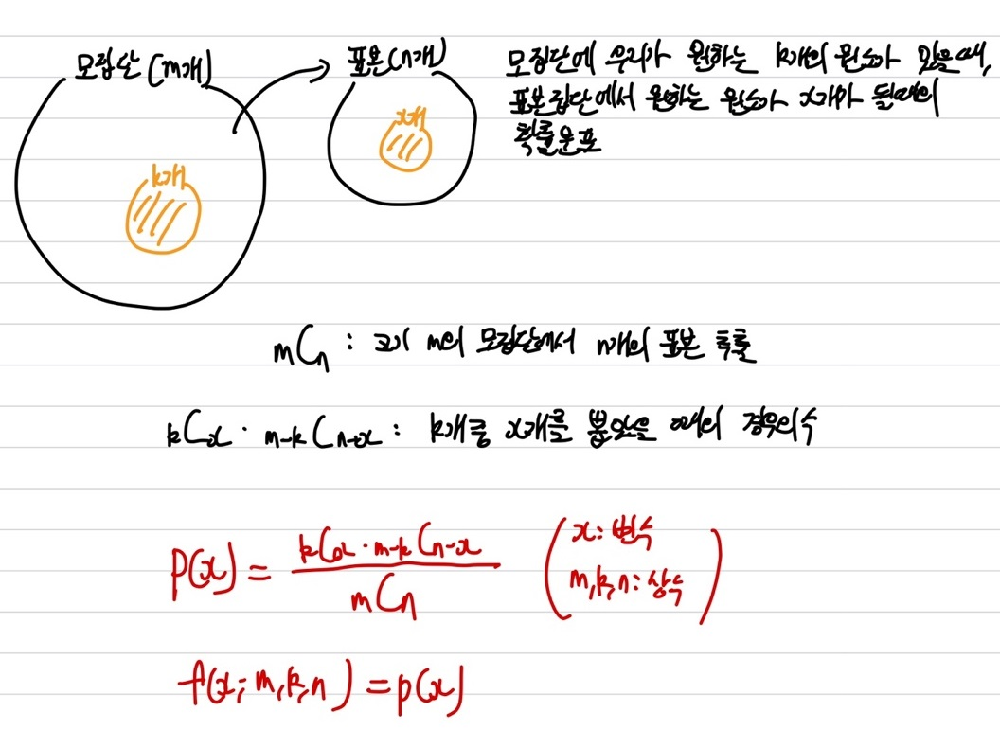
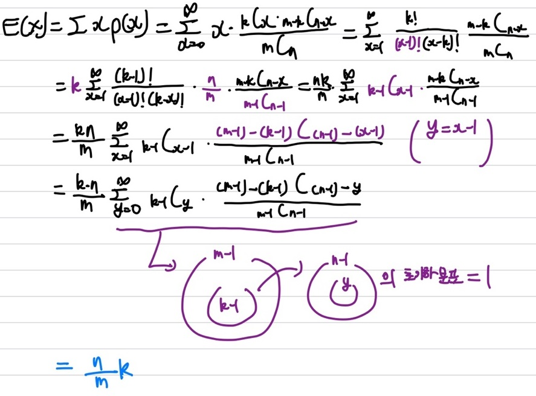
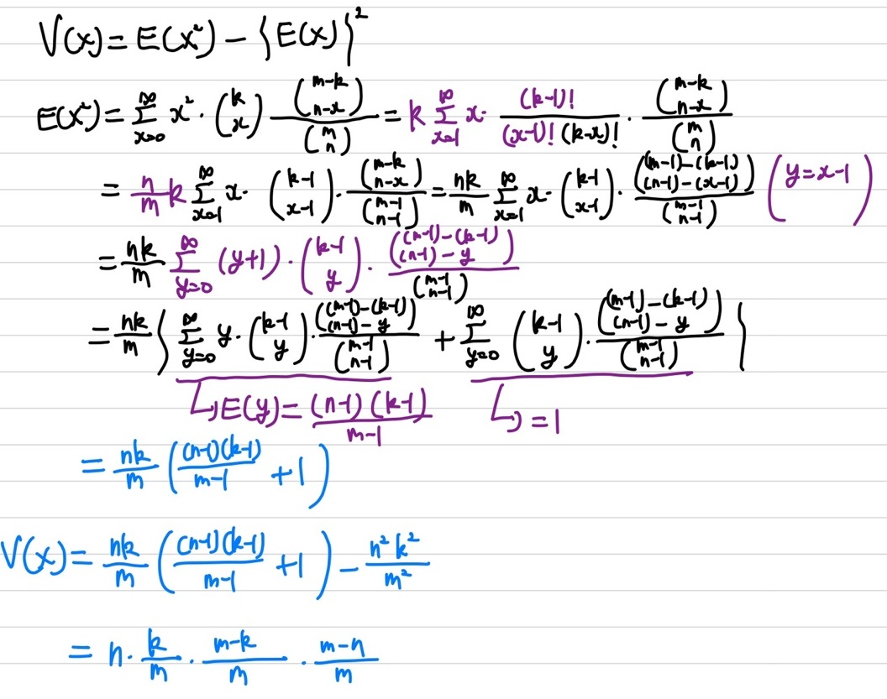
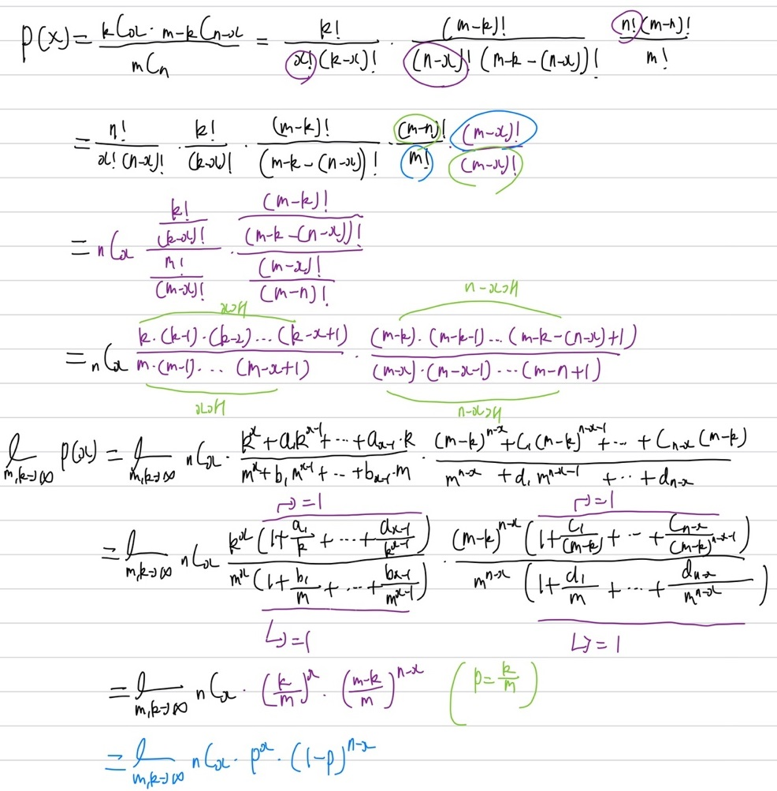

## 초기하 분포

**모집단이 유한**하며, 크기가 m인 모집단에 원하는 k개의 원소가 있을 때, n개의 표본을 **비복원 추출**할 때, 표본 집단에 원하는 원소 x개가 될 때의 확률 분포이다.

### 초기하 분포 확률 질량 함수

   
여기서 $x$의 최댓값은 n과 k 중 작은 값인 min(n, k)가 되며, $x$의 최솟값은 max(0, n-m+k)이 된다. 즉, $x$의 값은 $max(0, n-m+k) \le x \le min(n,k)$의 값을 가진다.  따라서, 초기화 분포는 총 m, k, n 3개의 모수(parameter)를 가지는 확률 질량 함수(pmf)로 나타낼 수 있다.

### 통계량

우선 기댓값부터 확인을 해보면   

상기의 수식을 통해 기댓값을 유도할 수 있다. 우리가 흔히 알고 있는 $\sum_{x=0}^{n}xp(x)$의 기댓값 수식에 초기하 분포의 확률 질량 함수인 $p(x)$를 넣어 수식을 전개하면 상기의 이미지와 동일하게 나타낼 수 있다. 여기서 trick을 이용하여 전체 m-1개의 모집단에서 n-1개의 표본을 추출하며, m-1개에는 우리가 원하는 k-1개 원소에서 x-1개를 추출하는 방법으로 치환을 이용하여 수식을 유도할 수 있다. x-1를 y로 치환을 한 후, 나타낸다면 모수(parameter)가 바뀐 초기화 분포를 유도할 수 있다. 초기화 분포의 확률의 합은 1이 되니, 초기화 분포의 기댓값을 유도할 수 있다. 따라서 초기화 분포의 기댓값은 $E(X)=\frac{nk}{m}$이다.   
다음으로는 분산을 확인해 보겠다.   

분산은 우리가 흔히 알고 있는 기댓값을 이용해 구할 수 있다. $V(x)=E(X^2) - \{E(X)\}^2$의 식을 통해 분산을 구할 수 있다. 분산을 구하기 위해서는 우선 $E(X^2)$을 먼저 구해야하는데, $E(X^2)$을 구하는 방법은 상기의 이미지에 수식 전개를 통해 확인해 볼 수 있다. 이전에 기댓값을 구할 때 사용한 치환 trick을 적용하여 m-1개의 모집단에 대해 n-1개의 표본을 추출하며, 우리가 원하는 원소가 모집단에서 k-1개에서 x-1개를 추출하는 초기하 분포로 변형하여 생각한다. 이 경우 상기의 이미지처럼 전개하면 $E(x-1) = \frac{(n-1)(k-1)}{m-1}$를 얻을 수 있다. 이를 전개하면 $E(X^2)$을 얻을 수 있으며 분산 또한 구할 수 있다. 초기하 분포의 분산은 $V(X)=n\frac{k}{m}\frac{m-k}{m}\frac{m-n}{m}$이다.   
### Appendix

여기서 재밌는 점이 있다. 초기화 분포에서 모집단 m과 우리가 추출하기 원하는 원소 k가 충분히 큰 경우, 즉 **모집단이 충분히 큰 경우에 비해 표본 집단 m이 충분히 작다면**, 비복원 추출은 **베르누이 시행**으로 간주할 수 있다. 이 경우 초기화 분포는 **이항 분포**로 근사할 수 있다. 하기의 이미지는 초기화 분포를 이항 분포로 근사하는 수식을 전개했다.    

