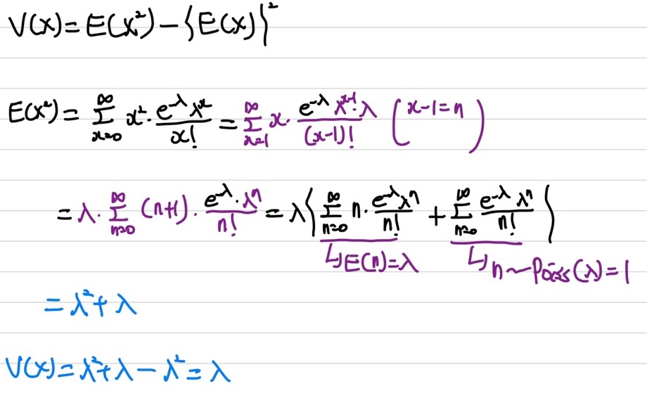

## 포아송 분포

이번에는 매우 많이 사용되며 대표적인 분포들 중 하나인 포아송 분포에 대해 정리하겠다. 포아송 분포는 **이항 분포**와 매우 밀접한 관련이 있다. 포아송 분포는 **이항 분포의 특수한 경우**이다. 즉, 이항 분포에서 **표본의 크기가 매우 크며, 확률이 매우 희박한 경우**에 대한 확률 분포이다. 이 경우에는 이항 분포를 통해 계산하기가 매우 어렵다. 쉽게 말해 이항 분포에서 $n → \infty, p → 0$로 가는 경우에 대한 확률 분포이다.    
좀 더 쉽게 이해를 하기 위해 예시를 들어보겠다. 예를 들어, 하루동안(24시간) 길거리를 돌아다니다 길냥이를 보는 사건에 대한 확률을 구하고 싶다고 해보자. 이 경우 길냥이는 확률변수(x)가 되며, 내가 길냥이를 마주칠 확률인 p이며, 내가 길냥이를 마주치기 위해 시행하는 횟수는 n이 된다. 이 경우, 내가 길냥이를 마주치기 위해 시행하는 횟수는 계속 길거리를 돌아다니는 것, 즉 $\infty$가 되며, 이 길냥이를 마주칠 확률이 매우 희박하다고 볼 수 있다. 확률이 희박하니 거의 0에 가깝다고 볼 수 있다. 그럼 이 이항 분포에서 하루 동안 길냥이를 볼 평균 횟수를 구할 수 있는데, $E(x) = np$라는 값을 갖게 된다. 포아송 분포는 이 np를 $\lambda = np$로 나타낸 것이다.

### 포아송 분포 확률 질량 함수

우선 이항 분포에서 포아송 분포를 유도하는 과정에 대해 알아 보겠다.   
   
상기의 이미지와 같이, 이항 분포에서 $n → \infty, p → 0$간다고 가정하면, 포아송 분포를 유도할 수 있다.   
   
따라서, 포아송 분포는 $\lambda$라는 모수(parameter) 한 개를 가지는 확률 질량 함수(pmf)로 나타낼 수 있다.

### 통계량

우선 기댓값부터 확인을 해보면   

상기의 수식을 통해 기댓값을 유도할 수 있다. 우리가 흔히 알고 있는 $\sum_{x=0}^{n}xp(x)$의 기댓값 수식에 포아송 분포의 확률 질량 함수인 $p(x)$를 넣어 수식을 전개하면 상기의 이미지와 동일하게 나타낼 수 있다. 여기서 trick을 이용하면,  $\lambda$ 하나를 빼서 x-1로 맞춰준 후 치환을 해준다. 그 후 매클로린 급수를 이용하여 전개하면 기댓값을 구할 수 있다. 매클로린 급수는 아래 Appendix에서 추가로 설명하겠다. 따라서 포아송 분포의 기댓값은 $E(X)=\lambda$이다.   
다음으로는 분산을 확인해 보겠다.   

분산은 우리가 흔히 알고 있는 기댓값을 이용해 구할 수 있다. $V(x)=E(X^2) - \{E(X)\}^2$의 식을 통해 분산을 구할 수 있다. 분산을 구하기 위해서는 우선 $E(X^2)$을 먼저 구해야하는데, $E(X^2)$을 구하는 방법은 상기의 이미지에 수식 전개를 통해 확인해 볼 수 있다. 이전에 기댓값을 구할 때 사용한 치환 trick을 이용하여, n에 대한 포아송 분포를 나타낼 수 있다. 그 후 $E(X^2)$를 구해 주면 분산을 구할 수 있다. 분산은 $V(X)=\lambda$이다.  
여기서 포아송 분포는 이항 분포로부터 유도했으며, 이항 분포와 비슷한 성질을 갖는다. 만약 **확률 변수 X와 Y가 포아송 분포를 따르고 독립이라면, (X + Y) 또한 포아송 분포를 따른다**. 즉, **X+Y \~ Poiss($λ_{1}$ + $λ_{2}$)**이다. 

### Appendix

우선 매클로린 급수를 알기 전에, 테일러 급수에 대해 먼저 알아야한다. 매클로린 급수는 테일러 급수에 대한 특수한 경우이기 때문이다.    
    
테일러 급수는 나중에 좀 더 자세히 다루도록 하겠다.   
우선, 포아송 분포 통계량 유도에서 사용했던 매클로린 급수에 대해 간단하게 다루겠다.   
    
상기의 이미지와 같이, 테일러 급수를 전개할 수 있으며, 위에 매클로린 급수에 대한 설명처럼, 테일러 급수에서 a값이 0인 경우를 매클로린 급수라고 부른다.    
매클로린 급수는 일반 적인 경우를 나타내면 7개정도로 나타낼 수 있다.    
   
상기의 이미지처럼, 매클로린 급수를 표현할 수 있다.
