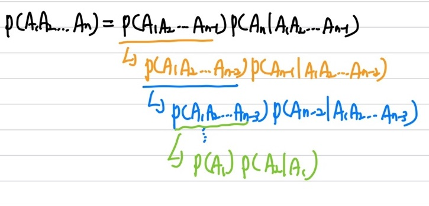
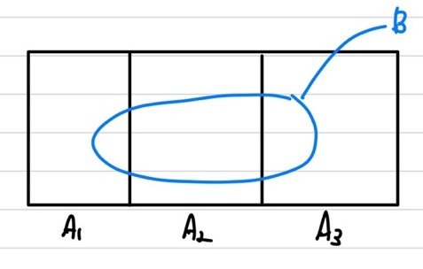
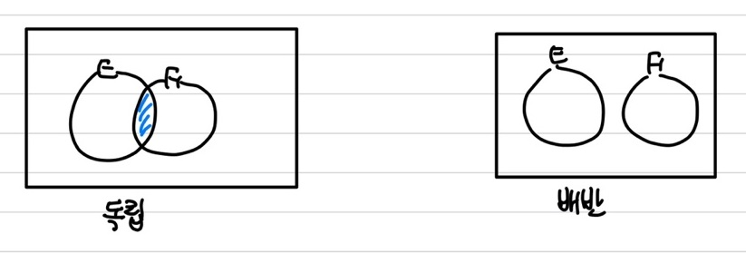

## 순열

서로 다른 n개의 원소에서 r개를 중복없이 순서에 상관있게 선택하는 혹은 나열하는 것이다.   
$nP_r=\frac{n!}{(n-r)!}$   
a, b, c 중 2개를 순열로 뽑는다고 하면, ab, ac, ba, bc, ca, cb 총 6가지가 된다.

## 조합

서로 다른 n개의 원소에서 r개를 순서를 고려하지 않은 채 선택한 것이다.   
$nC_r = \frac{n!}{(n-r)!r!}$    
$nC_r = nC_{n-r}$의 성질을 가진다.   

## 이항 정리

$(x+y)^n=\sum_{i=0}{n}nC_ix^iy^{n-i}$이다.   
$nC_i$는 이항 계수를 뜻하며, 파스칼의 삼각형의 행이다.   
여기서 다항 계수를 정리하면 $\frac{n!}{n_1!n_2!...n_r!}$인데, 여기서 $nCn_1 \;X \; (n-n_1)Cn_2 \; X \; (n-n_1-n_2)Cn_3 \; ... X\; nrCn_r$과 동일하다.   

## 조건부 확률

$P(E\|F)=\frac{P(EF)}{P(F)}$ &rarr; $P(EF)=P(F)P(E\|F)=P(E)P(F\|E)$   
chain rule을 적용하면, $P(E\|FG)=\frac{P(EFG)}{P(FG)}$ &rarr; $P(EFG)=P(FG)P(E\|FG)=P(F)P(G\|F)P(E\|FG)$   
chain rule이란 $P(A_1A_2A_3...A_k)=P(A_1)P(A_2 \|A_1)P(A_3\|A_1A_2)P(A_4\|A_1A_2A_3)...P(A_k\|A_1A_2...A_{k-1})$이다.    
  

## Marginal rule

   
$P(B)=P(A_1 \cap B) + P(A_2 \cap B) + P(A_3 \cap B)$   
$P(B)=P(A_1)P(B\|A_1)+P(A_2)P(B\|A_2)+P(A_3)P(B\|A_3) = \sum_{i=1}^{3}P(A_i)P(B\|A_i)$   

## Bayse Rule

 사전, 사전 정보 확률로 사후 확률 구하기   
$P(A_1\|B) = \frac{P(A_1B)}{P(B)}=\frac{P(A_1)P(B\|A_1)}{P(B)} = \frac{P(A_1)P(B\|A_1)}{\sum_{i=1}^{3}P(A_i)P(B\|A_i)}$   
$P(A_2\|B) = \frac{P(A_2B)}{P(B)}=\frac{P(A_2)P(B\|A_2)}{P(B)} = \frac{P(A_2)P(B\|A_2)}{\sum_{i=1}^{3}P(A_i)P(B\|A_i)}$   
$P(A_i\|B)=\frac{P(A_i)P(B\|A_i)}{\sum_{i=1}^{k}P(A_i)P(B\|A_i)}$   
사전 확률(이미 알고 있는 정보) : $P(A_i), P(A_2), P(A_3)$   
사전 정보 조건부 확률(이미 알고 있는 정보) : $P(B\|A_1),P(B\|A_2),P(B\|A_3)$   
사후 확률(사전 확률이 어떤 정보(B)에 의해 update될 확률) : $P(A_1\|B),P(A_2\|B),P(A_3\|B)$   

## 독립 사건

① 독립 사건 : 서로 영향을 미치지 않는 사건   
② 배반 사건 : 서로 동시에 일어날 수 없는 사건(교집합이 공집합)   
   
$P(B\|A)=P(B)$   
$P(AB)=P(A)P(B\|A)=P(A)P(B)$   
$P(A_1A_2A_3...A_n)=P(A_1)P(A_2)P(A_3)...P(A_n)=P(A_1)P(A_2\|A_1)P(A_3\|A_1A_2)...P(A_n\|A_1A_2...A_{n-1})$   
상기의 이미지에서 $P(E)=P(EF)+P(EF^c)$인데, 만약 E와 F가 독립이라면 $P(E)P(F)+P(EF^c)$가 될 수 있다.   
또한, $P(EF^c)=P(E)(1-P(F))$인데, 독립이라면 $P(E)P(F^c)$가 될 수 있다.   
