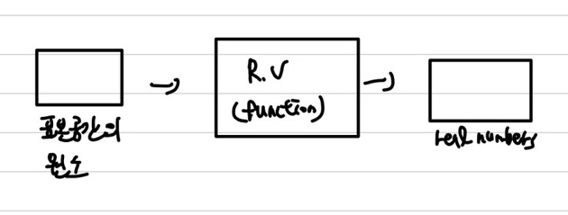
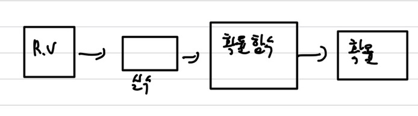
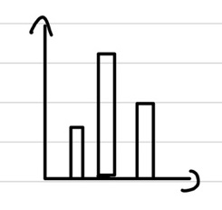
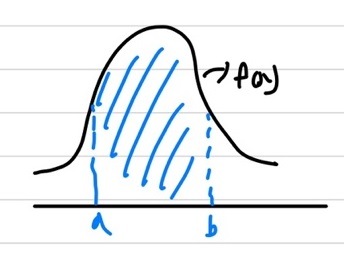
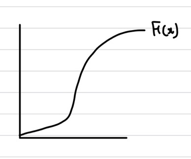

## 확률 변수(Random Variable)

표본 공간에 있는 원소를 실수로 대응시키는 함수이다. 실생활에서 일어나는 어떤 사건을 실수로 대응시켜주는 함수라고 생각할 수 있다.   
예를 들어, 3개의 동전에서 동전 던지기를 할 때, 확률 변수는 앞면이 나오는 횟수라고 하면 \{0, 1, 2, 3\} 총 4가지가 될 수 있다.   
   

### 이산형 확률 변수

이산 확률 변수는 수집된 데이터가 **셀 수 있는 특정한 값들로 구성**되거나 **일정한 범위**로 나타나는 경우이다.  
위에서 예시를 들었던, 동전 던지기가 이산 확률 변수의 예시이다.

### 연속형 확률 변수

연속 확률 변수는 변수가 **연속적인 숫자**이거나 **무한한 경우**와 같이 셀 수 없는 경우이다.   
예시를 들면, 각 반별 학생의 평균 키나 시간 같은 경우를 예시로 들 수 있다.   

## 확률 함수

확률 변수의 실수를 확률로 변경해주는 함수이다.   
이산 확률 변수는 **pmf**, 연속 확률 변수는 **pdf**로 변경해준다.    

### PMF(Probability Mass Function)

Random Variable이 **이산 확률 변수**이다.    
   
상기의 이미지와 같은 형태의 그래프를 가진다.   
$p(x) = P(X=x)$이며, ①$0 \le p(x) \le 1$ ② $\sum p(x) = 1$을 만족한다.   
이제 통계량에 대해 설명하겠다.   
$E(X)=\sum_{i}x_if_x(x_i)$이며 가중 평균을 뜻한다. 여기서 $x_i$는 확률 변수, $f(x_i)$는 확률 함수를 뜻한다. 즉, 확률 변수와 확률 함수의 곱의 합이 기댓값이다.   
좀 더 일반화를 하자면 확률 변수의 함수가 $g(x)$라고 하자. 그러면 기댓값은 $E(g(x))$가 되며 $E(g(x))=\sum_{i}g(x_i)p(x_i)$가 된다.   
기댓값의 성질에 대해 알아보자.   
① $E(c)=\sum_{i}cp(x_i) = c$   
② $E(cX)=\sum_{i}cx_ip(x_i) = cE(X)$   
③ $E(cX+d)=\sum_{i}(cx_i+d)p(x_i) = \sum_{i}cx_ip(x_i) + \sum_{i}dp(x_i) = cE(X) + d$   
④ $E(X^n) = \sum_{x}x^np(x)$여기서 $E(X^n)$는 적률(moment)라고 하는데 이는 추후에 다시 알아보도록 하겠다.   
⑤ $E(X_1+X_2+X_3+...+X_n) = E(X_1)+E(X_2)+E(X_3)+...+E(X_n)$   
다음으로 분산에 대해 알아보도록 하자. 분산은 쉽게 말하면 **흩어짐 정도**라고 말할 수 있다.   
$V(X)=E\[(X - E(X))^2\] = E(X^2) - \(E(X)\)^2$   
원래 분산은 각 확률 변수의 값에 기댓값을 뺀 값들의 평균이다. 이 말이 곧 각 확률 변수들이 평균값에서 얼마나 떨어져있는지를 뜻한다.   
분산의 성질에 대해 알아보자.   
① $V(c)=E\[(c - E(c))^2\] = E\[(c-c)^2\] = 0$   
② $V(cX)=E\[(cX - E(cX))^2\] = E\[c^2(X-E(X))^2\] = c^2V(X)$   
③ $V(cX+d)=E\[(cX+d - E(cX+d))^2\] = c^2V(X)$   
④ $SD(X)=**√**V(X)$

### PDF(Probability Dense Function)

Random Variable이 **연속 확률 변수**이다.   
확률 변수는 보통 범위로 주어지기도 한다.(e.g. (0, 1), [0, 1), [0, 1], (-$\infty$, $\infty$))    
   
상기의 이미지와 같은 형태의 그래프를 가진다.   
$p(a \le x \le b)=\int_{a}^{b} f(x) dx$   
$p(X=a)=p(a \le x \le a) = \int_{a}^{a}f(x)dx = 0$    
$p(-\infty \le x \le \infty) = \int_{-\infty}^{\infty}f(x)dx = 1$   
$p(a - \frac{\epsilon}{2} \le x \le a + \frac{\epsilon}{2}) = \int{a - \frac{\epsilon}{2}}^{a + \frac{\epsilon}{2}}f(x)dx \approx \epsilon f(a)$ : a지점의 좁은 공간   
기댓값은 $E(X)=\int xf(x)dx$이다.   

#### CDF(Cumulate Dense Function)

cdf는 **pdf의 적분값**이며, cdf의 미분은 pdf이다.   
$F(x)=p(X \le x) = \omt_{- \infty}^{x}f(t) dt$   
$\frac{d}{dx}F(x) = f(x)$   
$0 \le F(x) \le 1$   
$b \ge a$라면, $F(b) \ge F(a)$이니, CDF는 **단조 증가 함수**이다.  
  
상기의 PDF에서 나타낸 확률과 동일하다. &rarr; $F(b) - F(a) = p(a \le x \le b) = \int_{a}^{b} f(x) dx$이다.     
만약에, $p(a \le x \le b)$를 구한다고 하면, $p(a \le x \le b) = p(x \le b) - p(x \le a) = \int_{- \infty}^{b} f(x) dx - \int_{- \infty}^{a} f(x) dx$로 구할 수 있다.   
