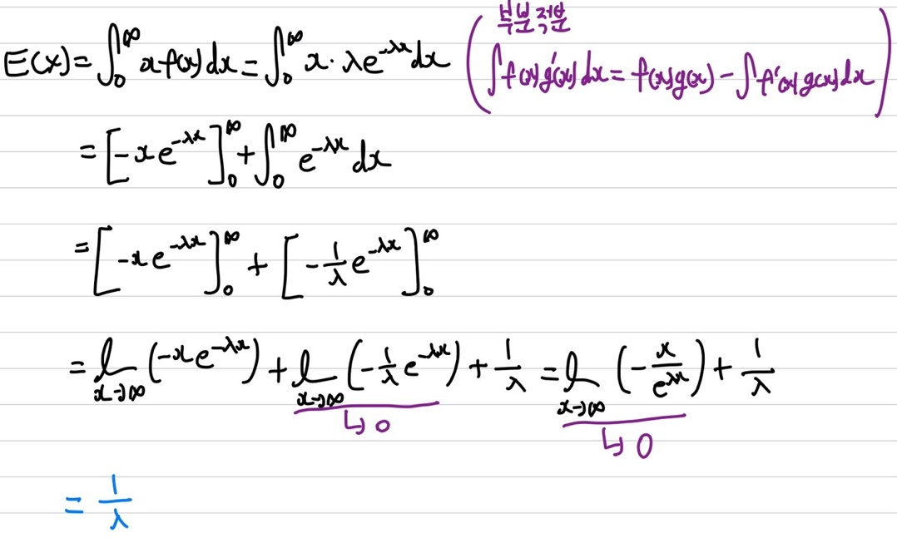
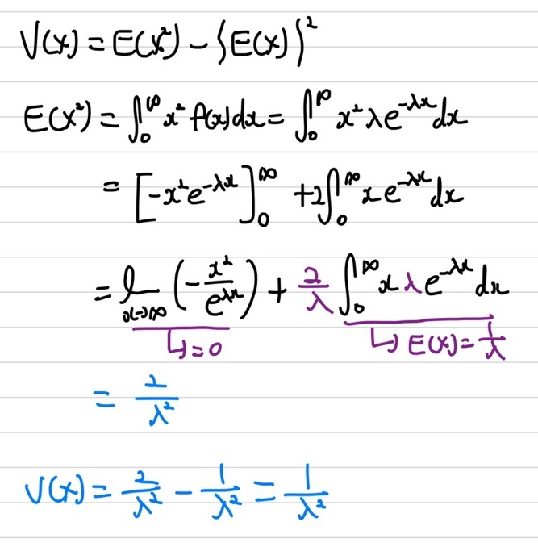

## 지수 분포

이번에 알아볼 분포는 지수 분포입니다. 지수 분포는 **확률 밀도 함수(pdf)**입니다. 지수 분포는 이후에 배울 **감마 분포**에의 한 종류인 특수한 케이스이다.    
우선 지수 분포의 개념에 대해 알아보도록 하겠습니다. 지수 분포는 확률 밀도 함수이지만, 재밌는 점이 **포아송 분포와 매우 밀접한 관련**이 있습니다. 지수 분포는 포아송 분포에서 유도된 분포입니다. 이전에 배웠던 포아송 분포의 개념을 다시 짚어보면 **단위 시간동안 사건의 평균 발생 횟수**에 대한 분포가 포아송 분포라고 말씀드렸습니다.    
   
여기서 $\lambda$는 단위 시간동안 사건의 평균 발생 횟수를 의미합니다. $x$는 사건 발생 횟수를 뜻합니다.  즉, 어떤 사건이 단위 시간동안 평균 $\lambda$번 발생할 때, 그 사건이 발생하는 횟수 $x$를 확률 변수로 하는 분포입니다. 이전에 예시를 들었던, 길냥이를 다시 말씀 드리겠습니다. 만약, $\lambda=3$일 때, 포아송 분포는 $p(x) = \frac{3^x e^{-3}}{x!}$이 되는데, 이 뜻은 하루라는 단위 시간동안 길냥이를 평균 3회정도 마주칠 때, 길냥이를 $x$번 마주칠 확률을 뜻합니다.   
여기서, 지수 분포는 포아송 분포을 알고 있을 때($\lambda$를 알고 있을 때), **어떤 사건이 처음 발생할 때까지의 걸리는 시간이 $T$이하일 확률에 대한 분포**입니다. 좀 더 쉽게 설명하기 위해 위에 말했던 길냥이 예시를 통해 다시 한번 더 설명하겠습니다. 길냥이를 마주칠 때까지 걸리는 시간이 t이하일 확률이 지수 분포를 따릅니다.   
   
상기의 그래프 이미지에서 어떤 함수 **$f(t)$에서 T까지의 넓이(적분)**가 **어떤 사건이 처음 발생할 때까지의 걸리는 시간이 $T$이하일 확률**이 됩니다. 즉, $f(t)$가 지수 분포가 됩니다. 여기서 사건이 처음 발생했을 때의 시간을 $t$라고 하고 시간은 0보다 크거나 같아야하니 확률은  $p(0 \le t \le T)$이 됩니다. 그래프의 넓이는 $\int_{0}^{T} f(t) dt$가 되고 넓이가 곧 확률이 되니  $p(0 \le t \le T) = \int_{0}^{T} f(t) dt$이 됩니다. 

   
상기의 그래프는 $\lambda$값에 따른 지수 분포 그래프의 변화를 나타냈습니다.      

지수 분포의 대표적인 예시로는 전구 예시를 들 수 있습니다. 내가 지금 전구를 바라 봤을 때의 전구의 남은 수명과 1시간 뒤에 다시 전구를 바라봤을 때 전구의 남은 수명은 동일하다는 것입니다. 즉, 지수 분포는 **망각 특징**을 가지고 있습니다. 

### 지수 분포 확률 밀도 함수

이제 포아송 분포를 통해 지수 분포를 유도해보겠습니다. 우선 쉽게 이해하기 위해 이전에 설명했던 길냥이 예시를 통해 설명하겠습니다. 하루동안 길냥이를 평균 3회정도 마주친다고 했을 때, 포아송 분포는 $p(x)= \frac{3^x e^{-3}}{x!}$이 됩니다. 자 현재 $\lambda$값을 알고 있으니 지수 분포를 구해보겠습니다. **길냥이를 처음 마주칠 때까지 걸리는 기간이 5일 이하일 확률**을 구해보겠습니다. 이 말은 $p(0 \le t \le 5) = \int_{0}^{5} f(t) dt$의 $f(t)$를 구해보겠다는 말입니다. $f(t)$를 구하기 위해 2가지의 방법이 있습니다.    
① 1일차에 길냥이를 만났을 때, 1일차 X 2일차에 만났을 때, 1일차 X 2일차 X 3일차에 만났을 때...    
② 여사건을 이용하는 것입니다. 1 - (5일 동안 길냥이를 만나지 못했을 때)   
더 쉬워보이는 ②방법을 통해 구해보도록 하겠습니다. 우선 1일 동안 길냥이를 만나지 못할 확률을 구해보겠습니다. 이 말은 포아송 분포 $p(x)= \frac{3^x e^{-3}}{x!}$에서 확률 변수 x가 0일 때, 즉 0번 하루동안 0번 마주칠 확률을 구하면 됩니다. $\frac{1 e^{-3}}{0!} = e^{-3}$이 됩니다. 5일 동안이니 $e^{-3}$을 5번 곱해준 $e^{-15}$가 5일 동안 길냥이를 마주치지 못할 확률이 됩니다. 즉, **길냥이를 처음 마주칠 때까지 걸리는 기간이 5일 이하일 확률**은 $1 - e^{-15}$가 됩니다.    
자 이제 일반화를 시켜보겠습니다. **어떤 사건이 처음 발생할 때까지의 걸리는 시간이 $T$이하일 확률**은 $p(0 \le t \le T) = \int_{0}^{T} f(t) dt = 1 - e^{- \lambda T}$가 됩니다.    
   
   
   
지수 분포는 $\lambda$라는 1개의 모수를 가집니다. 또한, 확률 변수는 시간을 의미하기 때문에 항상 0이상이여야 하며, 0보다 작을 경우는 확률이 0이 됩니다. 또한, 평균 발생 횟수를 뜻하는 $\lambda$도 항상 0보다 크거나 같아야합니다.

### 통계량

우선 기댓값부터 확인을 해보면   

상기의 수식을 통해 기댓값을 유도할 수 있습니다. 우리가 흔히 알고 있는 $\int_{0}^{\infty} x f(x)$의 기댓값 수식에 지수 분포의 확률 밀도 함수인 $f(x)$를 넣어 수식을 전개하면 상기의 이미지와 동일하게 나타낼 수 있습니다. 여기서 부분적분을 이용하여 전개했습니다. 여기서 x가 무한대로 가는 경우는 우선 $lim$을 통해 표현을 했으며, 여기서 **로피탈 정리**를 이용하여 해당 값들이 0으로 간다는 것을 증명할 수 있습니다. 따라서 지수 분포의 기댓값은 $\frac{1}{\lambda}$가 됩니다.  
다음으로는 분산을 확인해 보겠다.   

분산은 우리가 흔히 알고 있는 기댓값을 이용해 구할 수 있다. $V(x)=E(X^2) - \{E(X)\}^2$의 식을 통해 분산을 구할 수 있습니다. 분산을 구하기 위해서는 우선 $E(X^2)$을 먼저 구해야하는데, $E(X^2)$을 구하는 방법은 상기의 이미지에 수식 전개를 통해 확인해 볼 수 있습니다. 이 때 이전에 기댓값을 구하기 위해 이용했던 부분 적분을 이용하여 구할 수 있습니다. 여기서 똑같이 **로피탈 정리**을 이용하여 $lim$값이 0으로 간다는 것을 증명할 수 있습니다. 또한, 여기서 trick을 이용해서 각 분모, 분자에 $\lambda$를 곱해서 해당 형태가 $E(X)$을 구하는 식의 모양으로 변형해서 이전에 구했던 기댓값을 이용하여 쉽게 전개했습니다. 그 후 $E(X^2)$를 구해 주면 분산을 구할 수 있습니다. 분산은 $V(X)= \frac{1}{\lambda^2}$가 됩니다. 
