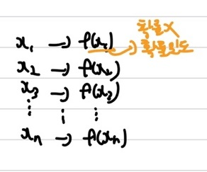
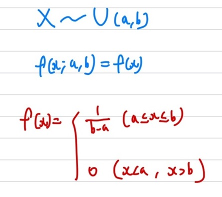
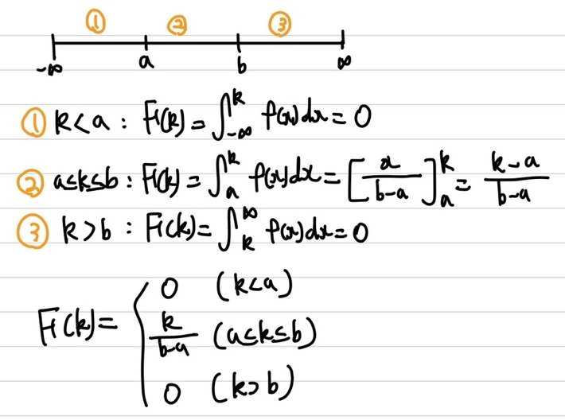
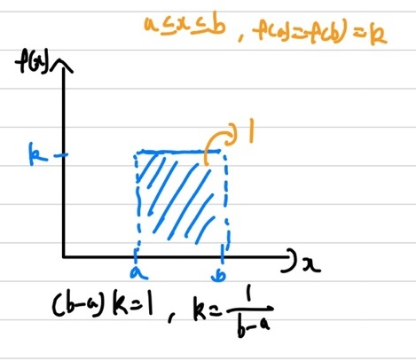
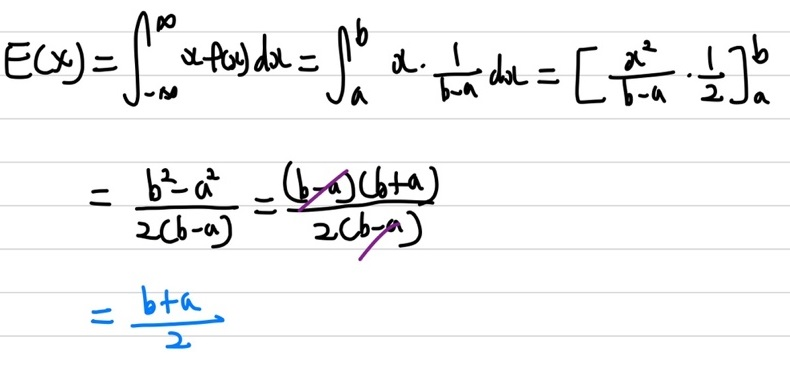
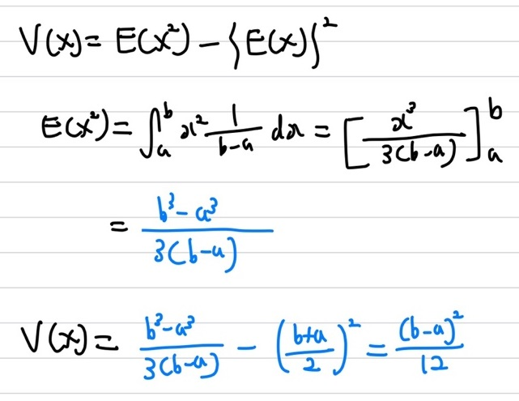

## 균등 분포

이전까지는 이산 확률 변수에 대해 다뤘는데, 이번부터는 연속 확률 변수에 대해 다뤄보겠습니다. 이산 확률 변수는 $P(X=x)$로 확률을 표현할 수 있지만, 연속 확률 변수는 $P(a \le x \le b)$로 확률을 표현합니다. 또한, 이산 확률 변수의 확률 분포를 표현한 함수는 **확률 질량 함수(pmf)**라고 하며, 연속 확률 변수는 **확률 밀도 함수(pdf)**라고 부른다.    

이번에 소개할 균등 분포는 우선 **연속 확률 변수**를 가지며 **확률 밀도 함수(pdf)**입니다. 균등 분포는 **모든 확률 변수에 대해 균일한 확률을 갖는 분포**입니다. 즉, 확률 변수 $x$가 폐구간 [a, b]내의 모든 영역에서 동일한 확률을 갖습니다. 참고로 균등 분포는 연속 확률 변수라고 하지만, **이산 확률 변수**에서도 사용되기도 합니다.    
좀 더 쉽게 이해하기 위해 예시를 통해 설명하겠습니다. 5분마다 정류장에 1대씩 들어오는 버스가 있다고 해보자. 이 때, 내가 정류장에서 버스가 올 때까지 기다리는 시간은 $0 \le x \le 5$이며, 균등 분포를 따른다고 해보자. 그럼 내가 k분 미만으로 기다릴 확률을 구하면, $P(X \< k) = \int_{0}^{k} f(x) dx = \int_{0}^{k} \frac{1}{5} dx$가 된다.    
참고로 베이지안 확률에서의 **사전 분포를 균등 분포**로 많이 사용한다고 합니다.

### 균등 분포 확률 밀도 함수

균등 분포의 경우, 상기의 이미지 처럼 폐구간을 나타내는 2개의 모수(parameter)가 필요하다. 확률은 모두 일정하기 때문에 $\frac{1}{b-a}$가 됩니다.    
   
균등 분포는 [a, b]구간에서는 일정한 확률을 지니지만, 그 외의 구간에서는 0의 값을 가집니다. 이에 따른 CDF를 확인해보면, (-$\infty$, a) 값은 0, (b, $\infty$)도 0의 값을 가지며, [a, b]에서 일정한 값을 가집니다. 이제 균등 분포의 그래프를 알아보도록 하겠습니다.    
   

### 통계량

우선 기댓값부터 확인해보면   
   
상기의 수식을 통해 기댓값을 유도할 수 있다. 우리가 흔히 알고 있는 $\int_{x=0}^{n}x f(x)$의 기댓값 수식에 균등 분포의 확률 질량 함수인 $f(x)$를 넣어 수식을 전개하면 상기의 이미지와 동일하게 나타낼 수 있다.  균등 분포의 기댓값은 $\frac{b+a}{2}$이다.   
다음으로는 분산을 확인해 보겠습니다.   
   

분산은 우리가 흔히 알고 있는 기댓값을 이용해 구할 수 있다. $V(x)=E(X^2) - \{E(X)\}^2$의 식을 통해 분산을 구할 수 있다. 분산을 구하기 위해서는 우선 $E(X^2)$을 먼저 구해야하는데, $E(X^2)$을 구하는 방법은 상기의 이미지에 수식 전개를 통해 확인해 볼 수 있다. 균등 분포의 분산은 $\frac{(b-a)^2}{12}$이다.
