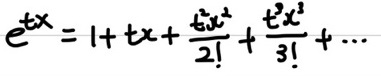

## 적률(Moment)

우선 적률 생성 함수를 알아보기 전에 적률이 무엇인지에 대해 간단하게 알아보도록 하겠습니다. 적률은 물리학, 공학에서 많이 사용되는 개념입니다. 우선 수학에서 정의된 적률의 개념은 **함수 모양을 수학적으로 표현하는 하나의 척도**라고 합니다. 이 개념이 물리학, 통계학, 공학에서 모두 사용됩니다. 물리학에서 0차 적률은 질량, 1차 적률은 질량중심, 2차 적률은 관성모멘트로 사용됩니다. 우선 아래에 적률의 정의에 대해 보여주겠습니다.   
$\mu_{n}=\int_{- \infty}^{\infty} (x-c)^n f(x) dx$   
$\mu_{n}$이 n차 적률을 의미합니다.   
보통, 통계학에서의 적률은 c=0인 적률을 의미합니다. 따라서  $\mu_{n}=\int_{- \infty}^{\infty} x^n f(x) dx$가 됩니다.   

한번 1차 적률을 구해보겠습니다.   
$\mu_{1}=\int_{- \infty}^{\infty} x f(x) dx$   
만약 f(x)를 확률 질량 함수라고 한다면, 우리가 기댓값을 구할 때 보던 수식과 동일 합니다. 즉, 1차 적률은 평균(기댓값)을 의미합니다.   

이번에는 2차 적률을 구해보겠습니다.   
$\mu_{2}=\int_{- \infty}^{\infty} x^2 f(x) dx$   
이 또한, 분산을 구할 때 사용하던 $E(X^2)$의 수식과 동일합니다. 즉 적률은 곧 **n차 확률 변수의 기댓값**을 의미하고 있다는 것을 볼 수 있습니다.    

## MGF(적률 생성 함수)

적률 생성 함수는 말 그대로 상기에서 설명했던 **적률을 생성해주는 함수**입니다. 적률은 상기에서처럼 적분을 통해 구해 줄 수도 있습니다. 하지만, 적률 생성 함수를 구해 놓으면 n차 적률을 쉽게 구할 수 있습니다.    
   
적률 생성 함수는 상기와 같이 정의됩니다. 즉, **확률 변수 X가 있을 때, $e^{tx}$의 기댓값이 확률 변수 X의 적률 생성 함수**가 됩니다. 이 적률 생성 함수를 **t번 미분 한 후, t=0을 대입 해주면 t차 적률**을 구할 수 있습니다.    
우선 $E(e^{tx})$를 구해보겠습니다. $E(e^{tx}) = \int_{- \infty}^{\infty} e^{tx} f(x) dx$가 됩니다. $E(e^{tx})$을 더 쉽게 구하기 위해서 우선 $e^{tx}$를 전개해보겠습니다. 이 전에 배웠던 **매클로린 급수**를 이용하여 전개해보겠습니다.    
   
상기와 같이 $e^{tx}$를 다항 함수로 표현할 수 있습니다. 그런 후 양변에 기댓값을 씌어본 후 적률을 구해보겠습니다.    
      
우선 1차 적률에 대해 구해보았습니다. 1차 적률은 평균(기댓값)을 나타낸다고 했는데, 똑같이 나타난 다는 것을 확인할 수 있습니다.   
이번에는 2차 적률에 대해 구해보겠습니다.    
   
2차 적률 또한, 잘 생성된 것을 확인할 수 있습니다. 따라서 상기의 수식이 적률 생성 함수인 것을 확인할 수 있습니다. 

이번에는 예시를 들어 적률 생성 함수를 어떻게 구하는지에 대해 알아보겠습니다. 정규 분포의 적률 생성 함수를 구하고자 하겠습니다. 정규 분포는 $f(x) = \frac{1}{\sqrt{2 \pi \sigma^2}}e^{- \frac{(x - \mu )^2}{2 \sigma^2}}$입니다. 정규 분포의 적률 생성 함수는 아래와 같이 됩니다.   
$E(e^{tx}) = \int_{- \infty}^{\infty} e^{tx} \frac{1}{\sqrt{2 \pi \sigma^2}}e^{- \frac{(x - \mu )^2}{2 \sigma^2}} dx$   
이 수식을 통해 1차 적률을 구해보면 $E(x) = \mu$를 구할 수 있습니다. 
