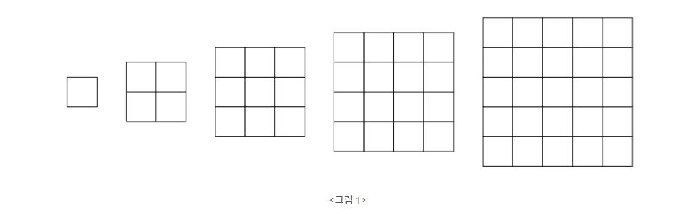

## 색종이 붙이기(17136)

<https://www.acmicpc.net/problem/17135>

### 문제
<그림 1>과 같이 정사각형 모양을 한 다섯 종류의 색종이가 있다. 색종이의 크기는 1×1, 2×2, 3×3, 4×4, 5×5로 총 다섯 종류가 있으며, 각 종류의 색종이는 5개씩 가지고 있다.

    

색종이를 크기가 10×10인 종이 위에 붙이려고 한다. 종이는 1×1 크기의 칸으로 나누어져 있으며, 각각의 칸에는 0 또는 1이 적혀 있다. 1이 적힌 칸은 모두 색종이로 덮여져야 한다. 색종이를 붙일 때는 종이의 경계 밖으로 나가서는 안되고, 겹쳐도 안 된다. 또, 칸의 경계와 일치하게 붙여야 한다. 0이 적힌 칸에는 색종이가 있으면 안 된다.

종이가 주어졌을 때, 1이 적힌 모든 칸을 붙이는데 필요한 색종이의 최소 개수를 구해보자.

### 입력

총 10개의 줄에 종이의 각 칸에 적힌 수가 주어진다.

### 해결법
우선 해당 문제의 경우 각 색종이를 5개씩 가지고 있다는 점을 생각해야합니다. 크기가 10 x 10이기 때문에 단순 브르투 포스로 해결이 가능합니다. (0, 0)에서 부터 아래로 증가시킨 (1, 0)칸을 순서대로 확인하며, 1이 존재할 때는 색종이를 붙여야합니다. 이 때 색종이는 총 5가지의 종류가 있는데, 어떤 색종이를 붙여야하는지 단순 5번의 for문을 통해 확인합니다. 이때, 백트래킹을 이용해, 어떤 색종이들을 각각에 붙였을 때, 최소한의 색종이로 1인칸을 모두 없앨 수 있는지 구하면됩니다.


```python
n = 10
board = []
for x in range(n):
    data = list(map(int, input().split()))
    board.append(data)

# 각 색종이 종류마다 5개가 존재
paper = [5 for _ in range(5)]
answer = 100

def dfs(x, y, cnt):
    global answer
    # y축 범위를 벗어날 때 끝까지 탐색한 것이기 때문에 최소값 갱신
    if y >= n:
        answer = min(answer, cnt)
        return
    # x좌표가 넘어가면 (0. y+1)에서 재탐색
    if x >= n:
        dfs(0, y+1, cnt)
        return
    
    # 색종이를 붙여야하는 칸인 경우
    if board[x][y] == 1:
        # 5가지의 종류의 색종이 확인
        for k in range(5):
            # 색종이 다 썻는 경우
            if paper[k] == 0:
                continue
            # 색종이 붙일 때 범위를 넘어갈 경우
            if x + k >= 10 or y + k >= 10:
                continue

            # 색종이 붙일 수 있는지 확인하는 플래그
            is_possible = True
            # 현재 좌표에서 색종이 붙일 수 있는지 확인
            for i in range(x, x + k + 1):
                for j in range(y, y + k + 1):
                    # 0인 부분이 존재해 해당 색종이를 못붙이는 경우
                    if board[i][j] == 0:
                        is_possible = False
                        break
                # 해당 크기의 색종이는 붙이기가 불가능한 경우
                if not is_possible:
                    break
            # 색종이 붙이기가 가능하니 현재 보드판에 색종이 붙이기
            if is_possible:
                #
                for i in range(x, x + k + 1):
                    for j in range(y, y + k + 1):
                        board[i][j] = 0
                # 해당 선택한 색종이 개수 감소
                paper[k] -= 1
                # 색종이를 붙였으니 백트래킹 수행
                dfs(x + k + 1, y, cnt + 1)
                
                # 다른 색종이 선택할 수도 있으니 원복 시키기
                paper[k] += 1
                for i in range(x, x + k + 1):
                    for j in range(y, y + k + 1):
                        board[i][j] = 1
    # 색종이 붙일 수 없는 칸인 경우 다음 칸 확인
    else:
        dfs(x + 1, y, cnt)

dfs(0, 0, 0)
if answer == 100:
    print(-1)
else:
    print(answer)
```