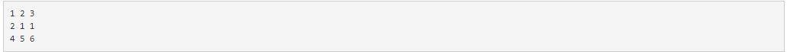
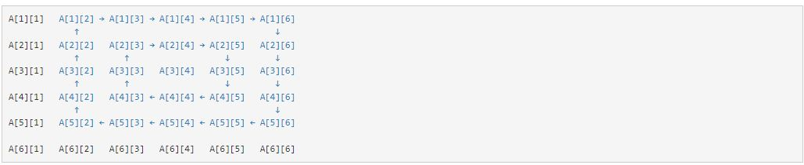
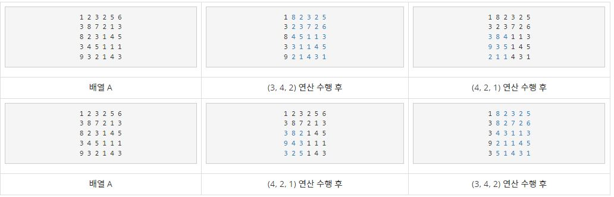

## 배열 돌리기(17406)

<https://www.acmicpc.net/problem/17406>

### 문제
크기가 N×M 크기인 배열 A가 있을때, 배열 A의 값은 각 행에 있는 모든 수의 합 중 최솟값을 의미한다. 배열 A가 아래와 같은 경우 1행의 합은 6, 2행의 합은 4, 3행의 합은 15이다. 따라서, 배열 A의 값은 4이다.

    


배열은 회전 연산을 수행할 수 있다. 회전 연산은 세 정수 (r, c, s)로 이루어져 있고, 가장 왼쪽 윗 칸이 (r-s, c-s), 가장 오른쪽 아랫 칸이 (r+s, c+s)인 정사각형을 시계 방향으로 한 칸씩 돌린다는 의미이다. 배열의 칸 (r, c)는 r행 c열을 의미한다.

예를 들어, 배열 A의 크기가 6×6이고, 회전 연산이 (3, 4, 2)인 경우에는 아래 그림과 같이 회전하게 된다.

    


회전 연산이 두 개 이상이면, 연산을 수행한 순서에 따라 최종 배열이 다르다.

다음은 배열 A의 크기가 5×6이고, 회전 연산이 (3, 4, 2), (4, 2, 1)인 경우의 예시이다.

    


배열 A에 (3, 4, 2), (4, 2, 1) 순서로 연산을 수행하면 배열 A의 값은 12, (4, 2, 1), (3, 4, 2) 순서로 연산을 수행하면 15 이다.

배열 A와 사용 가능한 회전 연산이 주어졌을 때, 배열 A의 값의 최솟값을 구해보자. 회전 연산은 모두 한 번씩 사용해야 하며, 순서는 임의로 정해도 된다.
### 입력

첫째 줄에 배열 A의 크기 N, M, 회전 연산의 개수 K가 주어진다.

둘째 줄부터 N개의 줄에 배열 A에 들어있는 수 A[i][j]가 주어지고, 다음 K개의 줄에 회전 연산의 정보 r, c, s가 주어진다.

### 해결법
해당 문제의 경우 우선 k번 만큼 입력 받은 (r,c,s)회전 연산에 대한 순서를 정해야합니다. 이 순서는 n!인 $nP_n$이므로 백트래킹을 이용한 순열을 통해 순서를 정했습니다.    
그 다음 배열을 돌리는데, 가운데 지점인 (r, c)는 그대로 둔체 그 바깥쪽을 시계방향으로 1칸씩 이동시키면 됩니다. 이 때, 좌측 상단과 우측 하단의 경우는 좌표값이 확 틀어지는 구간입니다. 좌측 상단은 해당 하단 위치의 x+1값으로 대체를 해주고 우측 하단은 x-1의 위치의 배열이 해당 위치를 차지하게됩니다. 그 외에는 우측으로 이동, 아래로 이동, 좌측으로 이동, 위로 이동이 일어나게됩니다. 
```python
import copy

n, m, k = map(int, input().split())

board = []
for _ in range(n):
    data = list(map(int, input().split()))
    board.append(data)

# (r,c)를 기준으로 +-s 주위들 시계방향 회전
def rotate(sx, sy, ss, cp_board):
    # 회전한 배열을 담을 임시 배열
    _board = [[0] * m for _ in range(n)]
    # 안쪽 부터 회전 시키기
    for d in range(1, ss + 1):
        # y의 범위는 c - s ~ c + s
        # x의 범위 r - s ~ r + s
        for x in range(sx-d, sx+d+1):
            for y in range(sy - d, sy + d + 1):
                # 가운데 값
                if x == sx and y == sy:
                    cx, cy = x, y
                # 양 끝 지점에만 신경을 써주면 됨
                # 그 외는 각각 이전위치의 값을 가져오기 때문
                # x축 시작지점
                elif x == sx - d:
                    # x축 시작과 y축 시작지점
                    if y == sy - d:
                        cx, cy = x+1, y
                    else:
                        cx, cy = x, y-1
                # x축 끝 지점
                elif x == sx + d:
                    # x축 끝과 y축 끝
                    if y == sy + d:
                        cx, cy = x - 1, y
                    else:
                        cx, cy = x, y + 1
                
                elif y == sy - d:
                    cx, cy = x + 1, y
                elif y == sy + d:
                    cx, cy = x - 1, y
                else:
                    cx, cy = x, y
                _board[x][y] = cp_board[cx][cy]
        # 원본 배열에 담기
        for x in range(sx-d, sx+d+1):
            for y in range(sy - d, sy + d + 1):
                if x == sx and y == sy:
                    continue
                cp_board[x][y] = _board[x][y]

# 각 행의 합들 중 최소 찾기
def get_min(_board):
    result = min(map(sum, _board))
    return result

# 가증한 회전 경우의 수(n!인 순열)
def dfs(depth, _visited, arr):
    global answer
    if depth == k:
        new_board = copy.deepcopy(board)
        # do something
        for a, b, c in arr:
            rotate(a, b, c, new_board)
        result = get_min(new_board)
        answer = min(result, answer)
        return
    for i in range(k):
        if _visited[i]:
            continue
        _visited[i] = True
        arr.append(rotate_calc[i])
        dfs(depth + 1, _visited, arr)
        _visited[i] = False
        arr.pop()

rotate_calc = []
visited = [False] * k
for _ in range(k):
    r, c, s = map(int, input().split())
    rotate_calc.append([r-1, c-1, s])

answer = int(1e9)
dfs(0, visited, [])
print(answer)
```


해당 문제를 풀 때 너무 불필요하게 연산이 많이 수행된다고 생각하여 조금 더 개선법에 대해 생각해봤습니다. 물론 코드가 너무 길어져서 불편했습니다.   
회전 연산 시키전의 보드판을 복사해둔 후, 슬라이싱을 이용해 복사한 보드판에 오른쪽으로 이동하는 것들, 아래쪽으로 이동하는 것들, 왼쪽으로 이동하는 것들, 위쪽으로 이동하는 것들을 이동시키셔 저장하면 끝나는 문제입니다. 
```python
import copy

n, m, k = map(int, input().split())

board = []
for _ in range(n):
    data = list(map(int, input().split()))
    board.append(data)

# (r,c)를 기준으로 +-s 주위들 시계방향 회전
def rotate(sx, sy, ss, cp_board):
    _board = copy.deepcopy(cp_board)
    for d in range(1, ss + 1):
        # -> 우측 이동(가장 위쪽)
        _board[sx - d][sy - d + 1: sy + d + 1] = cp_board[sx - d][sy - d: sy + d]
        # 아래쪽 이동(가장 오른쪽)
        for x in range(sx + d, sx - d, -1):
            _board[x][sy + d] = cp_board[x - 1][sy + d]
        # <- 좌측 이동(가장 아래쪽)
        _board[sx + d][sy - d: sy + d] = cp_board[sx + d][sy - d + 1: sy + d + 1]
        # ↑ 위쪽 이동(가장 왼쪽)
        for x in range(sx - d, sx + d):
            _board[x][sy - d] = cp_board[x + 1][sy - d]
    return _board
    pass
# 각 행의 합들 중 최소 찾기
def get_min(_board):
    result = min(map(sum, _board))
    return result

# 가증한 회전 경우의 수(n!인 순열)
def dfs(depth, _visited, arr):
    global answer
    if depth == k:
        new_board = copy.deepcopy(board)
        # do something
        for a, b, c in arr:
            new_board = rotate(a, b, c, new_board)
        result = get_min(new_board)
        answer = min(result, answer)
        return
    for i in range(k):
        if _visited[i]:
            continue
        _visited[i] = True
        arr.append(rotate_calc[i])
        dfs(depth + 1, _visited, arr)
        _visited[i] = False
        arr.pop()

rotate_calc = []
visited = [False] * k
for _ in range(k):
    r, c, s = map(int, input().split())
    rotate_calc.append([r-1, c-1, s])

answer = int(1e9)
dfs(0, visited, [])
print(answer)
```