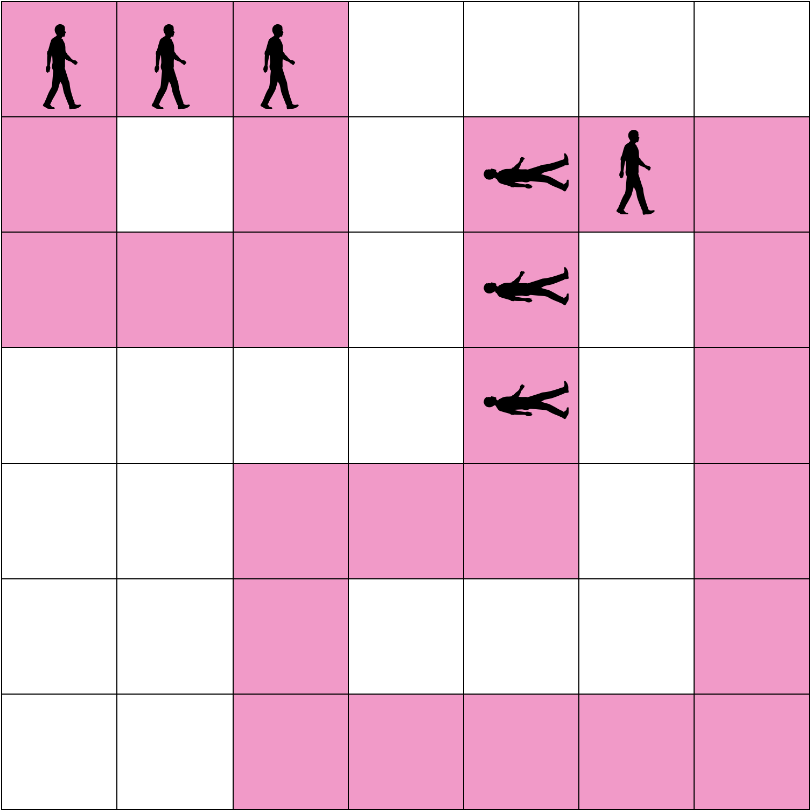
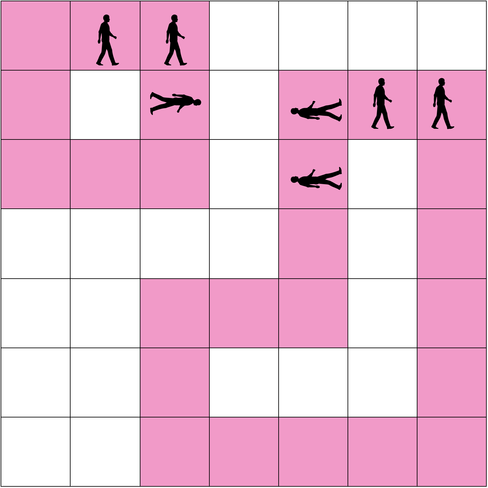
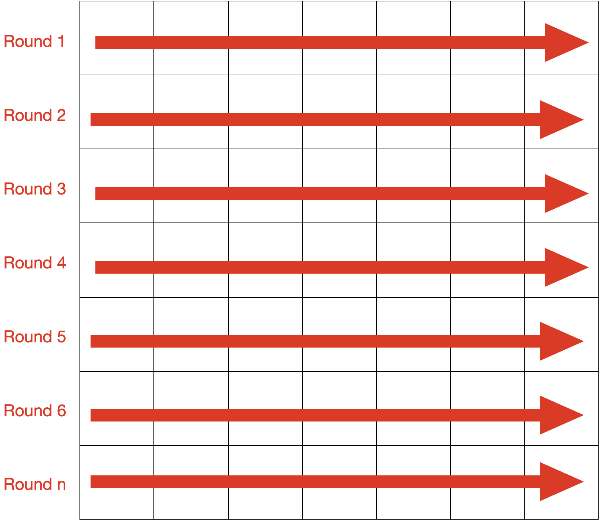
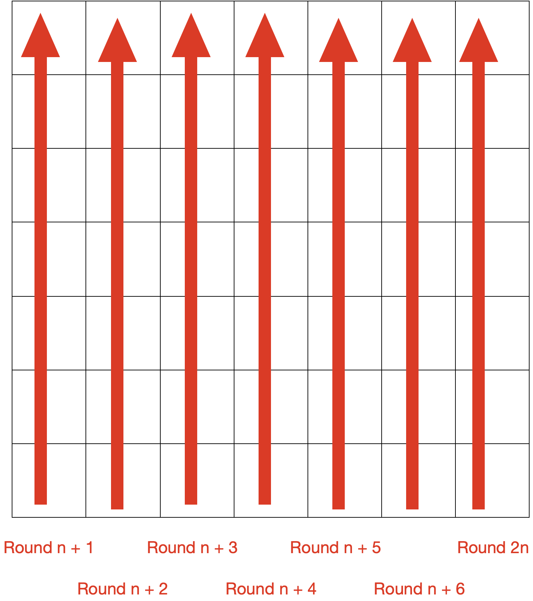
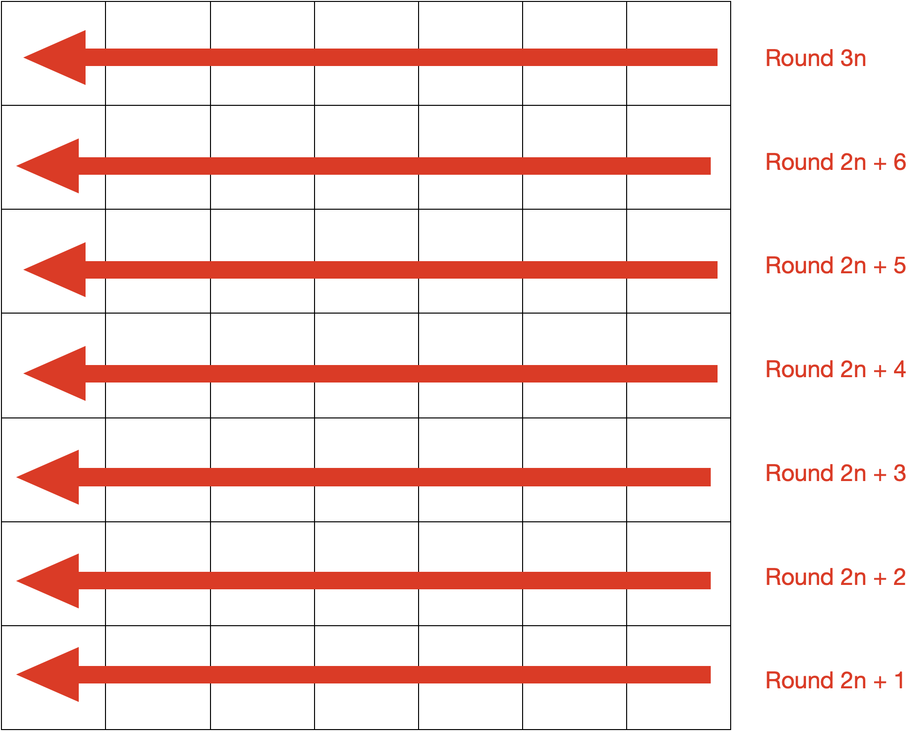
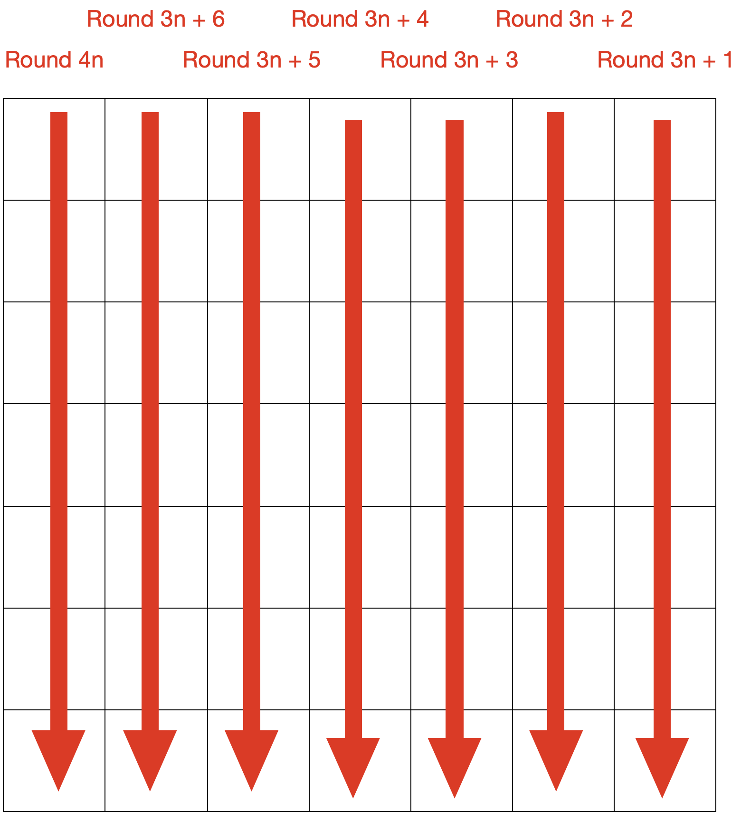
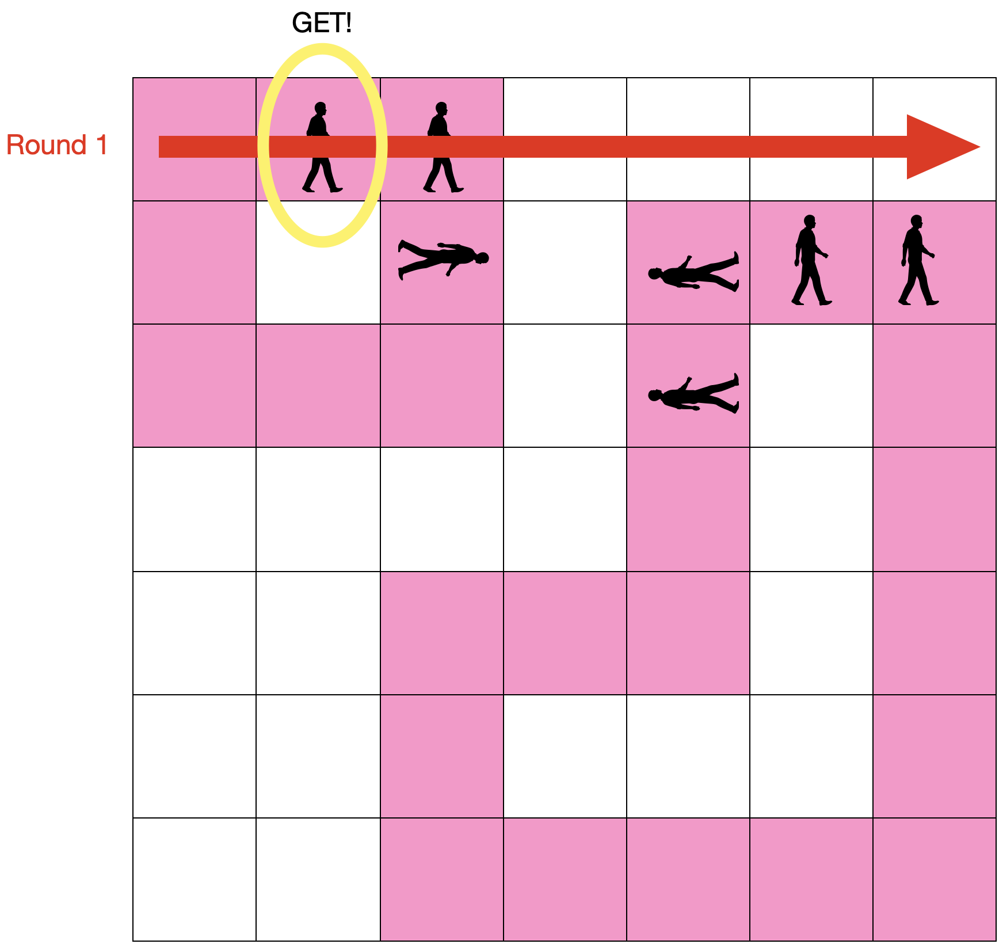
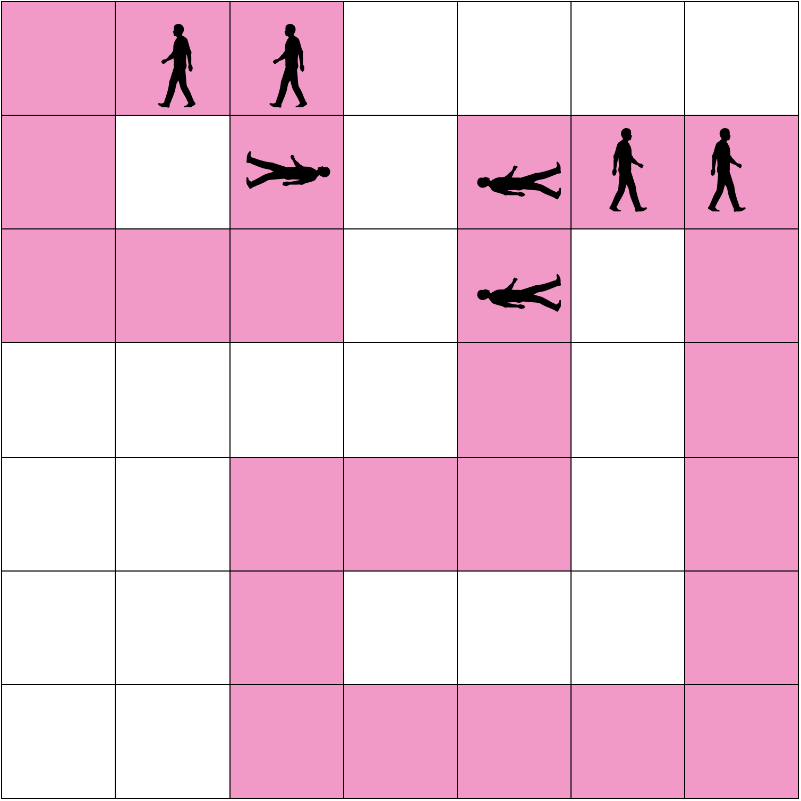
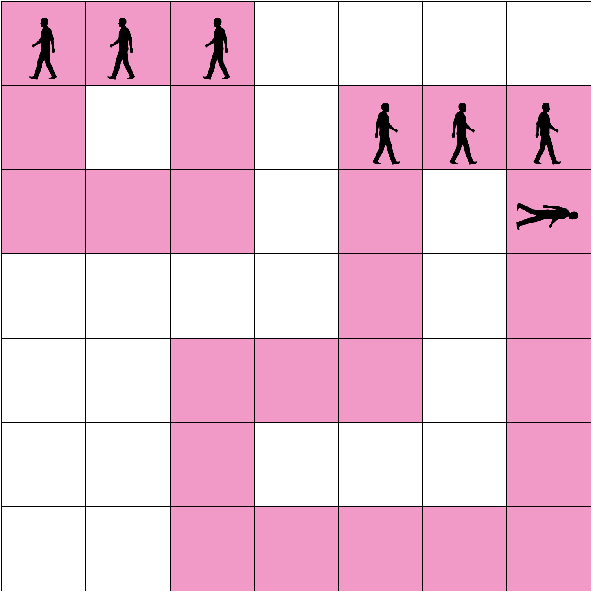
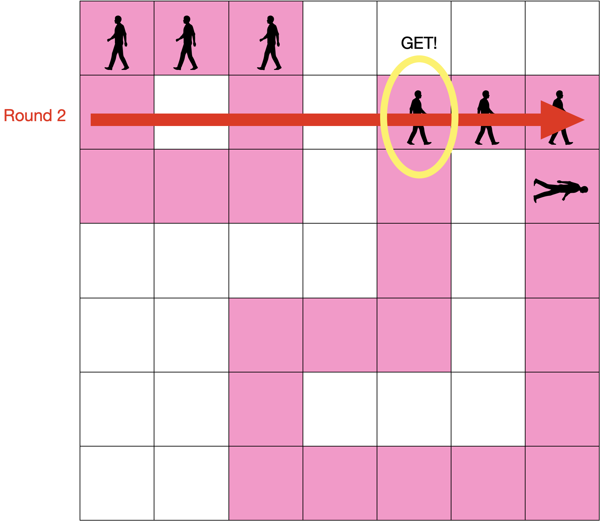

## 꼬리 잡기

<https://www.codetree.ai/training-field/frequent-problems/problems/tail-catch-play/description?page=4&pageSize=5>

### 문제

n * n 격자에서 꼬리잡기놀이를 진행합니다. 꼬리잡기놀이는 다음과 같이 진행됩니다.   
3명 이상이 한 팀이 됩니다. 모든 사람들은 자신의 앞 사람의 허리를 잡고 움직이게 되며, 맨 앞에 있는 사람을 머리사람, 맨 뒤에 있는 사람을 꼬리사람이라고 합니다. 각 팀은 게임에서 주어진 이동 선을 따라서만 이동합니다. 각 팀의 이동 선은 끝이 이어져있습니다. 각 팀의 이동 선은 서로 겹치지 않습니다.   
다음과 같이 초기 조건이 주어질 수 있습니다.   
<div style="text-align : center;">
    
</div>
게임은 라운드 별로 진행이 되며, 한 라운드는 다음과 같이 진행됩니다.   

1. 먼저 각 팀은 머리사람을 따라서 한 칸 이동합니다.
<div style="text-align : center;">
    
</div>

2. 각 라운드마다 공이 정해진 선을 따라 던져집니다. n개의 행, n개의 열이 주어진다고 했을 때 공이 던져지는 선은 다음과 같습니다.
<div style="text-align : center;">
    
</div>
<div style="text-align : center;">
    
</div>
<div style="text-align : center;">
    
</div>
<div style="text-align : center;">
    
</div>

4n번째 라운드를 넘어가는 경우에는 다시 1번째 라운드의 방향으로 돌아갑니다.
3. 공이 던져지는 경우에 해당 선에 사람이 있으면 최초에 만나게 되는 사람만이 공을 얻게 되어 점수를 얻게 됩니다. 점수는 해당 사람이 머리사람을 시작으로 팀 내에서 k번째 사람이라면 k의 제곱만큼 점수를 얻게 됩니다. 아무도 공을 받지 못하는 경우에는 아무 점수도 획득하지 못합니다. 위의 예시에서 1라운드는 다음과 같이 진행됩니다.
<div style="text-align : center;">
    
</div>


머리사람에서 3번째에 있는 사람이 공을 얻었기 때문에 9(3 * 3)점을 획득하게 됩니다. 공을 획득한 팀의 경우에는 머리사람과 꼬리사람이 바뀝니다. 즉 방향을 바꾸게 됩니다.

4. 다음 라운드는 다음과 같이 진행됩니다.   
    4-1. 1라운드가 끝난 후
<div style="text-align : center;">
    
</div>

4-2. 모든 팀 1칸 이동
<div style="text-align : center;">
    
</div>
4-3. 공 발사(+ 16점)
<div style="text-align : center;">
    
</div>

총 격자의 크기, 각 팀의 위치, 각 팀의 이동 선, 총 진행하는 라운드의 수가 주어질 때 각 팀이 획득한 점수의 총합을 구하는 프로그램을 구하세요.

### 입력
첫 번째 줄에 격자의 크기 n, 팀의 개수 m, 라운드 수 k가 공백을 사이에 두고 주어집니다.   
이후 n개의 줄에 걸쳐 각 행에 해당하는 초기 상태의 정보가 공백을 사이에 두고 주어집니다. 0은 빈칸, 1은 머리사람, 2는 머리사람과 꼬리사람이 아닌 나머지, 3은 꼬리사람, 4는 이동 선을 의미합니다.   
이동 선의 각 칸은 반드시 2개의 인접한 칸만이 존재하고, 하나의 이동 선에는 하나의 팀만이 존재한다고 가정해도 좋습니다.   

- 3 ≤ n ≤ 20
- 1 ≤ m ≤ 5
- 1 ≤ k ≤ 1000

### 해결법
우선 문제에 대한 이해를 먼저 수행했습니다. 팀원들은 **머리 사람을 따라 이동**, **공은 총 4가지의 방식으로 던져짐**, **공을 잡은 인원이 속한 팀은 팀원의 순서가 reverse**   
우선 board에 초기 사람들의 위치가 주어집니다. 그리고 **팀이 이동할 수 있는 레인 1개당 1팀만 존재, 레인은 서로 겹칠 수 없다** 이 점을 고려하여 개발하였습니다.   
일단 board판은 머리 사람은 1, 일반 가운데 사람은 2, 꼬리 사람은 3, 레인은 4, 빈 칸은 0으로 입력이 들어오는데, 이 때 입력 받을 때, 머리 사람의 위치를 header라는 2차원 리스트에 넣으면서, 각 팀 당 머리 사람은 1명씩 존재하니, 머리 사람을 기준으로 팀원을 나눌 수 있게 했습니다. 즉, 1번째 팀은 header[1] = [(0, 1), (0, 2)] 이런식으로 구성되게 했습니다. 그 후, 머리 사람을 기준으로 팀원들을 찾는 함수인 find_member 함수를 **BFS를 이용**하여 구현했습니다. 이 때, 이 **header에 들어오는 순서를 고려**하기 위해, **머리 사람 바로 다음 사람은 2번 사람이 들어오게 2의 값의 경우 appendleft를 이용**하여 deque에 추가했습니다. find_member_all을 통해 모든 팀의 팀원들을 구했습니다.   
그 다음으로는 팀원들의 이동을 구현했습니다. 우선 머리 사람이 이동하면, 그 레인을 따라 나머지 인원들이 쭈욱 열차같이 움직여야 합니다. 이 때, 처음에는 **머리 사람이 움직일 수 있는 4방향(상,하,좌,우)를 확인하여 4번이 존재할 시 그 방향**으로 머리 사람 이동 시킨 후, **이동한 사람의 이전 위치를 다음 사람의 위치로 스왑**을 통해, 모두 열차같이 움직이도록 구현했습니다. 근데, 여기서 테스트 케이스의 경우 모두 레인에 팀원들로 모두 꽉차 있는 경우가 존재해, 이를 고려해주기 위해, 추가적으로 **머리 사람이 갈 수 있는 방향 중 4의 값이 없다면, 꼬리 사람인 3번의 방향을 찾도록 반목문을 2번** 돌았습니다. 이렇게 move 함수를 구현한 후, 모든 팀들의 팀원들이 이동할 수 있게 move_all 함수를 호출하게됩니다.   
여기서 move를 하게 되면, header 리스트의 값이 바뀌게 되고, 이를 기반으로 보드 판을 다시 업데이트하기 위해 update_board라는 함수를 구현했습니다. **기존 board에서 0,4의 값인 빈 칸과 레인의 위치만 가진 보드 판에 header를 기준으로 다시 사람들의 위치를 세팅**하게 됩니다.    
그럼 마지막으로 이제 공을 잡는 사람을 찾는 것과 공이 덩져지는 규칙에 대한 함수를 구현해야합니다. 우선 공을 던지는 함수인 throw_ball을 구현하였으며, 라운드에 따라 어떤 규칙으로 공을 던지게 되는지를 정의했습니다. 특정 규칙에 따라 공을 던졌을 때, 제일 먼저 만나는 **사람의 위치를 기반으로 find_index를 통해, 그 사람이 속한 팀 번호, 그 팀에서 몇번째인지의 정보**를 가져왔습니다. 그 후, 그 팀의 순서를 reverse해주었고, 그 값을 최종 점수에 추가해주었습니다. 이 때, 만약 공을 아무도 잡는 사람이 없는 경우도 발생하기 때문에, 항상 초기값을 -1로 설정하여 -1이 아닐 시에만 동작하게 했습니다.   
<br>
우선 이렇게 구현하고 테스트를 해보았지만, 한 가지 간과한게 있어서 시간을 좀 잡아먹었습니다. 이 때, header의 팀원들의 순서를 reverse한 후, 이 reverse한 결과를 다시 보드에 세팅을 안해준 부분 이었습니다.   
```python
import copy
from collections import deque

# 3명 이상 한팀, 머리 사람 : 맨 앞 사람, 꼬리 사람 : 맨 뒤 사람
# 1. 머리 사람 따라 이동
# 2-1. 1 ~ n 라운드 : 좌 -> 우로 공(순서 : 상 -> 하)
# 2-2. n+1 ~ 2n 라운드 : 하 -> 상 공(좌 -> 우)
# 2-3. 2n +1 ~ 3N 라운드 : 우 -> 좌 공(하 -> 상)
# 2-4. 3n + 1 ~ 4n 라운드 : 상 -> 하 공(우 -> 좌)
# 3. 공이 던져진 라운드에 최초의 사람을 만나게 될 시, 머리사람 기준 k번째 사람은 k^2만큼 점수 획득(3명시 꼬리사람 : 3번 사람)
# 3. -> 공 획득 팀은 머리와 꼬리 사람 변경

# 격자 크기, 팀의 개수, 라운드 수
n, m, k = map(int, input().split())

header = [[] for _ in range(m + 1)]
# 각 팀의 점수
scores = [0] * (m + 1)

# 보드
board = []
for x in range(n):
    # 0: 빈칸, 1: 머리사람, 2: 일반사람, 3: 꼬리사람, 4: 이동 선
    data = list(map(int, input().split()))
    board.append(data)

# 머리 사람 위치 저장
header_idx = 1
for x in range(n):
    for y in range(n):
        if board[x][y] == 1:
            header[header_idx].append((x, y))
            header_idx += 1

dx = [1, -1, 0, 0]
dy = [0, 0, 1 ,-1]

visited = [[False] * n for _ in range(n)]

# 머리 사람 기준 팀원 찾기
def find_member(_x, _y, _idx, _header):
    visited[_x][_y] = True
    q = deque()
    q.append((_x, _y))
    while q:
        x, y = q.popleft()
        if board[x][y] == 2 or board[x][y] == 3:
            _header[_idx].append((x, y))
        for i in range(4):
            nx, ny = x + dx[i], y + dy[i]
            if 0 <= nx < n and 0 <= ny < n:
                if not visited[nx][ny]:
                    # 일반 사람의 경우 먼저 확인하게 수행
                    if board[nx][ny] == 2:
                        visited[nx][ny] = True
                        q.appendleft((nx, ny))
                    elif board[nx][ny] == 3:
                        visited[nx][ny] = True
                        q.append((nx, ny))
# 팀원 찾기
def find_member_all(_header):
    for i in range(1, m+1):
        x, y = header[i][0]
        find_member(x, y, i, _header)

# 머리 사람따라 이동
def move(_idx, _header):
    # 머리 사람 현재 위치
    sx, sy = _header[_idx][0]
    # 머리 사람이 다음으로 가야하는 위치
    snx, sny = -1, -1
    # 레인이 꽈 찼는지 확인
    is_full = False
    # 가야하는 방향 찾기
    # print('이동 전 header : ', _header)
    # print('현재 헤더 위치 : ', sx, sy)
    # print(board)
    for i in range(4):
        nx, ny = sx + dx[i], sy + dy[i]
        # print('확인해보는 위치 : ', nx, ny)
        if 0 <= nx < n and 0 <= ny < n and board[nx][ny] == 4:
            snx, sny = nx, ny
            _header[_idx][0] = (snx, sny)
            # break
        ######################################
        # 팀 레인에 사람이 꽉차 있는 경우 -> 기차 놀이
        # 만약 5개짜리 레인일 때, 5명인 1 2 2 2 3 로 존재할시, 이동시 2 2 2 3 1로 이동
        # 즉 이동을 함
        #######################################
        elif 0 <= nx < n and 0 <= ny < n and board[nx][ny] == 3:
            is_full = True
    # print(is_full)
    # 가야하는 방향 찾기
    if is_full:
        for i in range(4):
            nx, ny = sx + dx[i], sy + dy[i]
            if 0 <= nx < n and 0 <= ny < n and board[nx][ny] == 3:
                snx, sny = nx, ny
                _header[_idx][0] = (snx, sny)
                break

    if (snx, sny) != (-1, -1):
        # print('이동해야할 위치 : ', sx, sy, snx, sny)
        # 현재 팀의 인원 수
        team_size = len(_header[_idx])
        for i in range(1, team_size):
            # 이동하기 전 위치
            px, py = _header[_idx][i]
            _header[_idx][i] = (sx, sy)
            # 다음 사람이 이용해야 할 위치 변경
            sx, sy = px, py

# 모든 팀들이 다 이동
def move_all(_header):
    for i in range(1, m + 1):
        move(i, _header)

# 보드 업데이트
def update_board(_header, _board):
    # 보드 복사(팀원들 현재 위치 제거)
    new_board = [[4 if ele == 2 or ele == 3 or ele == 1 else ele for ele in row] for row in board]
    for i in range(1, m + 1):
        team_size = len(_header[i])
        for k in range(team_size):
            x, y =_header[i][k]
            # 머리 사람
            if k == 0:
                new_board[x][y] = 1
            # 꼬리 사람
            elif k == team_size - 1:
                new_board[x][y] = 3
            # 일반 사람
            else:
                new_board[x][y] = 2
    return new_board

def find_index(_x, _y):
    global header
    for i in range(1, m + 1):
        if (_x, _y) in header[i]:
            idx = header[i].index((_x, _y))
            header[i].reverse()
            return i, idx + 1
    return -1, -1

# 공 던지기(현재 라운드, 보드)
def throw_ball(round, _board):
    global scores
    real_round = round % n
    cur_round = round // n
    # 0 ~ n-1 : 0, n ~ 2n -1 : 1, 2n ~ 3n -1 : 2, 3n ~ 4n -1 : 3
    # 4n ~ 5n - 1 : 4, 5n ~ 6n - 1: 5, 
    cur_round = cur_round % 4

    # print('round', cur_round, real_round)

    team_idx, score = -1, -1
    # 첫번째 라운드 : 좌 -> 우 로 공 던지기
    if cur_round == 0:
        team_idx, score = first_rule(real_round, _board)
    # 두번째 라운드 : 하 -> 상 로 공 던지기
    elif cur_round == 1:
        team_idx, score = sec_rule(real_round, _board)
    # 세번째 라운드 : 우 -> 좌 로 공 던지기
    elif cur_round == 2:
        team_idx, score = third_rule(n - 1 - real_round, _board)
    elif cur_round == 3:
        team_idx, score = fourth_rule(n - 1 - real_round, _board)

    # print(f'team : {team_idx}, socre {score**2} ')
    # 공을 잡은 팀이 있는 경우
    if team_idx != -1 and score != -1:
        scores[team_idx] += (score**2)


# 첫번째 라운드 규칙
def first_rule(_x, _board):
    for y in range(n):
        # 첫번째로 공을 잡는 사람
        if _board[_x][y] != 0 and _board[_x][y] != 4:
            team_idx, score = find_index(_x, y)
            # print(f'first : {_x, y}')
            return team_idx, score
    return -1, -1

# 두번째 라운드 규칙
def sec_rule(_y, _board):
    for x in range(n - 1, -1, -1):
        # 첫번째로 공을 잡는 사람
        if _board[x][_y] != 0 and _board[x][_y] != 4:
            team_idx, score = find_index(x, _y)
            # print(f'sec : {x, y}')
            return team_idx, score
    return -1, -1

# 세번째 라운드 규칙
def third_rule(_x, _board):
    for y in range(n - 1, -1, -1):
        # 첫번째로 공을 잡는 사람
        if _board[_x][y] != 0 and _board[_x][y] != 4:
            team_idx, score = find_index(_x, y)
            # print(f'thrid : {_x, y}')
            return team_idx, score
    return -1, -1

# 네번째 라운드 규칙
def fourth_rule(_y, _board):
    for x in range(n):
        # 첫번째로 공을 잡는 사람
        if _board[x][_y] != 0 and _board[x][_y] != 4:
            team_idx, score = find_index(x, _y)
            # print(f'fourth : {x, _y}')
            return team_idx, score
    return -1, -1


# 초기화(세팅)
find_member_all(header)

for r in range(k):
    # print('round : ', r+1)
    move_all(header)
    # print(header)
    board = update_board(_header=header, _board=board)
    # for row in board:
    #     print(row)
    throw_ball(r, board)
    # print(header)
    # print(sum(scores))
    # 공을 잡았을 시, 팀이 바뀔 경우 보드에 업데이트
    board = update_board(header, board)
    # print()
print(sum(scores))
```