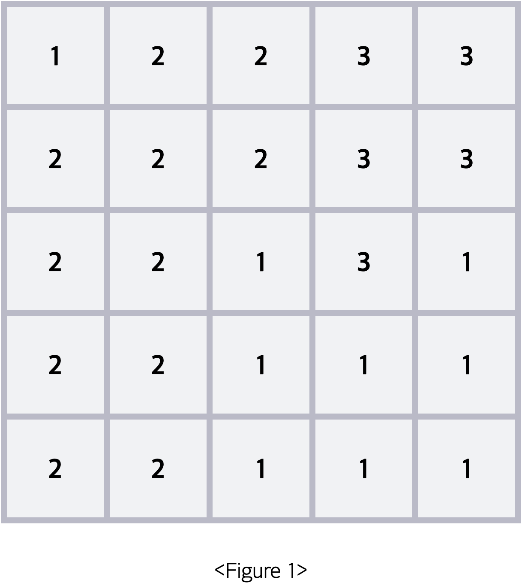
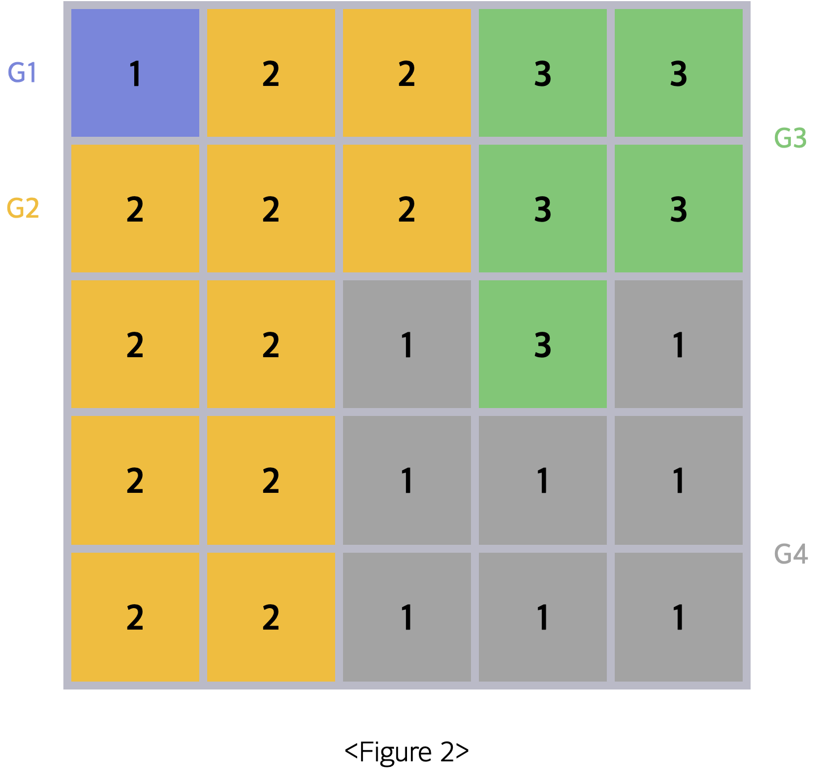
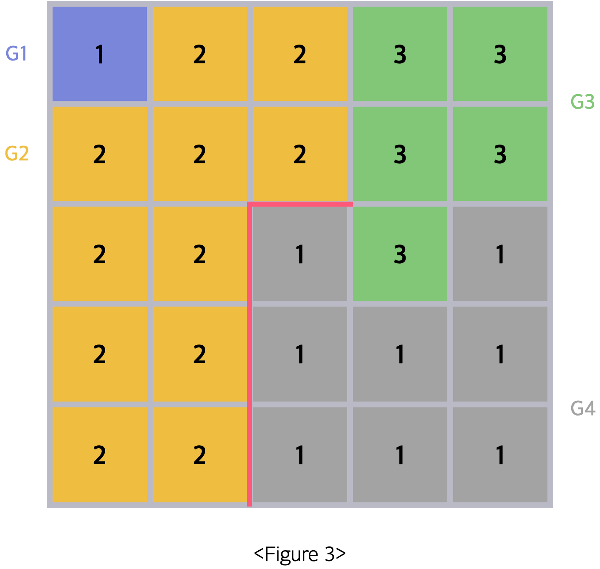
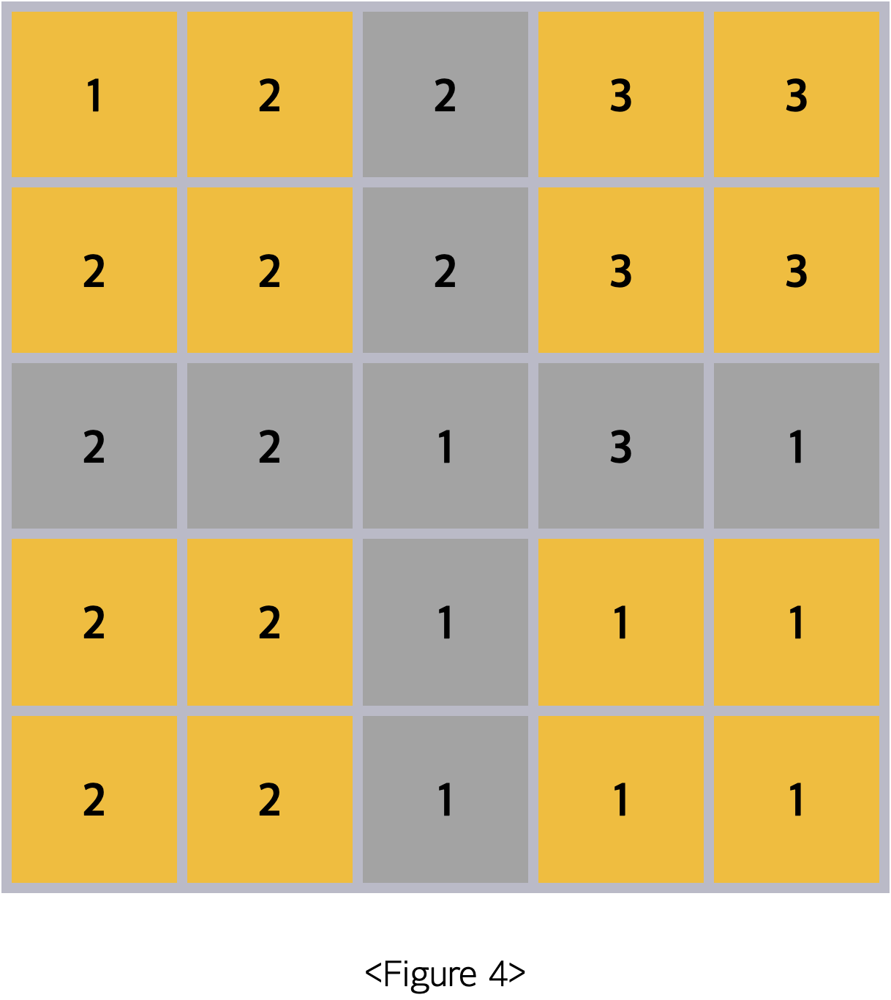
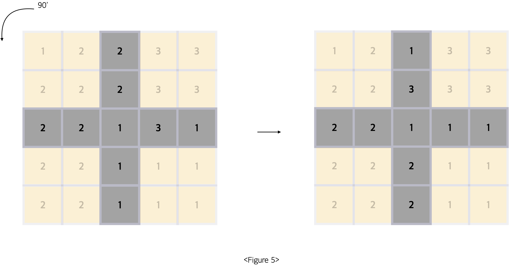
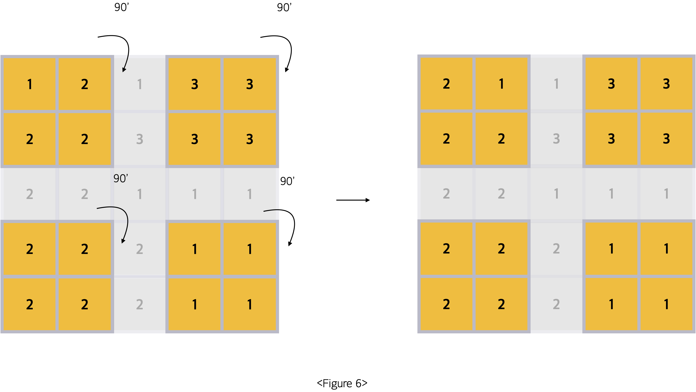
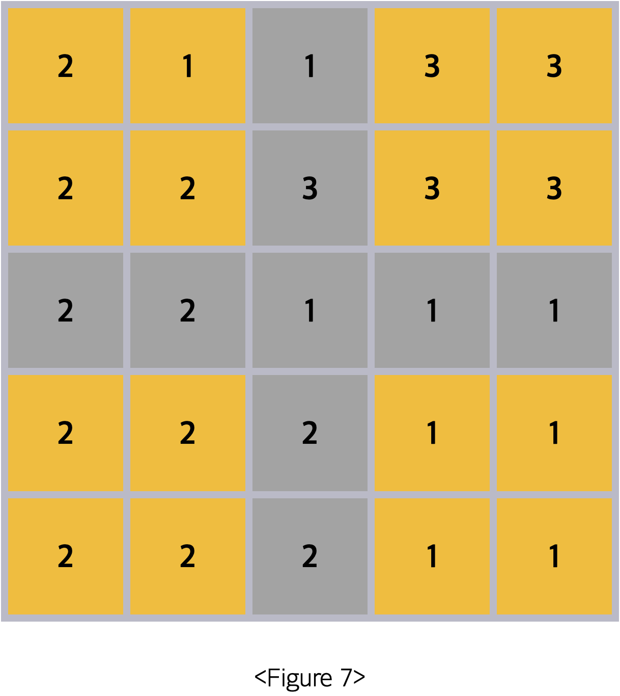

## 예술성

<https://www.codetree.ai/training-field/frequent-problems/problems/artistry/description?page=4&pageSize=5>

### 문제
예술가 Sam은 그림에 대한 예술성을 평가하는 알고리즘을 만들어냈습니다. 그림을 편의상 n * n 크기의 격자로 생각하고, 각 칸의 색깔을 1이상 10이하의 숫자로 표현하여 이 알고리즘을 적용해보려 합니다.   

다음은 5 * 5 크기의 그림의 예시입니다.   
<div style="text-align : center;">
    
</div>   

먼저 이 그림에서 동일한 숫자가 상하좌우로 인접해있는 경우 동일한 그룹이라 본다면, 총 4개의 그룹이 만들어지게 됩니다.   

<div style="text-align : center;">
    
</div>   


예술 점수는 모든 그룹 쌍의 조화로움의 합으로 정의됩니다. 그룹 a와 그룹 b의 조화로움은 (그룹 a에 속한 칸의 수 + 그룹 b에 속한 칸의 수 ) x 그룹 a를 이루고 있는 숫자 값 x 그룹 b를 이루고 있는 숫자 값 x 그룹 a와 그룹 b가 서로 맞닿아 있는 변의 수로 정의됩니다.   

예로 <Figure 2> 에서 두 그룹 G2, G4의 조화로움은 (11 + 8) x 2 x 1 x 4 = 152가 됩니다.   

<div style="text-align : center;">
      
</div>   


그룹 쌍 간의 조화로움 값이 0보다 큰 조합인 (G1, G2), (G2, G3), (G2, G4), (G3, G4) 의 조화로움 값을 전부 더하면 48 + 192 + 152 + 156 = 548이 됩니다. 이를 초기 예술 점수라 부르겠습니다.   

초기 예술 점수를 구한 뒤에는 그림에 대한 회전을 진행합니다.   

회전은 정중을 기준으로 두 선을 그어 만들어지는 십자 모양과 그 외 부분으로 나뉘어 진행됩니다.   

<div style="text-align : center;">
      
</div>   


십자 모양의 경우 통째로 반시계 방향으로 90' 회전합니다.   
<br>
<div style="text-align : center;">
      
</div>   


십자 모양을 제외한 4개의 정사각형은 각각 개별적으로 시계 방향으로 90'씩 회전이 진행됩니다.   
<br>
<div style="text-align : center;">
     
</div>   

두 부분에 대한 회전이 동시에 진행되므로 회전 이후 <Figure 4>는 다음 모습이 됩니다.   
<br>
<div style="text-align : center;">
     
</div>   


### 입력
첫 번째 줄에 n이 주어집니다. n은 반드시 홀수입니다.
이후 n개의 줄에 걸쳐 각 행에 칠해져 있는 색깔에 대한 정보인 숫자들이 공백을 사이에 두고 주어집니다.

- 3 ≤ n ≤ 29
- 1 ≤ 주어지는 숫자 ≤ 10

### 해결법
이번 문제는 처음에 크게 구현해야할 부분을 고려해보면, 크게 3가지라고 생각했습니다. 그룹 나누기, 그룹 점수, 배열 회전    
우선 그룹 나누기를 구현했습니다. 그룹 나누기는 BFS를 통해, 같은 값이어진 곳을 상하좌우 4방향으로 최대한 갈 수 잇는 곳들이 그룹으로 됩니다. 이 때, 그룹을 설정하는 새로운 group_board라는 2차원 배열을 만들어, 여기 그룹 번호를 대입시켰습니다. 그 이유는 처음에 1번값을 가지는 그룹이 2개인데, 이 때 어떻게 구분선 개수를 다르게 셀지를 고민했기 때문입니다. 따라서 split_group 함수를 통해 새로운 그룹 구분 보드판을 만들었습니다.   
그후 get_adj_group이라는 함수를 구현했습니다. 이 함수는 만약 1번 그룹에 2번 그룹으로 갈 수 있는 방향이 총 2개라면 구분선이 2개가 됩니다. 또한, 2번 그룹에서는 3번과 1의 그룹 2개가 인접해있는데, BFS로 갈 수 잇는 곳은 3번 그룹과는 인접한 2개를 통해, 1번은 인접한 4개를 통해 갈 수 있습니다. 이 값이 곧 경계썬을 의미하게됩니다. 이 경계선을 담을 딕셔너리인 line_dict을 채워주는 함수입니다.    
그 다음 조화로움의 점수를 내는, get_score 함수를 구현했습니다. 이 함수는 group_dict이라는 각 그룹 번호에 몇개의 원소가 있는지를 나타내는 딕셔너리와 line_dict이라는 1번 그룹과 2번그룹의 경계썬 개수와 같은 값을 담고 있는 line_dict을 인자로 받습니다. 따라서 이를 통해 조화로움 식에 맞춰 조화로움 값을 계산하게 됩니다.   
그럼 1차적으로 그룹 구분 + 조화로움 점수를 얻는 스텝을 합친 get_group이라는 함수를 만들었습니다.   
처음에는 초기화, 1번 회전 후, 2번 회전 후, 3번 회전 후와 같이 총 4번의 시뮬레이션이 동작하게 됩니다. 따라서 이제는 배열 회전을 구현해야합니다.   
우선 십자가 모양으로 가운데는 반시계 90도 방향, 십자가로 통해 생기는 4등분의 배열을 시계방향 90도 회전을 하게됩니다. 여기서 4등분 배열을 빠르게 나눌 방법이 생각이 안나서 우선 빠르게 구현하고자 하드 코딩 방시긍로 나눴습니다.   
그럼 이제 시뮬레이션 대로, 1. 그룹을 나누기 2.조화로움 점수 얻기 3. 배열 회전 이렇게 수행을 총 4번을 하게되면 최종 조화로움 합을 얻을 수 있습니다.   


```python
from collections import deque

# 1. BFS로 그룹 묶끼
# 2. a,b의 조화로움 = (a개수 + b개수) x a의 값 x b의 값 x ab의 경계 선 개수
# 3. 0보다큰 조화로움의 조합들의 점수 합 = 초기 예술 점수
# 4. 회전 : 가운데 기준 십가로 나누어 4등분, 십자가는 반시계 90도 방향 회전, 각 4등분은 시계 방향 90도로 회전
# 5. 1회 회전후 예술 점수 획득, 이를 총 3회 회전 예술점수까지 획득

n = int(input())

board = []
total_group_type = set()

dx = [1, -1, 0, 0]
dy = [0, 0, 1, -1]

for _ in range(n):
    data = list(map(int, input().split()))
    board.append(data)
    for val in data:
        total_group_type.add(val)

# 전체 그룹 번호 개수
total_group_cnt = len(total_group_type)

def get_dict(_dict, val):
    if val in _dict.keys():
        _dict[val] += 1
    else:
        _dict[val] = 1

def is_range(_x, _y):
    if 0 <= _x < n and 0 <= _y < n:
        return True
    else:
        return False

# 그룹 나누기 -> 그룹 번호, 방문, 좌표, 보드, 그룹의 개수, 그룹 구분 보드
def split_group(_n, _visited, _x, _y, _board, groups_dict, _groups_board):
    _visited[_x][_y] = True
    group_num = _board[_x][_y]
    _groups_board[_x][_y] = _n
    q = deque()
    q.append([_x, _y])
    get_dict(groups_dict, (_n, group_num, _x, _y))
    while q:
        x, y = q.popleft()
        for i in range(4):
            nx, ny = x + dx[i], y + dy[i]
            if is_range(nx, ny) and not _visited[nx][ny]:
                # 같은 그룹으로 묶여야할 때
                if _board[nx][ny] == group_num:
                    q.append([nx, ny])
                    _visited[nx][ny] = True
                    _groups_board[nx][ny] = _n
                    get_dict(groups_dict, (_n, group_num, _x, _y))


# 인접한 그룹과 그룹 구분선 개수
def get_adj_group(_visited, _x, _y, _board, _group_board):
    _visited[_x][_y] = True
    group_num = _board[_x][_y]
    q = deque()
    q.append([_x, _y])
    line_dict = dict()
    while q:
        x, y = q.popleft()
        for i in range(4):
            nx, ny = x + dx[i], y + dy[i]
            if is_range(nx, ny) and not _visited[nx][ny]:
                # 같은 그룹일 때, 이동
                if _board[nx][ny] == group_num:
                    q.append([nx, ny])
                    _visited[nx][ny] = True
                # 다른 그룹일 때
                else:
                    get_dict(line_dict, (group_num, _board[nx][ny], _group_board[_x][_y], _group_board[nx][ny]))

    return line_dict


# 점수 획득
# a,b의 조화로움 = (a개수 + b개수) x a의 값 x b의 값 x ab의 경계 선 개수
def get_score(line_dict, group_dict, _groups_board):
    scores = 0
    for (real_a, real_b, ga, gb), abval in line_dict.items():
        a_val = 0
        b_val = 0
        for (gn, gv, sx, sy), group_cnt in group_dict.items():
            # a 그룹과 같을 시
            if gn == ga:
                a_val = group_cnt
            if gn == gb:
                b_val = group_cnt
        # 조화로움
        score = (a_val + b_val) * real_a * real_b * abval
        scores += score
    return scores


# 그룹 나누고 예술성 점수 획득
def get_group(_board):
    groups_board = [[0] * n for _ in range(n)]
    visited = [[False] * n for _ in range(n)]
    # (n번 그룹, 그룹의 값, 시작 좌표) : 개수
    groups_dict = dict()
    gcnt = 1
    for x in range(n):
        for y in range(n):
            if not visited[x][y]:
                split_group(gcnt, visited, x, y, _board, groups_dict, groups_board)
                gcnt += 1
    # 구분선 개수 획득
    visited = [[False] * n for _ in range(n)]
    result = 0
    for (gn, gval, cx, cy), group_cnt in groups_dict.items():
        if not visited[cx][cy]:
            # (실제 a그룹 값, 실제 b그룹 값, 그룹을위해 지정한 a그룹 번호, 그룹을 위해 지정한 b그룹 번호,시작 좌표) : 구분선 개수
            line_dict = get_adj_group(visited, cx, cy, _board, groups_board)
            # 예술 점수 획득
            result += get_score(line_dict, groups_dict, groups_board)

    return result

def rotate_board(_board):
    # 십자가 반시계 방향
    new_n = n // 2
    new_board = [[0] * n for _ in range(n)]
    # 가로 축 채우기
    for y in range(n):
        # 십자가 가운데는 그대로
        if y == new_n:
            new_board[new_n][y] = _board[new_n][y]
        # 십자가 제외
        else:
            new_board[new_n][y] = _board[y][new_n]
    # 세로 축 채우기
    for x in range(n):
        # 십자가 가운데는 그대로
        if x == new_n:
            new_board[x][new_n] = _board[x][new_n]
        # 십자가 제외
        else:
            new_board[x][new_n] = _board[new_n][(n - 1) - x]

    # 각 4등분 시계방향 회전
    # 왼쪽위 시작 좌표 : (0,0) ~ (new_n - 1, new_n - 1), (new_n + 1, 0) , (0, new_n + 1), (new_n + 1, new_n + 1)
    # 왼쪽위, 왼쪽 아래, 오른쪽 위, 오른쪽 아래
    first_board = [[0] * new_n for _ in range(new_n)]
    sec_board = [[0] * new_n for _ in range(new_n)]
    thrid_board = [[0] * new_n for _ in range(new_n)]
    fourth_board = [[0] * new_n for _ in range(new_n)]

    for x in range(new_n):
        first_board[x] = _board[x][:new_n]
        sec_board[x] = _board[new_n + 1 + x][:new_n]
        thrid_board[x] = _board[x][new_n + 1:]
        fourth_board[x] = _board[new_n + 1 + x][new_n + 1:]

    new_board = rotate_90(first_board, 0, 0, new_board)
    new_board = rotate_90(sec_board, new_n + 1, 0, new_board)
    new_board = rotate_90(thrid_board, 0, new_n + 1, new_board)
    new_board = rotate_90(fourth_board, new_n + 1, new_n + 1, new_board)

    return new_board

def rotate_90(_board, sx, sy, _new_board):
    new_n = len(_board[0])
    for x in range(new_n):
        for y in range(new_n):
            _new_board[sx + x][sy + y] = _board[new_n - 1 - y][x]

    return _new_board


result = 0


for _ in range(4):
    result += get_group(board)
    board = (rotate_board(board))

print(result)
```