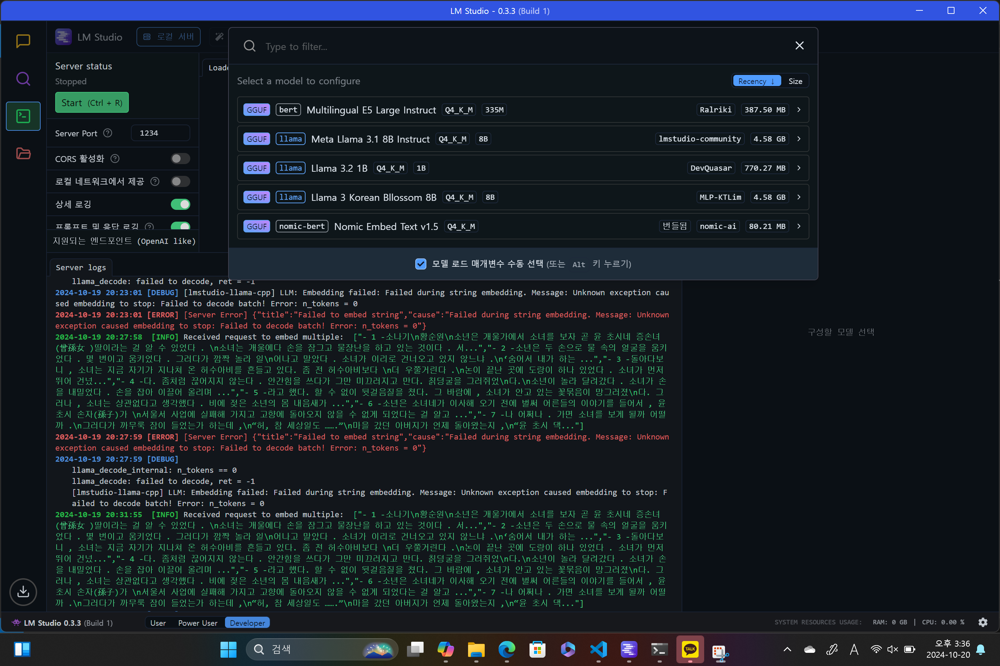

# LM Studio
이번 절에서는 LLM 모델을 간편하게 이용할 수 있도록 도와주는 애플리케이션인 LM Studio에 대해 알아보겠습니다.   
LM Studio를 이용하면, 직접 Local PC에서 서버를 띄어 Local 모델을 불러와서 테스트를 해볼 수 있습니다. 물론, OPENAI의 API키를 결제하거나 HuggingFace에서 모델을 로드하여 할 수도 있지만, 직접 내 PC Local에서 서버를 띄어 모델을 콜해서 사용해보고 싶은 경우, 매우 유용하다고 생각합니다.    
<a href="https://lmstudio.ai/" target="_blank">LM Studio</a> 첨부된 링크에서 자신의 PC에 맞는 아키텍처의 LM Studio 프로그램을 설치해주시면 됩니다.   
<div style="text-align : center;">
    
</div>   
설치를 완료하신 후, 실행을 시키면 상기와 같은 화면을 찾으실 수 있으실 겁니다. 상기의 메뉴에서는 현재 오픈소스로 오픈된 모델들을 검색하여 직접 로컬에 다운을 받으실 수 있습니다. HuggingFace에 올라온 대부분의 오픈소스 모델들은 모두 제공이 됩니다. 저의 경우 PC성능이 그렇게 좋지 못하기 때문에, Quantization이 된 모델들인 gguf 모델을 로컬에 설치하였습니다.   
<div style="text-align : center;">
    
</div>   
이제 Developer 모드로 선택을 한 후, 설치한 모델들을 상기의 이미지와 같이 확인하실 수 있습니다. 원하는 모델을 클릭하신 후, Start 버튼을 클릭하시면 "http://127.0.0.1:1234/v1"에 모델이 올라오는 것을 하기의 이미지와 같이 확인할 수 있으실겁니다.   
<div style="text-align : center;">
    
</div>   
이렇게 하시면, 이제 제 Local 서버에 모델을 올리는 작업이 끝이 났습니다.   

# 모델 Load
이제 이 모델들을 Langchain과 연동해서 어떻게 사용하는지에 대해 알아보겠습니다.   
우선 제 서버에서 서버에 올린 "meta-llama-3.1-8b"을 통해 간단한 질문에 대해 inference하는 코드를 알려드리겠습니다.   
```python
from langchain_openai import OpenAI

llm = OpenAI(base_url="http://127.0.0.1:1234/v1", api_key="meta-llama-3.1-8b-instruct")

print(llm.invoke("안녕 만나서 반가워, 너의 이름은 무엇이니?"))
```
상기와 같은 코드에 대해 간략하게 설명하겠습니다. 우선 제가 Local 서버의 주소는 "http://127.0.0.1:1234/v1"가 됩니다. 이 서버에서 어떤 모델을 Load할지를 api_key값에 넣어주면 끝입니다.   
상기와 같이 작성을 하시면, Local서버에 올린 모델을 편리하게 로드하고 원하시는 애플리케이션 개발을 편리하게 진행하실 수 있으실겁니다. 또한, Langchain_opeanai의 OpenAI에서 제공되는 메서드를 이용하실 수도 있습니다.   
<br>
그럼 이제 Embedding 모델을 로드하는 방법에 대해 알려드리겠습니다. 상기의 이미지에서 볼 수 있듯이 저는 현재 Local 서버에서 "meta-llama-3.1-8b-instruct"인 LLM 모델과 "multilingual-e5-large-instruct" Embedding 모델 2개를 올려놓은 상태입니다. 그럼 이번에는 "multilingual-e5-large-instruct"을 어떻게 Call하여 사용하는지에 대해 알려드리겠습니다.   
```python
from langchain_openai import OpenAIEmbeddings
embedding = OpenAIEmbeddings(base_url='http://localhost:1234/v1', check_embedding_ctx_length=False,
                             api_key='multilingual-e5-large-instruct')

vector = embedding.embed_query("Cat is animal.")
print(vector[:3])
```
상기와 같은 코드에 대해 간략하게 설명하겠습니다. 이전 LLM 모델 Load와 동일하지만, 이번에는 Embedding 모델이니 api_key값에 Embedding 모델의 api_key값을 넣어주시면 됩니다. 하지만, 여기서 **check_embedding_ctx_length값을 False**로 해주셔야, Embedding 모델이 Load가 됩니다. 현재 그 이유는 저도 정화하게 파악하지는 못했지만, 알게된다면 추가적으로 작성을 해놓겠습니다.   
상기와 같이 작성을 하시면, LLM 모델과 똑같이 langchain의 OpenAIEmbeddings에서 제공되는 메서드를 이용하실 수 있습니다.   
