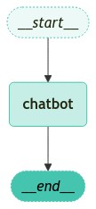

하기의 내용은 <a href="https://wikidocs.net/233801" target="_blank">LangChain 노트</a> 기반으로 작성했습니다.


## Graph Structure
이번 절에서는 LangGraph을 이용하여 아주 간단한 챗봇을 만들어보겠습니다. 매우 간단한 구조를 띄고 있지만, 이 구조를 통해 LangGraph가 어떻게 구성되고 동작하는지를 잘 알아볼 수 있을 것입니다. LangGraph는 말그대로 Graph구조의 자료구조형태를 띄고 있으며, Node와 Edge로 연결되어 정보를 전달하게됩니다.   
그래프를 생성하기 위해서는 **StateGraph**이 Object를 통해 생성을 시작하며, 이 정보를 Node로 정의하여 다음 Node로 전달하는 식으로 다음 Node로 정보를 전달할 수 있습니다.   
<div style="text-align : center;">
    
</div>   

그럼 이제 상기의 구조를 띄는 LangGraph를 만들어 보겠습니다.   

<br>
<span style='color:blue'>**① 상태(State)정의**</span>   

```python
from typing import Annotated, TypedDict
from langgraph.graph import StateGraph, START, END
from langgraph.graph.message import add_messages


class State(TypedDict):
    # 메시지 정의(list type 이며 add_messages 함수를 사용하여 메시지를 추가)
    messages: Annotated[list, add_messages]
```
<br>
<span style='color:blue'>**② 노드(Node)정의**</span>  

```python
from langchain_openai import ChatOpenAI

llm = ChatOpenAI(base_url="http://127.0.0.1:1234/v1", temperature=0, api_key="meta-llama-3.1-8b-instruct")
# 챗봇 함수 정의
def chatbot(state: State):
    # 메시지 호출 및 반환
    return {"messages": [llm.invoke(state["messages"])]}
```

상기의 코드는 chatbot이라는 Node를 정의하는 작업입니다. State에 정의했던 messages에 대한 LLM이 추론한 결과를 다시 messages에 담아 반환하는 역할을 수행합니다.   
<br>
<span style='color:blue'>**③ 그래프(Graph)정의**</span>   

```python
# 그래프 생성
graph_builder = StateGraph(State)

# 노드 이름, 함수 혹은 callable 객체를 인자로 받아 노드를 추가
graph_builder.add_node("chatbot", chatbot)
graph_builder.add_edge(START, "chatbot")
graph_builder.add_edge("chatbot", END)

```
상기의 코드는 그래프를 정의하고 해당 그래프에 Node와 Edge를 추가하여 Graph를 만드는 작업을 수행합니다. 우선 제일 처음과 끝은 START와 END로 마무리 또는 시작을 정의하고 여기서 chatbot이라는 Node로 Edge를 추가해주면 상기의 이미지와 같은 구조를 나타내게할 수 있습니다.   

<br>
<span style='color:blue'>**④ 그래프(Graph) 컴파일 및 실행**</span>   

```python
graph = graph_builder.compile()

question = "서울의 유명한 맛집 TOP 10 추천해줘"

# 그래프 이벤트 스트리밍
for event in graph.stream({"messages": [("user", question)]}):
    # 이벤트 값 출력
    for value in event.values():
        print("Assistant:", value["messages"][-1].content)
```

상기와같이 같이 작성해주면 간단한 LangGraph로 구성된 chatbot을 만들 수 있습니다.   
