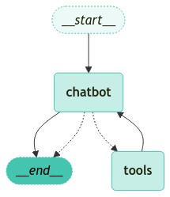

하기의 내용은 <a href="https://wikidocs.net/233801" target="_blank">LangChain 노트</a> 기반으로 작성했습니다.

## Tool
이전 Agent절에서 Tool이 어떤것들과 어떤 역할을 하는지에 대해 알아보았습니다. 간단하게 다시 정리하면, LLM이 Tool을 Binding 후 들어온 요청에 대해 수행할 수 없다면 Tool을 호출하여 답변을 얻어낼 수 있습니다. LangGraph에서는 대부분 Agent를 이용하여 정의하는 것들이 많이 있습니다. 이 때 이전 절에서 설명했듯이 만약 chatbot Node에서 Tool을 호출해야할 경우 LangGraph의 꽃이라고 할 수 있는 **Conditional Edge**을 통해 Tool을 호출할지 말지의 여부를 Agent가 스스로 결정하여 사용자의 입력 요청에 대한 답변을 해주게 될 것 입니다.    
이번 절에서는 가장 간단한 Tool인 TavilySearch Tool을 이용해보도록 하겠습니다. 기억하시겠지만 다시 한번 더 TavilySearch Tool을 정의해보도록 하겠습니다.   
```python
from langchain_community.tools.tavily_search import TavilySearchResults
from dotenv import load_dotenv
import os
# API 키 정보 로드
load_dotenv()
os.environ["TAVILY_API_KEY"] = ""

tool = TavilySearchResults(
    max_results=3
)
tools = [tool]

tool.invoke("AI LLM 최신 뉴스")
```

## Agent + Tool
상기에 간단한 TavilySearch Tool 정의하는 법을 알아보았습니다. 그럼 이번에는 LLM 모델에 해당 Tool을 Binding하여 LangGraph 구조로 만들어보겠습니다.   
저희의 최종 목표는 하기와같은 구조를 띄는 LangGraph를 만드는 것입니다.   
<div style="text-align : center;">
    
</div>   

```python
from typing import Annotated
from typing_extensions import TypedDict
from langgraph.graph.message import add_messages

# State 정의
class State(TypedDict):
    # list 타입에 add_messages 적용(list 에 message 추가)
    messages: Annotated[list, add_messages]

from langchain_openai import ChatOpenAI

# LLM 초기화
llm = ChatOpenAI(base_url="http://127.0.0.1:1234/v1", temperature=0, api_key="meta-llama-3.1-8b-instruct")

# LLM 에 도구 바인딩
llm_with_tools = llm.bind_tools(tools)

# 챗봇 함수 정의
def chatbot(state: State):
    # 메시지 호출 및 반환
    return {"messages": [llm.invoke(state["messages"])]}

from langgraph.graph import StateGraph

# 상태 그래프 초기화
graph_builder = StateGraph(State)

# 노드 추가
graph_builder.add_node("chatbot", chatbot)
```

상기의 코드는 TavilySearch를 Binding한 LLM모델을 LangGraph의 1개의 Node까지 정의를 마치는 코드입니다.   
그런데 여기서 만약 **TavilySearch 도구를 호출하는 경우 실제로 실행할 수 있는 Node도 추가적으로 필요할 것 같다**는 생각을 하실 수 있습니다. 즉, **가장 최근의 메시지를 확인하고 메세지에서 tool을 호출해야한다는 필요성을 느끼면 Tool을 호출하는 <span style='color:blue'>ToolNode</span>가 필요**하다는 의미가 됩니다. LangGraph에서는 이를 위해 ToolNode라는 함수를 제공해줍니다.    

<br>

상기의 이미지에서 보면 chatbot Node에서는 tools로 갈지 END로 갈지에 대한 선택의 갈림길에 있는 것을 확인할 수 있습니다. 이런 선택의 갈림길을 나타내느 것이 LangGraph의 꽃이라고 할 수 있는 <span style='color:red'>**Conditional Edge**</span>입니다. Conditional Edge는 쉽게 말하면 if문의 역할을 한다고 할 수 있습니다. 상기의 이미지에 나타난 구조로 말씀을 드리면, chatbot Node가 Tool를 호출해야한다면 ToolNode쪽으로, 굳이 필요가 없다면 답변 후 END조건으로 가는 역할을 수행해줍니다. 이런 Conditional Edge는 LangGraph에서 **add_conditional_edge**라는 함수를 통해 정의할 수 있습니다.    
여기서 Tool을 호출할지 말지에 대한 route_tools도 다행히 LangGraph의 **tools_condition**함수에서 제공을 해주고 있습니다.   
그럼 이어서 상기의 이미지와 같은 구조의 LangGraph를 만들어 보겠습니다.   

```python
from langgraph.graph import StateGraph, START, END
from langgraph.prebuilt import ToolNode, tools_condition

# ToolNode로 tools들 정의
tool_node = ToolNode(tools)

# 상태 그래프 초기화
graph_builder = StateGraph(State)

# 노드 추가

graph_builder.add_node("chatbot", chatbot)
graph_builder.add_node("tools", tool_node)


graph_builder.add_edge(START, "chatbot")
graph_builder.add_edge("tools", "chatbot")
graph_builder.add_conditional_edges("chatbot", tools_condition)
graph_builder.add_edge("chatbot", END)
graph = graph_builder.compile()

for chunk in graph.stream(
    {"messages": [("human", "최신 AI 뉴스에 대해 알려줘.")]},
    stream_mode="values",
):
    # 마지막 메시지 출력
    chunk["messages"][-1].pretty_print()
```

## Agent + Tool + Memory
이번에는 이어서 chatbot에서 가장 중요한 Multi-turn을 할 수 있게 해보겠습니다. 이전 대화내용에 대한 정보를 가지고 있게 해줄 수 있는 방법인 Memory를 추가해보겠습니다.   
LangGraph는 **persistent checkpointing**을 통해 이 문제를 해결합니다.
매우 간단합니다. graph를 compile할 때, checkpointer을 제공해주고 Graph를 호출할 때, thread_id를 제공해주면, LangGraph에서는 thread_id에 맞춰 상태를 저장하여 이전 대화의 내용을 기억하고 이와 상호작용하여 답변을 수행할 수 있게됩니다.   

```python
from langgraph.checkpoint.memory import MemorySaver

# 메모리 저장소 생성
memory = MemorySaver()

from langgraph.graph import StateGraph, START, END
from langgraph.prebuilt import ToolNode, tools_condition

# ToolNode로 tools들 정의
tool_node = ToolNode(tools)

# 상태 그래프 초기화
graph_builder = StateGraph(State)

# 노드 추가

graph_builder.add_node("chatbot", chatbot)
graph_builder.add_node("tools", tool_node)


graph_builder.add_edge(START, "chatbot")
graph_builder.add_edge("tools", "chatbot")
graph_builder.add_conditional_edges("chatbot", tools_condition)
graph_builder.add_edge("chatbot", END)
graph = graph_builder.compile(checkpointer=memory)
```

이제 multi-turn을 하기 위해 trhead_id별 사용자를 정의하는 방법에 대해 알아보겠습니다. LangChain에서 제공하는 RunnableConfig를 통해 각 사용자들에 대해 정의를 해보겠습니다. RunnableConfig에서는 대표적으로 크게 2가지 arugmnent인 recursion_limit 과 thread_id가 존재합니다. recursion_limit은 최대로 방문할 Node를 의미하고, thread_id는 말 그대로 thread_id를 의미합니다. thread_id를 통해 세션을 구분할 수 있습니다.    

```python
from langchain_core.runnables import RunnableConfig

config = RunnableConfig(
    recursion_limit=10,  # 최대 10개의 노드까지 방문. 그 이상은 RecursionError 발생
    configurable={"thread_id": "1"},  # 스레드 ID 설정
)
question = (
    "내 이름은 유한성이야. 나의 직업은 AI 엔지니어야."
)

for event in graph.stream({"messages": [("user", question)]}, config=config):
    for value in event.values():
        value["messages"][-1].pretty_print()
        
question = "내 이름은 뭐고 내 직업은 뭐야?"

for event in graph.stream({"messages": [("user", question)]}, config=config):
    for value in event.values():
        value["messages"][-1].pretty_print()
```