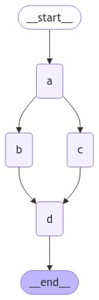
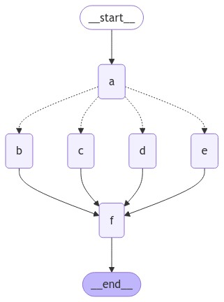

하기의 내용은 <a href="https://wikidocs.net/233801" target="_blank">LangChain 노트</a> 기반으로 작성했습니다.

# Parallel Node
보통 Graph를 구성하다보면 한개의 Node에서 두 가지 또는 여러가지 Node로 Edge가 이어지게 구성하고 싶은 경우가 종종 발생하신적이 있으실 겁니다. LangGraph에서는 이를 Conditional Edge를 통해 여러가지 Node로 연결시킬 수 있습니다. 즉, 하기와 같은 이미지 구조의 Graph를 만들고 싶을 때, 하는 방법에 대해 이번 절에서 다뤄보겠습니다.   
<div style="text-align : center;">
    
</div>   

상기의 Graph 구조를 보면 a -> b -> d 또는 a -> c -> d 로 구성되어있는 것을 확인할 수 있다. 그럼 이번에 상기의 Graph 구조로 띄는 LangGraph를 만들어 보겠습니다.   
```python
# 상태 정의(add_messages 리듀서 사용)
class State(TypedDict):
    aggregate: Annotated[list, add_messages]

# 노드 값 반환 클래스
class ReturnNodeValue:
    # 초기화
    def __init__(self, node_secret: str):
        self._value = node_secret

    # 호출시 상태 업데이트
    def __call__(self, state: State) -> Any:
        print(f"Adding {self._value} to {state['aggregate']}")
        return {"aggregate": [self._value]}

# 상태 그래프 초기화
builder = StateGraph(State)

# 노드 A부터 D까지 생성 및 값 할당
builder.add_node("a", ReturnNodeValue("I'm A"))
builder.add_edge(START, "a")
builder.add_node("b", ReturnNodeValue("I'm B"))
builder.add_node("c", ReturnNodeValue("I'm C"))
builder.add_node("d", ReturnNodeValue("I'm D"))

# 노드 연결
builder.add_edge("a", "b")
builder.add_edge("a", "c")
builder.add_edge("b", "d")
builder.add_edge("c", "d")
builder.add_edge("d", END)

# 그래프 컴파일
graph = builder.compile()
```

상기의 Graph에서 각 Node가 어떤 Node에서 값을 받는지 확인해보면, a노드는 empty, b노드와 c노드는 "I'm A" Message를 받았으며, d노드는, "I'm A", "I'm B", "I'm C" 이렇게 3개의 Message를 받아올 수 있다는 것을 확인할 수 있습니다.   

## Conditional 분기
이번에는 만약 a노드에서 b노드와 c노드로 갈 수 있는데, 이를 결정하는 조건을 추가한 Graph를 구성해보겠습니다.   
<div style="text-align : center;">
    
</div>   

상기의 이미지는 조금 더 많은 분기를 가지고 있습니다. a노드에서 b,c,d,e노드로 분기가 될 수 있습니다. 이렇듯 Graph의 특징을 살려 더 복잡한 Graph의 구조를 그려낼 수 있게됩니다. 상기의 Graph 구조에 대한 코드 구성은 하기와 같습니다.   
```python
# 상태 정의(add_messages 리듀서 사용)
class State(TypedDict):
    aggregate: Annotated[list, add_messages]
    which: str


# 노드별 고유 값을 반환하는 클래스
class ReturnNodeValue:
    def __init__(self, node_secret: str):
        self._value = node_secret

    def __call__(self, state: State) -> Any:
        print(f"Adding {self._value} to {state['aggregate']}")
        return {"aggregate": [self._value]}


# 상태 그래프 초기화
builder = StateGraph(State)
builder.add_node("a", ReturnNodeValue("I'm A"))
builder.add_edge(START, "a")
builder.add_node("b", ReturnNodeValue("I'm B"))
builder.add_node("c", ReturnNodeValue("I'm C"))
builder.add_node("d", ReturnNodeValue("I'm D"))
builder.add_node("e", ReturnNodeValue("I'm E"))
builder.add_node("f", ReturnNodeValue("I'm F"))


# 상태의 'which' 값에 따른 조건부 라우팅 경로 결정 함수
def router(state: State) -> Sequence[str]:
    if state["which"] == "bc":
        return ["b", "c"]
    elif state["which"] == "bd":
        return ["b", "d"]
    elif state["which"] == "be":
        return ["b", "e"]
    elif state["which"] == "cd":
        return ["c", "d"]
    elif state["which"] == "ce":
        return ["c", "e"]
    else:
        return ["d", "e"]


# 전체 병렬 처리할 노드 목록
intermediates = ["b", "c", "d", "e"]

builder.add_conditional_edges(
    "a",
    router,
    intermediates,
)
for node in intermediates:
    builder.add_edge(node, "f")


# 최종 노드 연결 및 그래프 컴파일
builder.add_edge("f", END)
graph = builder.compile()
```

## Parallel Node 예외 처리
보통 LangGraph는 **super-step**으로 Node를 실행합니다. 여기서 **super-step**은 여러 Node들이 처리되는 전체 프로세스 스텝을 의미합니다. 따라서 parallel Node를 통해 분기가 되더라도 전체 super-step이 트랜잭션으로 처리됨을 의미합니다.    
이는 병렬 분기 중 어떤 1개의 Node라도 예외가 발생한다면, State에 대한 업데이트가 모두 적용되지 못한다는 것을 의미하게됩니다. 즉, **super-step이 오류로 처리**된다는 것을 의미합니다. 따라서, 이런 예기치 못한 경우를 대비해 항상 예외 처리를 적용해주는 것이 필요합니다.   
LangGraph에서는 오류가 발생할 수 있는 작업들에 대해 크게 해결할 수 있는 2가지 방법을 제공해준다고 합니다.   
① Node 내에서 일반적인 Python 코드를 작성하여 예외를 포착하고 처리하는 방법    
② <a href="https://langchain-ai.github.io/langgraph/reference/graphs/#langgraph.graph.graph.CompiledGraph.retry_policy" target="_blank"><span style='color:blue'>retry_policy</span></a>를 설정하여 예외가 발생한 Node는 재시도하도록 하는 방법(단, 실패한 분기에 대해서만 재시도하므로 불필요한 작업이 재시행되는 case에 대해서는 방지됨)   

## 신뢰도
방금 예외 처리에서 예기했듯이 병렬로 펼쳐진 노드들은 하나의 **super-step**으로 실행됩니다. 각 super-step 에서 발생한 업데이트들은 해당 **super-step**이 완료된 후 순차적으로 상태에 적용됩니다.    
그럼 이 **super-step**에서 분기 지점에 어떤 Node가 먼저 수행되어야할지에 대한 순서를 정의할 필요가 있을 때가 존재합니다. 이를 의미하는 reliable라는 변수를 State에 추가적으로 정의하고 기록하여, 이를 통해 분기 순서를 결정하는 방법에 대해 이번에 알아보겠습니다.   
이번에는 우선 코드부터 확인해보겠습니다.   
```python
from typing import Annotated, Sequence
from typing_extensions import TypedDict
from langgraph.graph import StateGraph
from langgraph.graph.message import add_messages


# 팬아웃 값들의 병합 로직 구현, 빈 리스트 처리 및 리스트 연결 수행
def reduce_fanouts(left, right):
    if left is None:
        left = []
    if not right:
        # 덮어쓰기
        return []
    return left + right


# 상태 관리를 위한 타입 정의, 집계 및 팬아웃 값 저장 구조 설정
class State(TypedDict):
    # add_messages 리듀서 사용
    aggregate: Annotated[list, add_messages]
    fanout_values: Annotated[list, reduce_fanouts]
    which: str


# 그래프 초기화
builder = StateGraph(State)
builder.add_node("a", ReturnNodeValue("I'm A"))
builder.add_edge(START, "a")


# 병렬 노드 값 반환 클래스
class ParallelReturnNodeValue:
    def __init__(
        self,
        node_secret: str,
        reliability: float,
    ):
        self._value = node_secret
        self._reliability = reliability

    # 호출시 상태 업데이트
    def __call__(self, state: State) -> Any:
        print(f"Adding {self._value} to {state['aggregate']} in parallel.")
        return {
            "fanout_values": [
                {
                    "value": [self._value],
                    "reliability": self._reliability,
                }
            ]
        }


# 신뢰도(reliability)가 다른 병렬 노드들 추가
builder.add_node("b", ParallelReturnNodeValue("I'm B", reliability=0.1))
builder.add_node("c", ParallelReturnNodeValue("I'm C", reliability=0.9))
builder.add_node("d", ParallelReturnNodeValue("I'm D", reliability=0.5))
builder.add_node("e", ParallelReturnNodeValue("I'm E", reliability=0.7))


# 팬아웃 값들을 신뢰도 기준으로 정렬하고 최종 집계 수행
def aggregate_fanout_values(state: State) -> Any:
    # 신뢰도 기준 정렬
    ranked_values = sorted(
        state["fanout_values"], key=lambda x: x["reliability"], reverse=True
    )
    print(ranked_values)
    return {
        "aggregate": [x["value"][0] for x in ranked_values] + ["I'm F"],
        "fanout_values": [],
    }


# 집계 노드 추가
builder.add_node("f", aggregate_fanout_values)


# 상태에 따른 조건부 라우팅 로직 구현
def router(state: State) -> Sequence[str]:
    if state["which"] == "bc":
        return ["b", "c"]
    elif state["which"] == "bd":
        return ["b", "d"]
    elif state["which"] == "be":
        return ["b", "e"]
    elif state["which"] == "cd":
        return ["c", "d"]
    elif state["which"] == "ce":
        return ["c", "e"]
    else:
        return ["d", "e"]

# 중간 노드들 설정 및 조건부 엣지 추가
intermediates = ["b", "c", "d", "e"]
builder.add_conditional_edges("a", router, intermediates)

# 중간 노드들과 최종 집계 노드 연결
for node in intermediates:
    builder.add_edge(node, "f")

# 그래프 완성을 위한 최종
graph = builder.compile()
```

State에 정의된 fan_out_values는 신뢰도를 의미하는 변수입니다. 즉, 분기될 때 어떤 Node로 먼저 분기될지에 대한 순서를 정할 수 있는 지표입니다. ParallelReturnNodeValue에는 추가적으로 reliables의 변수를 정의합니다. 또한, aggregate_fanout_values에서는 f노드로 오기까지 거쳐갔던 Node들에 대해 reliable점수로 내림차순 정렬을 진행해주는 역할을 하고 거기에 맞춰 다시 출력 순서를 집계하는 역할을 수행해줍니다. 따라서, b노드는 0.1, c노드는 0.9, d노드는 0.5, e노드는 0.7의 reliable점수를 가지고 있을 때, bc의 순서로 분기하라는 명령을 줬을 때, c의 점수가 더 높아, c노드 후, b노드를 분기하는 현상을 확인하실 수 있습니다. 