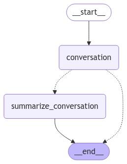

하기의 내용은 <a href="https://wikidocs.net/233801" target="_blank">LangChain 노트</a> 기반으로 작성했습니다.

# Summary Node
Chatbot을 구현할 때, 중요한 점 중 한개는 multi-turn입니다. 사용자와 계속해서 질의 응답을 주고 받는데, 사용자의 이전 질문이나, 이전 답변에 대한 내용을 기록하고 이에 근거하여 답변을 해주는 것이 중요합니다. 즉, 대화 내용의 **지속성**이 중요하다고 할 수 있습니다. 하지만, 대화가 길어진다면 이에 대한 이전 대화내용을 그대로 저장해두고 있는 것은 엄청난 리소스가 필요로합니다. 따라서 이를 위해 context window 방법을 이용한다고 이전에 알려드렸습니다. 최근 몇개의 대화 내용만을 보관하는 방법입니다. 그런데, 이 또한 너무 오래된 내용에 대한 기억은 가지고 있지 못하기 때문에 사용자는 불편함을 느낄 수도 있습니다. 그럼, 이런 문제점을 해결하기 위한 방법 중 1개는 context window가 작동되기 전, 이전 내용에 대한 **요약 내용**을 가지고 있다면, 리소스와 과거 내용을 모두 확보할 수 있을 겁니다. 그럼 이번절에서는 summarize를 하는 Node를 추가하여 작동하는지를 테스트해보겠습니다.   
우선 설계를 해보자면, 크게 3가지의 단계가 필요합니다.   
① 대화가 너무 긴지 확인 (메시지 수나 메시지 길이로 확인 가능)   
② 너무 길다면 요약본 생성 (이를 위한 프롬프트 필요)  
③ 마지막 N 개의 메시지를 제외한 나머지 삭제  

그럼 우선 state에서는 message에 대한 정보와 요약 정보 두가지를 가지고 있어야합니다.   
```python
# 메시지 상태와 요약 정보를 포함하는 상태 클래스
class State(MessagesState):
    messages: Annotated[list, add_messages]
    summary: str
```

<br>

그리고 챗봇을 구현해보겠습니다. 사용자의 질의에 대한 응답을 내뱉는 Node를 만들어야하는데, 이 때, **만약 이전 대화내용이 존재한다면 이를 넣어주고 State에 summary에 값이 존재한다면 summarize가 일어났다는 것이니 이 summarize 정보를 대화내용 앞에 추가해주는 작업**을 구현해보겠습니다.   
```python
def ask_llm(state: State):
    # 이전 요약 정보 확인
    summary = state.get("summary", "")

    # 이전 요약 정보가 있다면 시스템 메시지로 추가
    if summary:
        # 시스템 메시지 생성
        system_message = f"Summary of conversation earlier: {summary}"
        # 시스템 메시지와 이전 메시지 결합
        messages = [SystemMessage(content=system_message)] + state["messages"]
    else:
        # 이전 메시지만 사용
        messages = state["messages"]

    # 모델 호출
    response = model.invoke(messages)

    # 응답 반환
    return {"messages": [response]}
```

조금 더 상기의 코드를 살펴보겠습니다. 받아온 state로부터 summary의 정보를 추출하고, summary의 정보가 존재한다면, message를 만들 때, 앞에 이전 정보에 대한 요약정보라는 message를 만들어 이 정보를 현재 질문앞에 추가해주어 model의 입력으로 넣어주는 작업을 수행합니다. 그 후, model의 출력을 다시 message에 넣어줍니다.   

<br>
그럼 이제 요약하는 Node가 동작할지 말지를 결정하는 conditional edge를 구현해보겠습니다. 임의로 이전 대화내용 메세지가 6개 이하라면 그냥 답변을 하고 6개 이상이 될 시, 6개에 대한 대화내용을 요약하는 Node를 타게 결정해주는 함수를 구현해보겠습니다.   

```python
# 대화 종료 또는 요약 결정 로직
def should_continue(state: State) -> Literal["summarize_conversation", END]:
    # 메시지 목록 확인
    messages = state["messages"]

    # 메시지 수가 6개 초과라면 요약 노드로 이동
    if len(messages) > 6:
        return "summarize_conversation"
    return END
```

<br>

이번에는 **이전 대화내용을 요약하는 작업을 하는 Node인 Summarize Node**를 구현해보겠습니다. 만약 이전 대화내용에 대한 요약정보가 존재한다면 이 정보도 포함하여 요약정보를 만들어줘야하고, 만약 요약정보가 없다면 처음으로 요약을 해주어야합니다. 요약을 해주는 prompt를 추가하여 이와 요약을 할 메세지들을 포함하여 model의 입력으로 넣어주면, 요약을 수행하여 model이 출력을 내게될 것 입니다. 그 후, 과거에 대화내용은 메세지에서 삭제를 시켜주는 작업을 수행해주면 됩니다.   
```python
def summarize_conversation(state: State):
    # 이전 요약 정보 확인
    summary = state.get("summary", "")

    # 이전 요약 정보가 있다면 요약 메시지 생성
    if summary:
        summary_message = (
            f"This is summary of the conversation to date: {summary}\n\n"
            "Extend the summary by taking into account the new messages above in Korean:"
        )
    else:
        # 요약 메시지 생성
        summary_message = "Create a summary of the conversation above in Korean:"

    # 요약 메시지와 이전 메시지 결합
    messages = state["messages"] + [HumanMessage(content=summary_message)]
    # 모델 호출
    response = model.invoke(messages)
    # 오래된 메시지 삭제
    delete_messages = [RemoveMessage(id=m.id) for m in state["messages"][:-2]]
    # 요약 정보 반환
    return {"summary": response.content, "messages": delete_messages}
```   
<br>
그럼 이제 필요한 기능들에 대해 모두 구현을 마친 상태이니, LangGraph로 만들어 보겠습니다.   

```python
# 워크플로우 그래프 초기화
workflow = StateGraph(State)

# 대화 및 요약 노드 추가
workflow.add_node("conversation", ask_llm)
workflow.add_node(summarize_conversation)

# 시작점을 대화 노드로 설정
workflow.add_edge(START, "conversation")

# 조건부 엣지 추가
workflow.add_conditional_edges(
    "conversation",
    should_continue,
)

# 요약 노드에서 종료 노드로의 엣지 추가
workflow.add_edge("summarize_conversation", END)

# 워크플로우 컴파일 및 메모리 체크포인터 설정
app = workflow.compile(checkpointer=memory)
```

<div style="text-align : center;">
    
</div>   

## 대화
메세지가 6개 이상이 쌓일 때, summarize_conversation Node로 흘러가서 이전 대화 내용 message는 지우고, summary에 요약 정보 내용을 추가하는 작업을 거치게됩니다. 이를 직접 streaming으로 출력해보며 확인해보겠습니다.   
```python
from langchain_core.messages import HumanMessage

# 스레드 ID가 포함된 설정 객체 초기화
config = {"configurable": {"thread_id": "1"}}

# 첫 번째 사용자 메시지 생성 및 출력
input_message = HumanMessage(content="안녕하세요? 반갑습니다. 제 이름은 테디입니다.")
input_message.pretty_print()

# 스트림 모드에서 첫 번째 메시지 처리 및 업데이트 출력
for event in app.stream({"messages": [input_message]}, config, stream_mode="updates"):
    print_update(event)

# 두 번째 사용자 메시지 생성 및 출력
input_message = HumanMessage(content="제 이름이 뭔지 기억하세요?")
input_message.pretty_print()

# 스트림 모드에서 두 번째 메시지 처리 및 업데이트 출력
for event in app.stream({"messages": [input_message]}, config, stream_mode="updates"):
    print_update(event)

# 세 번째 사용자 메시지 생성 및 출력
input_message = HumanMessage(content="제 직업은 AI 연구원이에요")
input_message.pretty_print()

# 스트림 모드에서 세 번째 메시지 처리 및 업데이트 출력
for event in app.stream({"messages": [input_message]}, config, stream_mode="updates"):
    print_update(event)

# 사용자 입력 메시지 객체 생성
input_message = HumanMessage(
    content="최근 LLM 에 대해 좀 더 알아보고 있어요. LLM 에 대한 최근 논문을 읽고 있습니다."
)

# 메시지 내용 출력
input_message.pretty_print()

# 스트림 이벤트 실시간 처리 및 업데이트 출력
for event in app.stream({"messages": [input_message]}, config, stream_mode="updates"):
    print_update(event)
```

여기서 "최근 LLM 에 대해 좀 더 알아보고 있어요. LLM 에 대한 최근 논문을 읽고 있습니다."라는 입력을 넣어줬을 때, 메세지가 6개 이상이 되기 때문에, summarize_node를 타게되고 정보를 요약한 것을 확인하실 수 있습니다. 또한, 현재 thread_id가 1인 사용자와 상호작용을 하고 있기 때문에, 새로운 config를 만들어 새로운 사용자에 대해서도 추가적으로 작업이 진행될 수 있습니다.   
