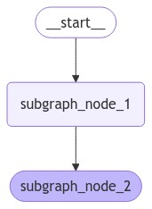
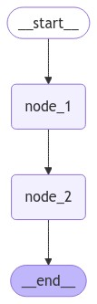
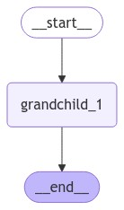
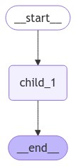
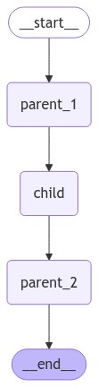

하기의 내용은 <a href="https://wikidocs.net/233801" target="_blank">LangChain 노트</a> 기반으로 작성했습니다.

# SubGraph
Graph 알고리즘에서 큰 Graph 내부에 작은 Graph구조를 띄는데 이를 SubGraph라고 합니다. 즉, 1개의 Graph는 여러개의 SubGraph로 구성되었다고 생각해도 무방합니다. LangGraph도 Graph구조를 띄니 이 또한 SubGraph로 나눠서 생각할 수 있습니다.    
이 SubGraph를 이용하면 여러 구성요소를 포함시키며 복잡한 시스템을 구축할 수 있습니다. 예를들어 A작업을 하는 SubGraph 구조와 B작업을 하는 SubGraph를 구현 한 후, 서로 연결시켜 독자가 원하는 시스템을 구축할 수 있다는 의미가 됩니다.    
이 SubGraph를 구성할 때 중요한 점은 상위 Graph와 SubGraph간의 통신부분입니다. 즉, State값을 어떻게 넘겨줄지에 대해 고민을 해야합니다. 한 번 2가지 시나리오 예시를 보며, 어떻게 State값을 넘겨줄지 확인해보겠습니다.   
① 상위 Graph와 SubGraph가 **Schema key를 공유**하는 경우 $\rightarrow$ **Compile된 SubGraph로 Node 추가**     
② 상위 Graph와 SubGraph가 **서로 다른 Schema key**인 경우 $\rightarrow$ **SubGraph를 호출하는 Node 함수 추가**   

<br>
그럼 이어서 저 2가지 시나리오에 대해 살펴보겠습니다.   

## SubGraph 시나리오

###  Schema Key 공유 O
Compile된 SubGraph를 노드로 추가하는 방법을 이용한다고 했습니다. 즉, **상위 Graph와 SubGraph가 공유 상태 키(State Key)를 이용해 통신하는 방법을 의미합니다. 한가지 예시를 들어드리자면, multi-agent system에서 agent들은 서로 State에 존재하는 message키를 이용하여 서로 통신을 하는 것을 예로 들 수 있습니다.    
구현 방법은 크게 2가지 step을 따라보겠습니다.   
① SubGraph Workflow를 정의 및 Compile   
② 상위 Graph Workflow에 .add_node를 통해 SubGraph 추가    

<span style='color:red'>**Compile된 SubGraph를 노드로 추가하는 방법**</span>에 대해 알아보겠습니다.   

<br>
그럼 우선 ①인 SubGraph Workflow를 정의해보겠습니다.   
이번에 구현할 SubGraph의 구조는 하기와 같습니다.    
<div style="text-align : center;">
    
</div>    

```python
# 서브그래프 상태 정의를 위한 TypedDict 클래스, 부모 그래프와 공유되는 name 키와 서브그래프 전용 family_name 키 포함
class ChildState(TypedDict):
    name: str  # 부모 그래프와 공유되는 상태 키
    family_name: str


# 서브그래프의 첫 번째 노드, family_name 키에 초기값 설정
def subgraph_node_1(state: ChildState):
    return {"family_name": "Lee"}


# 서브그래프의 두 번째 노드, 서브그래프 전용 family_name 키와 공유 name 키를 결합하여 새로운 상태 생성
def subgraph_node_2(state: ChildState):
    # 서브그래프 내부에서만 사용 가능한 family_name 키와 공유 상태 키 name를 사용하여 업데이트 수행
    return {"name": f'{state["name"]} {state["family_name"]}'}


# 서브그래프 구조 정의 및 노드 간 연결 관계 설정
subgraph_builder = StateGraph(ChildState)
subgraph_builder.add_node(subgraph_node_1)
subgraph_builder.add_node(subgraph_node_2)
subgraph_builder.add_edge(START, "subgraph_node_1")
subgraph_builder.add_edge("subgraph_node_1", "subgraph_node_2")
subgraph = subgraph_builder.compile()
```

상기의 코드는 이 SubGraph를 탈시 name에 "Lee"라는 family name이 추가된 결과를 얻을 수 있습니다. 여기서 이제 상위 Graph의 State와 name이라는 **Schema Key를 공유**하고 있을 것입니다.   

<br>
그럼 우선 ②인 상위 Graph Workflow를 정의해보겠습니다.   
이번에 구현할 상위 Graph 구조는 하기와 같습니다.    
<div style="text-align : center;">
    
</div>    

```python
# 부모 그래프의 상태 정의를 위한 TypedDict 클래스, name 키만 포함
class ParentState(TypedDict):
    name: str
    company: str


# 부모 그래프의 첫 번째 노드, name 키의 값을 수정하여 새로운 상태 생성
def node_1(state: ParentState):
    return {"name": f'My name is {state["name"]}'}


# 부모 그래프 구조 정의 및 서브그래프를 포함한 노드 간 연결 관계 설정
builder = StateGraph(ParentState)
builder.add_node("node_1", node_1)
# 컴파일된 서브그래프를 부모 그래프의 노드로 추가
builder.add_node("node_2", subgraph)
builder.add_edge(START, "node_1")
builder.add_edge("node_1", "node_2")
builder.add_edge("node_2", END)
graph = builder.compile()
```

node_1은 단순 "My name is ooo"을 반환하는 역할을 하는데, 이 node_1 후 SubGraph인 node_2를 타게된다면 "My name is ooo Lee"라는 결과를 얻을 수 있을거라고 예상하실 겁니다. SubGraph는 name뒤에 family name인 "Lee"를 붙이는 역할을 수행하는 Graph이기 때문입니다. 
만약 SubGraph의 출력까지 확인해보고 싶다면 하기와 같은 stream시 인자값을 넘겨주면 됩니다.    
```python
# 그래프 스트리밍 처리를 통한 서브그래프 데이터 청크 단위 순차 출력
# subgraphs 파라미터를 True로 설정하여 하위 그래프 포함 스트리밍 처리
for chunk in graph.stream({"name": "Teddy"}, subgraphs=True):
    print(chunk)
```

### Schema Key 공유 X
SubGraph를 호출하는 Node 함수 추가하는 방법을 이용하면 된다고 했습니다. 솔직하게 말씀드리면 독자가 System을 구축할 때, Schema Key를 공유하지 못하는 경우가 대다수일 것이라고 생각합니다. 보통 대부분 이런 경우에는 매우 복잡한 시스템이며, **상위 Graph와 SubGraph가 가진 Schema가 완전 다른 구조를 띄는 경우**입니다.   
<br>

그럼 이제 <span style='color:red'>**SubGraph를 호출하는 Node 함수 정의 방법**</span>에 대해 알아보겠습니다.   
이 함수는 SubGraph를 호출하기 이전에 **상위 State를 하위 State로 변환**하고, Node에서 State 업데이트를 반환하기 전 결과를 다시 **상위 State**로 변환해야합니다.   
그럼 하기에 Node 내부에서 SubGraph를 호출하도록 해보는 예시를 살펴보겠습니다.   

```python
# 서브그래프의 상태 타입 정의 (부모 그래프와 키를 공유하지 않음)
class ChildState(TypedDict):
    # 부모 그래프와 공유되지 않는 키들
    name: str


# 서브그래프의 첫 번째 노드: name 키에 초기값 설정
def subgraph_node_1(state: ChildState):
    return {"name": "Teddy " + state["name"]}


# 서브그래프의 두 번째 노드: name 값 그대로 반환
def subgraph_node_2(state: ChildState):
    return {"name": f'My name is {state["name"]}'}


# 서브그래프 빌더 초기화 및 노드 연결 구성
subgraph_builder = StateGraph(ChildState)
subgraph_builder.add_node(subgraph_node_1)
subgraph_builder.add_node(subgraph_node_2)
subgraph_builder.add_edge(START, "subgraph_node_1")
subgraph_builder.add_edge("subgraph_node_1", "subgraph_node_2")
subgraph = subgraph_builder.compile()
```

상기의 SubGraph는 name이라는 Key에 대한 State만 가지고 있으며, 이 결과에 대해 최종적으로 "My name is Teddy ooo"의 형태를 출력으로 내보는 역할을 수행합니다. 그럼 이어서 상위 Graph의 구현도 확인해보겠습니다.   
```python
# 부모 그래프의 상태 타입 정의
class ParentState(TypedDict):
    family_name: str
    full_name: str


# 부모 그래프의 첫 번째 노드: family_name 값 그대로 반환
def node_1(state: ParentState):
    return {"family_name": state["family_name"]}


# 부모 그래프의 두 번째 노드: 서브그래프와 상태 변환 및 결과 처리
def node_2(state: ParentState):
    # 부모 상태를 서브그래프 상태로 변환
    response = subgraph.invoke({"name": state["family_name"]})
    # 서브그래프 응답을 부모 상태로 변환
    return {"full_name": response["name"]}


# 부모 그래프 빌더 초기화 및 노드 연결 구성
builder = StateGraph(ParentState)
builder.add_node("node_1", node_1)

# 컴파일된 서브그래프 대신 서브그래프를 호출하는 node_2 함수 사용
builder.add_node("node_2", node_2)
builder.add_edge(START, "node_1")
builder.add_edge("node_1", "node_2")
builder.add_edge("node_2", END)
graph = builder.compile()
```

상위 Graph는 SubGraph와는 완전히 다른 Key인 family_name과 full_name이라는 Key를 가지는 State를 이용합니다. 여기서 주의깊게 봐야할 부분이 node_2의 함수부분입니다. node_2는 SubGraph로 "family_name"의 값을 넣어주고 거기에 반환된 결과를 "full_name"에 넣어주는 역할을 수행해줍니다. 즉, 상위 Graph의 최종 결과에서 "full_name"의 값에는 "My name is Teddy {family_name}"이 들어가게 된다는 것을 의미합니다.   
이렇듯 서로 다른 Schema Key를 가진 경우 **Node내에서 SubGraph를 호출하여 이에 대한 반환결과를 이용**하여 더 복잡한 시스템을 구축할 수도 있습니다.   

### 3중 SubGrpah
이번에는 3중 SubGraph구조를 가지며 모두 서로 다른 Schema Key를 가진 경우에 대해 어떻게 구현하면 될지에 대해 알아보겠습니다.   
쉽게 ParentGraph $\rightarrow$ ChildGraph $\rightarrow$ GrandChildGraph로 고려하고 구현해보겠습니다.    
<br>
그럼 우선 GrandChildGraph부터 구현해보겠습니다.   
Graph구조는 하기와 같습니다.   
<div style="text-align : center;">
    
</div>    

```python
# 손자 노드의 상태를 정의하는 TypedDict 클래스, 문자열 타입의 my_grandchild_key 포함
class GrandChildState(TypedDict):
    my_grandchild_key: str


# 손자 노드의 상태를 처리하는 함수, 입력된 문자열에 인사말 추가
def grandchild_1(state: GrandChildState) -> GrandChildState:
    # 자식 또는 부모 키는 여기서 접근 불가
    return {"my_grandchild_key": f'([GrandChild] {state["my_grandchild_key"]})'}


# 손자 노드의 상태 그래프 초기화
grandchild = StateGraph(GrandChildState)

# 상태 그래프에 손자 노드 추가
grandchild.add_node("grandchild_1", grandchild_1)

# 시작 노드에서 손자 노드로의 엣지 연결
grandchild.add_edge(START, "grandchild_1")

# 손자 노드에서 종료 노드로의 엣지 연결
grandchild.add_edge("grandchild_1", END)

# 정의된 상태 그래프 컴파일 및 실행 가능한 그래프 생성
grandchild_graph = grandchild.compile()
```
GraphChildGraph는 key값 앞에 "[GrandChild]"라는 값을 붙이고 그대로 반환하는 역할을 수행합니다.   

<br>
그럼 이어서 GrandChildGraph를 Node내에서 호출하는 ChildGraph를 구현해보겠습니다.   
ChildGraph의 구조는 하기와 같습니다. 여기서 child1의 node에서 GrandChildGraph를 호출하여 결과값을 반환 후 ChildState에 병합해줍니다.   
<div style="text-align : center;">
    
</div>    

```python
# 자식 상태 타입 정의를 위한 TypedDict 클래스
class ChildState(TypedDict):
    my_child_key: str


# 손자 그래프 호출 및 상태 변환 함수, 자식 상태를 입력받아 변환된 자식 상태 반환
def call_grandchild_graph(state: ChildState) -> ChildState:
    # 참고: 부모 또는 손자 키는 여기서 접근 불가능
    # 자식 상태 채널에서 손자 상태 채널로 상태 변환
    grandchild_graph_input = {"my_grandchild_key": state["my_child_key"]}
    # 손자 상태 채널에서 자식 상태 채널로 상태 변환 후 결과 반환
    grandchild_graph_output = grandchild_graph.invoke(grandchild_graph_input)
    return {"my_child_key": f'([Child] {grandchild_graph_output["my_grandchild_key"]})'}


# 자식 상태 그래프 초기화
child = StateGraph(ChildState)
# 참고: 컴파일된 그래프 대신 함수 전달
# 자식 그래프에 노드 추가 및 시작-종료 엣지 연결
child.add_node("child_1", call_grandchild_graph)
child.add_edge(START, "child_1")
child.add_edge("child_1", END)
# 자식 그래프 컴파일
child_graph = child.compile()
```

ChildGraph에서는 GrandChildGraph를 호출하여 "[Child]" 앞에 GrandChildGraph의 반환 결과를 추가하여 반환하는 역할을 수행합니다.   

<br>
그럼 마지막 최종 상위 Graph인 ParentGraph를 구현해보겠습니다. ParentGraph에서는 Node 내부에서 ChildGraph를 호추하면, ChildGraph내부에서 GrandChildGraph를 호출하고 있으니, 3중으로 SubGraph 구조를 가지며 반환된 결과값을 얻을 수 있습니다.   
ParentGraph구조는 하기와 같습니다. child Node에서는 ChildGraph를 호출하고 있으며, 또한 ChildGraph에서는 GrandChildGraph를 호출하고 있습니다.   
<div style="text-align : center;">
    
</div>    

```python
# 부모 상태 타입 정의를 위한 TypedDict 클래스
class ParentState(TypedDict):
    my_parent_key: str


# 부모 상태의 my_parent_key 값에 '[Parent1]' 문자열을 추가하는 변환 함수
def parent_1(state: ParentState) -> ParentState:
    # 참고: 자식 또는 손자 키는 여기서 접근 불가
    return {"my_parent_key": f'([Parent1] {state["my_parent_key"]})'}


# 부모 상태의 my_parent_key 값에 '[Parent2]' 문자열을 추가하는 변환 함수
def parent_2(state: ParentState) -> ParentState:
    return {"my_parent_key": f'([Parent2] {state["my_parent_key"]})'}


# 부모 상태와 자식 상태 간의 데이터 변환 및 자식 그래프 호출 처리
def call_child_graph(state: ParentState) -> ParentState:
    # 부모 상태 채널(my_parent_key)에서 자식 상태 채널(my_child_key)로 상태 변환
    child_graph_input = {"my_child_key": state["my_parent_key"]}
    # 자식 상태 채널(my_child_key)에서 부모 상태 채널(my_parent_key)로 상태 변환
    child_graph_output = child_graph.invoke(child_graph_input)
    return {"my_parent_key": child_graph_output["my_child_key"]}


# 부모 상태 그래프 초기화 및 노드 구성
parent = StateGraph(ParentState)
parent.add_node("parent_1", parent_1)

# 참고: 컴파일된 그래프가 아닌 함수를 전달
parent.add_node("child", call_child_graph)
parent.add_node("parent_2", parent_2)

# 상태 그래프의 실행 흐름을 정의하는 엣지 구성
parent.add_edge(START, "parent_1")
parent.add_edge("parent_1", "child")
parent.add_edge("child", "parent_2")
parent.add_edge("parent_2", END)

# 구성된 부모 상태 그래프의 컴파일 및 실행 가능한 그래프 생성
parent_graph = parent.compile()
```

상기의 코드에서 parent_1 node는 앞에 "[Parent1]"을 추가해주는 역할을 하고 그 후 child Node를 타게되면 "[Parent1] [Child] [GrandChild]"에 대한 결과를 얻을 수 있을거라고 예상할 것입니다. 그 후 parent_2 node를 타고 최종 결과를 반환하는데, 이 최종 결과는 "[Parent2] [Parent1] [Child] [GrandChild]"의 형태를 띄울것이라고 충분히 예상할 수 있습니다. 
