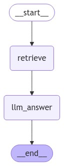

하기의 내용은 <a href="https://wikidocs.net/233801" target="_blank">LangChain 노트</a> 기반으로 작성했습니다.

# Naive RAG
예전에 RAG가 무엇인지 RAG 구성방법에 대해 알아본적이 있습니다.    
이 Naive RAG의 Sequence는 <span style='color:red'>**Question $\rightarrow$ Retrieve $\rightarrow$ Answer(LLM)**</span>로 이어집니다. 즉, Answer의 답변이 마음에 안든다면, 다시 처음부터 시작해야하는 고질적인 문제가 존재합니다. 이를 보완하기 위해 최근들어 LangGraph가 나타나며 뜨고 있습니다. 그럼 이번절에서는 이 Naive RAG를 한 번 LangGraph로 구현해보겠습니다.   
우선 가장 기본적인 RAG코드를 구현해보겠습니다.   

```python
from langchain_openai import OpenAIEmbeddings, ChatOpenAI
from langchain.text_splitter import RecursiveCharacterTextSplitter
from langchain_community.vectorstores import FAISS
from langchain.document_loaders import PyPDFLoader

llm = ChatOpenAI(model="gpt-4o-mini")
embeddings = OpenAIEmbeddings( #← OpenAIEmbeddings를 초기화
    model="text-embedding-ada-002"
)

loader = PyPDFLoader("./data/AI_brief_2023년_2월호.pdf")

text_splitter = RecursiveCharacterTextSplitter(chunk_size=1000, chunk_overlap=100)
split_docs = loader.load_and_split(text_splitter)
vector = FAISS.from_documents(split_docs, embeddings)
```

상기의 코드는 PDF파일을 읽은 후 vectorDB에 넣는거까지 매우 간단하게 구현한 코드입니다.    
그럼 이어서 이 vectorDB에서 필요한 Retrieval를 생성하여 질문에 필요한 청크들을 잘 갖고오는지 확인해보겠습니다.   

```python
retriever = vector.as_retriever()
retriever_result = retriever.invoke("비정형 데이터에대해 알려줘")
print(retriever_result)
```

그럼 이어서 최종 RAG로 구성된 LLM Chain을 만들어 보겠습니다.   
```python
from langchain.prompts import PromptTemplate
from langchain.schema.runnable import RunnablePassthrough
from langchain.schema.output_parser import StrOutputParser

class RAGChain:
    def __init__(self, llm):
        self.llm = llm
        
    def format_docs(self, docs):
        """검색된 문서들을 하나의 문자열로 포맷팅"""
        context = ""
        for doc in docs:
            context += doc.page_content
            context += '\n'
        return context

    def invoke(self, inputs):
        question = inputs.get("question", "")
        context = inputs.get("context", [])
        if isinstance(context, list):
            context = self.format_docs(context)
        history = inputs.get("chat_history", [])
        history = " ".join(history)
        
        template = """
        다음 정보는 이전 대화에 대한 요약된 내용입니다:
        {chat_history}
        
        다음 정보를 바탕으로 질문에 답하세요:
        {context}

        질문: {question}
        
        주어진 질문에만 답변하세요. 문장으로 답변해주세요.
        답변:
        """
        prompt = PromptTemplate.from_template(template)
        
        rag_chain = (
            prompt
            | self.llm
            | StrOutputParser()
        )
        answer = rag_chain.invoke({"chat_history": history, "context":context, "question":question })
        
        return answer
rag_chain = RAGChain(llm=llm)
answer = rag_chain.invoke(
    {
        "question": "비정형 데이터에 대해 알려줘.",
        "context": retriever_result,
        "chat_history": [],
    }
)
print(answer)
```

상기의 LLM Chain에 "비정형 데이터에 대해 알려줘"라고 질문을 주면 해당 PDF파일을 통해 답변을 수행해줍니다. 그럼 이제 이 RAG를 LangGraph로 구현해보겠습니다.   

## Naive RAG $\rightarrow$ LangGraph
LangGraph를 구현할 때 가장 먼저 해야할 State를 정의해보겠습니다. State는 당연히 사용자가 주는 **질문, Retrieval 결과, 답변** 이 3가지 필요합니다.   
```python
from typing import Annotated, TypedDict
from langgraph.graph.message import add_messages

# GraphState 상태 정의
class GraphState(TypedDict):
    question: Annotated[str, "Question"]  # 질문
    context: Annotated[str, "Context"]  # 문서의 검색 결과
    answer: Annotated[str, "Answer"]  # 답변
    messages: Annotated[list, add_messages]  # 메시지(누적되는 list)
``` 

<br>
State를 정의했으니, 그럼 이제 각 Node를 구성해보겠습니다. Node는 Naive RAG의 Sequence에 맞게, **Retrieval Node, Answer Node** 이렇게 2개를 구현할 것 입니다. 그럼 하기에 각 Node 함수를 구현해보겠습니다.   

```python
def messages_to_history(messages):
    message_list = []
    for msg in messages:
        if isinstance(msg, HumanMessage):
            content = f"user: {msg.content}"
        elif isinstance(msg, AIMessage):
            content = f"assitant: {msg.content}"
        else:
            content = f"assitant: {msg.content}"
        message_list.append(content)
    return "\n".join(message_list)


def format_docs(docs):
    """검색된 문서들을 하나의 문자열로 포맷팅"""
    context = ""
    for doc in docs:
        context += doc.page_content
        context += '\n'
    return context

# 문서 검색 노드
def retrieve_document(state: GraphState) -> GraphState:
    # 질문을 상태에서 가져옵니다.
    latest_question = state["question"]

    # 문서에서 검색하여 관련성 있는 문서를 찾습니다.
    retrieved_docs = retriever.invoke(latest_question)
    
    # 검색된 문서를 형식화합니다.(프롬프트 입력으로 넣어주기 위함)
    retrieved_docs = format_docs(retrieved_docs)

    # 검색된 문서를 context 키에 저장합니다.
    return GraphState(context=retrieved_docs)


# 답변 생성 노드
def llm_answer(state: GraphState) -> GraphState:
    # 질문을 상태에서 가져옵니다.
    latest_question = state["question"]
    
    print("chat history", state['messages'])
    # 검색된 문서를 상태에서 가져옵니다.
    context = state["context"]

    # 체인을 호출하여 답변을 생성합니다.
    response = rag_chain.invoke(
        {
            "question": latest_question,
            "context": context,
            "chat_history": messages_to_history(state["messages"]),
        }
    )
    # 생성된 답변, (유저의 질문, 답변) 메시지를 상태에 저장합니다.
    return GraphState(
        answer=response, messages=[("user", latest_question), ("assistant", response)]
    )
``` 

그럼 이제 상기의 코드에 대해 조금 더 자세히 살펴보도록 하겠습니다.    
retrieve_document에서는 이전 Node인 start에서로부터 받은 State에서 질문을 추출한 후, 이 질문을 기반으로 retrieval로 필요한 context들을 추출해주는 작업을 해주는 Node가 됩니다. 그 후, **다음 Node로 전달하기 전, 추출한 context를 State에 담아 질문과 context를 넘겨줍니다.** 추가적으로 format_docs함수는 context들의 내용을 "\n"로 연결해주는 작업을 합니다.     
llm_answer에서는 최종 답변을 생성하는 역할을 수행합니다. 이전 Node인 Retrieval Node에서는 질문에 알맞은 context를 추출해준 후, 이를 State에 담아 넘겨주는 작업을 한다고 말씀드렸다 시피, llm_answer Node에서는 그 정보와 질문, 그리고 이전 대화내용이 담긴 message를 전달하여 llm으로 부터 답변을 얻어내는 최종 작업을 수행합니다. 추가적으로 message_to_history는 이전 message가 누구의 meesage인지를 확인한 후, 사용자인 경우 user를 키로 llm인경우 assitant를 키로 가진 후, 이전 내용을 이어지게 붙이는 역할을 해줍니다.    

```python
from langgraph.graph import END, StateGraph
from langgraph.checkpoint.memory import MemorySaver

# 그래프 생성
workflow = StateGraph(GraphState)

# 노드 정의
workflow.add_node("retrieve", retrieve_document)
workflow.add_node("llm_answer", llm_answer)

# 엣지 정의
workflow.add_edge("retrieve", "llm_answer")  # 검색 -> 답변
workflow.add_edge("llm_answer", END)  # 답변 -> 종료

# 그래프 진입점 설정
workflow.set_entry_point("retrieve")

# 체크포인터 설정
memory = MemorySaver()

# 컴파일
app = workflow.compile(checkpointer=memory)
```

그럼 그래프 구성은 retrieval Node를 통해, State에 context정보를 담아준 후, llm Node를 타서 최종 답변을 해주는 Flow가 기본적인 Naive Rag의 Sequence와 동일하다는 것을 느끼실 수 있으실 겁니다. 즉, 하기의 이미지와같은 그래프 구조를 띄면됩니다.    
<div style="text-align : center;">
    
</div>    
