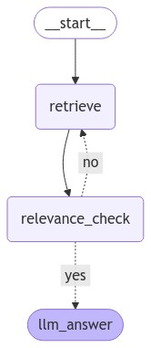

하기의 내용은 <a href="https://wikidocs.net/233801" target="_blank">LangChain 노트</a> 기반으로 작성했습니다.

# Evaluator
항상 LLM이 정확한 답변을 하는지 신뢰가 부족할 수 있습니다. RAG구조에서 답변이 잘못된 경우에 고려해볼 수 있는 경우는 크게 2가지가 존재한다고 볼 수 있습니다.   
① Retrieval의 결과가 이상한 경우    
② LLM이 답변을 질문과 무관하게 내뱉은 경우    
그럼 이를 한 번 평가하는 코드에 대해 알아보겠습니다. 이 평가자인 Evaluator는 직접 Custom으로 만들 수도 있고, API에서 제공해주기도 합니다. 이번절에서는 ②인 LLM 답변이 질문과 무관하게 내뱉었는지에 대한 평가를 해보겠습니다. 이 평가자로 LangSmith에서 제공해주는 LangChainStringEvaluator을 이용하여 평가해보겠습니다.   

```python
class RAGChain:
    def __init__(self, pdf, llm):
        self.llm = llm
        self.pdf = pdf
    
    def create_retriever(self, 
                         embeddings: object = OpenAIEmbeddings(model="text-embedding-ada-002")):
        loader = PyPDFLoader(self.pdf)

        text_splitter = RecursiveCharacterTextSplitter(chunk_size=1000, chunk_overlap=100)
        split_docs = loader.load_and_split(text_splitter)
        vector = FAISS.from_documents(split_docs, embeddings)
        retriever = vector.as_retriever()
        return retriever

        
    def format_docs(self, docs):
        """검색된 문서들을 하나의 문자열로 포맷팅"""
        context = ""
        for doc in docs:
            context += doc.page_content
            context += '\n'
        return context
            

    def invoke(self, inputs):
        question = inputs.get("question", "")
        context = inputs.get("context", [])
        if isinstance(context, list):
            context = self.format_docs(context)
        history = inputs.get("chat_history", [])
        history = " ".join(history)
        
        template = """
        다음 정보는 이전 대화에 대한 내용입니다.
        {chat_history}
        
        다음 정보를 바탕으로 질문에 답하세요:
        {context}

        질문: {question}
        
        주어진 질문에만 답변하세요. 문장으로 답변해주세요.
        답변:
        """
        prompt = PromptTemplate.from_template(template)
        
        rag_chain = (
            prompt
            | self.llm
            | StrOutputParser()
        )
        answer = rag_chain.invoke({"chat_history": history, "context":context, "question":question })
        
        return answer

def ask_llm(llm):
    rag_chain = RAGChain(llm=llm, pdf="./data/AI_brief_2023년_2월호.pdf")
    retriever = rag_chain.create_retriever()
    
    def _ask_question(inputs):
        context = retriever.invoke(inputs["question"])
        context = "\n".join([doc.page_content for doc in context])
        return {
            "question": inputs["question"],
            "context": context,
            "answer": rag_chain.invoke(inputs["question"]),
        }
    return _ask_question


gpt_chain = ask_llm(llm=ChatOpenAI(model="gpt-4o-mini"))
from langsmith.evaluation import evaluate, LangChainStringEvaluator
cot_qa_evalulator = LangChainStringEvaluator(
    "cot_qa",
    config={"llm": ChatOpenAI(model="gpt-4o-mini", temperature=0)},
    prepare_data=lambda run, example: {
        "prediction": run.outputs["answer"],
        "reference": run.outputs["context"],
        "input": example.inputs["question"],
    },
)

dataset_name = "RAG_EVAL_DATASET"
experiment_results1 = evaluate(
    gpt_chain,
    data=dataset_name,
    evaluators=[cot_qa_evalulator],
    experiment_prefix="MODEL_COMPARE_EVAL",
    # 실험 메타데이터 지정
    metadata={
        "variant": "GPT-4o-mini 평가 (cot_qa)",
    },
)
```

<br>
이어서 이번에는 ①인 Retrieval가 질문에 알맞은 Context를 잘 가져왔는지를 평가해보도록 하겠습니다. 

# Advanced Naive RAG(Relevance Node)
이번 절에서는 이전 절에 이어 Naive RAG 구조에서 조금 더 정확한 답변을 할 수 있도록 Retrieval에 대한 Relevance Check를 하는 Node를 추가해보도록 하겠습니다. 이전 절에서의 코드와 동일하며 Relevance Check Node가 추가된 형태입니다.   
그럼 Relevance Node를 구현해보겠습니다.   
Relevance를 Check하는 함수는 이전 <a href="https://drepion43.github.io/langchain/customRelevance/" target="_blank">Langchain relevance</a> 절에서 구현했던 RelevanceChecker Class를 이용하겠습니다.    

```python
# 관련성 체크 노드  
def relevance_check(state: GraphState) -> GraphState:  
    # 관련성 평가기를 생성합니다.  
    question_answer_relevant = RelevanceChecker(  
        llm=ChatOpenAI(model="gpt-4o-mini", temperature=0), types="question-retrieval"  
    ).create()  

    # 관련성 체크를 실행("yes" or "no")  
    response = question_answer_relevant.invoke(  
        {"question": state["question"], "context": state["context"]}  
    )  

    print("==== [RELEVANCE CHECK] ====")  
    print(response.score)  

    return GraphState(relevance=response.score)  

def is_relevant(state: GraphState) -> GraphState:  
    return state["relevance"] 
```

상기의 코드는 Relevance Node이며, RelevanceChecker를 통해 질문과 Retrieval간의 관련성을 검사하고, 관련이 있다면 "yes", 없다면 "no"를 받아 State의 relevance에 값을 넣어줍니다. 여기서 is_relevant는 Condition Edge에 이용이 되며, Relevance가 "yes"라면 다음 Node로 Relevance가 "no"라면 Retrieval Node로 회귀할 수 있게 해줍니다.    
그럼 이제 Graph를 만들어 보겠습니다.   
<br>

```python
from langgraph.graph import END, StateGraph  
from langgraph.checkpoint.memory import MemorySaver  

workflow = StateGraph(GraphState)  

# 노드 추가  
workflow.add_node("retrieve", retrieve_document)  
# 관련성 체크 노드 추가  
workflow.add_node("relevance_check", relevance_check)  
workflow.add_node("llm_answer", llm_answer)  

# 엣지 추가  
workflow.add_edge("retrieve", "relevance_check")  # 검색 -> 관련성 체크  


# # 조건부 엣지를 추가합니다.  
workflow.add_conditional_edges(  
    "relevance_check",  # 관련성 체크 노드에서 나온 결과를 is_relevant 함수에 전달합니다.  
    is_relevant,  
    {  
        "yes": "llm_answer",  # 관련성이 있으면 답변을 생성합니다.  
        "no": "retrieve",  # 관련성이 없으면 다시 검색합니다.  
    },  
)  

# 그래프 진입점 설정  
workflow.set_entry_point("retrieve")  

# 체크포인터 설정  
memory = MemorySaver()  
# 그래프 컴파일  
app = workflow.compile(checkpointer=memory)  
```
상기의 코드에 대해 간략하게 알아보면, retrieve Node는 이전과 동일하며, 추가적으로 relevence_check Node가 추가되었는데, relevance_check Node에서 Conditional Edge로 llm_answer Node로 가거나 아니면, retreive Node로 결정을 해줍니다. 
그래프 구조는 하기와 같은 이미지 형태로 나타집니다.    
<div style="text-align : center;">
    
</div>    