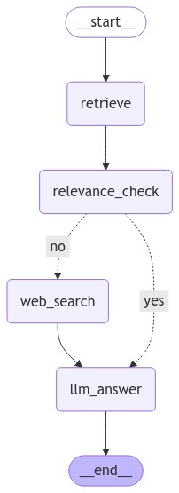

하기의 내용은 <a href="https://wikidocs.net/233801" target="_blank">LangChain 노트</a> 기반으로 작성했습니다.

# Module 추가

이번 절에서는 기존 LangGraph에서 구현한 Relevacne Check가 추가된 Naive RAG에서 Module을 추가하여 조금 더 확장된 LangGraph를 만들어보겠습니다.    

## Web Search(TavilySearch)
이전 LangGraph 구조와 동일하며 추가적으로 Web Search 노드가 추가된 형태입니다.   
그럼 Web Search Node를 구현해보겠습니다.   
```python
rag_chain = RAGPDFChain(llm=ChatOpenAI(model="gpt-4o-mini"), pdf="./data/AI_brief_2023년_2월호.pdf")
pdf_retriever = rag_chain.create_retriever()

from langchain_community.tools.tavily_search import TavilySearchResults

def web_search(state: GraphState) -> GraphState:
    # 검색 도구 생성
    tool = TavilySearchResults(
        max_results=3
        )

    search_query = state["question"]
    search_result = tool.invoke(search_query)
    search_result = [result['content']for result in search_result]
    return GraphState(context="\n".join(search_result))


```

상기가 TavilySearch를 이용하여 웹 검색을 수행하는 Node가 됩니다.   
그럼 이 웹 검색 Node는 언제 타면되는지 생각해보겠습니다. 우선 Retrieval를 수행한 후, Retrieval에서 얻은 정보로 답변을 낸 것과 질문간의 Relevence Check를 했을 때, 연관성이 없다면, Retrieval의 결과 대신 웹 검색의 결과를 기반으로 답변을 수행한다면, 조금 더 옳은 답변을 할 것이라고 예상하실 수 있습니다. 그럼 이 Flow로 Relevence Check에서 No라는 답변이 나오면, 웹 검색 Node를 타게 LangGraph를 구현해주면 됩니다. 하기에 LangGraph를 구현해보겠습니다.   
```python
from langgraph.graph import END, StateGraph  
from langgraph.checkpoint.memory import MemorySaver  

workflow = StateGraph(GraphState)  

# 노드 추가  
workflow.add_node("retrieve", retrieve_document)  
# 관련성 체크 노드 추가  
workflow.add_node("relevance_check", relevance_check)  
workflow.add_node("llm_answer", llm_answer)  
# web 검색 노드
workflow.add_node("web_search", web_search)


# 엣지 추가  
workflow.add_edge("retrieve", "relevance_check")  # 검색 -> 관련성 체크  


# # 조건부 엣지를 추가합니다.  
workflow.add_conditional_edges(  
    "relevance_check",  # 관련성 체크 노드에서 나온 결과를 is_relevant 함수에 전달합니다.  
    is_relevant,  
    {  
        "yes": "llm_answer",  # 관련성이 있으면 답변을 생성합니다.  
        "no": "web_search",  # 관련성이 없으면 다시 웹 검색합니다.  
    },  
)  
workflow.add_edge("web_search", "llm_answer")
workflow.add_edge("llm_answer", END)
# 그래프 진입점 설정  
workflow.set_entry_point("retrieve")  

# 체크포인터 설정  
memory = MemorySaver()  
# 그래프 컴파일  
app = workflow.compile(checkpointer=memory)  
```

상기의 코드로 나타난 LangGraph구조는 하기의 이미지와 같아집니다.   
<div style="text-align : center;">
    
</div>    

## Query Rewrite
