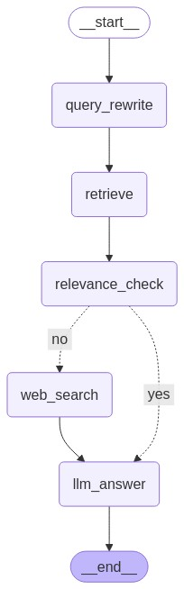

하기의 내용은 <a href="https://wikidocs.net/233801" target="_blank">LangChain 노트</a> 기반으로 작성했습니다.

# Module 추가

이번 절에서는 기존 LangGraph에서 구현한 Relevacne Check가 추가된 Naive RAG에서 Module을 추가하여 조금 더 확장된 LangGraph를 만들어보겠습니다.    

## Web Search(TavilySearch)
이전 LangGraph 구조와 동일하며 추가적으로 Web Search 노드가 추가된 형태입니다.   
그럼 Web Search Node를 구현해보겠습니다.   
```python
rag_chain = RAGPDFChain(llm=ChatOpenAI(model="gpt-4o-mini"), pdf="./data/AI_brief_2023년_2월호.pdf")
pdf_retriever = rag_chain.create_retriever()

from langchain_community.tools.tavily_search import TavilySearchResults

def web_search(state: GraphState) -> GraphState:
    # 검색 도구 생성
    tool = TavilySearchResults(
        max_results=3
        )

    search_query = state["question"]
    search_result = tool.invoke(search_query)
    search_result = [result['content']for result in search_result]
    return GraphState(context="\n".join(search_result))


```

상기가 TavilySearch를 이용하여 웹 검색을 수행하는 Node가 됩니다.   
그럼 이 웹 검색 Node는 언제 타면되는지 생각해보겠습니다. 우선 Retrieval를 수행한 후, Retrieval에서 얻은 정보로 답변을 낸 것과 질문간의 Relevence Check를 했을 때, 연관성이 없다면, Retrieval의 결과 대신 웹 검색의 결과를 기반으로 답변을 수행한다면, 조금 더 옳은 답변을 할 것이라고 예상하실 수 있습니다. 그럼 이 Flow로 Relevence Check에서 No라는 답변이 나오면, 웹 검색 Node를 타게 LangGraph를 구현해주면 됩니다. 하기에 LangGraph를 구현해보겠습니다.   
```python
from langgraph.graph import END, StateGraph  
from langgraph.checkpoint.memory import MemorySaver  

workflow = StateGraph(GraphState)  

# 노드 추가  
workflow.add_node("retrieve", retrieve_document)  
# 관련성 체크 노드 추가  
workflow.add_node("relevance_check", relevance_check)  
workflow.add_node("llm_answer", llm_answer)  
# web 검색 노드
workflow.add_node("web_search", web_search)


# 엣지 추가  
workflow.add_edge("retrieve", "relevance_check")  # 검색 -> 관련성 체크  


# # 조건부 엣지를 추가합니다.  
workflow.add_conditional_edges(  
    "relevance_check",  # 관련성 체크 노드에서 나온 결과를 is_relevant 함수에 전달합니다.  
    is_relevant,  
    {  
        "yes": "llm_answer",  # 관련성이 있으면 답변을 생성합니다.  
        "no": "web_search",  # 관련성이 없으면 다시 웹 검색합니다.  
    },  
)  
workflow.add_edge("web_search", "llm_answer")
workflow.add_edge("llm_answer", END)
# 그래프 진입점 설정  
workflow.set_entry_point("retrieve")  

# 체크포인터 설정  
memory = MemorySaver()  
# 그래프 컴파일  
app = workflow.compile(checkpointer=memory)  
```

상기의 코드로 나타난 LangGraph구조는 하기의 이미지와 같아집니다.   
<div style="text-align : center;">
    
</div>    

## Query Rewrite

이번에는 LLM을 통해 기존의 Query를 조금 더 잘 이해할 수 있도록 재작성하는 Node를 추가해보겠습니다.   
Graph의 Flow는 이전과 동일하지만, 추가적으로 제일 처음 사용자의 Query를 Prompt한 LLM의 Input으로 넣어, LLM이 Query를 재작성하여 뱉어내는 Node가 추가됩니다. 그럼 우선 해당 문서에서 Query 재작성을 위한 Prompting이 어떻게 되어있는지 확인해보겠습니다.   
```python
re_write_prompt = PromptTemplate(
    template="""Reformulate the given question to enhance its effectiveness for vectorstore retrieval.

- Analyze the initial question to identify areas for improvement such as specificity, clarity, and relevance.
- Consider the context and potential keywords that would optimize retrieval.
- Maintain the intent of the original question while enhancing its structure and vocabulary.

# Steps

1. **Understand the Original Question**: Identify the core intent and any keywords.
2. **Enhance Clarity**: Simplify language and ensure the question is direct and to the point.
3. **Optimize for Retrieval**: Add or rearrange keywords for better alignment with vectorstore indexing.
4. **Review**: Ensure the improved question accurately reflects the original intent and is free of ambiguity.

# Output Format

- Provide a single, improved question.
- Do not include any introductory or explanatory text; only the reformulated question.

# Examples

**Input**: 
"What are the benefits of using renewable energy sources over fossil fuels?"

**Output**: 
"How do renewable energy sources compare to fossil fuels in terms of benefits?"

**Input**: 
"How does climate change impact polar bear populations?"

**Output**: 
"What effects does climate change have on polar bear populations?"

# Notes

- Ensure the improved question is concise and contextually relevant.
- Avoid altering the fundamental intent or meaning of the original question.


[REMEMBER] Re-written question should be in the same language as the original question.

# Here is the original question that needs to be rewritten:
{question}
""",
    input_variables=["generation", "question"],
)

question_rewriter = (
    re_write_prompt | ChatOpenAI(model="gpt-4o-mini", temperature=0) | StrOutputParser()
)
question = "MLFlow와 AirFlow"

question_rewriter.invoke({"question": question})
``` 

상기와 같이 작성을 해서 재작성된 결과를 보면 Input으로는 "MLFlow와 AirFlow"라고 넣어줬지만, 해당 Chain을 타고 나온 결과로는 "MLFlow와 AirFlow의 차이점은 무엇인가요?"을 얻을 수 있었습니다. 그럼 이제 이 Query Rewrite Node를 만들어보겠습니다.   

```python
# Query Rewrite 노드
def query_rewrite(state: GraphState) -> GraphState:
    latest_question = state["question"][-1].content
    question_rewritten = question_rewriter.invoke({"question": latest_question})
    return GraphState(question=question_rewritten)
```

GraphState의 question에서 쌓여있던 가장 최근 question을가져온 후, 생성한 query_rewrite chain에 넣어주어 이 결과를 다시 GraphState question state에 넣어줍니다.   

```python
workflow = StateGraph(GraphState)  

# 노드 추가  
# Query Rewrite Node
workflow.add_node("query_rewrite", query_rewrite)

workflow.add_node("retrieve", retrieve_document)  
# 관련성 체크 노드 추가  
workflow.add_node("relevance_check", relevance_check)  
workflow.add_node("llm_answer", llm_answer)  
# web 검색 노드
workflow.add_node("web_search", web_search)


# 엣지 추가  
workflow.add_edge("query_rewrite", "retrieve")  # 쿼리 재작성 -> 검색색  
workflow.add_edge("retrieve", "relevance_check")  # 검색 -> 관련성 체크  

# # 조건부 엣지를 추가합니다.  
workflow.add_conditional_edges(  
    "relevance_check",  # 관련성 체크 노드에서 나온 결과를 is_relevant 함수에 전달합니다.  
    is_relevant,  
    {  
        "yes": "llm_answer",  # 관련성이 있으면 답변을 생성합니다.  
        "no": "web_search",  # 관련성이 없으면 다시 웹 검색합니다.  
    },  
)  
workflow.add_edge("web_search", "llm_answer")
workflow.add_edge("llm_answer", END)
# 그래프 진입점 설정 -> 쿼리 재작성
workflow.set_entry_point("query_rewrite")  

# 체크포인터 설정  
memory = MemorySaver()  
# 그래프 컴파일  
app = workflow.compile(checkpointer=memory)  
```

이전과 다르게 진입지점이 Query_rewrite Node로 바뀌고 그 후 Query rewrite Node를 타고 Retrieval Node를 타게 되는 구조가 됩니다. 하기와 같은 Graph 구조를 띄게 됩니다.   
<div style="text-align : center;">
    
</div>    

