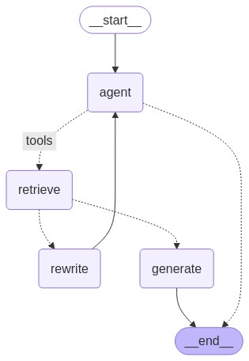

하기의 내용은 <a href="https://wikidocs.net/233801" target="_blank">LangChain 노트</a> 기반으로 작성했습니다.

# Agent
이번 절에서는 기존 LangGraph에서 Agent가 추가된 LangGraph를 만들어보겠습니다.    
살짝 Agent에 대해 다시 한번 상기해보겠습니다.   
Agent의 개념은 어떤 목표를 달성하기 위해 환경과 상호작용하며 의사 결정을 내리고 행동을 취해주는 역할을 하는 것입니다. 그럼 LLM에서의 agent는 이 개념을 그대로 LLM이 더욱 자율적이고 목표 지향적으로 작업을 수행할 수 있게 해주는 컴포넌트라고 할 수 있습니다. agent는 다양한 **도구(Tool)**을 잘 활용하여 주어진 목표를 수행하게 할 수 있습니다. 이 **도구**는 예를 들어 검색 도구, PDF 파싱 등과 같은 것들이 될 수도 있으며 매우 다양할 수 있습니다.    
그럼 LangGraph에서 Agent Node가 하는 일은 해당 사용자 질의에 대해 Tool도구를 사용해야할지 말지 여부를 결정하여 수행합니다.   
예를 들어, 기존 Naive RAG를 LangGraph로 나타냈을 때에 대해 알아보겠습니다. 그럼 여기서 Agent를 이용한다면 Retrieval를 Tool Node로 만들어준다면, 이 ToolNode를 Agent가 직접 사용할지 말지를 판단하여 작업을 수행해주게 됩니다.   

## Tool(Retrieval)
그럼 이번에 Agent에서 사용할 Tool로 Retrieval를 Tool로 만들어보겠습니다.   
기존과 동일하게 pdf retrieval를 만든 후, 이를 Tool로 묶어보겠습니다.    

```python
retriever_tool = create_retriever_tool(
    pdf_retriever,
    name="pdf_retriever",
    description="Search and return information about SPRI AI Brief PDF file. It contains useful information on recent AI trends. The document is published on Dec 2023.",
    document_prompt=PromptTemplate.from_template(
        "<document><context>{page_content}</context><metadata><source>{source}</source><page>{page}</page></metadata></document>"
    ),
)
```
Langchain에서 제공하는 create_retriever_tool을 이용하여 Tool을 만들었습니다. 여기서 name은 tool의 이름이고, description은 tool에 대한 부가 설명입니다. 여기서 document_prompt는 retrieval를 할 때, prompt를 넣어줄 수 있습니다. retrieval의 page_content가존재하고 여기에 metadata로 source와 page가 존재합니다.    
그럼 이제 tool을 만들었으니 이어서 Agent를 만들어보겠습니다.   

## Agent
우선 Agent의 State를 정의해보겠습니다. 각 Node(Tool)에서는 이 AgentState를 주고받아 정보를 추가한 후 서로 공유할 수 있습니다.   
```python
from typing import Annotated, Sequence, TypedDict
from langchain_core.messages import BaseMessage
from langgraph.graph.message import add_messages

class AgentState(TypedDict):
    messages: Annotated[Sequence[BaseMessage], add_messages]
```

이 AgentState는 메세지를 시퀀스대로 가지고 있으며 관리합니다. 그럼 이제 Node를 수행할 함수를 구현해보겠습니다.   
우선 하나씩 차근차근 확인해보겠습니다. 만약 Retrieval한 결과가 **옳다면 answer Node로** 가면 될 것이고 **아니라면 query를 재작성**을 해보는 식으로 FLOW를 따라가면 될 것 같습니다. 그럼 이 Retrieval한 결과가 옳은지 다른지를 판단할 수 있는 Relevence Check가 필요하다고 느끼실 것입니다. 그럼 이 평가를 하는 기능부터 구현해보겠습니다.   
```python
"Relevence Check"
class grade(BaseModel):
    binary_score: str = Field(
        description="Response 'yes' if the document is relevant to the question or 'no' if it is not."
    )
"Condtional Edge"
def grade_documents(state) -> Literal["generate", "rewrite"]:
    # LLM 모델
    model = ChatOpenAI(temperature=0, model="gpt-4o-mini", streaming=True)
    # LLM Tool 묶기
    llm_with_tool = model.with_structured_output(grade)
    # Relevence Prompt
    prompt = PromptTemplate(
        template="""You are a grader assessing relevance of a retrieved document to a user question. \n 
        Here is the retrieved document: \n\n {context} \n\n
        Here is the user question: {question} \n
        If the document contains keyword(s) or semantic meaning related to the user question, grade it as relevant. \n
        Give a binary score 'yes' or 'no' score to indicate whether the document is relevant to the question.""",
        input_variables=["context", "question"],
    )
    # llm + tool 바인딩 체인 생성 -> Relevence Check LLM
    chain = prompt | llm_with_tool
    # 현재 상태에서 메시지 추출
    messages = state["messages"]
    # 가장 마지막 메시지 추출
    last_message = messages[-1]
    # 원래 질문 추출
    question = messages[0].content
    # 검색된 문서 추출
    retrieved_docs = last_message.content
    # Relevence Check 수행
    scored_result = chain.invoke({"question": question, "context": retrieved_docs})
    # 관련성 확인 -> "yes" or "no"
    score = scored_result.binary_score
    # 현재 Retrieval 선택
    if score == "yes":
        print("==== [DECISION: DOCS RELEVANT] ====")
        return "generate"
    # Query 재작성으로 이동
    else:
        print("==== [DECISION: DOCS NOT RELEVANT] ====")
        print(score)
        return "rewrite"        
```

상기의 코드는 수행한 Retrieval의 결과의 Relevence Check를 한 후, Query rewrite로 갈지 answer로갈지 결정해주는 Conditonal Edge가 됩니다. 그럼 이어서 agent Node와 rewrite Node, answer Node를 만들어 보겠습니다.   
```python
"""Agent"""
def agent(state):
    # 현재 상태에서 메시지 추출
    messages = state["messages"]
    # LLM 모델 초기화
    model = ChatOpenAI(temperature=0, streaming=True, model="gpt-4o-mini")
    # retriever tool 바인딩
    model = model.bind_tools(tools)
    # 에이전트 응답 생성
    response = model.invoke(messages)
    # 기존 리스트에 추가되므로 리스트 형태로 반환
    return {"messages": [response]}

"""Query Rewrite"""
def rewrite(state):
    print("==== [QUERY REWRITE] ====")
    # 현재 상태에서 메시지 추출
    messages = state["messages"]
    # 원래 질문 추출
    question = messages[0].content
    # 질문 개선을 위한 프롬프트 구성
    msg = [
        HumanMessage(
            content=f""" \n 
    Look at the input and try to reason about the underlying semantic intent / meaning. \n 
    Here is the initial question:
    \n ------- \n
    {question} 
    \n ------- \n
    Formulate an improved question: """,
        )
    ]
    # LLM 모델로 질문 개선
    model = ChatOpenAI(temperature=0, model="gpt-4o-mini", streaming=True)
    # Query-Transform 체인 실행
    response = model.invoke(msg)
    # 재작성된 질문 반환
    return {"messages": [response]}
"""Answer"""
def generate(state):
    # 현재 상태에서 메시지 추출
    messages = state["messages"]
    # 원래 질문 추출
    question = messages[0].content
    # 가장 마지막 메시지 추출
    docs = messages[-1].content
    # RAG 프롬프트 템플릿 가져오기
    prompt = PromptTemplate(
        template="""You are an assistant for question-answering tasks. Use the following pieces of retrieved context to answer the question. 
        If you don't know the answer, just say that you don't know. Use three sentences maximum and keep the answer concise.
        Question: {question}
        Context: {context} 
        Answer:""",
        input_variables=["context", "question"],
    )
    # LLM 모델 초기화
    llm = ChatOpenAI(model_name="gpt-4o-mini", temperature=0, streaming=True)
    # RAG 체인 구성
    rag_chain = prompt | llm | StrOutputParser()
    # 답변 생성 실행
    response = rag_chain.invoke({"context": docs, "question": question})
    return {"messages": [response]}
```

이어서 상기의 코드에 대해 간략하게 부연 설명하겠습니다. agent Node는 우선 사용자 질의를 받아, 해당 질의에 대해 agent가 스스로 판단하여 retrieval가 필요하다면 tool을 이용하여 retrieval를 하거나 아니면 그냥 답변을 내뱉는 역할을 수행하게됩니다.    
그럼 이어서 Query Rewrite Node를 살펴보겠습니다. Query rewrite Node를 타게되면, 질문을 재생성해야하니, 우선 원본 질문을 추출한 후, rewrite prompt을 통해 LLM이 질문을 재생성하는 역할을 수행하게됩니다.    
마지막으로 answer쪽인 gernerate Node를 살펴보겠습니다. generate에서는 잘 추출한 retrieval를 결과를 prompt에 넣고 이에 대해 최종 질의를 넣어 LLM이 잘 답변을 하도록 수행할 수 있도록 하는 최종 역할을 합니다. 그럼 이들을 LangGraph화 시켜 본 후, 최종 어떤 형태로 나타나는지 이미지로까지 확인해보겠습니다.   
```python
from langgraph.graph import END, StateGraph, START
from langgraph.checkpoint.memory import MemorySaver  
from langgraph.prebuilt import ToolNode

workflow = StateGraph(AgentState)  

# 노드 추가  
# Agent Node
workflow.add_node("agent", agent)
# ToolNode Create
retrieve = ToolNode(tools=[retriever_tool])
# retrieve ToolNode
workflow.add_node("retrieve", retrieve)
# 재작성 Node
workflow.add_node("rewrite", rewrite)  
# 최종 답변 생성 Node  
workflow.add_node("generate", generate)  


# 엣지 추가  
# 그래프 진입점 설정 -> 쿼리 재작성
workflow.set_entry_point("agent")
# Agent Tool Conditonal Edge
workflow.add_conditional_edges(  
    "agent",  # agent에서 tool을 사용할지 판단하는 조건부 
    tools_condition,  
    {  
        # retrieve Tool 사용
        "tools": "retrieve",
        END: END,
    },  
)  
# Query Rewrite Conditional Edge
workflow.add_conditional_edges(
    "retrieve",
    # 문서 품질 평가
    grade_documents,
)
workflow.add_edge("rewrite", "agent")  # rewrite Node -> 다시 agent로
workflow.add_edge("generate", END)  # 답변 생성 Node -> 끝

# 체크포인터 설정  
memory = MemorySaver()  
# 그래프 컴파일  
app = workflow.compile(checkpointer=memory)  
```

<div style="text-align : center;">
    
</div>    
