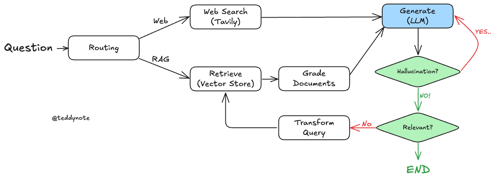
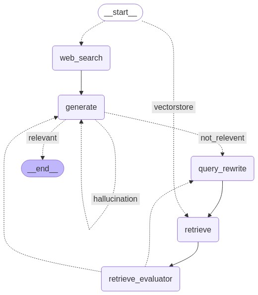

하기의 내용은 <a href="https://wikidocs.net/233801" target="_blank">LangChain 노트</a> 기반으로 작성했습니다.

# Adaptive RAG
Adaptive RAG는 최근에 <a href="https://arxiv.org/abs/2403.14403" target="_blank">논문: Adaptive-RAG: Learning to Adapt Retrieval-Augmented Large Language Models through Question Complexity</a>에서 제안된 RAG방법론입니다. **쿼리 분석**과 **Active/Self-Correcting RAG(능동적/자기 분석 RAG)**를 결합하여 다양한 데이터 소스에서 정보를 검색하고 더 정확한 답변을 생성하는 전략방법입니다. 이번 절에서는 추가적으로 최신 이벤트관련 질의는 웹 검색을 통해 수행하고, 인덱스관련 질의는 self-Correcting RAG를 이용하여 수행하는 전략으로 실습을 해보겠습니다. 우선 teddynote님께서 구현한 라우팅 방법을 하기에서 같이 확인해보도록 하겠습니다.   
<div style="text-align : center;">
    
</div>    
Routing에서 Retrieve를 할지, Web Search를 할지 결정하여 라우팅을 수행해줍니다. 또한, Retrieve 쪽에서는 self-correcting을 통해, retrieve한 결과에 대해 relevence check로 만약 부합하지 않다면, Query rewrite한 후, 다시 retrieve를 수행하게 해줍니다. 그럼 이제 직접 구현을 해보도록 하겠습니다.    

## Query Routing
Adaptive-RAG에서는 **효율적인 정보 생성과 검색**을 위해 **Query Routing**을 수행합니다. 그럼 Query Routing이란 **사용자의 Query를 분석하여 적절한 정보 소스로 Routing을 해주며, Query의 목적에 맞는 최적의 검색 경로를 설정**하도록 도와줍니다. 즉, 우리가 수행하는 task에서는 Routing이 웹 검색과 retrieve가 존재합니다. 사용자의 질의를 보고 어떤 Node로 보낼지를 결정해주는 역할을 하는게 Query Routing이라고 생각하시면 됩니다. 하기에 코드를 간단하게 구현하겠습니다.    
```python
# 사용자 쿼리를 가장 관련성 높은 데이터 소스로 라우팅하는 데이터 모델
class RouteQuery(BaseModel):
    """Route a user query to the most relevant datasource."""

    # 데이터 소스 선택을 위한 리터럴 타입 필드
    datasource: Literal["vectorstore", "web_search"] = Field(
        ...,
        description="Given a user question choose to route it to web search or a vectorstore.",
    )
# LLM 초기화 및 함수 호출을 통한 구조화된 출력 생성
llm = ChatOpenAI(model="gpt-4o-mini", temperature=0)
structured_llm_router = llm.with_structured_output(RouteQuery)
# prompt 생성
system = """You are an expert at routing a user question to a vectorstore or web search.
The vectorstore contains documents related to DEC 2023 AI Brief Report(SPRI) with OPEN AI, Domestic and foreign policy etc.
Use the vectorstore for questions on these topics. Otherwise, use web-search."""
# Routing 을 위한 프롬프트 템플릿 생성
route_prompt = ChatPromptTemplate.from_messages(
    [
        ("system", system),
        ("human", "{question}"),
    ]
)
# 프롬프트 템플릿과 구조화된 LLM 라우터를 결합하여 질문 라우터 생성
question_router = route_prompt | structured_llm_router
```
상기의 question_router에 AI Brief와 삼성 가우스나, 앤트로픽에 대해 질의를 넣어준다면, 결과로 vectorstore라는 결과를 얻을 수 있습니다. 그 외에 관련 없는 것들은 모두 web_search라는 결과를 얻을 수 있습니다. 즉, 어디로 routing을 해야할지 결정을 해주는 역할을 수행합니다.   

## Retreival Grader
이어서 Adaptive-RAG에서는 **Query Routing**이 중요하다고 했으며, 또한, **Self-Correcting**도 중요하다고 했습니다. 그럼 이 Self-Correcting을 하기 위해서는 Relevence Check를 수행해야할 겁니다. 즉, Retrieve한 문서의 결과가 정말 관련성이 있는지 확인해줘야합니다. 최종 LLM의 답변은 이 Retrieve한 문서에 따라 답변의 정확도가 크게 달라지기때문입니다. 그럼 이 Retrieve한 문서의 질을 높이기 위해 Self-Correcting을 수행하는 것을 하기에 구현해보도록 해보겠습니다.   
```python
# 문서 평가를 위한 데이터 모델 정의
class GradeDocuments(BaseModel):
    """Binary score for relevance check on retrieved documents."""

    binary_score: str = Field(
        description="Documents are relevant to the question, 'yes' or 'no'"
    )
# LLM 초기화 및 함수 호출을 통한 구조화된 출력 생성
llm = ChatOpenAI(model="gpt-4o-mini", temperature=0)
structured_llm_grader = llm.with_structured_output(GradeDocuments)
# 시스템 메시지와 사용자 질문을 포함한 프롬프트 템플릿 생성
system = """You are a grader assessing relevance of a retrieved document to a user question. \n 
    If the document contains keyword(s) or semantic meaning related to the user question, grade it as relevant. \n
    It does not need to be a stringent test. The goal is to filter out erroneous retrievals. \n
    Give a binary score 'yes' or 'no' score to indicate whether the document is relevant to the question."""
grade_prompt = ChatPromptTemplate.from_messages(
    [
        ("system", system),
        ("human", "Retrieved document: \n\n {document} \n\n User question: {question}"),
    ]
)
# 문서 검색결과 평가기 생성
retrieval_grader = grade_prompt | structured_llm_grader
```
상기의 코드에 대해 약간 살펴보겠습니다. 해당 LLM은 단순 Relevence Check를 하는 용도이면 답변 또한, 관련성이 있다면, yes 없다면 no를 출력하게됩니다. 즉, 질문과 retrieve의 관련성이 검사합니다. 만약 사용자의 질의를 통해 retrieve한 것이 질의와 관련이 있다면 yes를 없다면 no를 출력하는 것을 확인할 수 있습니다. 여기서 만약 yes라면 최종 답변 Node로, no라면 Query Rewrite Node로 간다면, 더 정확한 답변을 내뱉을 수 있게 될 것 입니다.   

## RAG Chain and Hallucination Check
이어서 빠르게 RAG Chain 구성하고 최종 답변에 대해서도 Relevence Check(Hallucination Check)하도록 구현해보겠습니다. 우선 먼저 RAG Chain을 구현하겠습니다.   
```python
prompt = PromptTemplate(
    template="""You are an assistant for question-answering tasks. Use the following pieces of retrieved context to answer the question. 
    If you don't know the answer, just say that you don't know. Use three sentences maximum and keep the answer concise.
    Question: {question}
    Context: {context} 
    Answer:""",
    input_variables=["context", "question"],
)
# LLM 초기화
llm = ChatOpenAI(model_name="gpt-4o-mini", temperature=0)
# 문서 포맷팅 함수
def format_docs(docs):
    return "\n\n".join(
        [
            f'<document><content>{doc.page_content}</content><source>{doc.metadata["source"]}</source><page>{doc.metadata["page"]+1}</page></document>'
            for doc in docs
        ]
    )
# RAG 체인 생성
rag_chain = prompt | llm | StrOutputParser()
```
RAG Chain은 다들 알 것이라 생각해서 빠르게 넘어갔습니다.    
이어서 그럼 Hallucination Check를 구현해보기 앞서 간단하게 왜 필요한지에 대해 알아보겠습니다. 여기서의 Relevence Check는 LLM이 최종 답변을 한 것이 정말 사용자의 질의와 관련성이 있는지를 확인하는 역할을 합니다. 이전에도 Relevence Check를 하긴 하지만, 이 경우 Query의 재작성하며 Retrieve와 Query간의 관련성 검사만 했습니다. 하지만, 우리의 **최종 목표는 사용자 질의와 관련 있는 답변을 생성**하는 것이 목적입니다. 따라서 이 생성한 답변이 정말 사용자가 원하는 질의에 대한 답변인지를 한 번더 검사를 해준다면 더 안전하며 정확한 답변을 생성할 수 있을 것 입니다. 방식과 구조는 기존 Relevence Check와 매우 흡사합니다. Prompt만 잘 작성을 해주면 됩니다. 하기에 구현을 해보겠습니다.   
```python
# 할루시네이션 체크를 위한 데이터 모델 정의
class GradeHallucinations(BaseModel):
    """Binary score for hallucination present in generation answer."""

    binary_score: str = Field(
        description="Answer is grounded in the facts, 'yes' or 'no'"
    )
# 함수 호출을 통한 LLM 초기화
llm = ChatOpenAI(model="gpt-4o-mini", temperature=0)
structured_llm_grader = llm.with_structured_output(GradeHallucinations)
# 프롬프트 설정
system = """You are a grader assessing whether an LLM generation is grounded in / supported by a set of retrieved facts. \n 
    Give a binary score 'yes' or 'no'. 'Yes' means that the answer is grounded in / supported by the set of facts."""
# 프롬프트 템플릿 생성
hallucination_prompt = ChatPromptTemplate.from_messages(
    [
        ("system", system),
        ("human", "Set of facts: \n\n {documents} \n\n LLM generation: {generation}"),
    ]
)
# 환각 평가기 생성
hallucination_grader = hallucination_prompt | structured_llm_grader

class GradeAnswer(BaseModel):
    """Binary scoring to evaluate the appropriateness of answers to questions"""
    binary_score: str = Field(
        description="Indicate 'yes' or 'no' whether the answer solves the question"
    )
# 함수 호출을 통한 LLM 초기화
llm = ChatOpenAI(model="gpt-4o-mini", temperature=0)
structured_llm_grader = llm.with_structured_output(GradeAnswer)
# 프롬프트 설정
system = """You are a grader assessing whether an answer addresses / resolves a question \n 
     Give a binary score 'yes' or 'no'. Yes' means that the answer resolves the question."""
answer_prompt = ChatPromptTemplate.from_messages(
    [
        ("system", system),
        ("human", "User question: \n\n {question} \n\n LLM generation: {generation}"),
    ]
)
# 프롬프트 템플릿과 구조화된 LLM 평가기를 결합하여 답변 평가기 생성
answer_grader = answer_prompt | structured_llm_grader
```

## Query Rewrite
이전 절에서 배웠던것과 비슷하게 Query Rewrite로 구조화된 LLM을 구현해보겠습니다.   
```python
# LLM 초기화
llm = ChatOpenAI(model="gpt-4o-mini", temperature=0)
# Query Rewriter 프롬프트 정의(자유롭게 수정이 가능합니다)
system = """You a question re-writer that converts an input question to a better version that is optimized \n 
for vectorstore retrieval. Look at the input and try to reason about the underlying semantic intent / meaning."""
# Query Rewriter 프롬프트 템플릿 생성
re_write_prompt = ChatPromptTemplate.from_messages(
    [
        ("system", system),
        (
            "human",
            "Here is the initial question: \n\n {question} \n Formulate an improved question.",
        ),
    ]
)
# Query Rewriter 생성
question_rewriter = re_write_prompt | llm | StrOutputParser()
```
## TavilySearch
TavilySearch를 구현해보겠습니다.
```python
from langchain_core.documents import Document

web_search_tool = TavilySearchResults(
    max_results=3
    )
search_result = web_search_tool.invoke("테디노트 위키독스 랭체인 튜토리얼 URL 을 알려주세요")
web_results_docs = [
    Document(
        page_content=web_result["content"],
        metadata={"source": web_result["url"]},
    )
    for web_result in search_result
]
print(web_results_docs)
```

## LangGraph Node Function
자 이제 필요한 역할을 하는 구조화된 LLM들을 모두 구현했습니다. 그럼 이제 LangGraph의 Node를 역할을 할 수 있도록 Node를 만들어보겠습니다.   
우선 GraphState부터 정의해보겠습니다. GraphState는 질의인 **question**, 답변인 **generation**, 문서 검색 결과인 **documents**가 필요합니다.   
```python
from typing import List
from typing_extensions import TypedDict, Annotated

# 그래프의 상태 정의
class GraphState(TypedDict):
    """
    그래프의 상태를 나타내는 데이터 모델

    Attributes:
        question: 질문
        generation: LLM 생성된 답변
        documents: 도큐먼틑 리스트
    """
    question: Annotated[str, "User question"]
    generation: Annotated[str, "LLM generated answer"]
    documents: Annotated[List[str], "List of documents"]
``` 

차곡 차곡 하나씩 구현해보겠습니다. 먼저 Adaptive-RAG의 FLOW를 생각해보면, **Query Routing에서 Web-Search와 Retrieval Node로 분기**됩니다. 먼저 이 2가지를 구현해보겠습니다.   
```python
"""웹 검색 Node"""
def web_search(state: GraphState) -> GraphState:
    tool = TavilySearchResults(
        max_results=3
        )

    search_query = state["question"]
    search_result = tool.invoke(search_query)
    web_results_docs = [
        Document(
            page_content=web_result["content"],
            metadata={"source": web_result["url"]},
        )
        for web_result in search_result
    ]
    return GraphState(documents=web_results_docs, question=search_query)
"""Retrieve Node"""
def retrieve(state: GraphState) -> GraphState:
    print("==== [RETRIEVE] ====")
    question = state["question"]
    documents = pdf_retriever.invoke(question)
    return GraphState(documents=documents, question=question)
```

이어서 생각해보겠습니다. retrieve한 **문서의 결과와 답변간의 관련성을 평가**한 후, 관련성이 없다면, **Query를 재작성**을 수행합니다. 이번에는 이 2가지를 구현해보겠습니다.    
```python
"""문서 관련성 평가"""
def grade_documents(state: GraphState) -> GraphState:
    print("==== [CHECK DOCUMENT RELEVANCE TO QUESTION] ====")
    question = state["question"]
    documents = state["documents"]
    
    # 관련성 있는 문서만 남기기
    relevence_documents = []
    for doc in documents:
        grade = retrieval_grader.invoke({"question": question, "document": doc})
        score = grade.binary_score
        # 관련성이 있다면 추가
        if score == "yes":
            print("---GRADE: DOCUMENT RELEVANT---")
            relevence_documents.append(doc)
        else:
            print("---GRADE: DOCUMENT NOT RELEVANT---")
            continue
    return GraphState(question=question, documents=relevence_documents)
"""쿼리 재작성"""
def rewrite_query(state: GraphState) -> GraphState:
    print("==== [TRANSFORM QUERY] ====")
    question = state["question"]
    documents = state["documents"]
    rewrite_query = question_rewriter.invoke({"question":question})
    return GraphState(question=rewrite_query, documents=documents)
```

상기의 코드는 retrieve한 문서에 대해 아까 구현한 retrieval_grader LLM을 통해 관련성을 평가합니다. 만약 query와 관련성이 있는 document라면 남기고 없다면 document를 삭제합니다.     
이어서 최종 답변을 생성하는 generate Node를 구현해보겠습니다.   
```python
def generate(state: GraphState) -> GraphState:
    print("==== [GENERATE] ====")
    # 질문과 문서 검색 결과 가져오기
    question = state["question"]
    documents = state["documents"]

    # RAG 답변 생성
    generation = rag_chain.invoke({"context": documents, "question": question})
    return GraphState(question=question, documents=documents, generation=generation)
```

## LangGraph Edge
이제 Node들을 모두 생성했으니, self-Correcting을 하도록 수행하는 Edge들을 구현해야하는 차례입니다. 계속해서 Adaptive-RAG의 FLOW를 잊지 않아야합니다. 가장 먼저 **사용자 질의에 따라 어떤 Node로 분기할지를 결정하는 Query Routing**이 가장 중요합니다. 이를 하기에 구현해보겠습니다.   
```python
def query_routing(state: GraphState) -> Literal["web_search", "vectorstore"]:
    print("==== [ROUTE QUESTION] ====")
    # 질문 가져오기
    question = state["question"]
    router_result = question_router.invoke({"question": question})
    if router_result == "web_serach":
        print("==== [ROUTE QUESTION TO WEB SEARCH] ====")
        return "web_search"
    else:
        print("==== [ROUTE QUESTION TO VECTORSTORE] ====")
        return "vectorstore"
``` 
상기의 코드를 보면, 이전에 만들었던 question_router의 LLM을 통해 해당 질의가 AI BREIF와 관련이 있다면 "vectorstore", 없다면 "web_search"를 답변하게됩니다. 이에 따라 어떤 Node로 분기할지를 결정해줍니다.    
그럼 이어서 또 Adaptive-RAG에서 어떤 분기점이 존재하는지 생각해봅시다. **retrieve한 결과가 Query와 관련성이 없다면 Query Rewrite Node**로 **관련성이 있다면 바로 Answer Node로 분기**하는 점이 존재해야합니다. 그럼 retrieve한 문서와 query간의 관련성 검사를 수행 후, 분기를 시켜주면 될 것입니다. 이를 하기에 구현해보겠습니다.   
```python
def check_retrieve_doc(state: GraphState) -> Literal["query_rewrite", "generate"]:
    print("==== [DECISION TO GENERATE] ====")
    # 질문과 문서 검색 결과 가져오기
    question = state["question"]
    filtered_documents = state["documents"]
    # document가 없다면 query 재작성
    if not filtered_documents or len(filtered_documents) == 0:
        print("==== [DECISION: ALL DOCUMENTS ARE NOT RELEVANT TO QUESTION, REWRITE QUERY] ====")
        return "query_rewrite"
    else:
        print("==== [DECISION: GENERATE] ====")
        return "generate"
```

상기의 코드를 확인해보면 retrieve Node에서 Relevence Check를 수행 후, Relevence한 document들이 있다면, 그런 document들만 남겨놓고 나머진 삭제를 합니다. 여기서 모두 삭제가 되어 document가 없다면 query rewrite Node로 분기를 하면되고, document가 1개라도 존재한다면 그걸 기반으로 LLM이 최종 답변을 생성되게 진행하면 될 것 입니다.   
이어서 마지막으로 최종 답변이 Query의 의도에 맞게 잘 생성되었는지를 확인을 해줘야합니다. 즉, **Hallucination이 발생했다면, 다시 한번 더 답변을 재생성해주고(generate Node로)**, Halluciniation은 아니지만, **답변이 Query와 연관성이 없다면, 다시 Query Rewrite로**, 그게 아니라면 최종적으로 답변을 잘 생성했으니 종료를 하게하면 됩니다. 이를 하기에 구현해보겠습니다.   
```python
def hallucination_check(state: GraphState) -> Literal["hallucination", "not_relevent", "relevant"]:
    print("==== [CHECK HALLUCINATIONS] ====")
    # 질문과 문서 검색 결과 가져오기
    question = state["question"]
    documents = state["documents"]
    generation = state["generation"]
    hallu_evaluator = hallucination_grader.invoke({"documents": docs, "generation": generation})
    score = hallu_evaluator.binary_score
    # 할루시네이션이 없다면, 
    if score == "yes":
        print("==== [DECISION: GENERATION IS GROUNDED IN DOCUMENTS] ====")
        print("==== [GRADE GENERATED ANSWER vs QUESTION] ====")
        answer_evaluator = answer_grader.invoke({"question": question, "generation": generation})
        score = answer_evaluator.binary_score
        # 답변이 Query와 잘 관련성이 있는지 확인
        if score == "yes":
            print("==== [DECISION: GENERATED ANSWER ADDRESSES QUESTION] ====")
            return "relevant"
        else:
            print("==== [DECISION: GENERATED ANSWER DOES NOT ADDRESS QUESTION] ====")
            return "not_relevent"
    # 할루네이션 발생 -> 답변 재생성
    else:
        print("==== [DECISION: GENERATION IS NOT GROUNDED IN DOCUMENTS, RE-TRY] ====")
        return "hallucination"
```

상기의 코드는 이전에 만들었던 hallucination evalutor와, 정답과 query간의 관련성 평가를 하는 answer evaluator를 모두 이용하여 평가하여 분기하는 역할을 수행합니다. 우선 할루시네이션이 있는지 hallucination evalutor를 통해 평가해서 **할루시네이션이 있다면 답변 재생성**, 할루시네이션이 없다면, 답변과 Query간의 관련성을 평가합니다. **Query와 관련성이 있다면 최종 답변 생성**, 없다면 **Query를 재작성하는 Node로 분기**합니다.   
## Graph Compile
이제 상기의 구현한 Node와 Edge함수들을 Graph로 만들어 보겠습니다. 계속하여 Adaptive-RAG의 FLOW를 생각하며 최종 Graph의 노드들을 branch로 잘 이어줘야합니다. 그리고 최종적으로 생성된 Graph의 구조를 이미지로 확인해보겠습니다.   
```python
from langgraph.graph import END, StateGraph, START
from langgraph.checkpoint.memory import MemorySaver

# 그래프 상태 초기화
workflow = StateGraph(GraphState)

# 노드 정의
workflow.add_node("retrieve", retrieve)
workflow.add_node("web_search", web_search)
workflow.add_node("query_rewrite", rewrite_query)
workflow.add_node("retrieve_evaluator", grade_documents)
workflow.add_node("generate", generate)

# 엣지 정의 
workflow.add_conditional_edges(
    START,
    query_routing, # query routing -> [web_search, retrieve]
    {
        "web_search": "web_search",
        "vectorstore": "retrieve"
    }
)
workflow.add_edge("web_search", "generate") # web serach -> generate
workflow.add_edge("retrieve", "retrieve_evaluator") # retrieve -> grade_documents
workflow.add_conditional_edges(
    "retrieve_evaluator",
    check_retrieve_doc, # grade_documents -> [query_rewrite, generate]
    {
        "query_rewrite": "query_rewrite",
        "generate": "generate"
    }
)
workflow.add_edge("query_rewrite", "retrieve") # query_rewrite -> retrieve
workflow.add_conditional_edges(
    "generate",
    hallucination_check, # generate -> [query_rewrite, END, generate]
    {
        "hallucination": "generate",
        "not_relevent": "query_rewrite",
        "relevant": END
    }
)

app = workflow.compile(checkpointer=MemorySaver())
```

<div style="text-align : center;">
    
</div>    


```python
from langchain_core.runnables import RunnableConfig
from stream import *

# stream function

inputs = GraphState(question="AI관련 정책")
node_names = ["web_search" ,"retrieve", "retrieve_evaluator", "query_rewrite", "generate"]
# config 설정(재귀 최대 횟수, thread_id)
config = RunnableConfig(recursion_limit=20, configurable={"thread_id": "1"})

streamer(app=app, inputs=inputs, config=config, node_names=node_names)
```

```bash
==== [ROUTE QUESTION] ====
==== [ROUTE QUESTION TO VECTORSTORE] ====
==== [RETRIEVE] ====
==== [CHECK DOCUMENT RELEVANCE TO QUESTION] ====

==================================================
🔄 Node: retrieve_evaluator 🔄
- - - - - - - - - - - - - - - - - - - - - - - - - 
---GRADE: DOCUMENT RELEVANT---
---GRADE: DOCUMENT RELEVANT---
---GRADE: DOCUMENT RELEVANT---
---GRADE: DOCUMENT RELEVANT---
==== [DECISION TO GENERATE] ====
==== [DECISION: GENERATE] ====
==== [GENERATE] ====

==================================================
🔄 Node: generate 🔄
- - - - - - - - - - - - - - - - - - - - - - - - - 
AI 관련 정책으로는 중국의 딥페이크 게시 금지 규정과 영국의 탈탄소를 위한 AI 프로그램이 있습니다. 미국은 AI에 대한 민간 기업의 자율 규칙을 제안하는 'AI Bill of Rights'를 발표했습니다. 이러한 정책들은 AI 기술의 발전과 사회적 책임을 동시에 고려하고 있습니다.==== [CHECK HALLUCINATIONS] ====
==== [DECISION: GENERATION IS GROUNDED IN DOCUMENTS] ====
==== [GRADE GENERATED ANSWER vs QUESTION] ====
==== [DECISION: GENERATED ANSWER ADDRESSES QUESTION] ====
```
상기의 결과를 얻을 수 있습니다.