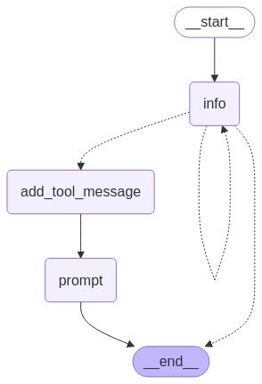

하기의 내용은 <a href="https://wikidocs.net/233801" target="_blank">LangChain 노트</a> 기반으로 작성했습니다.

# Prompt Generation
이번절에서는 사용자가 프롬프트를 생성할 수 있도록 돕는 chatbot을 만들어보겠습니다. chatbot은 사용자의 요구사항을 수집 후, 이를 기반으로 프롬프트를 생성하고 사용자의 입력에 맞춰 이를 수정할 수 있습니다.    

우선 이를 LangGraph로 구현하기 위한 State를 정의해두겠습니다.    
```python
# State 정의
class State(TypedDict):
    messages: Annotated[list, add_messages]
```
## Node
### 요구사항
사용자에게 프롬프트를 생성해주려면, 우선 사용자의 요구사항을 알아야합니다. 이 요구사항을 수집하는 기능을 만들어보겠습니다. 여기서 **정의한 요구사항을 모두 알아내기 전까지 사용자에게 계속하여 필요한 정보를 요구**하도록 LangGraph를 만들겠습니다.    
그럼 프롬프트를 잘 만들려면 어떤 요구사항이 필요한지 생각해보겠습니다. **프롬프트의 목표(어떤 도메인에 특화시킬지)**, **프롬프트에 전달될 변수**, **답변 생성시 피해야할 출력 또는 꼭 추가해야할 출력** 총 이렇게 4가지의 경우에 대한 요구사항을 수집할 수 있도록 구성해보겠습니다.   
```python
# 사용자 요구사항 수집을 위한 시스템 메시지 템플릿
template = """Your job is to get information from a user about what type of prompt template they want to create.

You should get the following information from them:

- What the objective of the prompt is
- What variables will be passed into the prompt template
- Any constraints for what the output should NOT do
- Any requirements that the output MUST adhere to

If you are not able to discern this info, ask them to clarify! Do not attempt to wildly guess.

After you are able to discern all the information, call the relevant tool.

[IMPORTANT] Your conversation should be in Korean. Your generated prompt should be in English."""
# 사용자 메시지 목록을 받아 시스템 메시지와 결합하여 반환
def get_messages_info(messages: list) -> list:
    # 사용자 요구사항 수집을 위한 시스템 메시지와 기존 메시지 결합
    return [SystemMessage(content=template)] + messages
```

우선 상기는 요구사항을 수집하기 위한 LLM의 prompt입니다. 그럼 이제 이 상기의 prompting이 된 LLM을 만들어보겠습니다.    
```python
# LLM에 대한 프롬프트 지침을 정의하는 데이터 모델
class PromptInstructions(BaseModel):
    """Instructions on how to prompt the LLM."""
    # 프롬프트의 목표
    objective: str = Field(description="Extract the objectives of the prompt.")
    # 프롬프트 템플릿에 전달될 변수 목록
    variables: List[str] = Field(description="Extracts a list of variables that will be passed to the prompt template.")
    # 출력에서 피해야 할 제약 조건 목록
    constraints: List[str] = Field(description="Extracts a list of constraints that should be avoided from the output.")
    # 출력이 반드시 따라야 할 요구 사항 목록
    requirements: List[str] = Field(description="Extracts a list of requirements that the output must follow.")

# LLM 초기화
llm = ChatOpenAI(temperature=0, model='gpt-4o-mini')
# PromptInstructions 구조체를 바인딩
prompt_instruction_llm = llm.bind_tools([PromptInstructions])

# 상태 정보를 기반으로 메시지 체인을 생성하고 LLM 호출
def info_chain(state: State) -> State:
    # 상태에서 메시지 정보를 가져와 시스템 메시지와 결합
    messages = get_messages_info(state["messages"])
    # LLM을 호출하여 응답 생성
    response = prompt_instruction_llm.invoke(messages)
    # 생성된 응답을 메시지 목록으로 반환
    return {"messages": [response]}
``` 
상기의 코드는 프롬프트를 만들기 위해 필요한 사용자의 요구사항을 수집하는 LLM입니다. PromptInstructions을 보면, **프롬프트의 목표**, **프롬프트 템플릿에 전달될 변수 목록**, **출력에 피해야할 조건**, **출력에 넣어야할 조건** 총 4가지의 variable들을 가지고 있습니다. 이 BaseModel을 llm에 binding을 해준다면, 이 binding된 llm은 input에서 4가지의 variable들에 대해 잘 분할하여 데이터를 가지고 있게 됩니다. 즉, 요구사항들 중 사용자가 답변한 요구사항이 프롬프트의 목표와 반드시 들어가야할 출력 조건만 있다면, 이 2가지를 objective와 requirements에 담고 있다는 의미가 됩니다.    

### 프롬프트 생성
이제 프롬프트 생성할 상태를 설정하겠습니다. 그럼 이 프롬프트를 만들기 위해선 또한 프롬프트를 생성하는 LLM이 필요합니다. 즉, prompt generation에 특화될 수 있도록 prompting이 된 LLM이 필요하다는 의미입니다. 이번절에서는 **메타 프롬프트**를 활용해보겠습니다. 그럼 우선 **메타 프롬프트**가 어떤 것인지 한 번 살펴보겠습니다.   
최근들어 <a href="https://arxiv.org/abs/2402.10949" target="_blank">AI로 생성한 프롬프트가 인간이 생성한 프롬프트보다 더 나은 성과를 냈다</a>라는 논문이 나왔었습니다. 저는 이 쪽에 대해 생각을 해보면, LLM 모델은 본인에게 어떤 지시가 들어왔을 때, 더 정확한 답변을 내릴 수 있다고 본인이 더 잘 이해하고 있다고 생각합니다. 즉, LLM 본인에게 어떤 prompt가 들어와야 더 답변을 잘할 수 있는지를 알고 있으니, 이 prompt 또한 LLM에게 맡긴다면 훨씬 더 잘할 수 있다고 생각합니다. 그럼 이 프롬프트를 자동을 생성하는 방법은 다양합니다. 그 중에 하나인 **메타 프롬프트**는 쉽게 말하면 **프롬프트를 만드는 프롬프트**입니다. 여기서 **메타**가 무엇인지 한 번 생각해보겠습니다. **메타**는 **자기 참조**를 의미합니다. 즉, **메타 프롬프트**는 일반적인 프롬프트보다 더 높은 단계의 수준의 사고를 요구하며, **프롬프트를 만드는 과정 자체를 프롬프트화**하는 것입니다.    
OpenAI에 <a href="https://platform.openai.com/docs/guides/prompt-generation?context=text-out" target="_blank">메타 프롬프트 엔지니어링 가이드</a> 해당 링크를 한 번 참조해보시는 것도 추천드립니다.    
그럼 상기의 OpenAI의 링크에서 가져온 **메타 프롬프트**를 정의해보겠습니다.   
```python
from langchain_core.messages import AIMessage, HumanMessage, ToolMessage, SystemMessage

# 프롬프트를 생성하는 메타 프롬프트 정의
META_PROMPT = """Given a task description or existing prompt, produce a detailed system prompt to guide a language model in completing the task effectively.

# Guidelines

- Understand the Task: Grasp the main objective, goals, requirements, constraints, and expected output.
- Minimal Changes: If an existing prompt is provided, improve it only if it's simple. For complex prompts, enhance clarity and add missing elements without altering the original structure.
- Reasoning Before Conclusions**: Encourage reasoning steps before any conclusions are reached. ATTENTION! If the user provides examples where the reasoning happens afterward, REVERSE the order! NEVER START EXAMPLES WITH CONCLUSIONS!
    - Reasoning Order: Call out reasoning portions of the prompt and conclusion parts (specific fields by name). For each, determine the ORDER in which this is done, and whether it needs to be reversed.
    - Conclusion, classifications, or results should ALWAYS appear last.
- Examples: Include high-quality examples if helpful, using placeholders [in brackets] for complex elements.
   - What kinds of examples may need to be included, how many, and whether they are complex enough to benefit from placeholders.
- Clarity and Conciseness: Use clear, specific language. Avoid unnecessary instructions or bland statements.
- Formatting: Use markdown features for readability. DO NOT USE ``` CODE BLOCKS UNLESS SPECIFICALLY REQUESTED.
- Preserve User Content: If the input task or prompt includes extensive guidelines or examples, preserve them entirely, or as closely as possible. If they are vague, consider breaking down into sub-steps. Keep any details, guidelines, examples, variables, or placeholders provided by the user.
- Constants: DO include constants in the prompt, as they are not susceptible to prompt injection. Such as guides, rubrics, and examples.
- Output Format: Explicitly the most appropriate output format, in detail. This should include length and syntax (e.g. short sentence, paragraph, JSON, etc.)
    - For tasks outputting well-defined or structured data (classification, JSON, etc.) bias toward outputting a JSON.
    - JSON should never be wrapped in code blocks (```) unless explicitly requested.

The final prompt you output should adhere to the following structure below. Do not include any additional commentary, only output the completed system prompt. SPECIFICALLY, do not include any additional messages at the start or end of the prompt. (e.g. no "---")

[Concise instruction describing the task - this should be the first line in the prompt, no section header]

[Additional details as needed.]

[Optional sections with headings or bullet points for detailed steps.]

# Steps [optional]

[optional: a detailed breakdown of the steps necessary to accomplish the task]

# Output Format

[Specifically call out how the output should be formatted, be it response length, structure e.g. JSON, markdown, etc]

[User given variables should be wrapped in {{brackets}}]

<Question>
{{question}}
</Question>

<Answer>
{{answer}}
</Answer>

# Examples [optional]

[Optional: 1-3 well-defined examples with placeholders if necessary. Clearly mark where examples start and end, and what the input and output are. User placeholders as necessary.]
[If the examples are shorter than what a realistic example is expected to be, make a reference with () explaining how real examples should be longer / shorter / different. AND USE PLACEHOLDERS! ]

# Notes [optional]

[optional: edge cases, details, and an area to call or repeat out specific important considerations]

# Based on the following requirements, write a good prompt template:

{reqs}
"""
```

상기는 이제 **메타 프롬프트**의 한 예시 중에 하나입니다. 그럼 이제 이 메타 프롬프트에 이전에 사용자로 부터 필요한 요구사항들을 수집한 결과들을 함께 이용하여 프롬프트를 생성하면 될 것 입니다. 이 사용자의 요구사항들은 어디에 저장이 되있을까요? 아까 설정한 BaseModel을 기억하실겁니다. 이 BaseModel에 4가지의 요구사항이 다 채워질 때까지, 요구사항용 LLM은 사용자에게 계속하여 질의를 하게됩니다. 이 4가지의 요구사항들이 모두 채워졌을 때, 이제 메타 프롬프트에 그 정보를 함께 넘겨주어 프롬프틑 생성하면 됩니다. 그럼 이 요구사항 정보들은 어떻게 알 수 있을까요? 요구사항용 LLM은 BaseModel을 tool로 binding을 했었습니다. 즉, tool_call이 발생한 후의 메세지(정보)들을 수집하여 메타 프롬프트에 넣어주면 될 것 입니다. 이를 하기에 구현해보겠습니다.    
```python
# 프롬프트 생성을 위한 메시지 가져오기 함수
# 도구 호출 이후의 메시지만 가져옴
def get_prompt_messages(messages: list) -> list:
    # 도구 호출 정보를 저장할 변수 초기화
    tool_call = None
    # 도구 호출 이후의 메시지를 저장할 리스트 초기화
    other_msgs = []
    # 메시지 목록을 순회하며 도구 호출 및 기타 메시지 처리
    for m in messages:
        # AI 메시지 중 도구 호출이 있는 경우 도구 호출 정보 저장
        if isinstance(m, AIMessage) and m.tool_calls:
            tool_call = m.tool_calls[0]["args"]
        # ToolMessage는 건너뜀
        elif isinstance(m, ToolMessage):
            continue
        # 도구 호출 이후의 메시지를 리스트에 추가
        elif tool_call is not None:
            other_msgs.append(m)
    # 시스템 메시지와 도구 호출 이후의 메시지를 결합하여 반환
    return [SystemMessage(content=META_PROMPT.format(reqs=tool_call))] + other_msgs

# 프롬프트 생성 체인 함수 정의
def prompt_gen_chain(state: State) -> State:
    # 상태에서 프롬프트 메시지를 가져옴
    messages = get_prompt_messages(state["messages"])
    # LLM을 호출하여 응답 생성
    response = llm.invoke(messages)
    # 생성된 응답을 메시지 목록으로 반환
    return {"messages": [response]}

def add_tool_message(state: State) -> State:
    return {
        "messages": [
            ToolMessage(
                content="Prompt generated!",
                tool_call_id=state["messages"][-1].tool_calls[0][
                    "id"
                ],  # 상태에서 도구 호출 ID를 가져와 메시지에 추가
            )
        ]
    }
``` 

이제까지 사실상 프롬프트 생성용 LangGraph에 필요한 Node들을 모두 정의했습니다. 그럼 이제 Edge를 만들면 되겠습니다.    
## Edge
Edge의 경우에는 사용자의 요구사항이 모두 채워지지 않을 시에는 계속하여 요구사항을 지시하는 구조이면 됩니다. 즉, 요구사항 Node를 self-recursion이 되게 Conditional Edge를 만들면 됩니다. 하기에 살펴보겠습니다.    
```python
# 상태 결정 함수 정의
# 상태에서 메시지 목록을 가져옴
def get_state(state: State) -> Literal["add_tool_message", END, "info"]:
    messages = state["messages"]
    # 마지막 메시지가 AIMessage이고 도구 호출이 있는 경우
    if isinstance(messages[-1], AIMessage) and messages[-1].tool_calls:
        # 도구 메시지를 추가해야 하는 상태 반환
        return "add_tool_message"
    # 마지막 메시지가 HumanMessage가 아닌 경우
    elif not isinstance(messages[-1], HumanMessage):
        # 대화 종료 상태 반환
        return END
    # 기본적으로 정보 수집 상태 반환
    return "info"
``` 

## Graph Compile
이제 Graph를 Compile한 후 어떤식으로 나타나는지 도식화까지 수행해보겠습니다.   
```python
from langgraph.checkpoint.memory import MemorySaver
from langgraph.graph import StateGraph, START, END
from langchain_core.messages import ToolMessage
from langgraph.graph.message import add_messages
from typing import Annotated
from typing_extensions import TypedDict

workflow = StateGraph(State)

# Node 추가
workflow.add_node("info", info_chain)
workflow.add_node("prompt", prompt_gen_chain)

# 도구 메시지 추가 상태 노드 정의
workflow.add_node("add_tool_message", add_tool_message)

    
# Edge 추가
workflow.set_entry_point("info")
workflow.add_edge("add_tool_message", "prompt")
workflow.add_edge("prompt", END)
workflow.add_conditional_edges(
    "info",
    get_state,
    {
        "add_tool_message": "add_tool_message",
        "info": "info",
        END: END
    }
)

app = workflow.compile(checkpointer=MemorySaver())
```

<div style="text-align : center;">
    
</div>    

이제 실제로 PDF기반 RAG의 프롬프트를 만들어보겠습니다. 하기의 코드를 돌려 나온 출력도 나타내보겠습니다.    
```python
config = RunnableConfig(recursion_limit=20, configurable={"thread_id": "1"})

node_names = ["info" ,"add_tool_message", "prompt"]

while True:
    try:
        # 사용자 입력 받기
        user = input("User (q/Q to quit): ")
    except:
        pass

    # 사용자 입력 출력
    print(f"\n[사용자] {user}")

    # 'q' 또는 'Q' 입력 시 루프 종료
    if user in {"q", "Q"}:
        print("AI: 다음에 또 만나요!")
        break

    # 출력 변수 초기화
    output = None

    streamer(
        app=app,
        inputs=State(messages=user),
        config=config,
        node_names=node_names,
    )
```

```bash
[사용자] RAG 프롬프트를 만들고 싶어

==================================================
🔄 Node: info 🔄
- - - - - - - - - - - - - - - - - - - - - - - - - 
RAG 프롬프트를 만들기 위해 몇 가지 정보를 더 필요로 합니다. 다음 질문에 답해 주실 수 있나요?

1. 프롬프트의 목적은 무엇인가요?
2. 프롬프트 템플릿에 전달될 변수는 무엇인가요?
3. 출력에서 피해야 할 제약 조건은 무엇인가요?
4. 출력이 반드시 준수해야 할 요구 사항은 무엇인가요?
[사용자] 프롬프트 목적은 PDF기반 RAG이고, 변수는 question, context 2개야

==================================================
🔄 Node: info 🔄
- - - - - - - - - - - - - - - - - - - - - - - - - 
좋습니다! PDF 기반 RAG 프롬프트의 목적과 변수에 대한 정보를 받았습니다. 이제 다음 질문에 답해 주실 수 있나요?

3. 출력에서 피해야 할 제약 조건은 무엇인가요?
4. 출력이 반드시 준수해야 할 요구 사항은 무엇인가요?
[사용자] 출력은 최대한 간결하게 해줬으면 좋겠어

==================================================
🔄 Node: info 🔄
- - - - - - - - - - - - - - - - - - - - - - - - - 
출력에서 피해야 할 제약 조건은 "출력이 간결해야 한다"는 것이군요. 이제 마지막 질문입니다.

4. 출력이 반드시 준수해야 할 요구 사항은 무엇인가요?
[사용자] 출력에 피해야할 조건은 없어

==================================================
🔄 Node: info 🔄
- - - - - - - - - - - - - - - - - - - - - - - - - 
좋습니다! 다음과 같이 정보를 정리할 수 있습니다:

- **목적**: PDF 기반 RAG
- **변수**: question, context
- **제약 조건**: 출력은 최대한 간결해야 한다.
- **요구 사항**: 특별한 요구 사항은 없음.

이 정보를 바탕으로 프롬프트 템플릿을 생성하겠습니다. 잠시만 기다려 주세요.
==================================================
🔄 Node: add_tool_message 🔄
- - - - - - - - - - - - - - - - - - - - - - - - - 
Prompt generated!
==================================================
🔄 Node: prompt 🔄
- - - - - - - - - - - - - - - - - - - - - - - - - 
Answer questions based on the provided context from a PDF document using a retrieval-augmented generation (RAG) approach.

You will receive a {question} and a {context} extracted from a PDF. Your response should directly address the question using the information in the context while ensuring that the output is as concise as possible.

# Output Format

Your answer should be a short, clear response that directly answers the question. 

<Question>
{question}
</Question>

<Answer>
{answer}
</Answer>

# Examples

**Example 1:**
<Question>
What is the main theme of the document?
</Question>
<Context>
The document discusses the impact of climate change on global agriculture, emphasizing the need for sustainable practices.
</Context>
<Answer>
The main theme is the impact of climate change on global agriculture and the need for sustainable practices.
</Answer>

**Example 2:**
<Question>
What are the key findings of the research?
</Question>
<Context>
The research found that renewable energy sources can significantly reduce carbon emissions and improve air quality.
</Context>
<Answer>
The key findings indicate that renewable energy sources significantly reduce carbon emissions and improve air quality.
</Answer>

# Notes

- Ensure that the answer is derived solely from the provided context.
- Avoid adding any information not present in the context.
[사용자] q
AI: 다음에 또 만나요!
```